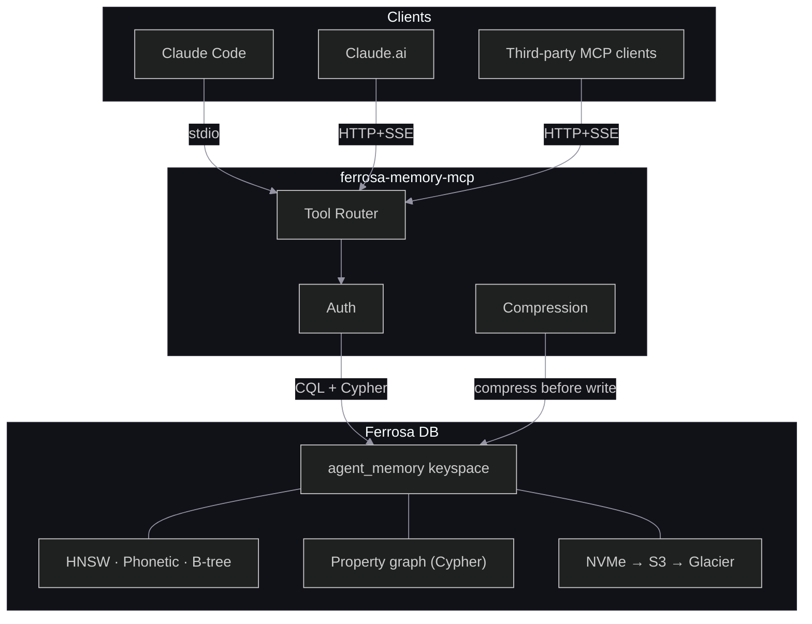

# ferrosa-memory-mcp

A structured memory backend for LLM agent trajectories, exposed as an [MCP](https://modelcontextprotocol.io/) server over Ferrosa DB.

LLM agents running inside Claude Code (and other MCP-compatible clients) currently lose all working context between sessions. Sub-calls re-derive results the parent already computed. Plans evaporate when the REPL tears down. Entities discovered in one trajectory are invisible to the next.

ferrosa-memory-mcp fixes this by providing durable, typed memory tools backed by Ferrosa's CQL tables, HNSW vector indexes, phonetic indexes, and property graph:

- **Memoization** — cache sub-call results by content hash, skip redundant LLM invocations
- **Plan state** — hierarchical plan trees with O(depth) range scans for structured re-injection
- **Trajectory folds** — branch-and-collapse pattern with semantic retrieval over fold summaries
- **Entity graph** — named entity tracking with phonetic deduplication and multi-hop Cypher queries
- **Temporal chains** — timestamped facts with supersession tracking (most-recent-valid retrieval)
- **Feedback loop** — record retrieval strategy outcomes for offline guideline refinement

## Architecture



The server is a thin adapter (~3,200 lines of Rust) that translates MCP tool calls into CQL and Cypher queries. All intelligence stays in the LLM; all durability stays in Ferrosa.

## Tools

12 MCP tools across 5 functional groups:

| Group | Tools | Purpose |
|-------|-------|---------|
| Memo | `check_memo_cache`, `store_memo_result` | Sub-call memoization |
| Plan | `write_plan_node`, `get_plan_context`, `update_plan_node` | Hierarchical plan state |
| Fold | `start_fold`, `append_to_fold`, `complete_fold`, `retrieve_fold_context` | Trajectory fold/summarize |
| Entity | `upsert_entity`, `retrieve_entities` | Named entity graph |
| Feedback | `record_outcome` | Strategy outcome recording |

## Quick Start

### Build

```sh
cargo build --workspace
```

### Run (stdio mode, for Claude Code)

```sh
# Create a config file
cp examples/ferrosa-memory.toml ./ferrosa-memory.toml
# Edit contact_points to your Ferrosa instance

# Run
cargo run --bin ferrosa-memory-mcp
```

### Run (HTTP mode)

```sh
cp examples/ferrosa-memory-http.toml ./ferrosa-memory-http.toml
cp examples/http-auth.toml ./http-auth.toml
# Update TLS paths, contact points, graph URL, and auth principals

FERROSA_MEMORY_CONFIG=./ferrosa-memory-http.toml cargo run --bin ferrosa-memory-mcp
# Listens on port 8765 by default and exposes:
#   GET /healthz/live
#   GET /healthz/ready
#   POST /mcp
```

For Podman-based container startup on macOS, prefer `PODMAN_COMPOSE_PROVIDER=podman-compose`
so `podman compose` does not delegate to Docker Desktop's `docker-compose`.

### Start On Login (macOS)

```sh
./scripts/install-launch-agent.sh
```

This installs a per-user `launchd` agent that, at login:

- starts the Podman machine if needed
- runs `podman compose up -d` from this repo
- brings up the Ferrosa stack defined in [docker-compose.yml](docker-compose.yml)

To remove it later:

```sh
./scripts/uninstall-launch-agent.sh
```

### Claude Code Integration

Add to `~/.claude/settings.json`:

```json
{
  "mcpServers": {
    "ferrosa-memory": {
      "command": "/path/to/ferrosa-memory-mcp",
      "env": {
        "FERROSA_MEMORY_CONFIG": "/path/to/ferrosa-memory.toml"
      }
    }
  }
}
```

### Database Setup

Apply the DDL scripts against your Ferrosa instance:

```sh
cqlsh -f ddl/001_keyspace.cql
cqlsh -f ddl/002_folds_entities.cql
```

## Configuration

See [`examples/ferrosa-memory.toml`](examples/ferrosa-memory.toml) for all options. Key sections:

| Section | Controls |
|---------|----------|
| `[server]` | Transport (stdio/http), port, log level |
| `[ferrosa]` | CQL contact points, keyspace, replication, consistency |
| `[memory]` | TTL, compression threshold, confidence gate, memo limits |
| `[embeddings]` | Provider (Ollama/OpenAI), model, dimensions |
| `[security]` | Audit log, anomaly detection, sigma threshold |
| `[routing]` | Guideline version, feedback export schedule |

For shared deployments, use:

- [`examples/ferrosa-memory-http.toml`](examples/ferrosa-memory-http.toml) for the HTTP server
- [`examples/http-auth.toml`](examples/http-auth.toml) for principal-to-tenant auth mapping

Shared HTTP mode requires:

- `server.require_tls = true`
- `server.cert_path` and `server.key_path`
- `server.auth_file`
- no `server.tenant_id` fallback

`viz` is disabled by default for the shared HTTP template. Keep stdio mode for local fallback and local visualization.

## Project Structure

```
crates/
  ferrosa-memory-core/          Shared library (17 modules)
  ferrosa-memory-mcp/    MCP server binary
  ferrosa-memory-batch/  Nightly routing guideline job
ddl/                     CQL schema definitions
specs/                   Architecture, DSM, threat model, FMEA, project plan
product/                 Product specification
examples/                Config file templates
```

## Security

The design addresses threats identified by MCPShield, MemoryGraft, and the LLM Agent Memory privacy paper:

- **Tenant isolation** — all queries scoped by `tenant_id` from auth context, never client-supplied
- **Memory poisoning defense** — confidence gating, retrieval anomaly detection (>3σ), append-only audit log
- **Injection prevention** — all CQL/Cypher queries use parameterized prepared statements
- **Privacy** — raw trajectories compressed and archived to Glacier within 30 days; cascade delete per session

See [`specs/threat-model.md`](specs/threat-model.md) for the full STRIDE analysis.

## Research Foundation

The design is grounded in recent work on recursive language models, agent memory architectures, and MCP security:

- **RLM / SRLM** — memoization requirement, program selection as primary performance driver
- **ReCAP** — structured plan re-injection with linear depth scaling
- **Context-Folding** — branch-and-collapse with 10x context reduction
- **Zep** — temporal knowledge graphs outperform static RAG by 18.5%
- **MIRIX** — six memory types needed for real-world agent workloads
- **ACON** — failure-pair datasets for guideline refinement
- **MCPShield / MemoryGraft** — MCP trust model, memory poisoning attacks

Full citations in [`product/spec.md`](product/spec.md).

## Development

```sh
# Format, lint, test
cargo fmt
cargo clippy --workspace -- -D warnings
cargo test --workspace

# Coverage
cargo llvm-cov --workspace

# Docs
cargo doc --workspace --no-deps
```

CI runs on every PR: format, clippy, build, test + coverage (80% gate), complexity analysis, and doc generation.

## License

MIT
