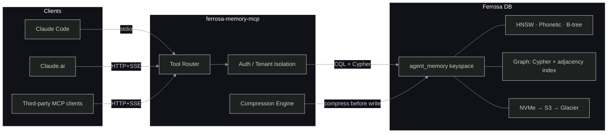

# ferrosa-memory-mcp — Architecture Specs

## Overview

ferrosa-memory-mcp is a Rust MCP server (~14,400 lines) that exposes Ferrosa DB's index and graph infrastructure as typed memory tools for LLM agent trajectories. It provides durable, structured memory for Recursive Language Model (RLM) workloads — memoization, hierarchical plan state, trajectory fold/summarization, semantic retrieval, phonetic entity search, spreading activation, dream consolidation, intention tracking, and a feedback loop for retrieval strategy refinement.

**Stack:** Rust (Tokio), cdrs-tokio for CQL, reqwest for HTTP Cypher, Ollama for embeddings (nomic-embed-text, 768d). No Python anywhere — all algorithms (LLMLingua compression, spreading activation, dream consolidation) ported to native Rust.

**32+ MCP tools** across 8 functional groups: memoization, plan state, trajectory folds, entity graph, temporal chains, feedback/routing, cognitive memory (spreading activation, dream consolidation, importance scoring, intention tracking), and hybrid search. Entity type schemas are dynamic — loaded from the `entity_types` registry table at startup.

## Index

| Document | Description |
|----------|-------------|
| [overview.md](overview.md) | System overview, positioning, and high-level Mermaid diagrams |
| [components.md](components.md) | Component architecture — modules, responsibilities, interfaces |
| [data-flow.md](data-flow.md) | Data flow diagrams — tool call paths, storage paths, retrieval paths |
| [threat-model.md](threat-model.md) | STRIDE threat analysis with trust boundaries |
| [project-plan.md](project-plan.md) | Timeboxed sprint plan prioritized by risk |
| [shared-http-deployment.md](shared-http-deployment.md) | Production HTTP deployment blueprint: auth, TLS, probes, tenant policy, viz boundary |
| [decisions/](decisions/) | Architecture Decision Records |

| [memory-lifecycle.md](memory-lifecycle.md) | Memory consolidation, forgetting, importance decay, and state machine |
| [visualization.md](visualization.md) | Real-time graph dashboard — WebSocket protocol, D3.js frontend, event types |
| [dsm-analysis.md](dsm-analysis.md) | Design Structure Matrix — module boundaries and coupling |
| [fmea.md](fmea.md) | Failure Mode and Effects Analysis with RPN scoring |
| [lsp-code-indexing.md](lsp-code-indexing.md) | LSP-based code indexing spec for structural codebase ingestion |

## Source

All specs derived from `ferrosa-memory-mcp-spec.md` (v0.1, 2026-03-21).

## Update History

- **2026-03-21 (init):** Full 5-phase blueprint created
- **2026-03-21 (update):** Drift detected after 8 commits. Updated: graph_client HTTP refactor, DSM M11 decoupling, vector column gap (F31), graph edge write gap (F32), sprint completion tracking, risk register updates
- **2026-04-01 (update):** Dynamic type registry (DDL 019), multiselect filter UI in viz, extended entity/edge color mapping, CO_OCCURS noise filtering, ghost row resilience, stale prepared statement recovery, NER module, frg ingest data flow, markdown docs ingestion support
- **2026-04-10 (update):** Shared HTTP deployment blueprint: real auth boundary, TLS/secret handling, multi-tenant policy, liveness/readiness probes, and viz exposure decision
