# MCP Eval Framework + SPARQL Endpoint -- Compiled Project Plan

## Header

| Field | Value |
|-------|-------|
| **Generated** | 2026-04-05 |
| **Total Tasks** | 65 |
| **Batches** | 6 |
| **Ambiguities Resolved** | 4 (see below) |
| **TDD Mode** | All implementation tasks: test written FIRST, then implementation makes it pass |

### Source Spec Hashes

| File | SHA-1 |
|------|-------|
| specs/mcp-eval/overview.md | `0a0c4c953f5547f96374163a84ff3301a21d4bf7` |
| specs/mcp-eval/dsm-analysis.md | `a167e18fd4652002b1f0f636a43cead6a5988039` |
| specs/mcp-eval/threat-model.md | `99721940feb39d4426119fd00c2f40e4ad50f40c` |
| specs/mcp-eval/fmea.md | `0c58935de40bb2dc85b6e9b2ce27cf006eed0eed` |
| specs/mcp-eval/project-plan.md | `37d630670bcfd8da7ff7f45938c22c2785073a83` |
| specs/mcp-eval/rdf-star-gap-analysis.md | `83d3680af177357996813cd2a06541a9c6aad7a7` |
| CLAUDE.md | `e58807228ebb732979f401cfcf27188d02c918c7` |

### Ambiguities Resolved

1. **Mock storage prohibited** -- ADR-003 and CLAUDE.md both mandate live Ferrosa cluster. All tests target real CQL. No MockStorage usage in eval crate.
2. **Eval CQL role** -- Threat ET-S3/ET-E1 require SELECT-only CQL role for analyzers. Until Ferrosa supports per-role permissions, wrap all analyzer queries through a `ReadOnlyStorage` newtype that only exposes read methods from the `Storage` trait.
3. **RDF\* initial implementation** -- `edge_annotations` CQL table is the first-class store (not JSON in metadata field). The rdf-star-gap-analysis spec initially mentions JSON-in-metadata as migration path, but the project-plan (S2-T10/S2-T11) commits to the dedicated table. Use the table from day one.
4. **SPARQL parser** -- Use `spargebra` crate (Rust, used by Oxigraph) as specified in rdf-star-gap-analysis.md. Do not implement a custom parser.

### Existing Crate Layout

```
crates/
    ferrosa-memory-core/      # Core types, Storage trait, dispatch, all 50 tools
    ferrosa-memory-mcp/       # MCP server binary (stdio + HTTP)
    ferrosa-memory-batch/     # Batch ingestion
    ferrosa-memory-sync/      # Cluster sync
```

New crates to create:
- `crates/ferrosa-memory-eval/` -- Eval framework
- `crates/ferrosa-memory-sparql/` -- SPARQL endpoint

### Key Types Reference

```
-- crates/ferrosa-memory-core/src/types.rs --
TenantContext { tenant_id: Uuid }
EntityEntry { tenant_id, entity_id, session_id, entity_name, entity_type, source_fold_id, context_snippet, entity_embedding, confidence, state, created_at }
TypedEdge { tenant_id, session_id, src_id, edge_type, dst_id, weight, metadata, created_at }
TemporalEvent { tenant_id, entity_id, event_time, event_id, fact_text, supersedes_id, valid_until, source_session, confidence }
FoldEntry { ... status: FoldStatus, summary, embedding, compression_ratio ... }

-- crates/ferrosa-memory-core/src/storage.rs --
pub trait Storage: Send + Sync { ... 40+ async methods ... }

-- crates/ferrosa-memory-core/src/dispatch.rs --
pub fn tool_definitions(entity_types: &[String]) -> Vec<ToolDef>
pub async fn dispatch<S: Storage>(method, params, storage, ctx, session) -> Result<Value, (i32, String)>

-- crates/ferrosa-memory-core/src/transport.rs --
JsonRpcRequest { jsonrpc, id, method, params }
JsonRpcResponse { jsonrpc, id, result, error }
```

---

## Dependency Graph

```mermaid
graph TD
    %% Batch 1: Foundation
    T001[T-001 Crate scaffold]
    T002[T-002 Scenario parser]
    T003[T-003 MCP client stdio]
    T004[T-004 Claim rubric]
    T005[T-005 Programmatic grader]
    T006[T-006 Report generator]
    T007[T-007 Config module]

    T001 --> T002
    T001 --> T003
    T001 --> T004
    T001 --> T005
    T001 --> T006
    T001 --> T007

    %% Batch 2: Runner + Scenarios
    T008[T-008 Scenario runner]
    T009[T-009 Pre-flight check]
    T010[T-010 Session isolation]
    T011[T-011 Warm-up phase]
    T012[T-012 L1 scenarios x5]
    T013[T-013 Red-team scenarios x3]
    T014[T-014 edge_annotations DDL]
    T015[T-015 EdgeAnnotation types]
    T016[T-016 Storage trait annotations]
    T017[T-017 CqlStorage annotations]

    T002 --> T008
    T003 --> T008
    T004 --> T008
    T005 --> T008
    T006 --> T008
    T003 --> T009
    T008 --> T010
    T008 --> T011
    T008 --> T012
    T008 --> T013
    T004 --> T013
    T001 --> T014
    T014 --> T015
    T015 --> T016
    T016 --> T017

    %% Batch 3: DIKW + Semantic + RDF*
    T018[T-018 DIKW data_info]
    T019[T-019 DIKW info_knowledge]
    T020[T-020 DIKW knowledge_wisdom]
    T021[T-021 DIKW emergence]
    T022[T-022 Semantic inference]
    T023[T-023 Semantic ontology]
    T024[T-024 Semantic graph_quality]
    T025[T-025 Semantic multi_hop]
    T026[T-026 Semantic dedup]
    T027[T-027 RDF* edge provenance writes]
    T028[T-028 Datalog annotation predicate]
    T029[T-029 L2 scenarios x5]
    T030[T-030 L3 scenarios x5]

    T010 --> T018
    T010 --> T019
    T010 --> T020
    T017 --> T021
    T027 --> T021
    T010 --> T022
    T010 --> T023
    T010 --> T024
    T010 --> T025
    T010 --> T026
    T017 --> T027
    T017 --> T028
    T018 --> T029
    T019 --> T029
    T020 --> T029
    T021 --> T029
    T022 --> T030
    T023 --> T030
    T024 --> T030
    T025 --> T030
    T026 --> T030

    %% Batch 4: LLM Judge + CI
    T031[T-031 LLM judge]
    T032[T-032 Cross-validation]
    T033[T-033 Tool usage grader]
    T034[T-034 MCP quality scores]
    T035[T-035 Stability canary]
    T036[T-036 Judge verdict caching]
    T037[T-037 HTTP transport]
    T038[T-038 Parallel execution]
    T039[T-039 Scenario manifest]
    T040[T-040 Server identity]
    T041[T-041 Cleanup ledger]
    T042[T-042 Regression scenarios x3]
    T043[T-043 CI integration]
    T044[T-044 Documentation]

    T008 --> T031
    T031 --> T032
    T005 --> T032
    T008 --> T033
    T005 --> T034
    T004 --> T034
    T031 --> T034
    T033 --> T034
    T008 --> T035
    T031 --> T036
    T003 --> T037
    T010 --> T038
    T002 --> T039
    T003 --> T040
    T010 --> T041
    T008 --> T042
    T035 --> T043
    T038 --> T043
    T043 --> T044

    %% Batch 5: SPARQL Read
    T045[T-045 SPARQL crate scaffold]
    T046[T-046 SPARQL parser]
    T047[T-047 Namespace manager]
    T048[T-048 SPARQL planner]
    T049[T-049 SPARQL executor]
    T050[T-050 RDF* query support]
    T051[T-051 JSON results serializer]
    T052[T-052 Turtle serializer]
    T053[T-053 HTTP endpoint]
    T054[T-054 URI support on entities]

    T045 --> T046
    T045 --> T047
    T046 --> T048
    T047 --> T048
    T048 --> T049
    T017 --> T050
    T049 --> T050
    T049 --> T051
    T049 --> T052
    T049 --> T053
    T051 --> T053
    T052 --> T053
    T045 --> T054

    %% Batch 6: SPARQL Write + Integration
    T055[T-055 SPARQL UPDATE parser]
    T056[T-056 Write planner]
    T057[T-057 RDF* annotated inserts]
    T058[T-058 Tenant scoping for writes]
    T059[T-059 Pattern-matched bulk ops]
    T060[T-060 LOAD support]
    T061[T-061 Property paths]
    T062[T-062 N-Triples serializer]
    T063[T-063 Eval SPARQL integration]
    T064[T-064 SPARQL eval scenarios x3]
    T065[T-065 Final verification]

    T046 --> T055
    T049 --> T056
    T055 --> T056
    T050 --> T057
    T056 --> T057
    T053 --> T058
    T056 --> T059
    T052 --> T060
    T056 --> T060
    T049 --> T061
    T049 --> T062
    T053 --> T063
    T008 --> T063
    T063 --> T064
    T064 --> T065
    T043 --> T065
```



---

## Execution Batches

### Batch 1: Crate Scaffolding + Core Graders (7 tasks)
**Focus:** Get the eval crate compiling with scenario parsing, MCP client, and the two critical graders (programmatic + claim). Address FMEA EF01 (RPN 336, false-pass claim matching) immediately.

**Verification:** `cargo build -p ferrosa-memory-eval && cargo test -p ferrosa-memory-eval`

### Batch 2: Runner + Session Isolation + Infrastructure (10 tasks)
**Focus:** Wire graders into a scenario runner, add session isolation, pre-flight checks, write L1 scenarios and red-team suite. Begin edge_annotations schema for RDF* (prerequisite for Batch 3 emergence scoring).

**Verification:** `cargo run -p ferrosa-memory-eval -- --scenarios level1/ --red-team` passes with zero false positives on red-team suite.

### Batch 3: DIKW + Semantic Analyzers + RDF* (13 tasks)
**Focus:** Full 3-level grading. All DIKW sub-modules, all Semantic sub-modules, RDF* edge provenance, Datalog annotation predicate. Write L2 and L3 scenarios.

**Verification:** `cargo run -p ferrosa-memory-eval -- --all` produces L1 + L2 + L3 scores.

### Batch 4: LLM Judge + Stability + CI (14 tasks)
**Focus:** LLM-as-Judge with prompt injection mitigation (threat ET-T2), tool usage grading, stability canary, parallel execution, CI integration.

**Verification:** `cargo run -p ferrosa-memory-eval -- --all --with-judge` passes stability canary (3 identical runs = identical scores).

### Batch 5: SPARQL Read Endpoint (10 tasks)
**Focus:** Full SPARQL SELECT endpoint with parser, planner, executor, RDF* query support, JSON + Turtle serialization, HTTP endpoint.

**Verification:** `curl -X POST http://localhost:9090/sparql -d "SELECT ?s ?p ?o WHERE { ?s ?p ?o } LIMIT 10"` returns valid SPARQL JSON results.

### Batch 6: SPARQL Writes + Final Integration (11 tasks)
**Focus:** SPARQL UPDATE (INSERT DATA, DELETE DATA, MODIFY), LOAD, property paths, eval integration with SPARQL verification, final end-to-end verification.

**Verification:** Full eval suite passes with SPARQL-based verification queries. INSERT/DELETE round-trips verified.

---

## Task Definitions

---

### T-001: Eval Crate Scaffold

| Field | Value |
|-------|-------|
| **Batch** | 1 |
| **Status** | [ ] Not started |
| **Spec references** | overview.md section 5 (Module Breakdown) |
| **Risk references** | None (scaffold) |
| **Receives from** | None (root task) |
| **Hands off to** | T-002, T-003, T-004, T-005, T-006, T-007 |

**Acceptance criteria:**
1. `crates/ferrosa-memory-eval/Cargo.toml` exists as workspace member with dependencies on `ferrosa-memory-core`, `tokio`, `serde`, `serde_json`, `toml`, `chrono`, `uuid`, `anyhow`, `thiserror`, `tracing`, `sha2`
2. `Cargo.toml` (workspace root) includes `"crates/ferrosa-memory-eval"` in `members`
3. `src/lib.rs` and `src/main.rs` exist with stub entry points
4. `cargo build -p ferrosa-memory-eval` succeeds
5. Module directories created: `src/grading/`, `src/dikw/`, `src/semantic/`

**Context:**
- Workspace root: `/Users/bkearns/src/ferrosa-memory/Cargo.toml` -- add `"crates/ferrosa-memory-eval"` to `members` array
- Existing member pattern: `crates/ferrosa-memory-core`, `crates/ferrosa-memory-mcp`, etc.
- Edition: `2024` (workspace default). Use `workspace.package` for version/edition/license.
- Core dependency: `ferrosa-memory-core = { path = "../ferrosa-memory-core" }`
- Use workspace deps where available: `tokio.workspace = true`, `serde.workspace = true`, etc.
- Create module stubs: `src/scenario.rs`, `src/runner.rs`, `src/mcp_client.rs`, `src/report.rs`, `src/config.rs`, `src/grading/mod.rs`, `src/dikw/mod.rs`, `src/semantic/mod.rs`
- `src/main.rs` should use `clap` for CLI (add `clap = { version = "4", features = ["derive"] }`)

**Verification command:** `cargo build -p ferrosa-memory-eval`

---

### T-002: Scenario Parser

| Field | Value |
|-------|-------|
| **Batch** | 1 |
| **Status** | [ ] Not started |
| **Spec references** | overview.md section 6.1 (Scenario Definition TOML) |
| **Risk references** | EF08 (UUID format mismatch, RPN 120), ET-S1 (scenario substitution) |
| **Receives from** | T-001 (crate scaffold) |
| **Hands off to** | T-008 (runner), T-039 (manifest) |

**Acceptance criteria:**
1. `EvalScenario`, `EvalStep`, `GroundTruth`, `GradingConfig`, `ClaimRubricConfig`, `LlmJudgeConfig`, `DikwConfig`, `SemanticConfig` structs parse from TOML
2. Validates `tool` names against `tool_definitions()` -- unknown tools are a parse error
3. Parses the full example scenario from overview.md section 6.1 without error
4. Rejects malformed TOML (missing required fields, invalid level, etc.) with descriptive errors
5. Supports all step fields: `tool`, `arguments`, `expect_in_response`, `expect_action`, `expect_entity_name`
6. Test: parse 5 sample TOMLs, parse 3 intentionally malformed TOMLs (expect errors)

**Context:**
- File: `crates/ferrosa-memory-eval/src/scenario.rs`
- Use `toml` crate (already in workspace deps) for deserialization
- `tool_definitions()` is at `ferrosa_memory_core::dispatch::tool_definitions` -- call with empty entity_types `&[]` for validation
- Key structs to define:
  ```rust
  pub struct EvalScenario {
      pub scenario: ScenarioMeta,
      pub steps: Vec<EvalStep>,
      pub grading: GradingConfig,
      pub dikw: Option<DikwConfig>,
      pub semantic: Option<SemanticConfig>,
  }
  pub struct ScenarioMeta {
      pub id: String,
      pub name: String,
      pub description: String,
      pub level: u8,  // 1, 2, or 3
      pub dikw_transition: Option<String>,
      pub tags: Vec<String>,
      pub timeout_ms: u64,
  }
  pub struct EvalStep {
      pub tool: String,
      pub arguments: serde_json::Value,
      pub expect_in_response: Option<Vec<String>>,
      pub expect_action: Option<String>,
      pub expect_entity_name: Option<String>,
  }
  ```
- Place sample TOMLs in `crates/ferrosa-memory-eval/scenarios/level1/` following the directory structure from overview.md section 5

**Verification command:** `cargo test -p ferrosa-memory-eval scenario`

---

### T-003: MCP Client (stdio)

| Field | Value |
|-------|-------|
| **Batch** | 1 |
| **Status** | [ ] Not started |
| **Spec references** | overview.md sections 3-4 (Component/Data Flow), section 7 (Integration Points) |
| **Risk references** | EF23 (server crash cascades, RPN 63), ET-S2 (server impersonation) |
| **Receives from** | T-001 (crate scaffold) |
| **Hands off to** | T-008 (runner), T-009 (pre-flight), T-037 (HTTP transport), T-040 (server identity) |

**Acceptance criteria:**
1. Spawns `ferrosa-memory-mcp` as a child process with stdio pipes
2. Sends JSON-RPC `initialize` request and receives server info response
3. Sends `tools/call` requests with tool name and arguments, receives responses
4. Tracks latency (wall clock) per tool call
5. Detects server crash (child process exit) and returns structured error, not panic
6. Records binary path for identity verification (ET-S2)
7. Test: connect to live MCP server, call `initialize`, call `get_stats`, verify JSON response structure

**Context:**
- File: `crates/ferrosa-memory-eval/src/mcp_client.rs`
- MCP server binary: `crates/ferrosa-memory-mcp/src/main.rs` -- build with `cargo build -p ferrosa-memory-mcp`
- Protocol: JSON-RPC 2.0 over stdio, newline-delimited (see `transport.rs` in core crate)
- Request format: `{"jsonrpc":"2.0","id":1,"method":"tools/call","params":{"name":"get_stats","arguments":{}}}`
- Response: `JsonRpcResponse` with `result` or `error`
- Use `tokio::process::Command` to spawn, `tokio::io::BufReader` for line-based reading
- Key struct:
  ```rust
  pub struct McpClient {
      child: tokio::process::Child,
      stdin: tokio::io::BufWriter<tokio::process::ChildStdin>,
      stdout: tokio::io::BufReader<tokio::process::ChildStdout>,
      next_id: u64,
      binary_path: String,
  }
  pub struct ToolCallResult {
      pub response: serde_json::Value,
      pub latency: std::time::Duration,
      pub request_id: u64,
  }
  ```
- The MCP server expects a `FERROSA_CQL_SEEDS` env var (default `127.0.0.1:9042`) -- pass through from eval process environment

**Verification command:** `cargo test -p ferrosa-memory-eval mcp_client -- --ignored` (requires live cluster)

---

### T-004: Claim-Based Rubric Grader (Anti-False-Pass)

| Field | Value |
|-------|-------|
| **Batch** | 1 |
| **Status** | [ ] Not started |
| **Spec references** | overview.md section 6.1 (claim_rubric config), FMEA EF01 |
| **Risk references** | **EF01 (RPN 336)** -- top FMEA risk, false-pass from lenient substring matching. ET-E3 (trivially satisfiable claims). |
| **Receives from** | T-001 (crate scaffold) |
| **Hands off to** | T-008 (runner), T-013 (red-team), T-034 (MCP quality) |

**Acceptance criteria:**
1. Claims use **word-boundary regex** matching, not naive substring (`\bentity created\b`, not `contains("entity created")`)
2. Claim polarity: supports `positive` (must be present) and `negative` (must NOT be present) claims
3. Partial credit: score = claims_met / total_claims
4. `passing_threshold` from config determines pass/fail
5. **ADVERSARIAL TESTS (from FMEA ET01-ET03):**
   - ET01: `"entity created"` does NOT match `"no entity created"` -- word boundary is insufficient, need negation awareness
   - ET02: `"entity_id"` does NOT match a response containing only `"session_id"` (no cross-field false match)
   - ET03: Negative claim `"NOT: error"` correctly fails when response contains `"error"`
6. 0% false positive rate on adversarial test suite

**Context:**
- File: `crates/ferrosa-memory-eval/src/grading/claim_rubric.rs`
- Use `regex` crate -- add `regex = "1"` to Cargo.toml
- Key struct:
  ```rust
  pub struct Claim {
      pub text: String,
      pub polarity: ClaimPolarity,  // Positive | Negative
      pub pattern: regex::Regex,    // word-boundary compiled pattern
  }
  pub enum ClaimPolarity { Positive, Negative }
  pub struct ClaimScore {
      pub claims: Vec<ClaimResult>,
      pub score: f64,      // 0.0 - 1.0
      pub passed: bool,    // score >= threshold
      pub threshold: f64,
  }
  ```
- Claim text from TOML is compiled to regex with `\b` word boundaries: `format!(r"\b{}\b", regex::escape(&claim_text))`
- For negation awareness: if claim text starts with `"NOT: "`, strip prefix and set polarity to Negative
- The claim `"entity created"` must NOT match `"no entity created"` -- implement by checking that the match is not preceded by negation words (no, not, never, without, neither). Use a negative lookbehind: `r"(?<!\bno\s)(?<!\bnot\s)\bentity created\b"`
- Cross-reference with threat ET-E3: include a `discrimination_test` method that runs claims against known-wrong responses to verify they fail

**Verification command:** `cargo test -p ferrosa-memory-eval claim_rubric`

---

### T-005: Programmatic Grader

| Field | Value |
|-------|-------|
| **Batch** | 1 |
| **Status** | [ ] Not started |
| **Spec references** | overview.md section 5 (grading/programmatic.rs) |
| **Risk references** | EF04 (correct action on wrong entity, RPN 168), EF08 (UUID/float format mismatch, RPN 120) |
| **Receives from** | T-001 (crate scaffold) |
| **Hands off to** | T-008 (runner), T-032 (cross-validation), T-034 (MCP quality) |

**Acceptance criteria:**
1. Schema validation: response JSON matches expected structure for each tool
2. Tool sequence matching: actual tool call sequence matches expected sequence
3. Field assertions: `expect_in_response` strings present in response text
4. `expect_action` matching: e.g., "Created" in smart_ingest response
5. **Entity identity verification (EF04 fix):** when `expect_entity_name` is set, verify the entity_id in the response corresponds to an entity with that name (cross-reference via retrieval)
6. **Format normalization (EF08 fix):** UUID comparison ignores case/hyphens. Float comparison uses epsilon (1e-6).
7. Test: correct sequence passes, wrong sequence fails, wrong-entity detected

**Context:**
- File: `crates/ferrosa-memory-eval/src/grading/programmatic.rs`
- Tool schema validation: use `tool_definitions()` from `ferrosa_memory_core::dispatch` to get expected input schemas
- Key struct:
  ```rust
  pub struct ProgrammaticScore {
      pub schema_valid: bool,
      pub sequence_match: bool,
      pub field_assertions_passed: usize,
      pub field_assertions_total: usize,
      pub entity_identity_valid: Option<bool>,
      pub score: f64,  // 0.0 - 1.0
  }
  ```
- For entity identity check: after getting entity_id from response, call `retrieve_entities` via MCP client to verify name matches
- Float epsilon: `(a - b).abs() < 1e-6`
- UUID normalization: lowercase, strip hyphens before comparison

**Verification command:** `cargo test -p ferrosa-memory-eval programmatic`

---

### T-006: Report Generator

| Field | Value |
|-------|-------|
| **Batch** | 1 |
| **Status** | [ ] Not started |
| **Spec references** | overview.md section 9 (Report Output Format) |
| **Risk references** | EF25 (mixed score scales, RPN 36), ET-R1 (result manipulation) |
| **Receives from** | T-001 (crate scaffold) |
| **Hands off to** | T-008 (runner) |

**Acceptance criteria:**
1. CLI text output matches the format in overview.md section 9 (aligned columns, PASS/FAIL coloring via ANSI codes)
2. JSON output: `results/run-{timestamp}.json` with full `ScenarioResult` data
3. Score normalization (EF25 fix): all scores normalized to 0.0-1.0 before aggregation; MCP quality mapped to 1-5 scale only for display
4. Separate pass/fail determination per level (L1, L2, L3)
5. Test: format 5 mock scenario results, verify JSON round-trips

**Context:**
- File: `crates/ferrosa-memory-eval/src/report.rs`
- Result types from overview.md section 6.2: `ScenarioResult`, `McpQualityScores`, `DIKWScore`, `SemanticRepoScore`, `EmergenceScore`
- Create `results/` directory at crate root for JSON output
- JSON filename format: `run-2026-04-05T14-32-00Z.json`
- For CLI output, use ANSI escape codes: green for PASS (`\x1b[32m`), red for FAIL (`\x1b[31m`), reset (`\x1b[0m`)
- Aggregation: `composite = weighted_mean(l1_score, l2_score, l3_score)` with configurable weights

**Verification command:** `cargo test -p ferrosa-memory-eval report`

---

### T-007: Config Module

| Field | Value |
|-------|-------|
| **Batch** | 1 |
| **Status** | [ ] Not started |
| **Spec references** | overview.md section 5 (config.rs) |
| **Risk references** | None |
| **Receives from** | T-001 (crate scaffold) |
| **Hands off to** | T-008 (runner) |

**Acceptance criteria:**
1. Loads eval config from `ferrosa-memory.toml` `[eval]` section or CLI flags
2. Configurable: scenario directory, output directory, timeouts, thresholds, judge enabled, parallel mode
3. CLI flags override TOML config
4. Test: parse sample config, verify defaults

**Context:**
- File: `crates/ferrosa-memory-eval/src/config.rs`
- Existing config pattern: `ferrosa_memory_core::config::FerrosaCqlConfig` (loads from TOML)
- Key struct:
  ```rust
  pub struct EvalConfig {
      pub scenario_dir: PathBuf,
      pub output_dir: PathBuf,
      pub timeout_ms: u64,            // default 30000
      pub passing_threshold: f64,      // default 0.75
      pub judge_enabled: bool,         // default false
      pub parallel: bool,              // default false
      pub stability_canary: bool,      // default false
      pub warmup: bool,                // default true
      pub mcp_binary: PathBuf,         // path to ferrosa-memory-mcp binary
      pub cql_seeds: String,           // default "127.0.0.1:9042"
  }
  ```
- Use `clap` derive macros for CLI args

**Verification command:** `cargo test -p ferrosa-memory-eval config`

---

### T-008: Scenario Runner

| Field | Value |
|-------|-------|
| **Batch** | 2 |
| **Status** | [ ] Not started |
| **Spec references** | overview.md sections 3-4 (Component/Data Flow) |
| **Risk references** | EF07 (cross-scenario state leakage, RPN 210), EF14 (snapshot timing, RPN 72) |
| **Receives from** | T-002 (parser), T-003 (MCP client), T-004 (claim), T-005 (programmatic), T-006 (report) |
| **Hands off to** | T-010 (isolation), T-011 (warm-up), T-012 (L1 scenarios), T-013 (red-team), T-031 (judge), T-033 (tool usage), T-035 (canary), T-042 (regression), T-063 (SPARQL integration) |

**Acceptance criteria:**
1. Loads scenarios from directory via scenario parser
2. For each scenario: creates fresh session_id, runs steps sequentially via MCP client, records `ToolCallTrace` per step
3. Passes traces + expected results to grading pipeline
4. Collects all scores into `ScenarioResult`
5. **Before-snapshot (EF14 fix):** snapshot graph state (entity_count, edge_count) BEFORE any tool calls, not after first step
6. **Cleanup (EF07 fix):** calls `delete_session` both before AND after scenario. Verifies entity_count=0 pre-scenario.
7. Test: run a 3-step scenario against live cluster, verify traces recorded with correct latencies

**Context:**
- File: `crates/ferrosa-memory-eval/src/runner.rs`
- Key structs:
  ```rust
  pub struct ToolCallTrace {
      pub step_index: usize,
      pub tool: String,
      pub arguments: serde_json::Value,
      pub response: serde_json::Value,
      pub latency: Duration,
      pub error: Option<String>,
  }
  pub struct ScenarioRun {
      pub scenario: EvalScenario,
      pub session_id: Uuid,
      pub traces: Vec<ToolCallTrace>,
      pub graph_snapshot_before: GraphSnapshot,
      pub graph_snapshot_after: GraphSnapshot,
  }
  pub struct GraphSnapshot {
      pub entity_count: usize,
      pub edge_count: usize,
      pub derived_fact_count: usize,
      pub timestamp: chrono::DateTime<chrono::Utc>,
  }
  ```
- Session creation: generate `Uuid::new_v4()` per scenario
- delete_session tool call: `{"name": "delete_session", "arguments": {"session_id": "<uuid>"}}`
- get_stats tool call for snapshot: `{"name": "get_stats", "arguments": {}}`
- For before-snapshot: call get_stats immediately after session creation, before any scenario steps

**Verification command:** `cargo test -p ferrosa-memory-eval runner -- --ignored`

---

### T-009: Pre-flight Health Check

| Field | Value |
|-------|-------|
| **Batch** | 2 |
| **Status** | [ ] Not started |
| **Spec references** | FMEA systemic finding #3 (CQL single point of failure) |
| **Risk references** | FMEA CQL SPOF, EF09 (cold-start latency) |
| **Receives from** | T-003 (MCP client) |
| **Hands off to** | None (gate for all eval runs) |

**Acceptance criteria:**
1. Before any scenarios run, connects to MCP server and calls `get_stats`
2. Verifies response returns within 100ms (CQL is healthy)
3. If health check fails, aborts eval with clear error message: "Pre-flight failed: Ferrosa cluster unhealthy"
4. Reports cluster version info in output
5. Test: mock unhealthy scenario (timeout), verify abort

**Context:**
- File: `crates/ferrosa-memory-eval/src/runner.rs` (or a `preflight.rs` helper)
- Use `get_stats` as the health probe -- it queries entity/fold/edge counts from CQL
- Measure round-trip time with `Instant::now()` / `elapsed()`
- If elapsed > 100ms or error returned, print diagnostic and `std::process::exit(1)`
- This runs once before the scenario loop, not per-scenario

**Verification command:** `cargo test -p ferrosa-memory-eval preflight -- --ignored`

---

### T-010: Session Isolation

| Field | Value |
|-------|-------|
| **Batch** | 2 |
| **Status** | [ ] Not started |
| **Spec references** | overview.md section 7 (Session isolation), FMEA EF07 |
| **Risk references** | EF07 (cross-scenario state leakage, RPN 210), ET-I2 (cross-session measurement contamination), ET-D3 (graph pollution from incomplete cleanup) |
| **Receives from** | T-008 (runner) |
| **Hands off to** | T-018-T-026 (analyzers), T-038 (parallel), T-041 (cleanup ledger) |

**Acceptance criteria:**
1. Each scenario gets a unique session_id (UUID v4)
2. Pre-scenario: `delete_session` called, then `entity_count` verified as 0
3. Post-scenario: `delete_session` called
4. If pre-scenario entity_count > 0, abort scenario with "CONTAMINATED" error
5. **Dedicated eval tenant:** all eval runs use a fixed `tenant_id` (configurable, default UUID from config) separate from production
6. Test: run two scenarios sequentially, verify no entity leakage between them

**Context:**
- File: `crates/ferrosa-memory-eval/src/runner.rs` (session isolation logic within runner)
- delete_session tool: `{"name": "delete_session", "arguments": {"session_id": "<uuid>"}}`
- entity_count check: parse `get_stats` response for entity count field
- The MCP server uses `TenantContext { tenant_id }` -- the eval client passes tenant_id as part of the MCP initialize roots or via environment variable `FERROSA_TENANT_ID`
- Consider a fixed eval tenant UUID like `00000000-0000-0000-0000-eval00000000` (or generate one per run for parallel safety)

**Verification command:** `cargo test -p ferrosa-memory-eval isolation -- --ignored`

---

### T-011: Warm-up Phase

| Field | Value |
|-------|-------|
| **Batch** | 2 |
| **Status** | [ ] Not started |
| **Spec references** | FMEA EF09 (cold-start latency, RPN 75) |
| **Risk references** | EF09 |
| **Receives from** | T-008 (runner) |
| **Hands off to** | None |

**Acceptance criteria:**
1. Before scored scenarios, run one throwaway scenario (or a simple upsert_entity + get_stats cycle)
2. Throwaway results are not included in scoring
3. First scored scenario not penalized by cold-start latency
4. Test: compare first-scenario latency with and without warm-up

**Context:**
- File: `crates/ferrosa-memory-eval/src/runner.rs` (warm-up function)
- Warm-up sequence: `upsert_entity` with a dummy entity, `hybrid_search` for it, `delete_session`
- This exercises: CQL connection pool, Ollama embedding endpoint, HNSW index
- Controlled by `EvalConfig.warmup` flag (default true)

**Verification command:** `cargo test -p ferrosa-memory-eval warmup -- --ignored`

---

### T-012: Level 1 Scenarios (5 scenarios)

| Field | Value |
|-------|-------|
| **Batch** | 2 |
| **Status** | [ ] Not started |
| **Spec references** | overview.md section 5 (scenarios/level1/), DSM analysis clusters |
| **Risk references** | None (scenario content, not code) |
| **Receives from** | T-008 (runner) |
| **Hands off to** | None |

**Acceptance criteria:**
1. Five TOML scenario files: `memo_cache.toml`, `entity_crud.toml`, `fold_lifecycle.toml`, `plan_hierarchy.toml`, `temporal_facts.toml`
2. Each tests a distinct DSM cluster (Cluster 7, 1, 6, 8 mapping)
3. Each includes `[grading]` with `methods = ["programmatic", "claim_rubric"]`
4. Each includes ground truth claims that pass against a healthy system
5. All 5 pass against live cluster with current codebase
6. Test: run all 5, verify all PASS

**Context:**
- Files: `crates/ferrosa-memory-eval/scenarios/level1/*.toml`
- Follow the TOML schema from T-002 (EvalScenario)
- **memo_cache.toml:** `store_memo_result` then `check_memo_cache`, verify cache hit. Claims: "cache_hit", "result matches stored"
- **entity_crud.toml:** `upsert_entity` then `retrieve_entities`, verify entity returned. Claims: "entity_id", "entity_name matches"
- **fold_lifecycle.toml:** `start_fold` -> `append_to_fold` -> `complete_fold`, verify summary generated. Claims: "fold_id", "summary", "completed"
- **plan_hierarchy.toml:** `write_plan_node` -> `get_plan_context`, verify plan tree. Claims: "plan_node", "depth"
- **temporal_facts.toml:** `write_temporal_fact` -> `get_temporal_chain`, verify chain. Claims: "fact_text", "event_time"

**Verification command:** `cargo run -p ferrosa-memory-eval -- --scenarios scenarios/level1/`

---

### T-013: Red-Team Scenarios (3 scenarios)

| Field | Value |
|-------|-------|
| **Batch** | 2 |
| **Status** | [ ] Not started |
| **Spec references** | FMEA systemic finding #1 (false-pass dominance) |
| **Risk references** | EF01 (RPN 336), EF04 (RPN 168), EF16 (RPN 320) |
| **Receives from** | T-008 (runner), T-004 (claim rubric) |
| **Hands off to** | None |

**Acceptance criteria:**
1. Three TOML scenarios engineered to trigger false-pass conditions
2. **red_team_lenient_claims.toml:** Claims like `"entity created"` tested against responses containing `"no entity created"` -- MUST score 0.0 (not match)
3. **red_team_wrong_entity.toml:** Programmatic grader receives response with correct action but wrong entity_id -- MUST fail entity identity check
4. **red_team_search_fallback.toml:** Multi-hop test where result comes from `hybrid_search` not graph traversal -- MUST detect search fallback
5. All 3 red-team scenarios MUST FAIL. If any passes, the grader has a bug.
6. Test: run red-team suite, assert all return FAIL

**Context:**
- Files: `crates/ferrosa-memory-eval/scenarios/red_team/*.toml`
- These are meta-tests of the grading system itself
- For `red_team_lenient_claims.toml`: craft a response string that contains negated versions of claims, verify claim rubric scores 0.0
- For `red_team_wrong_entity.toml`: scenario creates entity "Alice", but ground truth expects entity "Bob" -- programmatic grader's entity identity check must catch this
- For `red_team_search_fallback.toml`: multi-hop scenario where the expected path is A->B->C but the system just returns C via search -- the grader must check the tool call sequence includes graph traversal tools (spread_activation, explore_connections, find_memory_chain)
- The runner should have a `--red-team` flag that inverts pass/fail expectations for red-team scenarios

**Verification command:** `cargo run -p ferrosa-memory-eval -- --scenarios scenarios/red_team/ --red-team`

---

### T-014: edge_annotations CQL DDL

| Field | Value |
|-------|-------|
| **Batch** | 2 |
| **Status** | [ ] Not started |
| **Spec references** | rdf-star-gap-analysis.md section "Structured Edge Metadata Table" |
| **Risk references** | None (schema) |
| **Receives from** | T-001 (crate scaffold) |
| **Hands off to** | T-015 (types) |

**Acceptance criteria:**
1. DDL file for `agent_memory.edge_annotations` table created
2. Schema: `(tenant_id uuid, session_id uuid, src_id uuid, edge_type text, dst_id uuid, property_name text, property_value text, value_type text, created_at timestamp)` with PK `((tenant_id, session_id, src_id, edge_type, dst_id), property_name)`
3. DDL applied to live Ferrosa cluster without error
4. Test: INSERT and SELECT from table succeed

**Context:**
- File: `ddl/edge_annotations.cql` (follow existing DDL pattern)
- Check existing DDL files: `ls /Users/bkearns/src/ferrosa-memory/ddl/` for naming convention
- This is a Ferrosa/CQL table -- use standard CQL CREATE TABLE syntax
- The partition key groups all annotations for one edge together: `(tenant_id, session_id, src_id, edge_type, dst_id)`
- Clustering key is `property_name` for efficient per-property lookups
- `value_type` is one of: `string`, `float`, `uuid`, `datetime`

**Verification command:** CQL: `SELECT * FROM agent_memory.edge_annotations LIMIT 1;` succeeds

---

### T-015: EdgeAnnotation Type Definitions

| Field | Value |
|-------|-------|
| **Batch** | 2 |
| **Status** | [ ] Not started |
| **Spec references** | rdf-star-gap-analysis.md section "Files to Modify" |
| **Risk references** | None |
| **Receives from** | T-014 (DDL) |
| **Hands off to** | T-016 (Storage trait) |

**Acceptance criteria:**
1. `EdgeAnnotation` struct added to `types.rs` with all fields from DDL
2. `AnnotationValue` enum for typed values: `String(String)`, `Float(f64)`, `Uuid(Uuid)`, `DateTime(DateTime<Utc>)`
3. Serialization/deserialization between `AnnotationValue` and `(property_value: String, value_type: String)` CQL columns
4. Test: round-trip all value types

**Context:**
- File: `/Users/bkearns/src/ferrosa-memory/crates/ferrosa-memory-core/src/types.rs`
- Add after `TypedEdge` struct (line ~413):
  ```rust
  pub struct EdgeAnnotation {
      pub tenant_id: Uuid,
      pub session_id: Uuid,
      pub src_id: Uuid,
      pub edge_type: String,
      pub dst_id: Uuid,
      pub property_name: String,
      pub property_value: String,
      pub value_type: String,
      pub created_at: chrono::DateTime<chrono::Utc>,
  }
  ```

**Verification command:** `cargo test -p ferrosa-memory-core edge_annotation`

---

### T-016: Storage Trait Annotation Methods

| Field | Value |
|-------|-------|
| **Batch** | 2 |
| **Status** | [ ] Not started |
| **Spec references** | rdf-star-gap-analysis.md "Files to Modify" (storage.rs) |
| **Risk references** | None |
| **Receives from** | T-015 (types) |
| **Hands off to** | T-017 (CqlStorage) |

**Acceptance criteria:**
1. Three new methods on `Storage` trait: `annotation_put`, `annotation_get`, `annotation_list`
2. `annotation_put(ctx, annotation: &EdgeAnnotation) -> Result<()>`
3. `annotation_get(ctx, session_id, src_id, edge_type, dst_id, property_name) -> Result<Option<EdgeAnnotation>>`
4. `annotation_list(ctx, session_id, src_id, edge_type, dst_id) -> Result<Vec<EdgeAnnotation>>`
5. MockStorage implements all three (in-memory HashMap)
6. Test: trait compiles, MockStorage passes basic CRUD test

**Context:**
- File: `/Users/bkearns/src/ferrosa-memory/crates/ferrosa-memory-core/src/storage.rs`
- Add methods after the existing `typed_edge_*` methods in the trait
- Follow existing pattern: all methods take `&self, ctx: &TenantContext` as first args
- MockStorage is at the bottom of storage.rs (line ~580)

**Verification command:** `cargo test -p ferrosa-memory-core annotation`

---

### T-017: CqlStorage Annotation Implementation

| Field | Value |
|-------|-------|
| **Batch** | 2 |
| **Status** | [ ] Not started |
| **Spec references** | rdf-star-gap-analysis.md "Files to Modify" (cql_storage.rs) |
| **Risk references** | ET-S3 (eval CQL bypasses MCP auth -- annotations must be tenant-scoped) |
| **Receives from** | T-016 (Storage trait) |
| **Hands off to** | T-021 (emergence), T-027 (provenance writes), T-028 (Datalog), T-050 (RDF* queries) |

**Acceptance criteria:**
1. `CqlStorage` implements `annotation_put`, `annotation_get`, `annotation_list` against live Ferrosa cluster
2. All queries include `tenant_id` and `session_id` in WHERE clause (ET-S3 mitigation)
3. Batch insert support for multiple annotations on one edge
4. Test: write annotation, read it back, list all annotations for an edge, verify tenant isolation

**Context:**
- File: `/Users/bkearns/src/ferrosa-memory/crates/ferrosa-memory-core/src/cql_storage.rs`
- Follow existing CQL query patterns in this file (prepared statements via cdrs-tokio)
- INSERT: `INSERT INTO agent_memory.edge_annotations (tenant_id, session_id, src_id, edge_type, dst_id, property_name, property_value, value_type, created_at) VALUES (?, ?, ?, ?, ?, ?, ?, ?, ?)`
- SELECT single: `SELECT * FROM agent_memory.edge_annotations WHERE tenant_id = ? AND session_id = ? AND src_id = ? AND edge_type = ? AND dst_id = ? AND property_name = ?`
- SELECT all: `SELECT * FROM agent_memory.edge_annotations WHERE tenant_id = ? AND session_id = ? AND src_id = ? AND edge_type = ? AND dst_id = ?`

**Verification command:** `cargo test -p ferrosa-memory-core cql_annotation -- --ignored`

---

### T-018: DIKW Data-to-Information Analyzer

| Field | Value |
|-------|-------|
| **Batch** | 3 |
| **Status** | [ ] Not started |
| **Spec references** | overview.md section 6.2 (DIKWScore), DSM DIKW mapping (Data/Information layers) |
| **Risk references** | EF10 (eventual consistency race, RPN 120) |
| **Receives from** | T-010 (session isolation) |
| **Hands off to** | T-029 (L2 scenarios) |

**Acceptance criteria:**
1. Checks entity type assignment: entities have non-default types (not just "concept")
2. Checks temporal scoping: temporal facts have valid event_time and optional valid_until
3. Checks session isolation: all entities belong to expected session_id
4. **Settle delay (EF10 fix):** wait 50-200ms before reading state to allow eventual consistency
5. Returns `TransitionScore { score: f64, details: Vec<String> }`
6. Test: create entities with types, verify score > 0.8; create entities without types, verify score < 0.5

**Context:**
- File: `crates/ferrosa-memory-eval/src/dikw/data_info.rs`
- Queries: use MCP client to call `get_stats` and `retrieve_entities` for the scenario session
- Entity types are in `EntityEntry.entity_type` -- "concept" is the NER fallback (penalize per EF05)
- Temporal check: `get_temporal_chain` returns temporal facts for an entity
- Settle delay: `tokio::time::sleep(Duration::from_millis(100)).await` before state inspection

**Verification command:** `cargo test -p ferrosa-memory-eval data_info -- --ignored`

---

### T-019: DIKW Information-to-Knowledge Analyzer

| Field | Value |
|-------|-------|
| **Batch** | 3 |
| **Status** | [ ] Not started |
| **Spec references** | overview.md section 6.2, DSM Knowledge layer |
| **Risk references** | EF11 (symmetric edge double-counting, RPN 180) |
| **Receives from** | T-010 (session isolation) |
| **Hands off to** | T-029 (L2 scenarios) |

**Acceptance criteria:**
1. Counts consolidation edges (CO_OCCURS) created during scenario
2. **Symmetric edge dedup (EF11 fix):** edges A->B and B->A counted as ONE, not two. Deduplicate by sorting `(min(src,dst), max(src,dst))`
3. Measures search recall@k: run hybrid_search for known entities, compute recall
4. Measures spread_activation reach: how many hops from seed entity
5. Returns `TransitionScore` with breakdown
6. Test: create known edge set, verify count is correct (not doubled)

**Context:**
- File: `crates/ferrosa-memory-eval/src/dikw/info_knowledge.rs`
- For edge counting: call `explore_connections` on scenario entities, collect edge list
- Dedup logic: `HashSet<(Uuid, Uuid)>` where each pair is `(min(a,b), max(a,b))`
- Recall@k: insert N known entities, search for each, compute `found / N`
- Spread activation: call `spread_activation` from seed entity, count unique nodes reached

**Verification command:** `cargo test -p ferrosa-memory-eval info_knowledge -- --ignored`

---

### T-020: DIKW Knowledge-to-Wisdom Analyzer

| Field | Value |
|-------|-------|
| **Batch** | 3 |
| **Status** | [ ] Not started |
| **Spec references** | overview.md section 6.2, DSM Wisdom layer |
| **Risk references** | EF12 (intention triggers on wrong context, RPN 196) |
| **Receives from** | T-010 (session isolation) |
| **Hands off to** | T-029 (L2 scenarios) |

**Acceptance criteria:**
1. Intention trigger verification: when `set_intention` is called, verify `check_intentions` triggers on correct context
2. **Context correctness (EF12 fix):** ground truth specifies expected trigger context. Compare actual trigger context against expected. Negative test: unrelated context must NOT trigger.
3. Smart ingest decision scoring: verify CREATE/UPDATE/SUPERSEDE decisions match ground truth
4. predict_needed accuracy: verify predictions match actual access patterns
5. Test: intention triggers on correct context (PASS), intention triggers on wrong context (scored as incorrect)

**Context:**
- File: `crates/ferrosa-memory-eval/src/dikw/knowledge_wisdom.rs`
- Intention tools: `set_intention` (with trigger pattern), `check_intentions` (with context), `complete_intention`
- For context check: scenario ground truth includes `expected_trigger_context: "branch:feature/xyz"`
- Smart ingest: check `expect_action` from scenario step against actual response action field
- predict_needed: call `predict_needed` and compare against expected predictions in ground truth

**Verification command:** `cargo test -p ferrosa-memory-eval knowledge_wisdom -- --ignored`

---

### T-021: DIKW Emergence Analyzer

| Field | Value |
|-------|-------|
| **Batch** | 3 |
| **Status** | [ ] Not started |
| **Spec references** | overview.md section 6.2 (EmergenceScore), rdf-star-gap-analysis.md (edge provenance) |
| **Risk references** | EF02 (edge correctness unverified, RPN 245), EF13 (base facts counted as derived, RPN 150), ET-E2 (manufacturing emergent relationships) |
| **Receives from** | T-017 (CqlStorage annotations), T-027 (RDF* provenance writes) |
| **Hands off to** | T-029 (L2 scenarios) |

**Acceptance criteria:**
1. Takes before/after graph snapshots (entity count, edge count, derived fact count)
2. **Edge provenance filtering (ET-E2 fix):** only counts edges with `created_by` annotation of `consolidation`, `datalog`, or `spread` as emergent. Edges with `created_by = "explicit"` are excluded.
3. **Base fact exclusion (EF13 fix):** derived facts whose (pred, args) exactly match base facts are excluded from emergence count
4. Computes graph density delta: `(edges_after - edges_before) / max_possible_edges`
5. **Edge quality sampling (EF02 fix):** randomly sample N edges post-consolidation, validate each against ground truth or LLM spot-check. Flag if >30% are meaningless.
6. Returns `EmergenceScore` with all fields from overview.md section 6.2
7. Test: scenario with explicit + consolidation edges, verify only consolidation edges counted

**Context:**
- File: `crates/ferrosa-memory-eval/src/dikw/emergence.rs`
- Edge provenance query via annotations: `annotation_list` for each edge, check `created_by` property
- Alternatively use CQL query: `SELECT * FROM edge_annotations WHERE property_name = 'created_by' AND property_value IN ('consolidation', 'datalog', 'spread') AND tenant_id = ? AND session_id = ?`
- Graph density = edges / (entities * (entities - 1)) for directed graph
- EmergenceScore struct is defined in overview.md section 6.2
- For edge quality sampling: select random subset of emergent edges, check if src and dst entities are semantically related (cosine similarity of embeddings > threshold)

**Verification command:** `cargo test -p ferrosa-memory-eval emergence -- --ignored`

---

### T-022: Semantic Inference Correctness Analyzer

| Field | Value |
|-------|-------|
| **Batch** | 3 |
| **Status** | [ ] Not started |
| **Spec references** | overview.md section 6.2 (SemanticRepoScore.inference_correctness) |
| **Risk references** | EF03 (predicate-only match, RPN 224), EF18 (depth weighting, RPN 120) |
| **Receives from** | T-010 (session isolation) |
| **Hands off to** | T-030 (L3 scenarios) |

**Acceptance criteria:**
1. Queries derived facts via `query_derived` tool
2. **Full tuple matching (EF03 fix):** ground truth specifies `(predicate, arg0, arg1)` tuples. Match must include entity IDs, not just predicate name. Swapped arguments detected as incorrect.
3. **Depth weighting (EF18 fix):** derivations requiring 3+ hop chains weighted higher than single-step derivations
4. Provenance chain verification: each derived fact has a valid provenance chain back to base facts
5. Test: verify correct derivation passes, swapped-args derivation fails, depth weighting applied

**Context:**
- File: `crates/ferrosa-memory-eval/src/semantic/inference.rs`
- `query_derived` tool returns `DerivedFact { predicate, args: Vec<String>, provenance: Vec<ProvenanceStep> }`
- Ground truth format in scenario: `expected_derivations = [{ pred = "related", args = ["alice-uuid", "bob-uuid"] }]`
- Depth = length of provenance chain
- Score per fact: `base_weight * depth_multiplier`. Depth multiplier: `1.0 + 0.2 * (depth - 1)`

**Verification command:** `cargo test -p ferrosa-memory-eval inference -- --ignored`

---

### T-023: Semantic Ontology Consistency Analyzer

| Field | Value |
|-------|-------|
| **Batch** | 3 |
| **Status** | [ ] Not started |
| **Spec references** | overview.md section 6.2 (SemanticRepoScore.ontological_consistency) |
| **Risk references** | EF05 (type coverage hides misclassification, RPN 180) |
| **Receives from** | T-010 (session isolation) |
| **Hands off to** | T-030 (L3 scenarios) |

**Acceptance criteria:**
1. Compares entity types against canonical type list (ground truth)
2. **Misclassification detection (EF05 fix):** score = correct_types / expected_types. The "concept" NER fallback type is penalized (scored as 0.5 instead of 1.0)
3. Edge type consistency: verify edge types are from known type registry
4. Type stability: if an entity is updated, its type should remain consistent (unless legitimately reclassified)
5. Test: correct types score 1.0, "concept" fallback scores 0.5, wrong type scores 0.0

**Context:**
- File: `crates/ferrosa-memory-eval/src/semantic/ontology.rs`
- Entity types from `EntityEntry.entity_type`
- Canonical type list: defined in scenario ground truth as `expected_types = ["person", "project", "decision", "bug", ...]`
- Edge types from `TypedEdge.edge_type`
- Type registry: `SessionState.entity_types` in dispatch.rs contains the known types

**Verification command:** `cargo test -p ferrosa-memory-eval ontology -- --ignored`

---

### T-024: Semantic Graph Quality Analyzer

| Field | Value |
|-------|-------|
| **Batch** | 3 |
| **Status** | [ ] Not started |
| **Spec references** | overview.md section 6.2 (SemanticRepoScore.graph_completeness) |
| **Risk references** | EF15 (self-edges inflate density, RPN 125) |
| **Receives from** | T-010 (session isolation) |
| **Hands off to** | T-030 (L3 scenarios) |

**Acceptance criteria:**
1. Computes graph density: edges / (entities * (entities - 1))
2. **Self-edge exclusion (EF15 fix):** edges where src_id == dst_id excluded from density calculation. Metadata edges (edge_type starting with `_`) also excluded.
3. Connected components: count distinct graph components (islands)
4. Average shortest path length between all entity pairs
5. Test: graph with self-edges produces correct density (self-edges excluded)

**Context:**
- File: `crates/ferrosa-memory-eval/src/semantic/graph_quality.rs`
- Query edges via `explore_connections` for each entity in session
- Self-edge filter: `edge.src_id != edge.dst_id`
- Connected components: BFS from each unvisited node
- Avg path: sample N random pairs, run `find_memory_chain` (BFS shortest path), average the path lengths

**Verification command:** `cargo test -p ferrosa-memory-eval graph_quality -- --ignored`

---

### T-025: Semantic Multi-hop Reasoning Analyzer

| Field | Value |
|-------|-------|
| **Batch** | 3 |
| **Status** | [ ] Not started |
| **Spec references** | overview.md section 6.2 (SemanticRepoScore.query_expressiveness) |
| **Risk references** | **EF16 (RPN 320)** -- multi-hop test passes via search fallback |
| **Receives from** | T-010 (session isolation) |
| **Hands off to** | T-030 (L3 scenarios) |

**Acceptance criteria:**
1. Tests 2-hop, 3-hop, and 4-hop reasoning queries
2. **Path verification (EF16 fix):** result must include intermediate entities. Not just the final answer.
3. **Tool call sequence check (EF16 fix):** verify that graph traversal tools (spread_activation, explore_connections, find_memory_chain) were used, not just hybrid_search
4. Score: 2-hop (weight 1.0), 3-hop (weight 1.5), 4-hop (weight 2.0)
5. Test: result via graph traversal scores PASS; same result via search-only scores FAIL

**Context:**
- File: `crates/ferrosa-memory-eval/src/semantic/multi_hop.rs`
- Ground truth for multi-hop: `expected_path = ["alice", "project-x", "bug-123", "fix-commit"]`
- Check `ToolCallTrace` sequence: at least one of `spread_activation`, `explore_connections`, `find_memory_chain` must appear
- If the tool sequence is only `hybrid_search` or `recursive_explore`, flag as "search fallback" and score 0.0
- Intermediate entity check: all entities in `expected_path` (not just first and last) must appear in responses

**Verification command:** `cargo test -p ferrosa-memory-eval multi_hop -- --ignored`

---

### T-026: Semantic Dedup Accuracy Analyzer

| Field | Value |
|-------|-------|
| **Batch** | 3 |
| **Status** | [ ] Not started |
| **Spec references** | overview.md section 6.2 (SemanticRepoScore.dedup_accuracy) |
| **Risk references** | EF17 (offline-only dedup testing, RPN 180) |
| **Receives from** | T-010 (session isolation) |
| **Hands off to** | T-030 (L3 scenarios) |

**Acceptance criteria:**
1. **Dual-layer testing (EF17 fix):** tests both ingest-time dedup (`smart_ingest` UPDATE detection) and offline dedup (`find_duplicates`)
2. Precision: of entities flagged as duplicates, what fraction are truly duplicates
3. Recall: of true duplicates, what fraction were detected
4. Weighted composite: `0.6 * ingest_time_score + 0.4 * offline_score`
5. Test: insert known duplicates, verify both detection methods work

**Context:**
- File: `crates/ferrosa-memory-eval/src/semantic/dedup.rs`
- Ingest-time: `smart_ingest` with similar content should return "Updated" not "Created"
- Offline: `find_duplicates` tool returns candidate duplicate pairs
- Ground truth: scenario specifies which entities are duplicates
- Precision = TP / (TP + FP), Recall = TP / (TP + FN)

**Verification command:** `cargo test -p ferrosa-memory-eval dedup -- --ignored`

---

### T-027: RDF* Edge Provenance Writes

| Field | Value |
|-------|-------|
| **Batch** | 3 |
| **Status** | [ ] Not started |
| **Spec references** | rdf-star-gap-analysis.md "Impact on Eval Framework" and "Files to Modify" |
| **Risk references** | ET-E2 (manufacturing emergent relationships -- solved by provenance) |
| **Receives from** | T-017 (CqlStorage annotations) |
| **Hands off to** | T-021 (emergence scoring) |

**Acceptance criteria:**
1. `run_consolidation` writes `created_by: "consolidation"` annotation on all CO_OCCURS edges
2. `smart_ingest` SUPERSEDE writes `created_by: "ingest"` annotation
3. `create_edge` / `batch_create_edges` writes `created_by: "explicit"` annotation
4. `spread_activation` discovery writes `created_by: "spread"` annotation
5. Datalog-derived edges write `created_by: "datalog"` annotation
6. All annotations include `confidence` property from the edge weight
7. Test: run consolidation, verify CO_OCCURS edges have `created_by = "consolidation"` annotation

**Context:**
- Files to modify (in ferrosa-memory-core):
  - `dream.rs` -- `run_consolidation` function, after edge creation, call `annotation_put`
  - `smart_ingest.rs` -- after SUPERSEDE edge creation
  - `dispatch.rs` -- `create_edge` and `batch_create_edges` handlers
  - `spreading.rs` -- `spread_activation` if it creates edges
  - `datalog.rs` -- after derived fact materialization
- Pattern: after each `typed_edge_put` call, immediately call `annotation_put` with `property_name = "created_by"` and appropriate `property_value`

**Verification command:** `cargo test -p ferrosa-memory-core edge_provenance -- --ignored`

---

### T-028: Datalog Annotation Predicate

| Field | Value |
|-------|-------|
| **Batch** | 3 |
| **Status** | [ ] Not started |
| **Spec references** | rdf-star-gap-analysis.md "Metadata Predicates in Datalog" |
| **Risk references** | None |
| **Receives from** | T-017 (CqlStorage annotations) |
| **Hands off to** | None (enables confidence-gated inference in scenarios) |

**Acceptance criteria:**
1. Built-in `annotation/5` predicate added to Datalog engine: `annotation(Src, Pred, Dst, PropName, PropValue)`
2. Queries `edge_annotations` table at evaluation time
3. Supports filtering: `annotation(X, related, Y, confidence, C), C > 0.8`
4. Works in rule definitions: `trusted(X, Y) :- edge(X, related, Y), annotation(X, related, Y, confidence, C), C > 0.8.`
5. Test: create edge with confidence annotation, query via Datalog, verify filtering works

**Context:**
- File: `/Users/bkearns/src/ferrosa-memory/crates/ferrosa-memory-core/src/datalog.rs`
- Existing built-in predicates: `edge/3` (from typed_edges table)
- Add `annotation/5` as a new built-in that queries `edge_annotations` table
- The Datalog engine is in-memory with CQL-backed fact loading
- Comparison filters (`C > 0.8`) use existing `BuiltinFilter` enum in types.rs

**Verification command:** `cargo test -p ferrosa-memory-core datalog_annotation -- --ignored`

---

### T-029: Level 2 DIKW Scenarios (5 scenarios)

| Field | Value |
|-------|-------|
| **Batch** | 3 |
| **Status** | [ ] Not started |
| **Spec references** | overview.md section 5 (scenarios/level2/) |
| **Risk references** | None (scenario content) |
| **Receives from** | T-018, T-019, T-020, T-021 (DIKW analyzers) |
| **Hands off to** | None |

**Acceptance criteria:**
1. Five TOML files: `contextualization.toml`, `consolidation_discovery.toml`, `recursive_exploration.toml`, `smart_ingest_decisions.toml`, `emergent_relationships.toml`
2. Each includes `[dikw]` section with expected metrics
3. Each exercises a different DIKW transition
4. All produce DIKW scores when run
5. Test: all 5 produce non-zero DIKW composite scores

**Context:**
- Files: `crates/ferrosa-memory-eval/scenarios/level2/*.toml`
- **contextualization.toml:** `upsert_entity` with types -> verify D->I transition (type assignment). `dikw_transition = "data_info"`
- **consolidation_discovery.toml:** Create entities, `run_consolidation`, verify CO_OCCURS edges discovered. `dikw_transition = "info_knowledge"`
- **recursive_exploration.toml:** Seed entities, `recursive_explore` with complex query, verify multi-source synthesis. `dikw_transition = "info_knowledge"`
- **smart_ingest_decisions.toml:** The example from overview.md section 6.1 (CREATE->UPDATE->SUPERSEDE). `dikw_transition = "knowledge_wisdom"`
- **emergent_relationships.toml:** Create entities, run consolidation + Datalog, measure edge density growth. `dikw_transition = "emergence"`

**Verification command:** `cargo run -p ferrosa-memory-eval -- --scenarios scenarios/level2/`

---

### T-030: Level 3 Semantic Scenarios (5 scenarios)

| Field | Value |
|-------|-------|
| **Batch** | 3 |
| **Status** | [ ] Not started |
| **Spec references** | overview.md section 5 (scenarios/level3/) |
| **Risk references** | None (scenario content) |
| **Receives from** | T-022, T-023, T-024, T-025, T-026 (Semantic analyzers) |
| **Hands off to** | None |

**Acceptance criteria:**
1. Five TOML files: `inference_correctness.toml`, `ontological_consistency.toml`, `graph_completeness.toml`, `multi_hop_reasoning.toml`, `semantic_dedup.toml`
2. Each includes `[semantic]` section with expected metrics
3. Each exercises a different semantic repository capability
4. All produce SemanticRepoScore when run
5. Test: all 5 produce non-zero Semantic composite scores

**Context:**
- Files: `crates/ferrosa-memory-eval/scenarios/level3/*.toml`
- **inference_correctness.toml:** Define Datalog rules, create base facts, verify derived facts via `query_derived`. Include `expected_derivations` in ground truth.
- **ontological_consistency.toml:** Create entities with various types, verify type consistency across updates.
- **graph_completeness.toml:** Create dense entity network, measure density and connectivity.
- **multi_hop_reasoning.toml:** Create chain A->B->C->D, query A->D via graph traversal, verify intermediate entities in result.
- **semantic_dedup.toml:** Insert near-duplicate entities, verify `smart_ingest` UPDATE and `find_duplicates` detection.

**Verification command:** `cargo run -p ferrosa-memory-eval -- --scenarios scenarios/level3/`

---

### T-031: LLM Judge (with Sanitization)

| Field | Value |
|-------|-------|
| **Batch** | 4 |
| **Status** | [ ] Not started |
| **Spec references** | overview.md section 5 (grading/llm_judge.rs) |
| **Risk references** | **ET-T2 (RPN 20, CRITICAL)** -- prompt injection via MCP tool responses. EF06 (vague rubrics, RPN 210). EF19 (non-deterministic verdicts, RPN 196). |
| **Receives from** | T-008 (runner) |
| **Hands off to** | T-032 (cross-validation), T-034 (MCP quality), T-036 (caching) |

**Acceptance criteria:**
1. Calls Claude API with structured rubric + tool responses
2. **Prompt injection sanitization (ET-T2):** strip control characters, XML-like tags, "ignore previous instructions" patterns from tool responses before embedding in judge prompt
3. **Structured JSON output (EF06 fix):** use Claude's tool_use/JSON mode for structured verdicts, not free-text parsing. Response must be `{ "verdict": "PASS"|"FAIL", "reasoning": "...", "confidence": 0.0-1.0 }`
4. **Temperature=0 (EF19 fix):** all judge calls use temperature=0 for determinism
5. **Calibration test (EF06):** run judge against known-bad scenario (obvious failure), verify FAIL verdict. Must achieve 9/10 correct on calibration suite.
6. Synthetic data only (ET-I1): validate no real user data patterns before API call
7. Test: judge PASS on known-good, FAIL on known-bad, sanitization strips injection attempts

**Context:**
- File: `crates/ferrosa-memory-eval/src/grading/llm_judge.rs`
- Claude API: use `reqwest` to call `https://api.anthropic.com/v1/messages` with API key from `ANTHROPIC_API_KEY` env var
- Request format: messages API with system prompt (rubric) and user message (scenario + responses)
- Sanitization function: `fn sanitize_for_judge(raw: &str) -> String` that:
  - Strips XML-like tags: `<[^>]+>`
  - Strips "ignore previous", "you are now", "system:" patterns
  - Strips control characters except newline/tab
  - Truncates to 10,000 characters
- Judge prompt template:
  ```
  You are evaluating an MCP memory server. Given the scenario and tool responses below, judge whether the server performed correctly.
  
  Rubric: {rubric_from_scenario}
  
  Tool Responses (sanitized):
  {sanitized_responses}
  
  Respond with JSON: {"verdict": "PASS" or "FAIL", "reasoning": "...", "confidence": 0.0-1.0}
  ```
- Add `ANTHROPIC_API_KEY` to `.env.example` (do NOT commit actual key)

**Verification command:** `cargo test -p ferrosa-memory-eval llm_judge`

---

### T-032: Cross-Validation (Judge vs Programmatic)

| Field | Value |
|-------|-------|
| **Batch** | 4 |
| **Status** | [ ] Not started |
| **Spec references** | threat-model.md ET-T2 mitigation |
| **Risk references** | ET-T2 (prompt injection -- cross-validation catches injected PASS) |
| **Receives from** | T-031 (LLM judge), T-005 (programmatic grader) |
| **Hands off to** | None |

**Acceptance criteria:**
1. After grading, compare programmatic verdict vs judge verdict
2. If programmatic = FAIL but judge = PASS, flag as "ANOMALOUS -- possible prompt injection"
3. Anomalous results logged with full details for manual review
4. Anomaly count included in report summary
5. Test: craft scenario where programmatic fails but inject "PASS" into response, verify anomaly flagged

**Context:**
- File: `crates/ferrosa-memory-eval/src/grading/mod.rs` (GradingPipeline orchestrator)
- Cross-validation runs after both graders have scored
- Anomaly detection: `if programmatic.passed == false && judge.verdict == "PASS" { flag_anomaly() }`
- Log to tracing: `tracing::warn!(scenario_id, "ANOMALOUS: programmatic FAIL but judge PASS")`
- Add `anomalies: Vec<Anomaly>` to report output

**Verification command:** `cargo test -p ferrosa-memory-eval cross_validation`

---

### T-033: Tool Usage Grader

| Field | Value |
|-------|-------|
| **Batch** | 4 |
| **Status** | [ ] Not started |
| **Spec references** | overview.md section 5 (grading/tool_usage.rs) |
| **Risk references** | None |
| **Receives from** | T-008 (runner) |
| **Hands off to** | T-034 (MCP quality) |

**Acceptance criteria:**
1. Latency tracking: per-tool p50, p95, p99 latencies from ToolCallTraces
2. Unnecessary call detection: if a tool is called but its result is never referenced by subsequent tools, flag as unnecessary
3. Token cost estimation: approximate token count from request/response sizes
4. Efficiency score: `1.0 - (unnecessary_calls / total_calls)`
5. Returns `ToolUsageScore { latency_p50, latency_p95, efficiency, token_estimate }`
6. Test: sequence with one unnecessary call scores lower than optimal sequence

**Context:**
- File: `crates/ferrosa-memory-eval/src/grading/tool_usage.rs`
- Input: `Vec<ToolCallTrace>` from scenario run
- Unnecessary call heuristic: if a tool returns data that doesn't appear in any subsequent tool's arguments, it may be unnecessary. Simple version: check if tool response entity_ids appear in later tool arguments.
- Token estimation: `(json_bytes / 4)` as rough approximation (1 token ~= 4 bytes)
- Latency percentiles: sort latencies, p50 = median, p95 = 95th percentile

**Verification command:** `cargo test -p ferrosa-memory-eval tool_usage`

---

### T-034: MCP Quality Scores Computation

| Field | Value |
|-------|-------|
| **Batch** | 4 |
| **Status** | [ ] Not started |
| **Spec references** | overview.md section 6.2 (McpQualityScores) |
| **Risk references** | None |
| **Receives from** | T-005 (programmatic), T-004 (claim), T-031 (judge), T-033 (tool usage) |
| **Hands off to** | None |

**Acceptance criteria:**
1. Maps grading results to 1-5 scale: Accuracy, Completeness, Relevance, Clarity, Reasoning
2. Accuracy = programmatic score * 5
3. Completeness = claim score * 5
4. Relevance = tool usage efficiency * 5
5. Clarity = schema validation + format correctness score * 5
6. Reasoning = judge confidence (if available) or claim + programmatic average * 5
7. Composite = weighted mean of all 5 dimensions
8. Test: verify score mapping is correct for known inputs

**Context:**
- File: `crates/ferrosa-memory-eval/src/grading/mod.rs` (part of GradingPipeline)
- McpQualityScores struct defined in overview.md section 6.2
- Target threshold: 3.5/5.0 for passing L1

**Verification command:** `cargo test -p ferrosa-memory-eval mcp_quality`

---

### T-035: Stability Canary

| Field | Value |
|-------|-------|
| **Batch** | 4 |
| **Status** | [ ] Not started |
| **Spec references** | FMEA systemic finding #2 (non-determinism cluster, combined RPN 571) |
| **Risk references** | EF19 (judge non-determinism), EF20 (embedding non-determinism), EF21 (CQL consistency) |
| **Receives from** | T-008 (runner) |
| **Hands off to** | T-043 (CI integration) |

**Acceptance criteria:**
1. Runs 3 identical copies of a designated "canary" scenario
2. Asserts all 3 produce identical programmatic + claim scores
3. If any scores diverge, halts the eval run with "STABILITY CANARY FAILED: non-determinism detected"
4. Reports divergence details (which scores differ, by how much)
5. Controlled by `EvalConfig.stability_canary` flag
6. Test: stable scenario produces 3 identical results; rigged unstable scenario triggers canary

**Context:**
- File: `crates/ferrosa-memory-eval/src/runner.rs` (canary function)
- Canary scenario: use `entity_crud.toml` (simplest, most deterministic scenario)
- Run 3 times with different session_ids
- Compare: `programmatic.score`, `claims.score` must be exactly equal
- DIKW and Semantic scores may vary slightly due to graph density changes -- canary only checks L1 scores
- If canary fails, print detailed diff and exit with non-zero status

**Verification command:** `cargo test -p ferrosa-memory-eval canary -- --ignored`

---

### T-036: Judge Verdict Caching

| Field | Value |
|-------|-------|
| **Batch** | 4 |
| **Status** | [ ] Not started |
| **Spec references** | FMEA EF19 (non-deterministic verdicts) |
| **Risk references** | EF19 |
| **Receives from** | T-031 (LLM judge) |
| **Hands off to** | None |

**Acceptance criteria:**
1. Cache key: `(scenario_id, sha256(response_content))`
2. Cache stored on disk (JSON file in `results/.cache/`)
3. Cache hit returns stored verdict without API call
4. Cache invalidated when scenario TOML changes (track TOML hash)
5. Test: first call hits API, second call returns cached, verify identical

**Context:**
- File: `crates/ferrosa-memory-eval/src/grading/llm_judge.rs` (caching layer)
- Cache file: `results/.cache/judge-{scenario_id}-{response_hash}.json`
- Use `sha2::Sha256` for content hashing
- Include TOML hash in cache key so rubric changes invalidate cache

**Verification command:** `cargo test -p ferrosa-memory-eval judge_cache`

---

### T-037: HTTP Transport for MCP Client

| Field | Value |
|-------|-------|
| **Batch** | 4 |
| **Status** | [ ] Not started |
| **Spec references** | overview.md section 7 (MCP over HTTP+SSE) |
| **Risk references** | None |
| **Receives from** | T-003 (MCP client stdio) |
| **Hands off to** | None |

**Acceptance criteria:**
1. McpClient supports connecting to a running MCP server over HTTP (not just spawning via stdio)
2. JSON-RPC over HTTP POST to configured endpoint
3. SSE for server-initiated notifications (SUBSCRIBE events)
4. Same ToolCallResult interface as stdio mode
5. Controlled by config: `--transport http --mcp-url http://localhost:8080`
6. Test: connect to HTTP endpoint, call `initialize`, call `get_stats`

**Context:**
- File: `crates/ferrosa-memory-eval/src/mcp_client.rs` (add HTTP transport variant)
- Use `reqwest` for HTTP POST, `eventsource-client` or manual SSE parsing for notifications
- The MCP server HTTP mode is handled in `crates/ferrosa-memory-core/src/http.rs`
- Use an enum transport:
  ```rust
  enum Transport {
      Stdio { child: Child, stdin: BufWriter<ChildStdin>, stdout: BufReader<ChildStdout> },
      Http { client: reqwest::Client, url: String },
  }
  ```

**Verification command:** `cargo test -p ferrosa-memory-eval http_transport -- --ignored`

---

### T-038: Parallel Scenario Execution

| Field | Value |
|-------|-------|
| **Batch** | 4 |
| **Status** | [ ] Not started |
| **Spec references** | overview.md section 10 (Sprint 3: parallel execution) |
| **Risk references** | EF07 (cross-scenario contamination in parallel mode) |
| **Receives from** | T-010 (session isolation) |
| **Hands off to** | T-043 (CI integration) |

**Acceptance criteria:**
1. `--parallel` flag runs scenarios concurrently using tokio::spawn
2. Each parallel scenario gets unique session_id AND unique MCP server instance (stdio) or unique session scope (HTTP)
3. No cross-scenario contamination: run 3 scenarios in parallel, verify isolated results
4. Concurrency limit: configurable max parallelism (default 4)
5. Report collects results as they complete, outputs in scenario order
6. Test: 3 scenarios run in parallel, all produce same results as sequential

**Context:**
- File: `crates/ferrosa-memory-eval/src/runner.rs` (parallel mode)
- For stdio transport: spawn N MCP server child processes
- For HTTP transport: single server, different session_ids (isolation via session)
- Use `tokio::sync::Semaphore` for concurrency limit
- Use `tokio::task::JoinSet` to run scenarios and collect results
- Ordering: collect into `Vec<ScenarioResult>`, sort by scenario_id before reporting

**Verification command:** `cargo test -p ferrosa-memory-eval parallel -- --ignored`

---

### T-039: Scenario Manifest (SHA-256 Checksums)

| Field | Value |
|-------|-------|
| **Batch** | 4 |
| **Status** | [ ] Not started |
| **Spec references** | threat-model.md ET-S1 (scenario substitution) |
| **Risk references** | ET-S1 |
| **Receives from** | T-002 (scenario parser) |
| **Hands off to** | None |

**Acceptance criteria:**
1. Before eval run, compute SHA-256 of every scenario TOML and ground_truth JSON file
2. Log manifest in report: `{ "file": "level1/memo_cache.toml", "sha256": "abc123..." }`
3. Optional: `--verify-manifest manifest.json` flag compares against expected checksums
4. Test: modify a scenario file, verify manifest detects change

**Context:**
- File: `crates/ferrosa-memory-eval/src/scenario.rs` (manifest generation)
- Use `sha2::Sha256` for hashing
- Manifest stored in report JSON under `manifest` key
- Walk scenario directory, hash each `.toml` and `.json` file

**Verification command:** `cargo test -p ferrosa-memory-eval manifest`

---

### T-040: Server Identity Verification

| Field | Value |
|-------|-------|
| **Batch** | 4 |
| **Status** | [ ] Not started |
| **Spec references** | threat-model.md ET-S2 (MCP server impersonation) |
| **Risk references** | ET-S2 |
| **Receives from** | T-003 (MCP client) |
| **Hands off to** | None |

**Acceptance criteria:**
1. Record SHA-256 of MCP server binary in report
2. Record `initialize` response (server name, version) in report
3. Optional: `--expect-server-hash <hash>` flag validates binary hash
4. Test: record binary hash, verify it appears in report

**Context:**
- File: `crates/ferrosa-memory-eval/src/mcp_client.rs` (identity recording)
- Binary path from `EvalConfig.mcp_binary`
- Hash the binary file at startup: `sha2::Sha256::digest(std::fs::read(path)?)`
- Store in report under `server_identity: { binary_hash, server_name, server_version }`

**Verification command:** `cargo test -p ferrosa-memory-eval server_identity`

---

### T-041: Cleanup Ledger

| Field | Value |
|-------|-------|
| **Batch** | 4 |
| **Status** | [ ] Not started |
| **Spec references** | threat-model.md ET-D3 (graph pollution from incomplete cleanup) |
| **Risk references** | ET-D3 |
| **Receives from** | T-010 (session isolation) |
| **Hands off to** | None |

**Acceptance criteria:**
1. Track all session_ids created during eval run in a ledger (in-memory + on-disk JSON)
2. On eval completion (success or failure), sweep all ledger sessions via `delete_session`
3. On eval startup, check for stale ledger from prior crashed run, sweep those sessions
4. Stale threshold: sessions > 1 hour old
5. Test: simulate crash (kill before cleanup), restart, verify stale sessions cleaned

**Context:**
- File: `crates/ferrosa-memory-eval/src/runner.rs` (cleanup ledger)
- Ledger file: `results/.cleanup-ledger.json`
- Format: `{ "run_id": "...", "started_at": "...", "sessions": ["uuid1", "uuid2", ...] }`
- On startup: read ledger, if `started_at` > 1 hour ago, sweep all sessions and delete ledger
- On each scenario start: append session_id to ledger, flush to disk
- On eval completion: sweep all sessions, delete ledger file

**Verification command:** `cargo test -p ferrosa-memory-eval cleanup_ledger`

---

### T-042: Regression Scenarios (3 scenarios)

| Field | Value |
|-------|-------|
| **Batch** | 4 |
| **Status** | [ ] Not started |
| **Spec references** | overview.md section 5 (scenarios/regression/) |
| **Risk references** | None (regression coverage) |
| **Receives from** | T-008 (runner) |
| **Hands off to** | None |

**Acceptance criteria:**
1. Three regression scenarios for known bugs that have been fixed
2. `co_occurs_session_mismatch.toml` -- tests that CO_OCCURS edges respect session_id (was bug: edges created with nil session)
3. `edge_dedup.toml` -- tests that duplicate edges are not created on repeated consolidation
4. `ghost_rows.toml` -- tests that ANN search skips null entity_id rows (was bug: null entity_id crash)
5. All 3 pass against current codebase (regressions stay fixed)

**Context:**
- Files: `crates/ferrosa-memory-eval/scenarios/regression/*.toml`
- These scenarios reproduce the exact conditions of past bugs (from recent git commits):
  - `69b63a5 fix: viz typed edges from nil session` -- CO_OCCURS + nil session
  - `bf74e93 fix: ANN search skips ghost rows` -- null entity_id in ANN results
- Each scenario should create the preconditions that triggered the bug, then verify correct behavior

**Verification command:** `cargo run -p ferrosa-memory-eval -- --scenarios scenarios/regression/`

---

### T-043: CI Integration

| Field | Value |
|-------|-------|
| **Batch** | 4 |
| **Status** | [ ] Not started |
| **Spec references** | project-plan.md Sprint 3 (S3-T13) |
| **Risk references** | None |
| **Receives from** | T-035 (stability canary), T-038 (parallel execution) |
| **Hands off to** | T-044 (docs), T-065 (final verification) |

**Acceptance criteria:**
1. GitHub Actions workflow file for eval: `.github/workflows/eval.yml`
2. Triggered manually (workflow_dispatch) or on label `run-eval`
3. Starts Ferrosa cluster via podman compose
4. Runs full eval suite with `--stability-canary`
5. Uploads results JSON as artifact
6. Fails CI if any L1 scenario fails or stability canary fails
7. Test: workflow syntax valid, eval runs in CI environment

**Context:**
- File: `.github/workflows/eval.yml`
- Podman compose: `podman compose -f docker-compose.yml up -d` (project uses podman, NOT docker)
- Wait for cluster health: retry `cqlsh -e "SELECT now() FROM system.local"` with backoff
- Run: `cargo run -p ferrosa-memory-eval -- --all --stability-canary --output results/`
- Upload artifact: `actions/upload-artifact@v4` with `results/` directory
- Exit code: eval binary exits 0 on all pass, 1 on any failure

**Verification command:** `act -j eval` (local CI testing with `act`) or push and trigger manually

---

### T-044: Eval Framework Documentation

| Field | Value |
|-------|-------|
| **Batch** | 4 |
| **Status** | [ ] Not started |
| **Spec references** | project-plan.md Sprint 3 (S3-T14) |
| **Risk references** | None |
| **Receives from** | T-043 (CI integration) |
| **Hands off to** | None |

**Acceptance criteria:**
1. `crates/ferrosa-memory-eval/scenarios/README.md` -- how to write new scenarios, TOML schema reference
2. `crates/ferrosa-memory-eval/README.md` -- how to run eval, interpret reports, configure
3. Both docs have examples
4. A new developer can write a scenario from the docs without reading source code

**Context:**
- Follow existing documentation patterns in the repo
- Include: TOML schema with all fields, example scenario, example output, CLI flags
- Note: only create these docs because the task explicitly requests it

**Verification command:** Manual review

---

### T-045: SPARQL Crate Scaffold

| Field | Value |
|-------|-------|
| **Batch** | 5 |
| **Status** | [ ] Not started |
| **Spec references** | rdf-star-gap-analysis.md "New Crate: ferrosa-memory-sparql" |
| **Risk references** | None |
| **Receives from** | None (root task for SPARQL work) |
| **Hands off to** | T-046, T-047, T-054 |

**Acceptance criteria:**
1. `crates/ferrosa-memory-sparql/Cargo.toml` exists as workspace member
2. Dependencies: `spargebra`, `ferrosa-memory-core`, `tokio`, `serde`, `serde_json`, `axum`, `tracing`
3. Module stubs: `parser.rs`, `planner.rs`, `executor.rs`, `results.rs`, `endpoint.rs`, `rdf_star.rs`, `namespace.rs`
4. `cargo build -p ferrosa-memory-sparql` succeeds

**Context:**
- Workspace root: add `"crates/ferrosa-memory-sparql"` to `members` in `/Users/bkearns/src/ferrosa-memory/Cargo.toml`
- `spargebra` crate: Rust SPARQL algebra parser (used by Oxigraph). Add to workspace deps.
- `axum` for HTTP endpoint: add to workspace deps
- Core dependency: `ferrosa-memory-core = { path = "../ferrosa-memory-core" }`

**Verification command:** `cargo build -p ferrosa-memory-sparql`

---

### T-046: SPARQL Parser

| Field | Value |
|-------|-------|
| **Batch** | 5 |
| **Status** | [ ] Not started |
| **Spec references** | rdf-star-gap-analysis.md "SPARQL Endpoint" section |
| **Risk references** | None |
| **Receives from** | T-045 (crate scaffold) |
| **Hands off to** | T-048 (planner), T-055 (UPDATE parser) |

**Acceptance criteria:**
1. Parses SPARQL SELECT, WHERE, FILTER, ORDER BY, LIMIT via `spargebra::Query::parse`
2. Handles prefixed names with registered prefixes (foaf:, ex:, etc.)
3. Returns structured algebra tree
4. Rejects invalid SPARQL with descriptive error
5. Test: parse 10 representative queries including triple patterns, filters, optional, union

**Context:**
- File: `crates/ferrosa-memory-sparql/src/parser.rs`
- `spargebra` API: `spargebra::Query::parse(query_str, Some(base_iri))?` returns `Query::Select { ... }`
- The algebra tree includes `GraphPattern::Bgp` (basic graph patterns), `GraphPattern::Filter`, `GraphPattern::Optional`, etc.
- Wrap `spargebra` errors in a custom `SparqlError` type
- Pre-register standard prefixes before parsing (see T-047)

**Verification command:** `cargo test -p ferrosa-memory-sparql parser`

---

### T-047: Namespace Manager

| Field | Value |
|-------|-------|
| **Batch** | 5 |
| **Status** | [ ] Not started |
| **Spec references** | rdf-star-gap-analysis.md (namespace.rs) |
| **Risk references** | None |
| **Receives from** | T-045 (crate scaffold) |
| **Hands off to** | T-048 (planner) |

**Acceptance criteria:**
1. Standard prefix registry: `rdf`, `rdfs`, `owl`, `xsd`, `foaf`, `dc`, `prov`, `ex` (ferrosa-specific)
2. `expand(prefixed: &str) -> String` converts `foaf:Person` to `http://xmlns.com/foaf/0.1/Person`
3. `compact(iri: &str) -> String` converts full IRI back to prefixed form
4. Custom prefix registration: `register(prefix, iri)`
5. `ex:` namespace maps to `http://ferrosa.dev/memory/` for ferrosa-specific types
6. Test: expand and compact round-trip for all standard prefixes

**Context:**
- File: `crates/ferrosa-memory-sparql/src/namespace.rs`
- Standard IRIs:
  - `rdf:` -> `http://www.w3.org/1999/02/22-rdf-syntax-ns#`
  - `rdfs:` -> `http://www.w3.org/2000/01/rdf-schema#`
  - `owl:` -> `http://www.w3.org/2002/07/owl#`
  - `xsd:` -> `http://www.w3.org/2001/XMLSchema#`
  - `foaf:` -> `http://xmlns.com/foaf/0.1/`
  - `dc:` -> `http://purl.org/dc/elements/1.1/`
  - `prov:` -> `http://www.w3.org/ns/prov#`
  - `ex:` -> `http://ferrosa.dev/memory/`

**Verification command:** `cargo test -p ferrosa-memory-sparql namespace`

---

### T-048: SPARQL Query Planner

| Field | Value |
|-------|-------|
| **Batch** | 5 |
| **Status** | [ ] Not started |
| **Spec references** | rdf-star-gap-analysis.md "Key translations" section |
| **Risk references** | None |
| **Receives from** | T-046 (parser), T-047 (namespace) |
| **Hands off to** | T-049 (executor) |

**Acceptance criteria:**
1. Translates basic graph patterns (triple patterns) to CQL queries against entity_store and typed_edges tables
2. `?s ?p ?o` with bound subject -> `entity_get_by_id` + `edge_list` via Storage trait
3. `?e a ?type` -> `entity_find_phonetic` or entity_store scan with type filter
4. `?e ex:name ?name` -> entity_store lookup
5. FILTER expressions -> CQL WHERE clauses where possible, Rust predicates for complex filters
6. ORDER BY / LIMIT / OFFSET -> post-processing on result sets
7. OPTIONAL -> left-join semantics (all LHS rows, matched RHS or null)
8. Returns `ExecutionPlan` struct that the executor can run
9. Test: plan generation for 5 representative queries, verify correct CQL mapping

**Context:**
- File: `crates/ferrosa-memory-sparql/src/planner.rs`
- Key mapping:
  - Triple pattern `?s ?p ?o` -> `Storage::typed_edge_list` (for edges) or `Storage::entity_find_*` (for entity properties)
  - `rdf:type` predicate -> `entity_type` field on EntityEntry
  - `ex:name` predicate -> `entity_name` field on EntityEntry
  - Other predicates -> `edge_type` on TypedEdge
- ExecutionPlan:
  ```rust
  pub enum PlanStep {
      ScanEntities { session_id: Uuid, filters: Vec<Filter> },
      ScanEdges { session_id: Uuid, edge_type: Option<String>, src_id: Option<Uuid> },
      ScanAnnotations { session_id: Uuid, src_id: Uuid, edge_type: String, dst_id: Uuid },
      Join { left: Box<PlanStep>, right: Box<PlanStep>, on: Vec<String> },
      LeftJoin { left: Box<PlanStep>, right: Box<PlanStep>, on: Vec<String> },
      Filter { input: Box<PlanStep>, predicate: FilterExpr },
      Sort { input: Box<PlanStep>, keys: Vec<SortKey> },
      Limit { input: Box<PlanStep>, limit: usize, offset: usize },
  }
  ```

**Verification command:** `cargo test -p ferrosa-memory-sparql planner`

---

### T-049: SPARQL Query Executor

| Field | Value |
|-------|-------|
| **Batch** | 5 |
| **Status** | [ ] Not started |
| **Spec references** | rdf-star-gap-analysis.md |
| **Risk references** | None |
| **Receives from** | T-048 (planner) |
| **Hands off to** | T-050, T-051, T-052, T-053, T-056, T-061, T-062 |

**Acceptance criteria:**
1. Executes `ExecutionPlan` against `Storage` trait implementation
2. Produces `ResultSet` with variable bindings (column names + rows of `Value`)
3. Handles joins: nested-loop join for small result sets
4. Handles OPTIONAL: left-join semantics
5. Handles FILTER: applies Rust predicates to result rows
6. Test: execute 5 queries against live cluster, verify result correctness against expected data

**Context:**
- File: `crates/ferrosa-memory-sparql/src/executor.rs`
- Key struct:
  ```rust
  pub struct ResultSet {
      pub variables: Vec<String>,
      pub rows: Vec<Vec<Option<RdfValue>>>,
  }
  pub enum RdfValue {
      Iri(String),
      Literal(String, Option<String>),  // value, optional datatype IRI
      Uuid(Uuid),
  }
  ```
- The executor takes `&dyn Storage` + `TenantContext` + `session_id` + `ExecutionPlan`
- For each `PlanStep::ScanEntities`, call `storage.entity_find_phonetic` or iterate
- For each `PlanStep::ScanEdges`, call `storage.typed_edge_list`
- Join: for now, naive nested-loop (optimize later if needed)

**Verification command:** `cargo test -p ferrosa-memory-sparql executor -- --ignored`

---

### T-050: RDF* Query Support

| Field | Value |
|-------|-------|
| **Batch** | 5 |
| **Status** | [ ] Not started |
| **Spec references** | rdf-star-gap-analysis.md "RDF* triple annotations" section |
| **Risk references** | None |
| **Receives from** | T-049 (executor), T-017 (CqlStorage annotations) |
| **Hands off to** | T-057 (annotated inserts) |

**Acceptance criteria:**
1. Supports SPARQL* annotation query syntax: `<< ?s ?p ?o >> ?prop ?val`
2. Translates to `edge_annotations` table joins
3. Supports FILTER on annotation values: `<< ?s ?p ?o >> ex:confidence ?c . FILTER (?c > 0.8)`
4. Returns annotation properties as variable bindings in result set
5. Test: create edge with annotations, query via SPARQL*, verify correct results

**Context:**
- File: `crates/ferrosa-memory-sparql/src/rdf_star.rs`
- SPARQL* syntax in spargebra: check if `spargebra` supports RDF* natively (it does via `TriplePattern` with `AnnotatedTriple`). If not, implement a pre-processing step that rewrites `<< ?s ?p ?o >> ?prop ?val` into a join with the annotations table.
- CQL translation from rdf-star-gap-analysis.md:
  ```sql
  SELECT te.src_id, te.dst_id, ea.property_value
  FROM typed_edges te
  JOIN edge_annotations ea ON (te.src_id = ea.src_id AND te.edge_type = ea.edge_type AND te.dst_id = ea.dst_id)
  WHERE ea.property_name = 'confidence' AND CAST(ea.property_value AS float) > 0.8
  ```
- In the planner, this becomes a `PlanStep::ScanAnnotations` joined with `PlanStep::ScanEdges`

**Verification command:** `cargo test -p ferrosa-memory-sparql rdf_star -- --ignored`

---

### T-051: SPARQL JSON Results Serializer

| Field | Value |
|-------|-------|
| **Batch** | 5 |
| **Status** | [ ] Not started |
| **Spec references** | rdf-star-gap-analysis.md "Serialization Formats" |
| **Risk references** | None |
| **Receives from** | T-049 (executor) |
| **Hands off to** | T-053 (HTTP endpoint) |

**Acceptance criteria:**
1. Serializes `ResultSet` to W3C SPARQL JSON Results format (`application/sparql-results+json`)
2. Format: `{ "head": { "vars": [...] }, "results": { "bindings": [{ "var": { "type": "uri", "value": "..." } }] } }`
3. Handles IRIs, literals (with datatype), blank nodes
4. Test: serialize known result set, validate against W3C spec

**Context:**
- File: `crates/ferrosa-memory-sparql/src/results.rs`
- W3C spec: https://www.w3.org/TR/sparql11-results-json/
- Map `RdfValue::Iri` -> `{ "type": "uri", "value": "..." }`
- Map `RdfValue::Literal(val, Some(dt))` -> `{ "type": "literal", "value": "...", "datatype": "..." }`
- Map `RdfValue::Uuid(u)` -> `{ "type": "literal", "value": "uuid-string", "datatype": "xsd:string" }`
- Use `serde_json` for serialization

**Verification command:** `cargo test -p ferrosa-memory-sparql json_results`

---

### T-052: Turtle Serializer

| Field | Value |
|-------|-------|
| **Batch** | 5 |
| **Status** | [ ] Not started |
| **Spec references** | rdf-star-gap-analysis.md "Serialization Formats" |
| **Risk references** | None |
| **Receives from** | T-049 (executor) |
| **Hands off to** | T-053 (HTTP endpoint), T-060 (LOAD) |

**Acceptance criteria:**
1. Serializes result sets as Turtle (`text/turtle`) for CONSTRUCT queries and entity export
2. Uses registered prefixes for compact output
3. Supports RDF* Turtle-star syntax: `<< :alice :knows :bob >> :confidence 0.95 .`
4. Valid Turtle that round-trip parses (test with a Turtle parser or self-parse)
5. Test: serialize entities and edges, validate output format

**Context:**
- File: `crates/ferrosa-memory-sparql/src/results.rs` (or separate `turtle.rs`)
- Turtle format basics:
  ```turtle
  @prefix ex: <http://ferrosa.dev/memory/> .
  @prefix foaf: <http://xmlns.com/foaf/0.1/> .
  
  ex:alice a foaf:Person ;
      foaf:name "Alice" ;
      ex:entity_type "person" .
  
  ex:alice ex:knows ex:bob .
  ```
- Use namespace manager (T-047) for prefix declarations
- For entity export: map EntityEntry fields to RDF properties

**Verification command:** `cargo test -p ferrosa-memory-sparql turtle`

---

### T-053: SPARQL HTTP Endpoint

| Field | Value |
|-------|-------|
| **Batch** | 5 |
| **Status** | [ ] Not started |
| **Spec references** | rdf-star-gap-analysis.md "SPARQL Endpoint" architecture |
| **Risk references** | None |
| **Receives from** | T-049 (executor), T-051 (JSON results), T-052 (Turtle) |
| **Hands off to** | T-058 (tenant scoping for writes), T-063 (eval integration) |

**Acceptance criteria:**
1. `GET /sparql?query=...` and `POST /sparql` (form-encoded or direct body) endpoints
2. Content negotiation: `Accept: application/sparql-results+json` or `Accept: text/turtle`
3. Default: JSON results for SELECT, Turtle for CONSTRUCT
4. Error responses: 400 for parse errors, 500 for execution errors, proper error body
5. Integrated into existing web console axum router (port 9090) or configurable separate port
6. Test: curl query returns valid SPARQL JSON results

**Context:**
- File: `crates/ferrosa-memory-sparql/src/endpoint.rs`
- Use `axum` for HTTP handling (already used in ferrosa-memory-core/src/http.rs for viz dashboard)
- Route: `Router::new().route("/sparql", get(sparql_get).post(sparql_post))`
- The endpoint needs access to `Storage` + `TenantContext` -- pass via axum `State`
- Content negotiation: check `Accept` header, default to JSON
- Integration point: the existing HTTP server in `crates/ferrosa-memory-core/src/http.rs` can mount the SPARQL router as a nested router

**Verification command:** `cargo test -p ferrosa-memory-sparql endpoint -- --ignored`

---

### T-054: Optional URI Support on Entities/Edges

| Field | Value |
|-------|-------|
| **Batch** | 5 |
| **Status** | [ ] Not started |
| **Spec references** | rdf-star-gap-analysis.md "Optional URI Support" |
| **Risk references** | None |
| **Receives from** | T-045 (SPARQL crate scaffold) |
| **Hands off to** | None |

**Acceptance criteria:**
1. `uri: Option<String>` field added to `EntityEntry` and `TypedEdge` structs
2. CQL schema migration: `ALTER TABLE entity_store ADD uri text;` and `ALTER TABLE typed_edges ADD uri text;`
3. Entities with URIs queryable via SPARQL (map UUID to URI for SPARQL results)
4. Backward compatible: existing entities without URIs continue to work
5. Test: create entity with URI, query via SPARQL, verify URI in results

**Context:**
- Files to modify:
  - `crates/ferrosa-memory-core/src/types.rs` -- add `pub uri: Option<String>` to EntityEntry (after line ~158) and TypedEdge (after line ~412)
  - `crates/ferrosa-memory-core/src/cql_storage.rs` -- update INSERT/SELECT queries
  - DDL migration: `ALTER TABLE agent_memory.entity_store ADD uri text;`
- URI format: `http://ferrosa.dev/memory/{entity_type}/{entity_id}`
- Auto-generate URI if not provided: in SPARQL layer, map UUID to URI for RDF output

**Verification command:** `cargo test -p ferrosa-memory-core entity_uri -- --ignored`

---

### T-055: SPARQL UPDATE Parser

| Field | Value |
|-------|-------|
| **Batch** | 6 |
| **Status** | [ ] Not started |
| **Spec references** | rdf-star-gap-analysis.md "SPARQL Update (Write Support)" |
| **Risk references** | None |
| **Receives from** | T-046 (SPARQL parser) |
| **Hands off to** | T-056 (write planner) |

**Acceptance criteria:**
1. Parses SPARQL UPDATE operations via `spargebra::Update::parse`: INSERT DATA, DELETE DATA, DELETE/INSERT (MODIFY)
2. Handles RDF* annotated insert syntax: `<< ?s ?p ?o >> ?prop ?val`
3. Handles LOAD directive
4. Rejects unsupported operations (DROP, CREATE) with clear error
5. Test: parse 5 representative UPDATE queries

**Context:**
- File: `crates/ferrosa-memory-sparql/src/update.rs`
- `spargebra` API: `spargebra::Update::parse(update_str, Some(base_iri))?` returns `Update { operations: Vec<GraphUpdateOperation> }`
- Operations: `InsertData`, `DeleteData`, `DeleteInsert` (MODIFY), `Load`
- RDF* in updates: check spargebra support for annotated triples in INSERT DATA. May need pre-processing.

**Verification command:** `cargo test -p ferrosa-memory-sparql update_parser`

---

### T-056: SPARQL Write Planner

| Field | Value |
|-------|-------|
| **Batch** | 6 |
| **Status** | [ ] Not started |
| **Spec references** | rdf-star-gap-analysis.md "Write Support" design decisions |
| **Risk references** | None |
| **Receives from** | T-049 (executor), T-055 (UPDATE parser) |
| **Hands off to** | T-057, T-059, T-060 |

**Acceptance criteria:**
1. INSERT DATA -> `Storage::entity_put` + `Storage::typed_edge_put` + `Storage::annotation_put`
2. DELETE DATA -> scoped removal via `Storage` trait methods
3. DELETE/INSERT (MODIFY) -> atomic delete + insert (within single partition key)
4. **Writes go through Storage trait** -- no bypassing validation (confidence gating, dedup, type checking)
5. All writes carry `created_by: "sparql"` provenance annotation
6. Returns `WritePlan` struct listing all mutations
7. Test: plan INSERT DATA for entity + edge, verify correct Storage calls

**Context:**
- File: `crates/ferrosa-memory-sparql/src/write_plan.rs`
- Key mapping:
  - `ex:alice a foaf:Person` -> `entity_put` with `entity_type = "person"`
  - `ex:alice ex:knows ex:bob` -> `typed_edge_put` with `edge_type = "knows"`
  - `<< ex:alice ex:knows ex:bob >> ex:confidence 0.95` -> `typed_edge_put` + `annotation_put`
- WritePlan:
  ```rust
  pub enum WriteMutation {
      PutEntity(EntityEntry),
      PutEdge(TypedEdge),
      PutAnnotation(EdgeAnnotation),
      DeleteEntity { session_id: Uuid, entity_id: Uuid },
      DeleteEdge { session_id: Uuid, src_id: Uuid, edge_type: String, dst_id: Uuid },
  }
  ```

**Verification command:** `cargo test -p ferrosa-memory-sparql write_plan`

---

### T-057: RDF* Annotated Inserts

| Field | Value |
|-------|-------|
| **Batch** | 6 |
| **Status** | [ ] Not started |
| **Spec references** | rdf-star-gap-analysis.md "RDF* annotations on INSERT" |
| **Risk references** | None |
| **Receives from** | T-050 (RDF* queries), T-056 (write planner) |
| **Hands off to** | None |

**Acceptance criteria:**
1. SPARQL* INSERT DATA with annotations creates edge + annotation rows
2. Example: `INSERT DATA { << ex:alice ex:knows ex:bob >> ex:confidence 0.95 ; ex:created_by "sparql" . }` creates one TypedEdge + two EdgeAnnotations
3. Annotations queryable immediately after insert via SPARQL* SELECT
4. All SPARQL inserts automatically get `created_by: "sparql"` annotation
5. Test: insert annotated triple via SPARQL, query via SPARQL*, verify round-trip

**Context:**
- Files: `crates/ferrosa-memory-sparql/src/write_plan.rs` + `rdf_star.rs`
- The write planner detects annotated triples and generates both edge and annotation mutations
- Auto-annotation: every write mutation gets a `created_by: "sparql"` annotation appended to the WritePlan

**Verification command:** `cargo test -p ferrosa-memory-sparql annotated_insert -- --ignored`

---

### T-058: Tenant/Session Scoping for SPARQL Writes

| Field | Value |
|-------|-------|
| **Batch** | 6 |
| **Status** | [ ] Not started |
| **Spec references** | rdf-star-gap-analysis.md "Tenant/session scoping" |
| **Risk references** | ET-S3 (CQL bypass), ET-E1 (write permissions) |
| **Receives from** | T-053 (HTTP endpoint) |
| **Hands off to** | None |

**Acceptance criteria:**
1. Extract tenant_id + session_id from HTTP auth context (header or token)
2. All SPARQL writes scoped to authenticated tenant + session
3. Reject cross-tenant writes: if write targets a different tenant, return 403
4. **Audit logging:** every SPARQL UPDATE logs full query text, affected triple count, tenant context to audit trail
5. Test: attempt cross-tenant write, verify rejected; verify audit log entry

**Context:**
- File: `crates/ferrosa-memory-sparql/src/endpoint.rs` (auth extraction + scoping)
- Auth: extract from `X-Tenant-Id` and `X-Session-Id` headers (or from MCP auth context)
- Audit: use existing `AuditEntry` type from `ferrosa_memory_core::types` and `Storage::audit_put` method
- Scope enforcement: before executing WritePlan, verify all mutations target the authenticated tenant

**Verification command:** `cargo test -p ferrosa-memory-sparql tenant_scoping -- --ignored`

---

### T-059: Pattern-Matched Bulk Operations

| Field | Value |
|-------|-------|
| **Batch** | 6 |
| **Status** | [ ] Not started |
| **Spec references** | rdf-star-gap-analysis.md "Pattern-matched bulk operations" |
| **Risk references** | None |
| **Receives from** | T-056 (write planner) |
| **Hands off to** | None |

**Acceptance criteria:**
1. `INSERT { ... } WHERE { ... }` -- query first, then apply inserts for each result row
2. `DELETE { ... } WHERE { ... }` -- query first, then delete matching triples
3. Uses the SPARQL executor (T-049) for the WHERE clause, then generates mutations for each binding
4. Bounded: maximum 10,000 mutations per operation (prevent accidental mass operations)
5. Test: bulk insert edges for all entities matching a pattern, verify via follow-up SELECT

**Context:**
- File: `crates/ferrosa-memory-sparql/src/write_plan.rs` (extend for pattern-matched operations)
- Flow: parse UPDATE -> extract WHERE pattern -> execute as SELECT -> for each result row, substitute variables into INSERT/DELETE template -> generate WritePlan with all mutations
- Bound: if result set > 10,000 rows, return error "Operation exceeds maximum mutation count"

**Verification command:** `cargo test -p ferrosa-memory-sparql bulk_ops -- --ignored`

---

### T-060: LOAD Support

| Field | Value |
|-------|-------|
| **Batch** | 6 |
| **Status** | [ ] Not started |
| **Spec references** | rdf-star-gap-analysis.md "LOAD support" |
| **Risk references** | None |
| **Receives from** | T-052 (Turtle serializer/parser), T-056 (write planner) |
| **Hands off to** | None |

**Acceptance criteria:**
1. `LOAD <file:///path/to/data.ttl>` imports Turtle or N-Triples file into a session
2. Parses Turtle file into triples, generates WritePlan
3. Uses batch ingest for performance (batch_create_edges equivalent)
4. Reports import count: "Loaded 1000 triples into session {uuid}"
5. Test: create 100-triple Turtle file, LOAD it, verify via SELECT count

**Context:**
- File: `crates/ferrosa-memory-sparql/src/write_plan.rs` (LOAD handling)
- Turtle parsing: use `rio_turtle` crate or implement minimal Turtle parser for N-Triples
- N-Triples is simpler: one triple per line, no prefixes, full IRIs
- Batch: collect all triples, group by type (entities vs edges), call `Storage::batch_*` methods
- Security: only allow `file://` URIs on local filesystem, reject remote URLs

**Verification command:** `cargo test -p ferrosa-memory-sparql load -- --ignored`

---

### T-061: Property Path Support

| Field | Value |
|-------|-------|
| **Batch** | 6 |
| **Status** | [ ] Not started |
| **Spec references** | rdf-star-gap-analysis.md "Property paths" |
| **Risk references** | None |
| **Receives from** | T-049 (executor) |
| **Hands off to** | None |

**Acceptance criteria:**
1. `?s foaf:knows+ ?o` (transitive closure) maps to BFS traversal or `spread_activation`
2. `?s foaf:knows* ?o` (reflexive transitive closure) includes self
3. `?s foaf:knows/foaf:name ?name` (sequence path) maps to multi-hop join
4. Bounded traversal: maximum depth configurable (default 10)
5. Test: create chain A->B->C->D, query `A knows+ ?` returns B, C, D

**Context:**
- File: `crates/ferrosa-memory-sparql/src/planner.rs` (property path handling)
- spargebra represents property paths as `PropertyPathExpression::OneOrMore`, `ZeroOrMore`, `Sequence`, etc.
- For `OneOrMore`/`ZeroOrMore`: use iterative BFS on typed_edges with the given edge_type
- For `Sequence(p1, p2)`: execute p1, then p2 on results (nested join)
- Alternative: map `+` paths to `spread_activation` tool (already implements iterative BFS with decay)
- Depth bound: include in planner config, default 10 to prevent infinite traversal

**Verification command:** `cargo test -p ferrosa-memory-sparql property_paths -- --ignored`

---

### T-062: N-Triples Serializer

| Field | Value |
|-------|-------|
| **Batch** | 6 |
| **Status** | [ ] Not started |
| **Spec references** | rdf-star-gap-analysis.md "N-Triples export" |
| **Risk references** | None |
| **Receives from** | T-049 (executor) |
| **Hands off to** | None |

**Acceptance criteria:**
1. Serializes result sets as N-Triples (`application/n-triples`)
2. Format: `<subject> <predicate> <object> .` one per line
3. Handles IRIs, string literals, typed literals
4. Valid N-Triples per W3C spec
5. Test: serialize entity/edge data, validate output format

**Context:**
- File: `crates/ferrosa-memory-sparql/src/results.rs` (add N-Triples format)
- N-Triples is the simplest RDF format: one triple per line, no prefixes, full IRIs
- Format: `<http://ferrosa.dev/memory/alice> <http://xmlns.com/foaf/0.1/name> "Alice" .`
- Literals with datatype: `"0.95"^^<http://www.w3.org/2001/XMLSchema#float>`
- Add content negotiation for `application/n-triples` in endpoint

**Verification command:** `cargo test -p ferrosa-memory-sparql ntriples`

---

### T-063: Eval Framework SPARQL Integration

| Field | Value |
|-------|-------|
| **Batch** | 6 |
| **Status** | [ ] Not started |
| **Spec references** | rdf-star-gap-analysis.md "Impact on Eval Framework", project-plan.md S4-T12 |
| **Risk references** | None |
| **Receives from** | T-053 (HTTP endpoint), T-008 (runner) |
| **Hands off to** | T-064 (SPARQL scenarios) |

**Acceptance criteria:**
1. New step type `sparql_verify` in scenario TOML: `{ type = "sparql", query = "SELECT ...", expect_count = 5 }`
2. Semantic Analyzer can use SPARQL for graph state inspection instead of raw CQL
3. Runner handles `sparql_verify` steps: execute SPARQL query, check result count/content against expected
4. Test: scenario with sparql_verify step passes when data matches

**Context:**
- File: `crates/ferrosa-memory-eval/src/runner.rs` (add SPARQL step handling)
- Also: `crates/ferrosa-memory-eval/src/scenario.rs` (extend EvalStep for SPARQL type)
- New step variant:
  ```rust
  pub struct SparqlVerifyStep {
      pub query: String,
      pub expect_count: Option<usize>,
      pub expect_bindings: Option<Vec<HashMap<String, String>>>,
  }
  ```
- The runner connects to the SPARQL endpoint (HTTP) to execute verification queries
- This replaces direct CQL inspection in semantic analyzers where possible

**Verification command:** `cargo test -p ferrosa-memory-eval sparql_verify -- --ignored`

---

### T-064: SPARQL Eval Scenarios (3 scenarios)

| Field | Value |
|-------|-------|
| **Batch** | 6 |
| **Status** | [ ] Not started |
| **Spec references** | project-plan.md S4-T13 |
| **Risk references** | None |
| **Receives from** | T-063 (eval SPARQL integration) |
| **Hands off to** | T-065 (final verification) |

**Acceptance criteria:**
1. `sparql_rdf_star_annotations.toml` -- create edges with annotations, verify via SPARQL* query
2. `sparql_multi_hop_paths.toml` -- create entity chain, query via property paths (`foaf:knows+`)
3. `sparql_inference_verification.toml` -- create Datalog rules + base facts, verify derived facts via SPARQL
4. All 3 use `sparql_verify` steps for verification
5. All 3 pass against live cluster with SPARQL endpoint running

**Context:**
- Files: `crates/ferrosa-memory-eval/scenarios/sparql/*.toml`
- Each scenario: setup phase (create entities/edges via MCP tools), verify phase (SPARQL queries)
- **rdf_star_annotations.toml:** Create edge alice->bob with confidence=0.95, verify: `SELECT ?c WHERE { << ex:alice ex:knows ex:bob >> ex:confidence ?c }` returns 0.95
- **multi_hop_paths.toml:** Create A->B->C chain, verify: `SELECT ?end WHERE { ex:A ex:knows+ ?end }` returns B and C
- **inference_verification.toml:** Define Datalog rule `friend_of_friend(X,Z) :- edge(X,knows,Y), edge(Y,knows,Z)`, verify via SPARQL

**Verification command:** `cargo run -p ferrosa-memory-eval -- --scenarios scenarios/sparql/`

---

### T-065: Final End-to-End Verification

| Field | Value |
|-------|-------|
| **Batch** | 6 |
| **Status** | [ ] Not started |
| **Spec references** | All specs |
| **Risk references** | All risks |
| **Receives from** | T-064 (SPARQL scenarios), T-043 (CI integration) |
| **Hands off to** | None (terminal task) |

**Acceptance criteria:**
1. Full eval suite runs: all L1 (5) + L2 (5) + L3 (5) + red-team (3) + regression (3) + SPARQL (3) = 24 scenarios
2. Red-team: 0% false-pass rate (all 3 FAIL as expected)
3. Stability canary: 3 identical runs produce identical L1 scores
4. L1 MCP quality: > 3.5/5.0 composite
5. L2 DIKW: > 0.60 composite
6. L3 Semantic: > 0.50 composite
7. SPARQL endpoint serves reads and writes with RDF* annotations
8. CI job passes end-to-end
9. JSON report generated with all scores, manifest, server identity
10. Test: `cargo run -p ferrosa-memory-eval -- --all --stability-canary --with-judge` exits 0

**Context:**
- This is the acceptance test for the entire project
- Run sequence: pre-flight -> warm-up -> stability canary -> all scenarios (parallel if configured) -> report
- Success metrics table from project-plan.md:
  - Red-team false-pass rate: 0%
  - Stability canary: 100% (3/3 identical)
  - L1 > 3.5/5.0
  - L2 > 0.60
  - L3 > 0.50
  - Runtime < 120s for 24 scenarios
  - Judge stability >= 9/10

**Verification command:** `cargo run -p ferrosa-memory-eval -- --all --stability-canary --with-judge`

---

## Risk Cross-Reference

### FMEA Risks Addressed by Task

| FMEA ID | RPN | Task(s) | Batch |
|---------|-----|---------|-------|
| EF01 | 336 | T-004 | 1 |
| EF16 | 320 | T-025, T-013 | 2-3 |
| EF02 | 245 | T-021 | 3 |
| EF03 | 224 | T-022 | 3 |
| EF06 | 210 | T-031 | 4 |
| EF07 | 210 | T-010 | 2 |
| EF12 | 196 | T-020 | 3 |
| EF19 | 196 | T-035, T-036 | 4 |
| EF05 | 180 | T-023 | 3 |
| EF11 | 180 | T-019 | 3 |
| EF17 | 180 | T-026 | 3 |
| EF04 | 168 | T-005 | 1 |
| EF13 | 150 | T-021 | 3 |
| EF15 | 125 | T-024 | 3 |
| EF10 | 120 | T-018 | 3 |
| EF18 | 120 | T-022 | 3 |
| EF08 | 120 | T-005 | 1 |
| EF09 | 75 | T-011 | 2 |
| EF14 | 72 | T-008 | 2 |
| EF23 | 63 | T-003 | 1 |
| EF25 | 36 | T-006 | 1 |
| EF20 | 180 | T-035 | 4 |
| EF21 | 120 | T-035 | 4 |

### Threat Model Mitigations by Task

| Threat | Risk | Task(s) | Batch |
|--------|------|---------|-------|
| ET-T2 (prompt injection) | 20 | T-031, T-032 | 4 |
| ET-S3 (CQL bypass) | 15 | T-017, T-058 | 2, 6 |
| ET-E1 (eval write perms) | 10 | T-017 | 2 |
| ET-E2 (manufactured emergence) | 12 | T-021, T-027 | 3 |
| ET-E3 (trivial claims) | 12 | T-004, T-013 | 1, 2 |
| ET-S1 (scenario substitution) | 8 | T-039 | 4 |
| ET-S2 (server impersonation) | 10 | T-040 | 4 |
| ET-D3 (cleanup pollution) | 12 | T-041 | 4 |
| ET-I1 (sensitive data to API) | 12 | T-031 | 4 |
| ET-R1 (result manipulation) | 8 | T-006 | 1 |
| ET-D1 (resource exhaustion) | 12 | T-007 | 1 |
| ET-T3 (ontological poisoning) | 12 | T-023 | 3 |
| ET-T4 (inference corruption) | 12 | T-022 | 3 |

---

## Success Metrics

| Metric | Target | Measured At | Task |
|--------|--------|-------------|------|
| Red-team false-pass rate | 0% | Batch 2 exit | T-013 |
| Stability canary | 100% (3/3) | Batch 4 exit | T-035 |
| L1 MCP quality | > 3.5/5.0 | Batch 2 exit | T-012 |
| L2 DIKW composite | > 0.60 | Batch 3 exit | T-029 |
| L3 Semantic composite | > 0.50 | Batch 3 exit | T-030 |
| Eval runtime (24 scenarios) | < 120s | Batch 6 exit | T-065 |
| Judge stability | >= 9/10 | Batch 4 exit | T-035 |
| SPARQL read correctness | 100% on test queries | Batch 5 exit | T-049 |
| SPARQL write round-trip | 100% | Batch 6 exit | T-057 |
