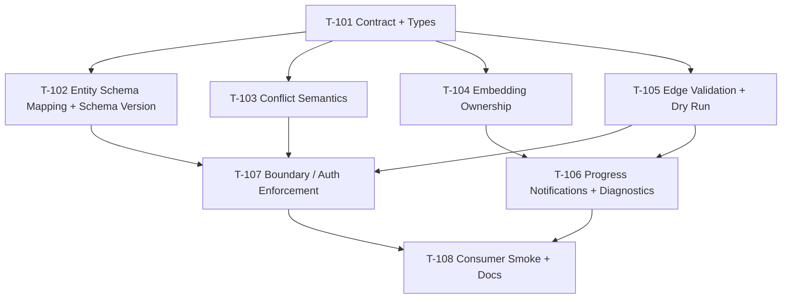

# Compiled Project Plan: Sprint 10 `ingest_entities` — Server-Owned Bulk Entity + Edge Ingest

**Generated:** 2026-04-22T00:00:00Z
**Planning basis:** `ferrosa-memory` needs a single semantic ingest seam for forge and future ingestors. Clients should stop owning CQL schema details, loader subprocesses, embedding plumbing, and silent partial-failure handling. The server should absorb schema drift, conflict semantics, dry-run planning, and progress reporting.

**Historical state (2026-04-22):** adjacent ingest surfaces (`batch_ingest`, `smart_ingest`, `ingest_skill`, `create_edge`) existed, but there was no single `ingest_entities` contract that covered semantic bulk entities + typed edges with row-level failure reporting, server-owned schema mapping, and dry-run support.

**Current note (2026-06-04):** `ingest_entities` is now implemented and
discoverable via `tools/list`. This compiled plan is retained as historical
traceability for the work packets rather than the current roadmap.

**Total tasks:** 8
**Estimated parallel batches:** 4
**Ambiguities requiring human input:** 0

## Dependency Graph



## Execution Batches

**Batch 1**: `T-101`, `T-102`, `T-103`  
Verification: `cargo test -p ferrosa-memory-core ingest_entities:: --lib`

**Batch 2**: `T-104`, `T-105`  
Verification: `cargo test -p ferrosa-memory-core --test ingest_entities_contract`

**Batch 3**: `T-106`, `T-107`  
Verification: `cargo test -p ferrosa-memory-mcp ingest_entities -- --nocapture && pytest tests/integration/test_ingest_entities.py -q`

**Batch 4**: `T-108`  
Verification: `bash scripts/smoke-18765.sh && pytest tests/system/test_ingest_entities_workflow.py -q`

## Ambiguity Log

| ID | Ambiguity | Resolution |
|----|-----------|------------|
| A-101 | Should clients continue sending server column names or storage-specific fields? | No. Clients send semantic fields only; `ferrosa-memory` maps to current app-table schema. |
| A-102 | Is the batch transactional? | No. It is a batch with explicit row-level failure reporting. Partial failures are first-class response data. |
| A-103 | Who owns embedding for missing vectors? | The server may compute missing embeddings when requested; client-supplied embeddings are stored verbatim. |
| A-104 | Can bulk ingest bypass the graph boundary for convenience? | No. App-table CQL is allowed, graph-owned state still uses the approved graph write seam. |

---

### T-101: Contract + Types

**Batch:** 1  
**Depends on:** none  
**Blocks:** `T-102`, `T-103`, `T-104`, `T-105`

#### Deliverables

- `ingest_entities` tool definition in `tools/list`
- request/response Rust types for entities, edges, options, and structured failures
- validation for unknown fields, invalid enums, malformed rows, and size limits

#### Verification

```bash
cargo test -p ferrosa-memory-core ingest_entities_contract_shape --lib
cargo test -p ferrosa-memory-core ingest_entities_rejects_unknown_fields --lib
```

#### Completion Criteria

- [ ] tool schema matches the blueprint contract
- [ ] invalid payloads fail before execution
- [ ] structured `failed[]` response types exist for entities, edges, and embeddings

---

### T-102: Entity Schema Mapping + Schema Version

**Batch:** 1  
**Depends on:** `T-101`  
**Blocks:** `T-107`

#### Deliverables

- semantic entity fields mapped to current app-table schema
- attrs validation and schema-versioned extension handling
- `schema_version` returned in every successful batch response

#### Verification

```bash
cargo test -p ferrosa-memory-core ingest_entities_schema_mapping --lib
pytest tests/integration/test_ingest_entities.py -q -k schema
```

#### Completion Criteria

- [ ] client payloads do not need storage column names
- [ ] unknown attrs fail loudly
- [ ] `schema_version` is present in the final response

---

### T-103: Conflict Semantics

**Batch:** 1  
**Depends on:** `T-101`  
**Blocks:** `T-107`

#### Deliverables

- `on_conflict=update|skip|error` behavior implemented
- idempotent replay behavior for `update`
- explicit counters for inserted, updated, skipped, and failed rows

#### Verification

```bash
cargo test -p ferrosa-memory-core ingest_entities_conflict_modes --lib
pytest tests/integration/test_ingest_entities.py -q -k conflict
```

#### Completion Criteria

- [ ] replays do not duplicate entities under `update`
- [ ] `skip` preserves resident rows untouched
- [ ] `error` reports conflicts without mutating the conflicting row

---

### T-104: Embedding Ownership

**Batch:** 2  
**Depends on:** `T-101`  
**Blocks:** `T-106`

#### Deliverables

- client-supplied embeddings stored verbatim
- missing embeddings computed server-side when `embed_missing=true`
- bounded retries/timeouts and row-level embedding failure reporting

#### Verification

```bash
cargo test -p ferrosa-memory-core ingest_entities_embedding_policy --lib
pytest tests/integration/test_ingest_entities.py -q -k embedding
```

#### Completion Criteria

- [ ] `computed` vs `received` counts are correct
- [ ] embedding failures do not disappear into logs only
- [ ] unrelated rows can still succeed when some embeddings fail

---

### T-105: Edge Validation + Dry Run

**Batch:** 2  
**Depends on:** `T-101`  
**Blocks:** `T-106`, `T-107`

#### Deliverables

- `strict_edges` endpoint resolution against batch + resident entities
- duplicate-edge handling and structured edge failures
- dry-run planner that performs zero writes

#### Verification

```bash
cargo test -p ferrosa-memory-core ingest_entities_strict_edges --lib
cargo test -p ferrosa-memory-core ingest_entities_dry_run_is_side_effect_free --lib
pytest tests/integration/test_ingest_entities.py -q -k "edges or dry_run"
```

#### Completion Criteria

- [ ] orphan edges fail loudly under `strict_edges=true`
- [ ] dry-run returns accurate plan data with no writes
- [ ] edge results distinguish inserted, skipped duplicate, and failed

---

### T-106: Progress Notifications + Diagnostics

**Batch:** 3  
**Depends on:** `T-104`, `T-105`  
**Blocks:** `T-108`

#### Deliverables

- bounded MCP `$/progress` notifications for large batches
- final response diagnostics with `duration_ms`
- operator-visible error shaping suitable for forge diagnostics

#### Verification

```bash
cargo test -p ferrosa-memory-mcp ingest_entities_progress -- --nocapture
pytest tests/system/test_ingest_entities_workflow.py -q -k progress
```

#### Completion Criteria

- [ ] progress events arrive during large batches
- [ ] final response includes `duration_ms`
- [ ] diagnostics are structured enough to replace loader subprocess stderr parsing

---

### T-107: Boundary / Auth Enforcement

**Batch:** 3  
**Depends on:** `T-102`, `T-103`, `T-105`  
**Blocks:** `T-108`

#### Deliverables

- tenant/session enforcement against authenticated context
- static and runtime guardrails preventing graph-table write bypass
- proof that the ingest path still uses the approved graph seam for graph-owned state

#### Verification

```bash
pytest tests/integration/test_ingest_entities.py -q -k auth
if rg -n "INSERT INTO \\{ks\\}\\.(typed_edges|folded_into|mentioned_in|co_occurs_with|supersedes|derived_edges_by_(pred|src))|UPDATE \\{ks\\}\\.(typed_edges|folded_into|mentioned_in|co_occurs_with|supersedes|derived_edges_by_(pred|src))|DELETE FROM \\{ks\\}\\.(typed_edges|folded_into|mentioned_in|co_occurs_with|supersedes|derived_edges_by_(pred|src))" crates/ferrosa-memory-core crates/ferrosa-memory-mcp; then exit 1; fi
```

#### Completion Criteria

- [ ] caller cannot widen tenant scope through payload values
- [ ] ingest introduces no new direct graph-table write path
- [ ] graph/app write boundaries remain explicit and test-covered

---

### T-108: Consumer Smoke + Docs

**Batch:** 4  
**Depends on:** `T-106`, `T-107`  
**Blocks:** none

#### Deliverables

- forge-oriented smoke coverage for one representative batch
- workbench/MCP docs covering dry-run, conflict modes, and schema drift
- rollout notes for migrating off client-owned loader subprocesses

#### Verification

```bash
bash scripts/smoke-18765.sh
pytest tests/system/test_ingest_entities_workflow.py -q
```

#### Completion Criteria

- [ ] a single live smoke batch proves entities, edges, embeddings, and diagnostics
- [ ] docs describe the supported migration path clearly
- [ ] consumer-facing behavior matches the blueprint contract
