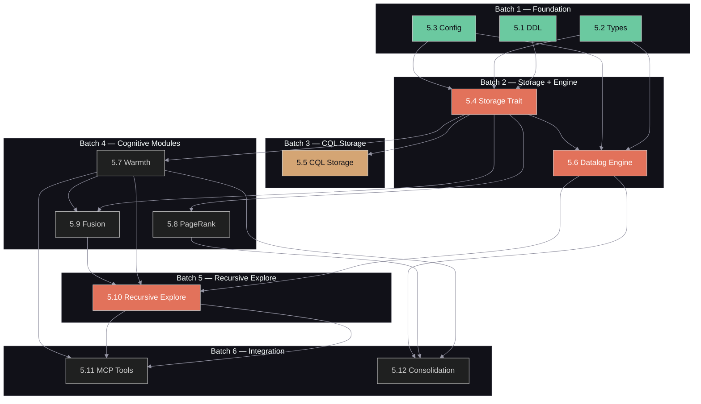

# Compiled Project Plan — Sprint 5: Recursive Memory Harness + Datalog Graph Inference

> **Generated:** 2026-03-29
> **Source Specs:** `specs/overview.md`, `specs/components.md`, `specs/data-flow.md`, `specs/dsm-analysis.md`, `specs/threat-model.md`, `specs/fmea.md`, `specs/project-plan.md`, `~/.claude/plans/tingly-chasing-quokka.md`, `~/datalog_graph_materialization_spec.md`
> **Total Tasks:** 12
> **Execution Batches:** 6
> **Ambiguities:** 0 blocking (see Ambiguity Log)

---

## Dependency DAG



**Critical path:** 5.2 --> 5.4 --> 5.6 --> 5.10 --> 5.11

---

## Execution Batches

### Batch 1 — Foundation (no dependencies)

| Task | Title | Size |
|------|-------|------|
| 5.1 | DDL: Warmth + Datalog Tables | M |
| 5.2 | Types: Warmth, Datalog, Inference | M |
| 5.3 | Config: RMH + Datalog Parameters | S |

All three tasks are parallelizable with zero inter-dependencies.

**Verification:**
```bash
cargo test --workspace
cargo clippy --workspace -- -D warnings
```

### Batch 2 — Storage + Engine (depends on Batch 1)

| Task | Title | Size | Depends On |
|------|-------|------|------------|
| 5.4 | Storage Trait: 15 new methods + MockStorage | L | 5.1, 5.2, 5.3 |
| 5.6 | Datalog Engine: Semi-Naive Evaluator | XL | 5.2, 5.3, 5.4 |

5.4 must complete before 5.6 can begin (5.6 uses `Storage` trait for fact loading). However, the pure evaluation logic in 5.6 (parser, semi-naive loop, provenance) can be designed in parallel while 5.4 is being built, as long as the trait signatures are settled first.

**Verification:**
```bash
cargo test --workspace
cargo clippy --workspace -- -D warnings
```

### Batch 3 — CQL Storage (depends on 5.4)

| Task | Title | Size | Depends On |
|------|-------|------|------------|
| 5.5 | CQL Storage: 15 Prepared Statements | L | 5.4 |

This task implements the concrete CQL backend for the 15 new trait methods. Requires a running Ferrosa cluster for integration tests.

**Verification:**
```bash
cargo test --workspace
cargo clippy --workspace -- -D warnings
# Integration tests against live Ferrosa:
# cargo test --workspace -- --ignored cql_warmth cql_rules cql_cache cql_provenance
```

### Batch 4 — Cognitive Modules (depends on Batch 2)

| Task | Title | Size | Depends On |
|------|-------|------|------------|
| 5.7 | Warmth Module | L | 5.4 |
| 5.8 | PageRank Module | L | 5.4 |
| 5.9 | Enhanced 5-Signal Fusion | M | 5.4, 5.7 |

5.7 and 5.8 are parallelizable. 5.9 depends on 5.7 (needs warmth scores for fusion) but can be started in parallel with PageRank since the warmth interface is defined in 5.4.

**Verification:**
```bash
cargo test --workspace
cargo clippy --workspace -- -D warnings
```

### Batch 5 — Recursive Exploration (depends on Batch 4)

| Task | Title | Size | Depends On |
|------|-------|------|------------|
| 5.10 | Recursive Query Exploration | XL | 5.6, 5.7, 5.9 |

The orchestration module that composes Datalog inference, warmth, hybrid search, and spreading activation into multi-pass recursive query resolution.

**Verification:**
```bash
cargo test --workspace
cargo clippy --workspace -- -D warnings
```

### Batch 6 — Integration (depends on Batch 5)

| Task | Title | Size | Depends On |
|------|-------|------|------------|
| 5.11 | MCP Tools + Wiring | L | 5.10 |
| 5.12 | Consolidation Pipeline Extension | M | 5.6, 5.7, 5.8 |

5.11 and 5.12 are parallelizable. 5.12 only needs 5.6 + 5.7 + 5.8 (not 5.10), so it could technically start during Batch 5. However, grouping it in Batch 6 ensures all cognitive modules are stable before wiring consolidation.

**Verification:**
```bash
cargo test --workspace
cargo clippy --workspace -- -D warnings
# Full regression:
cargo test --workspace -- --include-ignored
```

---

## Ambiguity Log

| # | Area | Status | Resolution |
|---|------|--------|------------|
| 1 | Test specification, test stubs, and CI harness were not generated (compile-project phases 7-9 skipped) | Non-blocking | Tests are defined inline in each task's acceptance criteria. Unit tests use `MockStorage`. Integration tests require live Ferrosa. |
| 2 | Heat telemetry table schema uses Cassandra counter columns | Non-blocking | Ferrosa supports counter columns. If not, fall back to regular columns with read-modify-write. Detect at runtime in CQL storage. |
| 3 | `ordered-float` crate dependency for `Term::ConstFloat(OrderedFloat<f64>)` | Non-blocking | Add `ordered-float = "4"` to `Cargo.toml`. Required for `Hash`/`Eq` on float terms in `FactSet`. |

No blocking ambiguities. All 12 tasks have sufficient detail for implementation.

---

## Task Definitions

### T-5.1: DDL — Warmth + Datalog Tables

**Status:** [ ] Not started
**Batch:** 1
**Size:** M
**Depends on:** none
**Blocks:** 5.4, 5.5

#### Context

Sprint 5 introduces 4 new storage concerns: persistent warmth field, rule registry, derived fact cache, and derivation provenance. Each requires dedicated CQL tables in the `agent_memory` keyspace. These tables follow the project's existing DDL pattern (numbered `.cql` files in `ddl/`). The warmth table stores per-entity activation scores with Ebbinghaus decay metadata. The rule tables store Datalog rule definitions with versioning. The cache tables provide TTL-bounded ephemeral storage for derived facts. The provenance table tracks the parent facts that justified each derivation.

#### Spec References

- Architecture: components.md sections 32-35 (datalog, warmth, pagerank, recursive_explore)
- Datalog spec: sections 8.4-8.8 (physical storage schema)
- DSM: M35 (datalog), M36 (warmth), M37 (pagerank) depend on storage layer
- Threats: I8 (provenance cross-tenant leakage — tenant in partition key), D8 (Datalog fact explosion — cache bounded by TTL)
- FMEA: F45 (derived cache staleness — TTL + rule_version), F46 (warmth runaway — cap in application layer)

#### Files to Create/Modify

| File | Action |
|------|--------|
| `ddl/011_warmth_field.cql` | **Create** — entity_warmth table |
| `ddl/012_datalog_rules.cql` | **Create** — rules_by_id, rules_by_family tables |
| `ddl/013_derived_cache.cql` | **Create** — derived_cache_by_query, derived_cache_by_pred tables |
| `ddl/014_derivation_provenance.cql` | **Create** — derivation_provenance table |

#### Implementation Guide

Follow the existing DDL pattern from `ddl/001_keyspace.cql` through `ddl/010_edge_strength.cql`. Each file starts with a comment block and uses `IF NOT EXISTS`.

**`ddl/011_warmth_field.cql`:**
```sql
-- Entity warmth field: persistent spreading activation with Ebbinghaus decay
-- Sprint 5 — RMH warmth module

CREATE TABLE IF NOT EXISTS agent_memory.entity_warmth (
    tenant_id uuid,
    entity_id uuid,
    session_id uuid,
    warmth double,
    pagerank double,
    last_accessed_at timestamp,
    access_count int,
    decay_zone text,
    updated_at timestamp,
    PRIMARY KEY ((tenant_id, entity_id))
);

-- Secondary index for listing all warmth entries in a session
CREATE INDEX IF NOT EXISTS idx_warmth_session
    ON agent_memory.entity_warmth (session_id);
```

**`ddl/012_datalog_rules.cql`:**
```sql
-- Datalog rule registry with versioning
-- Sprint 5 — Datalog inference engine

CREATE TABLE IF NOT EXISTS agent_memory.rules_by_id (
    tenant_id uuid,
    rule_id text,
    version int,
    name text,
    family text,
    state text,
    rule_body text,
    rule_weight double,
    incremental boolean,
    created_at timestamp,
    updated_at timestamp,
    PRIMARY KEY ((tenant_id, rule_id), version)
) WITH CLUSTERING ORDER BY (version DESC);

CREATE TABLE IF NOT EXISTS agent_memory.rules_by_family (
    tenant_id uuid,
    family text,
    state text,
    rule_id text,
    version int,
    updated_at timestamp,
    PRIMARY KEY ((tenant_id, family, state), rule_id, version)
) WITH CLUSTERING ORDER BY (rule_id ASC, version DESC);
```

**`ddl/013_derived_cache.cql`:**
```sql
-- Ephemeral cache for derived Datalog facts
-- Sprint 5 — TTL-bounded, append-oriented

CREATE TABLE IF NOT EXISTS agent_memory.derived_cache_by_query (
    tenant_id uuid,
    cache_key text,
    seq int,
    src_id uuid,
    pred text,
    dst_id uuid,
    confidence double,
    rule_id text,
    computed_at timestamp,
    PRIMARY KEY ((tenant_id, cache_key), seq)
) WITH default_time_to_live = 3600;

CREATE TABLE IF NOT EXISTS agent_memory.derived_cache_by_pred (
    tenant_id uuid,
    pred text,
    bucket text,
    src_id uuid,
    dst_id uuid,
    confidence double,
    rule_id text,
    computed_at timestamp,
    PRIMARY KEY ((tenant_id, pred, bucket), src_id, dst_id)
) WITH default_time_to_live = 3600;
```

**`ddl/014_derivation_provenance.cql`:**
```sql
-- Derivation provenance: tracks parent facts for each derived fact
-- Sprint 5 — STRIDE I8 mitigation: tenant_id in partition key

CREATE TABLE IF NOT EXISTS agent_memory.derivation_provenance (
    tenant_id uuid,
    derived_edge_id text,
    seq int,
    parent_src text,
    parent_pred text,
    parent_dst text,
    parent_kind text,
    PRIMARY KEY ((tenant_id, derived_edge_id), seq)
);
```

Key design decisions:
- `entity_warmth` uses `(tenant_id, entity_id)` as partition key for direct lookups; session_id has a secondary index for bulk session listing
- `rules_by_id` clusters by `version DESC` so the latest version is always first
- Cache tables use `default_time_to_live = 3600` (1 hour) per Datalog spec section 13.2
- All tables include `tenant_id` in the partition key (STRIDE I8 mitigation)

#### Acceptance Criteria

1. All 4 DDL files exist in `ddl/` directory
2. DDL executes without error on a Ferrosa cluster (manual or integration test)
3. Table schemas match the Datalog spec sections 8.4-8.8
4. `tenant_id` is in the partition key of every table (STRIDE I8)
5. Cache tables have TTL configured

#### Verification

```bash
# DDL files exist and are valid SQL:
ls ddl/01[1-4]*.cql
# On a running Ferrosa cluster:
# cqlsh -f ddl/011_warmth_field.cql
# cqlsh -f ddl/012_datalog_rules.cql
# cqlsh -f ddl/013_derived_cache.cql
# cqlsh -f ddl/014_derivation_provenance.cql
cargo test --workspace
cargo clippy --workspace -- -D warnings
```

---

### T-5.2: Types — Warmth, Datalog, Inference

**Status:** [ ] Not started
**Batch:** 1
**Size:** M
**Depends on:** none
**Blocks:** 5.4, 5.6, 5.7, 5.8, 5.9, 5.10, 5.11, 5.12

#### Context

This task extends `types.rs` with all domain types needed by Sprint 5 modules. Types are the highest fan-in module in the system (97% propagation per DSM analysis), so changes must be additive — only add new types and enums, never modify existing ones. These types are shared across the datalog engine, warmth module, pagerank, recursive explore, and MCP tool dispatch. The types follow existing patterns in `types.rs`: derive `Debug, Clone, Serialize, Deserialize`, use `uuid::Uuid` for identifiers, and `chrono::DateTime<chrono::Utc>` for timestamps.

#### Spec References

- Architecture: components.md section 28 (types — shared type definitions)
- DSM: M32 (types) at 97% propagation — additive-only changes
- Datalog spec: section 6 (canonical logical schema), section 11 (confidence model)
- Plan: tingly-chasing-quokka.md section 5.2

#### Files to Create/Modify

| File | Action |
|------|--------|
| `crates/ferrosa-memory-core/src/types.rs` | **Modify** — append new types after existing `AuditEntry` |
| `crates/ferrosa-memory-core/Cargo.toml` | **Modify** — add `ordered-float = "4"` dependency |

#### Implementation Guide

Append the following types to the end of `types.rs`, after the existing `AuditEntry` struct. Follow the existing pattern: `#[derive(Debug, Clone, Serialize, Deserialize)]` for data types, separate enums with Display impls.

**Warmth types:**

```rust
// --- Warmth types (Sprint 5) ---

/// Ebbinghaus decay zone — controls how fast memories fade.
///
/// Identity-zone memories (personal facts) decay 10x slower than Knowledge-zone.
/// Operational-zone memories (transient tasks) decay 3x faster.
#[derive(Debug, Clone, Serialize, Deserialize, PartialEq, Eq, Hash)]
#[serde(rename_all = "snake_case")]
pub enum DecayZone {
    Identity,
    Knowledge,
    Operational,
}

impl DecayZone {
    /// Returns the decay rate multiplier for this zone.
    /// Lower = slower decay (longer retention).
    pub fn decay_multiplier(&self) -> f64 {
        match self {
            Self::Identity => 0.1,
            Self::Knowledge => 1.0,
            Self::Operational => 3.0,
        }
    }
}

impl std::fmt::Display for DecayZone {
    fn fmt(&self, f: &mut std::fmt::Formatter<'_>) -> std::fmt::Result {
        match self {
            Self::Identity => write!(f, "identity"),
            Self::Knowledge => write!(f, "knowledge"),
            Self::Operational => write!(f, "operational"),
        }
    }
}

/// A persistent warmth entry for an entity.
#[derive(Debug, Clone, Serialize, Deserialize)]
pub struct WarmthEntry {
    pub tenant_id: Uuid,
    pub entity_id: Uuid,
    pub session_id: Uuid,
    pub warmth: f64,
    pub pagerank: f64,
    pub last_accessed_at: chrono::DateTime<chrono::Utc>,
    pub access_count: i64,
    pub decay_zone: DecayZone,
    pub updated_at: chrono::DateTime<chrono::Utc>,
}
```

**Datalog types:**

```rust
// --- Datalog types (Sprint 5) ---

use ordered_float::OrderedFloat;

/// A Datalog term — variable, UUID constant, string constant, or float constant.
#[derive(Debug, Clone, PartialEq, Eq, Hash, Serialize, Deserialize)]
#[serde(tag = "type", content = "value")]
pub enum Term {
    Var(String),
    Const(Uuid),
    ConstStr(String),
    ConstFloat(OrderedFloat<f64>),
}

/// A Datalog atom: predicate(arg1, arg2, ...).
#[derive(Debug, Clone, PartialEq, Eq, Hash, Serialize, Deserialize)]
pub struct Atom {
    pub predicate: String,
    pub args: Vec<Term>,
}

/// Built-in filter predicates for Datalog rule bodies.
#[derive(Debug, Clone, PartialEq, Serialize, Deserialize)]
pub enum BuiltinFilter {
    GreaterThan(String, f64),
    LessThan(String, f64),
    NotEqual(String, String),
}

/// A parsed Datalog rule: head :- body, filters.
#[derive(Debug, Clone, PartialEq, Serialize, Deserialize)]
pub struct DatalogRule {
    pub head: Atom,
    pub body: Vec<Atom>,
    pub filters: Vec<BuiltinFilter>,
}

/// A rule entry from the persistent rule registry.
#[derive(Debug, Clone, Serialize, Deserialize)]
pub struct RuleEntry {
    pub tenant_id: Uuid,
    pub rule_id: String,
    pub version: i32,
    pub name: String,
    pub family: String,
    pub state: RuleState,
    pub rule_body: String,
    pub rule_weight: f64,
    pub incremental: bool,
    pub created_at: chrono::DateTime<chrono::Utc>,
    pub updated_at: chrono::DateTime<chrono::Utc>,
}

/// State of a rule in the registry.
#[derive(Debug, Clone, Serialize, Deserialize, PartialEq, Eq)]
#[serde(rename_all = "snake_case")]
pub enum RuleState {
    Active,
    Deprecated,
    Superseded,
}

impl std::fmt::Display for RuleState {
    fn fmt(&self, f: &mut std::fmt::Formatter<'_>) -> std::fmt::Result {
        match self {
            Self::Active => write!(f, "active"),
            Self::Deprecated => write!(f, "deprecated"),
            Self::Superseded => write!(f, "superseded"),
        }
    }
}
```

**FactSet and DerivedFact:**

```rust
/// A set of Datalog facts, indexed by predicate name.
///
/// Each fact is a tuple of `Term` values. The predicate name is the key.
/// Example: `edge(uuid1, "co_occurs", uuid2)` stored as
/// `facts["edge"] = {[Const(uuid1), ConstStr("co_occurs"), Const(uuid2)]}`.
#[derive(Debug, Clone, Default, Serialize, Deserialize)]
pub struct FactSet {
    pub facts: std::collections::HashMap<String, std::collections::HashSet<Vec<Term>>>,
}

impl FactSet {
    pub fn new() -> Self {
        Self::default()
    }

    pub fn insert(&mut self, predicate: &str, args: Vec<Term>) -> bool {
        self.facts
            .entry(predicate.to_string())
            .or_default()
            .insert(args)
    }

    pub fn contains(&self, predicate: &str, args: &[Term]) -> bool {
        self.facts
            .get(predicate)
            .is_some_and(|set| set.contains(args))
    }

    pub fn len(&self) -> usize {
        self.facts.values().map(|s| s.len()).sum()
    }

    pub fn is_empty(&self) -> bool {
        self.len() == 0
    }

    pub fn get(&self, predicate: &str) -> Option<&std::collections::HashSet<Vec<Term>>> {
        self.facts.get(predicate)
    }

    pub fn predicates(&self) -> impl Iterator<Item = &String> {
        self.facts.keys()
    }
}

/// A derived fact with provenance chain.
#[derive(Debug, Clone, Serialize, Deserialize)]
pub struct DerivedFact {
    pub src_id: String,
    pub pred: String,
    pub dst_id: String,
    pub confidence: f64,
    pub rule_id: String,
    pub support_count: i32,
    pub provenance: Vec<ProvenanceStep>,
}

/// One step in a derivation provenance chain.
#[derive(Debug, Clone, Serialize, Deserialize)]
pub struct ProvenanceStep {
    pub parent_src: String,
    pub parent_pred: String,
    pub parent_dst: String,
    pub parent_kind: String,
}
```

**Recursive explore types:**

```rust
// --- Recursive exploration types (Sprint 5) ---

/// Result of a recursive exploration query.
#[derive(Debug, Clone, Serialize, Deserialize)]
pub struct RecursiveExploreResult {
    pub sub_queries: Vec<SubQuery>,
    pub results: Vec<SearchResult>,
    pub passes: usize,
    pub converged: bool,
    pub derived_facts_count: usize,
}

/// A decomposed sub-query with reasoning.
#[derive(Debug, Clone, Serialize, Deserialize)]
pub struct SubQuery {
    pub query_text: String,
    pub reasoning: String,
}

/// A search result from hybrid/recursive search.
#[derive(Debug, Clone, Serialize, Deserialize)]
pub struct SearchResult {
    pub entity_id: Uuid,
    pub entity_name: String,
    pub entity_type: String,
    pub context_snippet: String,
    pub score: f64,
    #[serde(skip_serializing_if = "Option::is_none")]
    pub provenance: Option<Vec<ProvenanceStep>>,
}
```

**Important patterns to follow:**
- The `use ordered_float::OrderedFloat;` import should go at the top of the file with other imports
- `Term` must derive `Eq + Hash` so it can be used in `HashSet` within `FactSet` — this requires `OrderedFloat` for the float variant
- `BuiltinFilter` only needs `PartialEq` (not used in hash sets)
- `FactSet::insert` returns `bool` (true if the fact was new) to support semi-naive evaluation's delta tracking

#### Acceptance Criteria

1. All types compile: `cargo check --workspace`
2. Serde round-trip tests pass for each new type
3. `DecayZone::decay_multiplier()` returns 0.1, 1.0, 3.0 for Identity, Knowledge, Operational
4. `FactSet` insert/contains/len operations work correctly
5. `Term::ConstFloat` uses `OrderedFloat<f64>` for `Hash`/`Eq` compliance
6. No modifications to existing types (additive only)
7. All existing tests pass (no regressions)

#### Verification

```bash
cargo test --workspace
cargo clippy --workspace -- -D warnings
# Specific type tests:
cargo test -p ferrosa-memory-core -- types::
```

---

### T-5.3: Config — RMH + Datalog Parameters

**Status:** [ ] Not started
**Batch:** 1
**Size:** S
**Depends on:** none
**Blocks:** 5.4, 5.6, 5.7, 5.8, 5.10

#### Context

Adds `[rmh]` and `[datalog]` configuration sections to the TOML config parser. These sections externalize tuning parameters for warmth, PageRank, recursive exploration, and Datalog evaluation. The config module is a leaf module in the DSM (no intra-crate dependencies), so this change has low propagation risk. Both sections are optional with sensible defaults, ensuring backward compatibility with existing config files.

#### Spec References

- Architecture: components.md section 18 (config — TOML configuration parsing)
- DSM: M18 (config) — leaf module, 34% propagation via downstream consumers
- Plan: tingly-chasing-quokka.md section 5.3
- Threats: D8 (max_iterations and max_facts as config caps), D9 (max_explore_passes)

#### Files to Create/Modify

| File | Action |
|------|--------|
| `crates/ferrosa-memory-core/src/config.rs` | **Modify** — add `RmhConfig` and `DatalogConfig` structs, add fields to `Config` |

#### Implementation Guide

Follow the existing pattern in `config.rs`. Each new config section is a struct with `#[derive(Debug, Deserialize)]`, a `Default` impl, and default functions. Add the new fields to the top-level `Config` struct with `#[serde(default)]`.

Add to the `Config` struct:
```rust
#[serde(default)]
pub rmh: RmhConfig,
#[serde(default)]
pub datalog: DatalogConfig,
```

**`RmhConfig` struct:**
```rust
/// Recursive Memory Harness configuration.
#[derive(Debug, Deserialize, Clone)]
pub struct RmhConfig {
    /// Warmth increment per access (default 0.3)
    #[serde(default = "default_warmth_boost")]
    pub warmth_boost_amount: f64,
    /// Fraction of warmth spread to 1-hop neighbors (default 0.5)
    #[serde(default = "default_neighbor_ratio")]
    pub warmth_neighbor_ratio: f64,
    /// Warmth below this threshold is pruned during decay (default 0.01)
    #[serde(default = "default_prune_threshold")]
    pub warmth_prune_threshold: f64,
    /// Max warmth cap to prevent runaway (default 10.0) — FMEA F46
    #[serde(default = "default_warmth_cap")]
    pub warmth_cap: f64,
    /// PPR teleport probability (default 0.45) — Ori Mnemos alpha
    #[serde(default = "default_ppr_alpha")]
    pub ppr_alpha: f64,
    /// PPR power iteration rounds (default 20)
    #[serde(default = "default_ppr_iterations")]
    pub ppr_iterations: usize,
    /// Ebbinghaus decay lambda (default 0.1)
    #[serde(default = "default_decay_lambda")]
    pub decay_lambda: f64,
    /// Max recursive explore passes (default 3) — STRIDE D9
    #[serde(default = "default_max_passes")]
    pub max_explore_passes: usize,
    /// Convergence novelty threshold (default 0.1)
    #[serde(default = "default_convergence")]
    pub convergence_threshold: f64,
    /// Max entities across all explore passes (default 50) — STRIDE D9
    #[serde(default = "default_max_explore_entities")]
    pub max_explore_entities: usize,
}
```

Default functions:
```rust
fn default_warmth_boost() -> f64 { 0.3 }
fn default_neighbor_ratio() -> f64 { 0.5 }
fn default_prune_threshold() -> f64 { 0.01 }
fn default_warmth_cap() -> f64 { 10.0 }
fn default_ppr_alpha() -> f64 { 0.45 }
fn default_ppr_iterations() -> usize { 20 }
fn default_decay_lambda() -> f64 { 0.1 }
fn default_max_passes() -> usize { 3 }
fn default_convergence() -> f64 { 0.1 }
fn default_max_explore_entities() -> usize { 50 }
```

**`DatalogConfig` struct:**
```rust
/// Datalog inference engine configuration.
#[derive(Debug, Deserialize, Clone)]
pub struct DatalogConfig {
    /// Max semi-naive evaluation iterations (default 100) — FMEA F42
    #[serde(default = "default_max_iterations")]
    pub max_iterations: usize,
    /// Max total derived facts before bail (default 50000) — STRIDE D8
    #[serde(default = "default_max_facts")]
    pub max_facts: usize,
    /// Derived cache TTL in seconds (default 3600)
    #[serde(default = "default_cache_ttl")]
    pub cache_ttl_seconds: u64,
    /// Confidence combination strategy (default "min_parent_times_weight")
    #[serde(default = "default_confidence_strategy")]
    pub confidence_combination: String,
}
```

Default functions:
```rust
fn default_max_iterations() -> usize { 100 }
fn default_max_facts() -> usize { 50000 }
fn default_cache_ttl() -> u64 { 3600 }
fn default_confidence_strategy() -> String { "min_parent_times_weight".to_string() }
```

#### Acceptance Criteria

1. Config parses correctly with no `[rmh]` or `[datalog]` sections (all defaults)
2. Config parses correctly with both sections present and overridden values
3. Config parses correctly with partial overrides (some fields default, some specified)
4. All default values match the spec: warmth_boost=0.3, ppr_alpha=0.45, max_iterations=100, max_facts=50000
5. Existing config tests pass unchanged (backward compatible)

#### Verification

```bash
cargo test --workspace
cargo clippy --workspace -- -D warnings
cargo test -p ferrosa-memory-core -- config::
```

---

### T-5.4: Storage Trait — Warmth + Rule + Cache + Provenance + Heat Operations

**Status:** [ ] Not started
**Batch:** 2
**Size:** L
**Depends on:** 5.1, 5.2, 5.3
**Blocks:** 5.5, 5.6, 5.7, 5.8, 5.9, 5.10, 5.11, 5.12

#### Context

The `Storage` trait is the primary abstraction boundary in the system (95% propagation, 24 direct dependents per DSM). This task adds 15 new async methods covering warmth, rule registry, derived cache, provenance, and heat telemetry. Every new method follows the established pattern: takes `&self` + `&TenantContext`, returns `anyhow::Result<T>`. The `MockStorage` struct must also implement all 15 methods for unit testing across all downstream modules.

This is the single most critical task in Sprint 5 — it gates every other task in Batches 2-6. The trait method signatures must be correct on the first pass, because all downstream modules will code against them.

#### Spec References

- Architecture: components.md section 29 (storage — storage trait abstraction)
- DSM: M29 (storage) at 95% propagation — 24 direct dependents, grows to 39 methods
- Datalog spec: sections 8.4-8.8 (storage operations)
- Threats: I8 (all methods take TenantContext for tenant isolation)
- FMEA: F45 (derived_cache_clear for cache invalidation), F46 (warmth_boost with cap)
- Plan: tingly-chasing-quokka.md section 5.4

#### Files to Create/Modify

| File | Action |
|------|--------|
| `crates/ferrosa-memory-core/src/storage.rs` | **Modify** — add 15 methods to `Storage` trait + `MockStorage` impl |

#### Implementation Guide

Add the following 15 methods to the `Storage` trait, after the existing `audit_put` method. Follow the existing method style exactly: `async fn name(&self, ctx: &TenantContext, ...) -> anyhow::Result<T>`.

**Warmth methods (5):**

```rust
// --- Warmth operations (Sprint 5) ---

/// Get warmth entry for an entity.
async fn warmth_get(
    &self,
    ctx: &TenantContext,
    entity_id: Uuid,
) -> anyhow::Result<Option<WarmthEntry>>;

/// Store or update a warmth entry.
async fn warmth_put(
    &self,
    ctx: &TenantContext,
    entry: &WarmthEntry,
) -> anyhow::Result<()>;

/// Boost an entity's warmth by `amount`. Creates entry if absent.
async fn warmth_boost(
    &self,
    ctx: &TenantContext,
    entity_id: Uuid,
    amount: f64,
    session_id: Uuid,
) -> anyhow::Result<()>;

/// List all warmth entries for a session.
async fn warmth_list_session(
    &self,
    ctx: &TenantContext,
    session_id: Uuid,
) -> anyhow::Result<Vec<WarmthEntry>>;

/// Apply Ebbinghaus decay to all warmth entries in a session.
/// Returns number of entries pruned (below threshold).
async fn warmth_decay_all(
    &self,
    ctx: &TenantContext,
    session_id: Uuid,
    elapsed_hours: f64,
) -> anyhow::Result<usize>;
```

**Rule registry methods (3):**

```rust
// --- Rule registry operations (Sprint 5) ---

/// Store a rule version.
async fn rule_put(
    &self,
    ctx: &TenantContext,
    entry: &RuleEntry,
) -> anyhow::Result<()>;

/// List rules by family and state.
async fn rule_list_family(
    &self,
    ctx: &TenantContext,
    family: &str,
    state: RuleState,
) -> anyhow::Result<Vec<RuleEntry>>;

/// Get a single rule by ID (latest version).
async fn rule_get(
    &self,
    ctx: &TenantContext,
    rule_id: &str,
) -> anyhow::Result<Option<RuleEntry>>;
```

**Derived cache methods (3):**

```rust
// --- Derived cache operations (Sprint 5) ---

/// Get cached derived facts by cache key.
async fn derived_cache_get(
    &self,
    ctx: &TenantContext,
    cache_key: &str,
) -> anyhow::Result<Vec<DerivedFact>>;

/// Cache derived facts with TTL.
async fn derived_cache_put(
    &self,
    ctx: &TenantContext,
    cache_key: &str,
    facts: &[DerivedFact],
) -> anyhow::Result<()>;

/// Invalidate cache entries for a predicate (on rule change).
async fn derived_cache_clear(
    &self,
    ctx: &TenantContext,
    pred: &str,
) -> anyhow::Result<()>;
```

**Provenance methods (2):**

```rust
// --- Provenance operations (Sprint 5) ---

/// Store provenance steps for a derived edge.
async fn provenance_put(
    &self,
    ctx: &TenantContext,
    derived_edge_id: &str,
    steps: &[ProvenanceStep],
) -> anyhow::Result<()>;

/// Get provenance steps for a derived edge.
async fn provenance_get(
    &self,
    ctx: &TenantContext,
    derived_edge_id: &str,
) -> anyhow::Result<Vec<ProvenanceStep>>;
```

**Heat telemetry methods (2):**

```rust
// --- Heat telemetry operations (Sprint 5) ---

/// Record a cache hit or miss for a predicate.
async fn heat_record(
    &self,
    ctx: &TenantContext,
    pred: &str,
    hit: bool,
    compute_ms: Option<i64>,
) -> anyhow::Result<()>;

/// Get heat data for a predicate over N days: (total_hits, total_compute_ms).
async fn heat_get(
    &self,
    ctx: &TenantContext,
    pred: &str,
    days: u32,
) -> anyhow::Result<(i64, i64)>;
```

**MockStorage implementation:**

Add corresponding fields to `MockStorage`:
```rust
pub warmth_entries: Mutex<Vec<WarmthEntry>>,
pub rules: Mutex<Vec<RuleEntry>>,
pub derived_cache: Mutex<std::collections::HashMap<String, Vec<DerivedFact>>>,
pub provenance: Mutex<std::collections::HashMap<String, Vec<ProvenanceStep>>>,
pub heat_records: Mutex<Vec<(String, bool, Option<i64>)>>,
```

Each MockStorage method should be a straightforward in-memory implementation:
- `warmth_get`: filter by entity_id
- `warmth_put`: upsert (replace if exists, push if not)
- `warmth_boost`: find or create, increment warmth
- `warmth_list_session`: filter by session_id
- `warmth_decay_all`: multiply each warmth by decay factor, remove if below threshold
- `rule_put`: push to vec
- `rule_list_family`: filter by family + state, sort by version desc
- `rule_get`: filter by rule_id, return highest version
- `derived_cache_get/put/clear`: HashMap operations
- `provenance_get/put`: HashMap operations
- `heat_record`: push tuple
- `heat_get`: filter + sum

**Imports to add at top of storage.rs:**
```rust
use crate::types::{
    // ... existing imports ...
    WarmthEntry, RuleEntry, RuleState, DerivedFact, ProvenanceStep,
};
```

#### Acceptance Criteria

1. `Storage` trait compiles with 15 new methods (total ~39 methods)
2. `MockStorage` implements all 15 new methods
3. All methods take `&TenantContext` as first data parameter (STRIDE I8)
4. Unit tests for each MockStorage method (CRUD round-trip)
5. All existing tests pass (no trait breakage in downstream modules)
6. `cargo check --workspace` succeeds (proves all trait implementations are complete)

#### Verification

```bash
cargo check --workspace  # critical — proves all impls are complete
cargo test --workspace
cargo clippy --workspace -- -D warnings
cargo test -p ferrosa-memory-core -- storage::
```

---

### T-5.5: CQL Storage — 15 New Prepared Statements

**Status:** [ ] Not started
**Batch:** 3
**Size:** L
**Depends on:** 5.4
**Blocks:** (none — downstream modules use trait, not concrete impl)

#### Context

Implements the 15 new `Storage` trait methods in `CqlStorage` — the concrete CQL backend that talks to Ferrosa. Each method maps to one or more CQL prepared statements. This task follows the established pattern in `cql_storage.rs`: `PreparedQuery` fields initialized in `connect()`, parameterized queries via `cdrs-tokio`, all scoped by `tenant_id` from `TenantContext`.

This task requires the DDL from T-5.1 to be applied to the target Ferrosa cluster. It can run in parallel with T-5.6 (Datalog engine) since the Datalog engine tests use `MockStorage`.

#### Spec References

- Architecture: components.md section 10 (cql_client — CQL storage client)
- DSM: M10 (cql_storage) — 5 dependencies, moderate fan-out
- Threats: T4 (all queries use prepared statements — zero string interpolation), I8 (tenant_id in every WHERE clause)
- FMEA: F01 (connection pool), F02 (prepared statement cache), F45 (cache TTL)
- Datalog spec: sections 8.4-8.8

#### Files to Create/Modify

| File | Action |
|------|--------|
| `crates/ferrosa-memory-core/src/cql_storage.rs` | **Modify** — add ~15 new PreparedQuery fields and 15 method implementations |

#### Implementation Guide

Follow the existing pattern in `cql_storage.rs`. For each new method:

1. Add a `PreparedQuery` field to the struct (e.g., `warmth_get_stmt`)
2. Prepare the statement in `connect()` method
3. Implement the trait method using the prepared statement

**Key CQL patterns:**

Warmth boost (read-modify-write):
```sql
-- warmth_get
SELECT * FROM agent_memory.entity_warmth WHERE tenant_id = ? AND entity_id = ?

-- warmth_put (upsert)
INSERT INTO agent_memory.entity_warmth
    (tenant_id, entity_id, session_id, warmth, pagerank, last_accessed_at, access_count, decay_zone, updated_at)
    VALUES (?, ?, ?, ?, ?, ?, ?, ?, ?)

-- warmth_list_session
SELECT * FROM agent_memory.entity_warmth WHERE session_id = ?
```

Rule registry:
```sql
-- rule_put (insert version)
INSERT INTO agent_memory.rules_by_id
    (tenant_id, rule_id, version, name, family, state, rule_body, rule_weight, incremental, created_at, updated_at)
    VALUES (?, ?, ?, ?, ?, ?, ?, ?, ?, ?, ?)

-- Also write to rules_by_family denormalized table
INSERT INTO agent_memory.rules_by_family
    (tenant_id, family, state, rule_id, version, updated_at)
    VALUES (?, ?, ?, ?, ?, ?)

-- rule_list_family
SELECT * FROM agent_memory.rules_by_family WHERE tenant_id = ? AND family = ? AND state = ?

-- rule_get (latest version — ORDER BY version DESC, LIMIT 1)
SELECT * FROM agent_memory.rules_by_id WHERE tenant_id = ? AND rule_id = ? LIMIT 1
```

Derived cache (with TTL):
```sql
-- derived_cache_put (with TTL)
INSERT INTO agent_memory.derived_cache_by_query
    (tenant_id, cache_key, seq, src_id, pred, dst_id, confidence, rule_id, computed_at)
    VALUES (?, ?, ?, ?, ?, ?, ?, ?, ?) USING TTL ?

-- derived_cache_get
SELECT * FROM agent_memory.derived_cache_by_query WHERE tenant_id = ? AND cache_key = ?

-- derived_cache_clear (delete all for a predicate in the by_pred table)
-- Note: requires knowing the bucket. Clear by predicate may need ALLOW FILTERING
-- or a secondary index. Simpler approach: just let TTL expire and bump rule_version
-- in cache key. Log that cache clear is best-effort.
```

Provenance:
```sql
-- provenance_put
INSERT INTO agent_memory.derivation_provenance
    (tenant_id, derived_edge_id, seq, parent_src, parent_pred, parent_dst, parent_kind)
    VALUES (?, ?, ?, ?, ?, ?, ?)

-- provenance_get
SELECT * FROM agent_memory.derivation_provenance WHERE tenant_id = ? AND derived_edge_id = ?
```

**UUID parsing:** `src_id` and `dst_id` in `DerivedFact` are `String` (not `Uuid`) because they may hold string identifiers from the Datalog canonical schema. Store them as `text` columns.

#### Acceptance Criteria

1. All 15 `Storage` trait methods implemented in `CqlStorage`
2. All queries use prepared statements (STRIDE T4 — zero string interpolation)
3. All queries include `tenant_id` in WHERE clause (STRIDE I8)
4. Cache writes use `USING TTL ?` with configured TTL
5. Integration tests pass against live Ferrosa cluster
6. `cargo check --workspace` succeeds

#### Verification

```bash
cargo check --workspace
cargo test --workspace
cargo clippy --workspace -- -D warnings
# Integration tests (requires running Ferrosa):
# cargo test -p ferrosa-memory-core -- --ignored cql_storage
```

---

### T-5.6: Datalog Engine — Semi-Naive Evaluator

**Status:** [ ] Not started
**Batch:** 2
**Size:** XL
**Depends on:** 5.2, 5.3, 5.4
**Blocks:** 5.10, 5.11, 5.12

#### Context

This is the core inference engine — a semi-naive Datalog evaluator that derives new facts from existing storage data using logical rules. It normalizes the entity graph into canonical predicates (`edge(Src, Pred, Dst)`, `node(Id)`), evaluates rules to fixpoint using the semi-naive algorithm (only process newly derived facts each round), and tracks provenance for every derivation.

The engine operates as a logical view over existing CQL storage. Existing entity edges (CO_OCCURS_WITH, MENTIONED_IN, FOLDED_INTO, SUPERSEDES) are normalized into canonical predicates at query time. Built-in rule families handle taxonomy closure, part-of closure, transitive co-occurrence, and multi-edge-type reachability.

This is the largest single task in Sprint 5. It should be implemented top-down: parser first (testable in isolation), then semi-naive evaluator (testable with hand-crafted FactSets), then fact loading (needs Storage trait), then query-time derivation (integrates cache).

#### Spec References

- Architecture: components.md section 32 (datalog — semi-naive Datalog evaluator)
- DSM: M35 (datalog) — depends on M29 (storage), M32 (types), M18 (config)
- Datalog spec: sections 6 (canonical schema), 10 (rules), 11 (confidence), 16 (execution model)
- Threats: S7 (rule injection — parse_rule validates before storage), D8 (fact explosion — max_facts + max_iterations caps), E5 (rules operate on closed FactSet)
- FMEA: F42 (divergence — max_iterations cap), F43 (invalid syntax — parse validation), F44 (confidence > 1.0 — clamping), F45 (cache staleness — rule_version in cache key)

#### Files to Create/Modify

| File | Action |
|------|--------|
| `crates/ferrosa-memory-core/src/datalog.rs` | **Create** — ~800 lines |
| `crates/ferrosa-memory-core/src/lib.rs` | **Modify** — add `pub mod datalog;` |

#### Implementation Guide

**Module structure:**

```rust
//! Semi-naive Datalog evaluator with rule parsing, canonical fact extraction,
//! query-time derivation, and provenance tracking.
//!
//! The engine normalizes existing storage edges into canonical predicates at
//! query time. Rules operate on a closed FactSet — no direct storage access
//! during evaluation (STRIDE E5 mitigation).

use std::collections::{HashMap, HashSet};
use uuid::Uuid;

use crate::config::DatalogConfig;
use crate::storage::Storage;
use crate::types::*;
```

**1. Rule Parser (`parse_rule`):**

```rust
/// Parse a Datalog rule from text syntax.
///
/// Syntax: `head(X, Y) :- body1(X, Z), body2(Z, Y), X != Y.`
///
/// Supports:
/// - Variables: uppercase first letter (X, Y, Foo)
/// - Constants: quoted strings ("co_occurs") or UUIDs
/// - Builtins: != (not equal), > (greater than), < (less than)
pub fn parse_rule(text: &str) -> anyhow::Result<DatalogRule> { ... }
```

Implementation approach:
- Trim trailing `.` and whitespace
- Split on `:-` to get head and body
- Parse head as a single `Atom`
- Split body on `,` (respecting parentheses)
- Each body element is either an `Atom` or a `BuiltinFilter`
- Variable detection: starts with uppercase letter
- Constant detection: quoted string or valid UUID

**2. Canonical Fact Extraction (`load_session_facts`):**

```rust
/// Normalize existing storage into canonical Datalog predicates.
///
/// Extracts from:
/// - entity_list_session() -> node(Id), node_label(Id, Label), node_name(Id, Name)
/// - edge_list_session() -> edge(Src, Pred, Dst)
/// - warmth_list_session() -> warmth(Id, Score)
/// - temporal_list_all() -> supersedes(New, Old), instance_of(Entity, Type)
pub async fn load_session_facts(
    storage: &(impl Storage + ?Sized),
    ctx: &TenantContext,
    session_id: Uuid,
) -> anyhow::Result<FactSet> { ... }
```

Edge type normalization:
- `CO_OCCURS` -> `co_occurs(A, B)` and `edge(A, "co_occurs", B)`
- `MENTIONED_IN` -> `mentioned_in(Entity, Fold)` and `edge(Entity, "mentioned_in", Fold)`
- `FOLDED_INTO` -> `folded_into(Child, Parent)` and `edge(Child, "folded_into", Parent)`
- `SUPERSEDES` -> `supersedes(New, Old)` and `edge(New, "supersedes", Old)`

Entity normalization:
- Each entity -> `node(Id)`, `node_label(Id, Type)`, `node_name(Id, Name)`
- If entity_type matches known taxonomy -> `instance_of(Id, Type)`

**3. Semi-Naive Evaluator (`evaluate`):**

```rust
/// Semi-naive fixpoint evaluation.
///
/// Returns (all_facts_including_base, newly_derived_facts_with_provenance).
///
/// Algorithm:
/// 1. delta = initial_facts (round 0 treats all base facts as new)
/// 2. For each round:
///    a. Apply each rule using delta facts as at least one body atom
///    b. Collect newly derived facts not already in all_facts
///    c. If no new facts -> fixpoint reached, break
///    d. Add new facts to all_facts, set delta = new facts
/// 3. Bail if max_iterations or max_facts exceeded
pub fn evaluate(
    rules: &[DatalogRule],
    initial_facts: &FactSet,
    max_iterations: usize,
    max_facts: usize,
) -> (FactSet, Vec<DerivedFact>) { ... }
```

Rule evaluation with join (inner function):
```rust
fn evaluate_rule(
    rule: &DatalogRule,
    all_facts: &FactSet,
    delta: &FactSet,
) -> Vec<(Vec<Term>, Vec<ProvenanceStep>)> { ... }
```

Algorithm for evaluating a single rule:
1. For each body atom, find matching facts in `all_facts` (at least one from `delta`)
2. Nested-loop join: iterate over bindings for body atoms left-to-right
3. Propagate variable bindings through the join
4. Check builtin filters after all body atoms are bound
5. Instantiate head atom from the complete binding
6. Return the head tuple + provenance (list of body facts used)

Confidence propagation (Datalog spec section 11):
```rust
fn compute_confidence(parent_confidences: &[f64], rule_weight: f64) -> f64 {
    let min_parent = parent_confidences.iter().cloned().fold(f64::INFINITY, f64::min);
    (min_parent * rule_weight).clamp(0.0, 1.0)  // FMEA F44: clamp to [0, 1]
}
```

**4. Built-in Rules:**

```rust
/// Returns the built-in rule families for ferrosa-memory.
pub fn builtin_rules() -> Vec<DatalogRule> {
    let rules_text = [
        // Transitive co-occurrence (RMH)
        "related(X, Z) :- co_occurs(X, Y), co_occurs(Y, Z), X != Z.",
        "cluster(X, Y) :- related(X, Y), related(Y, X).",
        // Reachability (multi-edge-type)
        "reachable(X, Z) :- edge(X, _, Z).",
        "reachable(X, Z) :- reachable(X, Y), edge(Y, _, Z), X != Z.",
        // Taxonomy closure
        "class_ancestor(C, P) :- subclass_of(C, P).",
        "class_ancestor(C, P) :- subclass_of(C, M), class_ancestor(M, P).",
        "isa(E, C) :- instance_of(E, C).",
        "isa(E, P) :- instance_of(E, C), class_ancestor(C, P).",
        // Part-of closure
        "ancestor_part(X, Y) :- part_of(X, Y).",
        "ancestor_part(X, Z) :- part_of(X, Y), ancestor_part(Y, Z).",
    ];
    rules_text.iter().filter_map(|r| parse_rule(r).ok()).collect()
}
```

**5. Query-Time Derivation (`query_predicate`):**

```rust
/// Query-time derivation with cache integration.
///
/// 1. Check derived cache -> return on hit, record heat
/// 2. On miss: load facts, evaluate relevant rules, derive
/// 3. Write to cache with TTL
/// 4. Record heat + compute cost
/// 5. Return derived facts with provenance
pub async fn query_predicate(
    storage: &(impl Storage + ?Sized),
    ctx: &TenantContext,
    session_id: Uuid,
    predicate: &str,
    params: &[(String, Term)],
    config: &DatalogConfig,
) -> anyhow::Result<Vec<DerivedFact>> { ... }
```

Cache key construction: `format!("{predicate}:{}", params_to_string(params))`

**Key constraints:**
- `max_iterations` (default 100) — FMEA F42 mitigation
- `max_facts` (default 50000) — STRIDE D8 mitigation
- Rules operate on closed `FactSet`, not storage handles — STRIDE E5
- Confidence clamped to `[0.0, 1.0]` — FMEA F44

#### Acceptance Criteria

1. `parse_rule` correctly parses all 10 built-in rules
2. Semi-naive evaluation reaches fixpoint on triangle graph (A-B-C-A cycle)
3. Transitive closure derives correct `related` and `cluster` facts on diamond graph
4. Taxonomy `isa` derives 3-level class hierarchy correctly
5. Confidence propagation uses `min(parents) * weight`, clamped to [0, 1]
6. Provenance tracks parent facts for every derivation
7. `max_iterations` cap triggers on adversarial cyclic rules (FMEA F42)
8. `max_facts` cap triggers on explosive rule sets (STRIDE D8)
9. Cache integration: first call computes, second call hits cache
10. Parse rejects malformed rule syntax (FMEA F43)

FMEA test cases: TC35 (cyclic rules), TC36 (max_iterations bail), TC37 (malformed rules), TC38 (built-in parse), TC39 (confidence clamping), TC40 (cache invalidation on rule change).

#### Verification

```bash
cargo test --workspace
cargo clippy --workspace -- -D warnings
cargo test -p ferrosa-memory-core -- datalog::
```

---

### T-5.7: Warmth Module — Persistent Spreading Activation with Ebbinghaus Decay

**Status:** [ ] Not started
**Batch:** 4
**Size:** L
**Depends on:** 5.4
**Blocks:** 5.9, 5.10, 5.11, 5.12

#### Context

The warmth module implements persistent spreading activation inspired by the Recursive Memory Harness (Ori Mnemos). Each entity has a warmth score that increases on access and decays over time following the Ebbinghaus forgetting curve. Warmth scores feed into the 5-signal RRF fusion pipeline to bias retrieval toward recently-accessed and frequently-used entities.

Zone-based decay differentiation ensures that identity-related memories (personal facts) persist much longer than operational memories (transient task context). The Ebbinghaus decay formula is: `warmth * exp(-lambda * decay_multiplier * elapsed_hours)`.

#### Spec References

- Architecture: components.md section 33 (warmth — persistent spreading activation)
- DSM: M36 (warmth) — depends on M29 (storage), M32 (types), M18 (config)
- Threats: T8 (warmth manipulation — max cap 10.0)
- FMEA: F46 (warmth runaway — cap), F47 (boost latency — fire-and-forget), F48 (aggressive decay — conservative threshold)

#### Files to Create/Modify

| File | Action |
|------|--------|
| `crates/ferrosa-memory-core/src/warmth.rs` | **Create** — ~300 lines |
| `crates/ferrosa-memory-core/src/lib.rs` | **Modify** — add `pub mod warmth;` |

#### Implementation Guide

**Module structure:**

```rust
//! Persistent warmth field with Ebbinghaus decay.
//!
//! Warmth accumulates on entity access and spreads to 1-hop neighbors.
//! Ebbinghaus decay reduces warmth over time with zone-based differentiation.

use std::collections::HashMap;
use uuid::Uuid;

use crate::config::RmhConfig;
use crate::storage::Storage;
use crate::types::{DecayZone, TenantContext, WarmthEntry};
```

**1. `boost_on_access`:**

```rust
/// Boost an entity's warmth on access.
///
/// - Increments warmth by config.warmth_boost_amount (default 0.3)
/// - Caps at config.warmth_cap (default 10.0) — FMEA F46
/// - Creates entry if absent (new entity gets initial warmth)
/// - Spreads to 1-hop neighbors at config.warmth_neighbor_ratio (default 50%)
/// - Neighbor boost is fire-and-forget (FMEA F47 — don't block retrieval)
pub async fn boost_on_access(
    storage: &(impl Storage + ?Sized),
    ctx: &TenantContext,
    entity_id: Uuid,
    session_id: Uuid,
    decay_zone: &DecayZone,
    config: &RmhConfig,
) -> anyhow::Result<()> { ... }
```

Implementation:
1. Call `storage.warmth_get(ctx, entity_id)` to check for existing entry
2. If exists: increment warmth, cap at `config.warmth_cap`, update `last_accessed_at` and `access_count`
3. If absent: create new `WarmthEntry` with initial warmth = `config.warmth_boost_amount`
4. Call `storage.warmth_put(ctx, &entry)`
5. Get 1-hop neighbors via `storage.edge_list_for_entity(ctx, entity_id)`
6. For each neighbor, boost by `config.warmth_boost_amount * config.warmth_neighbor_ratio`

**2. `compute_warmth_score`:**

```rust
/// Compute live warmth score with time-decay applied.
///
/// Formula: stored_warmth * exp(-lambda * decay_multiplier * elapsed_hours)
pub async fn compute_warmth_score(
    storage: &(impl Storage + ?Sized),
    ctx: &TenantContext,
    entity_id: Uuid,
    config: &RmhConfig,
) -> anyhow::Result<f64> { ... }
```

Implementation:
1. Call `storage.warmth_get(ctx, entity_id)`
2. If absent, return 0.0
3. Compute elapsed_hours from `last_accessed_at` to now
4. Apply Ebbinghaus: `warmth * (-config.decay_lambda * zone.decay_multiplier() * elapsed_hours).exp()`

**3. `run_decay_pass`:**

```rust
/// Batch Ebbinghaus decay pass for a session.
///
/// Applies time-decay to all entities, prunes those below threshold.
/// Returns number of entries that were pruned.
pub async fn run_decay_pass(
    storage: &(impl Storage + ?Sized),
    ctx: &TenantContext,
    session_id: Uuid,
    config: &RmhConfig,
) -> anyhow::Result<usize> { ... }
```

Implementation:
1. Call `storage.warmth_list_session(ctx, session_id)`
2. For each entry, compute decayed warmth using Ebbinghaus formula
3. If decayed warmth < `config.warmth_prune_threshold`: count as pruned
4. Call `storage.warmth_decay_all(ctx, session_id, elapsed_hours)` to batch-apply

**4. `get_warmth_scores`:**

```rust
/// Bulk read warmth scores for a session with live decay applied.
pub async fn get_warmth_scores(
    storage: &(impl Storage + ?Sized),
    ctx: &TenantContext,
    session_id: Uuid,
    config: &RmhConfig,
) -> anyhow::Result<HashMap<Uuid, f64>> { ... }
```

Implementation: list session entries, apply Ebbinghaus decay to each, return HashMap.

#### Acceptance Criteria

1. Warmth accumulates across repeated accesses to the same entity
2. Warmth capped at 10.0 (FMEA F46 — TC41)
3. Ebbinghaus decay reduces warmth over time
4. Identity zone (0.1x multiplier) decays 10x slower than Knowledge zone
5. Operational zone (3.0x multiplier) decays 3x faster than Knowledge zone
6. Neighbor spreading at 50% of boost amount
7. Entities below prune threshold (0.01) are pruned (TC44)
8. Identity-zone entity survives aggressive decay pass (TC43)
9. All operations are tenant-scoped via TenantContext

#### Verification

```bash
cargo test --workspace
cargo clippy --workspace -- -D warnings
cargo test -p ferrosa-memory-core -- warmth::
```

---

### T-5.8: PageRank — Personalized PageRank via Power Iteration

**Status:** [ ] Not started
**Batch:** 4
**Size:** L
**Depends on:** 5.4
**Blocks:** 5.12

#### Context

Personalized PageRank (PPR) computes authority/centrality scores over the entity graph, biased toward seed entities from the retrieval tracker. These scores identify structurally important entities and feed into the 5-signal RRF fusion pipeline. The alpha parameter (0.45, from Ori Mnemos) controls the teleport probability — higher alpha means more influence from the seed set vs. random walk.

PPR is computed during consolidation (dream cycle) and written to the warmth table's `pagerank` column. It is not computed on every retrieval call — that would be too expensive.

#### Spec References

- Architecture: components.md section 34 (pagerank — personalized PageRank)
- DSM: M37 (pagerank) — depends on M29 (storage), M32 (types), M18 (config)
- FMEA: F49 (PPR failure during consolidation — non-fatal), F50 (all-zero scores on disconnected graph — expected)

#### Files to Create/Modify

| File | Action |
|------|--------|
| `crates/ferrosa-memory-core/src/pagerank.rs` | **Create** — ~200 lines |
| `crates/ferrosa-memory-core/src/lib.rs` | **Modify** — add `pub mod pagerank;` |

#### Implementation Guide

**Module structure:**

```rust
//! Personalized PageRank via power iteration.
//!
//! Computes authority scores over the entity graph seeded from the retrieval
//! tracker. Writes scores to the warmth table for 5-signal RRF fusion.

use std::collections::HashMap;
use uuid::Uuid;

use crate::config::RmhConfig;
use crate::storage::Storage;
use crate::types::TenantContext;
```

**1. `compute_ppr`:**

```rust
/// Compute Personalized PageRank via power iteration.
///
/// - alpha: teleport probability (default 0.45)
/// - iterations: power iteration rounds (default 20)
/// - seeds: personalization vector (entity_id -> weight, should sum to ~1.0)
///
/// Algorithm:
/// 1. Build adjacency list from edge_list_session
/// 2. Initialize scores: seeds get their weights, others get 0
/// 3. For each iteration:
///    pr[v] = (1 - alpha) * sum(pr[u] / out_degree[u] for u in in_neighbors[v]) + alpha * seed[v]
/// 4. Return final scores
///
/// If seeds is empty, uses uniform distribution (standard PageRank).
pub async fn compute_ppr(
    storage: &(impl Storage + ?Sized),
    ctx: &TenantContext,
    session_id: Uuid,
    config: &RmhConfig,
    seeds: &HashMap<Uuid, f64>,
) -> anyhow::Result<HashMap<Uuid, f64>> { ... }
```

Implementation:
1. Call `storage.edge_list_session(ctx, session_id)` to get all edges
2. Build adjacency list: `HashMap<Uuid, Vec<Uuid>>` for outgoing edges
3. Collect all nodes (union of sources and targets)
4. Initialize score vector from seeds (or uniform if empty)
5. Power iteration loop for `config.ppr_iterations` rounds:
   - For each node v: `new_score[v] = (1 - alpha) * sum(score[u] / out_degree[u]) + alpha * seed_weight[v]`
6. Return final HashMap

Edge cases:
- Disconnected graph: nodes with no edges get only seed contribution (FMEA F50)
- Self-loops: include in adjacency (standard PPR behavior)
- Empty graph: return empty HashMap

**2. `update_pagerank_scores`:**

```rust
/// Write PPR scores to the warmth table's pagerank column.
pub async fn update_pagerank_scores(
    storage: &(impl Storage + ?Sized),
    ctx: &TenantContext,
    session_id: Uuid,
    ranks: &HashMap<Uuid, f64>,
) -> anyhow::Result<()> { ... }
```

Implementation:
1. For each (entity_id, score) in ranks:
   - Call `storage.warmth_get(ctx, entity_id)`
   - Update the `pagerank` field
   - Call `storage.warmth_put(ctx, &updated_entry)`
2. If warmth entry doesn't exist, create a minimal one with pagerank score

#### Acceptance Criteria

1. PPR scores are non-negative for all entities
2. PPR scores on a connected graph sum to approximately 1.0
3. High-connectivity nodes (many incoming edges) get higher scores
4. Seed entities have higher scores than non-seeds (personalization effect)
5. Disconnected nodes get only their seed contribution (FMEA F50)
6. Diamond graph test: middle nodes get higher score than leaves
7. Empty graph returns empty HashMap (not an error)
8. Scores written to warmth table's pagerank column

#### Verification

```bash
cargo test --workspace
cargo clippy --workspace -- -D warnings
cargo test -p ferrosa-memory-core -- pagerank::
```

---

### T-5.9: Enhanced 5-Signal RRF Fusion

**Status:** [ ] Not started
**Batch:** 4
**Size:** M
**Depends on:** 5.4, 5.7
**Blocks:** 5.10

#### Context

Currently, `hybrid_search.rs` uses 3-signal RRF (Reciprocal Rank Fusion) combining phonetic, ANN, and fold search results. This task extends it to 5-signal RRF by adding warmth and PageRank scores as additional ranking signals. The fusion must be backward compatible — when warmth/pagerank scores are unavailable (None), the system degrades gracefully to the existing 3-signal behavior.

A new `FusionConfig` struct allows per-signal weight multipliers, enabling fine-tuning of how much each signal contributes to the final ranking.

#### Spec References

- Architecture: components.md section 23 (hybrid_search — cross-type search with RRF)
- DSM: M21 (hybrid_search) — now depends on M36 (warmth) and M37 (pagerank) in addition to M29 (storage) + M32 (types)
- Plan: tingly-chasing-quokka.md section 5.9

#### Files to Create/Modify

| File | Action |
|------|--------|
| `crates/ferrosa-memory-core/src/hybrid_search.rs` | **Modify** — add warmth + pagerank signals, FusionConfig |

#### Implementation Guide

**1. Add `FusionConfig` struct:**

```rust
/// Configuration for 5-signal RRF fusion weights.
#[derive(Debug, Clone)]
pub struct FusionConfig {
    pub phonetic_weight: f64,    // default 1.0
    pub ann_weight: f64,         // default 1.0
    pub fold_weight: f64,        // default 1.0
    pub warmth_weight: f64,      // default 1.0
    pub pagerank_weight: f64,    // default 1.0
}

impl Default for FusionConfig {
    fn default() -> Self {
        Self {
            phonetic_weight: 1.0,
            ann_weight: 1.0,
            fold_weight: 1.0,
            warmth_weight: 1.0,
            pagerank_weight: 1.0,
        }
    }
}
```

**2. Modify `hybrid_search` function signature:**

Add optional warmth and pagerank score maps:

```rust
pub async fn hybrid_search(
    storage: &(impl Storage + ?Sized),
    ctx: &TenantContext,
    session_id: Uuid,
    query: &str,
    embedding: &[f32],
    k: usize,
    warmth_scores: Option<&HashMap<Uuid, f64>>,
    pagerank_scores: Option<&HashMap<Uuid, f64>>,
    fusion_config: &FusionConfig,
) -> anyhow::Result<Vec<SearchResult>> { ... }
```

**3. RRF with 5 signals:**

The existing RRF formula is: `score = sum(1 / (k + rank_i))` where k=60.

Extend to include warmth and pagerank:
1. Run existing 3 signal retrievals (phonetic, ANN, fold)
2. For each candidate entity, look up warmth score (if provided)
3. For each candidate entity, look up pagerank score (if provided)
4. Warmth signal: rank entities by warmth score descending, use rank for RRF
5. PageRank signal: rank entities by pagerank score descending, use rank for RRF
6. Apply signal weights: `weighted_score = sum(weight_i / (k + rank_i))`
7. Sort by weighted_score descending, return top k

**Backward compatibility:** When `warmth_scores` is `None`, the warmth signal contributes 0 to the RRF sum. Same for `pagerank_scores`. This means the existing 3-signal behavior is preserved by default.

**4. Ensure existing callers still work:**

The existing `hybrid_search` call sites should be updated to pass `None, None, &FusionConfig::default()` for the new parameters. This preserves exact backward compatibility.

#### Acceptance Criteria

1. Warm entities rank higher than cold entities (all else equal)
2. High-pagerank entities rank higher than low-pagerank entities (all else equal)
3. Backward compatible: existing tests pass with warmth=None, pagerank=None
4. FusionConfig allows disabling a signal by setting weight=0.0
5. All existing `hybrid_search` unit tests pass unchanged
6. New unit tests verify warmth and pagerank boost effect on ranking

#### Verification

```bash
cargo test --workspace
cargo clippy --workspace -- -D warnings
cargo test -p ferrosa-memory-core -- hybrid_search::
```

---

### T-5.10: Recursive Query Exploration

**Status:** [ ] Not started
**Batch:** 5
**Size:** XL
**Depends on:** 5.6, 5.7, 5.9
**Blocks:** 5.11

#### Context

This is the capstone module — the recursive query exploration engine that composes Datalog inference, warmth, hybrid search, and spreading activation into multi-pass recursive query resolution. It addresses the core limitation of ferrosa-memory's single-pass retrieval: complex multi-hop queries miss connected knowledge clusters.

The engine decomposes queries into sub-queries, runs iterative passes through 5-signal RRF fusion, then uses Datalog evaluation to discover connected entity clusters via `related()`, `cluster()`, and `reachable()` derived predicates. Convergence is detected when the Datalog fixpoint produces no new facts or novelty drops below a configurable threshold.

#### Spec References

- Architecture: components.md section 35 (recursive_explore — recursive query decomposition)
- DSM: M38 (recursive_explore) — fan-out 6: storage, types, datalog, warmth, hybrid_search, spreading
- Data Flow: data-flow.md section 7 (recursive exploration flow)
- Threats: D9 (resource exhaustion — max 5 passes, max 50 entities, per-pass timeout)
- FMEA: F51 (irrelevant sub-queries — original query always included), F52 (convergence failure — hard cap)

#### Files to Create/Modify

| File | Action |
|------|--------|
| `crates/ferrosa-memory-core/src/recursive_explore.rs` | **Create** — ~500 lines |
| `crates/ferrosa-memory-core/src/lib.rs` | **Modify** — add `pub mod recursive_explore;` |

#### Implementation Guide

**Module structure:**

```rust
//! Recursive query decomposition with multi-pass retrieval.
//!
//! Decomposes complex queries into sub-queries, runs iterative passes through
//! hybrid search and Datalog evaluation, discovers connected entity clusters
//! via transitive closure, and detects convergence.

use std::collections::{HashMap, HashSet};
use uuid::Uuid;

use crate::config::{DatalogConfig, RmhConfig};
use crate::datalog;
use crate::hybrid_search::{self, FusionConfig};
use crate::storage::Storage;
use crate::types::*;
use crate::warmth;
```

**1. `decompose_query` (pure Rust heuristic):**

```rust
/// Heuristic query decomposition — no LLM required.
///
/// Strategies:
/// 1. Original query always included (FMEA F51 — baseline quality guarantee)
/// 2. Split on conjunctions: "and", "but", "also", "as well as"
/// 3. Extract quoted phrases as separate sub-queries
/// 4. Extract capitalized multi-word sequences as entity name queries
/// 5. Cap at 5 sub-queries total (STRIDE D9)
pub fn decompose_query(query: &str) -> Vec<SubQuery> { ... }
```

Implementation:
1. Start with `vec![SubQuery { query_text: query.to_string(), reasoning: "original query" }]`
2. Split on conjunctions (case-insensitive)
3. Extract quoted phrases: regex or manual scan for `"..."` segments
4. Extract capitalized multi-word sequences (potential entity names)
5. Deduplicate by query_text
6. Truncate to 5

**2. `explore` (main orchestration):**

```rust
/// Multi-pass recursive exploration with Datalog-driven convergence.
///
/// Flow:
/// 1. Decompose query into sub-queries
/// 2. Pass 1: Run 5-signal hybrid_search for each sub-query -> seed entities
/// 3. Pass 2..N: Load Datalog facts -> evaluate rules -> discover connected
///    entities via related/cluster/reachable -> hybrid_search on new discoveries
/// 4. Converge when: no new Datalog facts OR novelty < threshold
/// 5. Boost warmth for all returned entities
///
/// Guard rails: max passes, max entities, per-pass entity cap
pub async fn explore(
    storage: &(impl Storage + ?Sized),
    ctx: &TenantContext,
    session_id: Uuid,
    query: &str,
    embedding: &[f32],
    rmh_config: &RmhConfig,
    datalog_config: &DatalogConfig,
) -> anyhow::Result<RecursiveExploreResult> { ... }
```

Implementation:

```
let sub_queries = decompose_query(query);
let mut all_results: Vec<SearchResult> = Vec::new();
let mut seen_entity_ids: HashSet<Uuid> = HashSet::new();
let mut passes = 0;
let mut converged = false;
let mut total_derived = 0;

// Get warmth and pagerank scores for fusion
let warmth_scores = warmth::get_warmth_scores(storage, ctx, session_id, rmh_config).await?;

// Pass 1: Initial retrieval
for sq in &sub_queries {
    let results = hybrid_search::hybrid_search(
        storage, ctx, session_id, &sq.query_text, embedding, 10,
        Some(&warmth_scores), None, &FusionConfig::default(),
    ).await?;
    for r in results {
        if seen_entity_ids.insert(r.entity_id) {
            all_results.push(r);
        }
    }
}
passes += 1;

// Pass 2..N: Datalog-driven exploration
while passes < rmh_config.max_explore_passes && !converged {
    // Load facts and evaluate
    let facts = datalog::load_session_facts(storage, ctx, session_id).await?;
    let rules = datalog::builtin_rules();
    let (_, derived) = datalog::evaluate(
        &rules, &facts, datalog_config.max_iterations, datalog_config.max_facts,
    );
    total_derived = derived.len();

    // Discover new entities from derived facts
    let new_entity_ids: Vec<Uuid> = derived.iter()
        .filter_map(|df| Uuid::parse_str(&df.dst_id).ok())
        .filter(|id| !seen_entity_ids.contains(id))
        .collect();

    if new_entity_ids.is_empty() || new_entity_ids.len() as f64 / all_results.len().max(1) as f64 < rmh_config.convergence_threshold {
        converged = true;
    } else {
        // Search for newly discovered entities
        for &entity_id in &new_entity_ids {
            if seen_entity_ids.len() >= rmh_config.max_explore_entities { break; }
            // Look up entity context and search
            // ...add to all_results
            seen_entity_ids.insert(entity_id);
        }
    }
    passes += 1;
}

// Warmth boost for all returned entities (fire-and-forget)
for r in &all_results {
    let _ = warmth::boost_on_access(
        storage, ctx, r.entity_id, session_id,
        &DecayZone::Knowledge, rmh_config,
    ).await;
}

Ok(RecursiveExploreResult {
    sub_queries,
    results: all_results,
    passes,
    converged,
    derived_facts_count: total_derived,
})
```

**Key guard rails (STRIDE D9):**
- `rmh_config.max_explore_passes` (default 3, hard cap 5)
- `rmh_config.max_explore_entities` (default 50)
- Convergence detection: stop when no new entities or novelty < threshold

#### Acceptance Criteria

1. `decompose_query` always includes the original query (FMEA F51)
2. Single-entity query converges in 1-2 passes
3. Multi-hop query surfaces 2-hop entities that single-pass misses
4. Convergence detected when Datalog fixpoint produces no new facts
5. `max_passes` cap enforced (FMEA F52 — TC47)
6. `max_explore_entities` cap enforced (STRIDE D9)
7. Results deduplicated by entity_id
8. All returned entities receive warmth boosts
9. Empty graph returns graceful result (not error) — FMEA F51 TC46
10. Nonsensical query returns results via original query fallback (TC46)

#### Verification

```bash
cargo test --workspace
cargo clippy --workspace -- -D warnings
cargo test -p ferrosa-memory-core -- recursive_explore::
```

---

### T-5.11: MCP Tools + Wiring

**Status:** [ ] Not started
**Batch:** 6
**Size:** L
**Depends on:** 5.10
**Blocks:** none

#### Context

This task adds 3 new MCP tools to `dispatch.rs` (`recursive_explore`, `query_derived`, `manage_rules`) and wires warmth boosts into all existing retrieval handlers. The dispatch module is the highest fan-out module (28 dependencies) but should remain a thin routing layer — each tool arm is a one-liner call into the corresponding module.

The 3 new tools expose Sprint 5 capabilities to MCP clients:
- `recursive_explore`: multi-pass retrieval with Datalog convergence
- `query_derived`: "why does X relate to Y?" explanation via Datalog provenance
- `manage_rules`: CRUD for the Datalog rule registry

#### Spec References

- Architecture: components.md section 2 (tool_dispatch — tool registry and dispatch)
- DSM: M2 (dispatch) — fan-out 28, routes to all tool modules
- Threats: S7 (rule injection — parse_rule validates in manage_rules handler)
- Plan: tingly-chasing-quokka.md section 5.11

#### Files to Create/Modify

| File | Action |
|------|--------|
| `crates/ferrosa-memory-core/src/dispatch.rs` | **Modify** — add 3 tool handlers + warmth wiring |

#### Implementation Guide

Follow the existing dispatch pattern. Each tool has:
1. A `handle_*` async function
2. A tool schema entry in `list_tools()`
3. A dispatch arm in the main `dispatch()` function

**1. `recursive_explore` tool:**

Schema:
```json
{
    "name": "recursive_explore",
    "description": "Multi-pass recursive exploration with Datalog-driven convergence. Surfaces knowledge clusters that single-pass search misses.",
    "inputSchema": {
        "type": "object",
        "required": ["session_id", "query"],
        "properties": {
            "session_id": {"type": "string", "format": "uuid"},
            "query": {"type": "string", "description": "Natural language query to explore"},
            "embedding": {"type": "array", "items": {"type": "number"}},
            "max_passes": {"type": "integer", "minimum": 1, "maximum": 5},
            "convergence_threshold": {"type": "number", "minimum": 0.0, "maximum": 1.0},
            "limit": {"type": "integer", "minimum": 1, "maximum": 50}
        }
    }
}
```

Handler:
```rust
async fn handle_recursive_explore(
    storage: &(impl Storage + ?Sized),
    ctx: &TenantContext,
    params: &Value,
    config: &Config,
) -> anyhow::Result<Value> {
    let session_id = parse_uuid(params, "session_id")?;
    let query = params["query"].as_str().ok_or_else(|| anyhow!("query required"))?;
    let embedding = parse_embedding(params, "embedding")?;
    // ... parse optional params, use config defaults ...
    let result = recursive_explore::explore(
        storage, ctx, session_id, query, &embedding, &config.rmh, &config.datalog,
    ).await?;
    Ok(serde_json::to_value(result)?)
}
```

**2. `query_derived` tool:**

Schema:
```json
{
    "name": "query_derived",
    "description": "Query derived Datalog facts with provenance. Explains why entities are related.",
    "inputSchema": {
        "type": "object",
        "required": ["session_id", "predicate"],
        "properties": {
            "session_id": {"type": "string", "format": "uuid"},
            "predicate": {"type": "string", "description": "Datalog predicate to query (e.g., 'related', 'cluster', 'reachable')"},
            "params": {"type": "object", "description": "Variable bindings for the predicate query"}
        }
    }
}
```

Handler delegates to `datalog::query_predicate(...)`.

**3. `manage_rules` tool:**

Schema:
```json
{
    "name": "manage_rules",
    "description": "CRUD operations on the Datalog rule registry.",
    "inputSchema": {
        "type": "object",
        "required": ["action"],
        "properties": {
            "action": {"type": "string", "enum": ["list", "get", "put", "deprecate"]},
            "rule_id": {"type": "string"},
            "family": {"type": "string"},
            "rule_body": {"type": "string", "description": "Datalog rule syntax"},
            "name": {"type": "string"},
            "rule_weight": {"type": "number"}
        }
    }
}
```

Handler:
- `list`: `storage.rule_list_family(ctx, family, RuleState::Active)`
- `get`: `storage.rule_get(ctx, rule_id)`
- `put`: **Validate with `datalog::parse_rule(rule_body)`** before storing (STRIDE S7). Reject if parse fails. Then `storage.rule_put(ctx, &entry)` + clear affected cache `storage.derived_cache_clear(ctx, head_predicate)`.
- `deprecate`: read rule, change state to Deprecated, write back

**4. Wire warmth boosts into existing retrieval handlers:**

In each of these existing handlers, add a fire-and-forget warmth boost for returned entities:
- `handle_hybrid_search`
- `handle_retrieve_entities`
- `handle_spread_activation`
- `handle_find_memory_chain`

Pattern:
```rust
// After computing results, boost warmth for returned entities
for result in &results {
    let _ = warmth::boost_on_access(
        storage, ctx, result.entity_id, session_id,
        &DecayZone::Knowledge, &config.rmh,
    ).await;
}
```

The `let _ =` pattern ensures boost failures don't affect retrieval results (FMEA F47).

**5. Update `list_tools()` to include the 3 new tools.**

**6. Update `lib.rs`** to add `pub mod datalog;`, `pub mod warmth;`, `pub mod pagerank;`, `pub mod recursive_explore;` if not already added by earlier tasks.

#### Acceptance Criteria

1. All 3 new tools appear in `tools/list` response
2. `recursive_explore` returns results with sub_queries, passes, converged, provenance
3. `query_derived` returns derived facts with explanation chains
4. `manage_rules` supports list/get/put/deprecate
5. `manage_rules` `put` rejects malformed rule body with parse error (STRIDE S7)
6. `manage_rules` `put` clears derived cache for affected predicate (FMEA F45)
7. Warmth boosts fire on all retrieval handlers (fire-and-forget)
8. All existing tool tests pass (no regressions)
9. JSON schema validation works for new tool parameters

#### Verification

```bash
cargo test --workspace
cargo clippy --workspace -- -D warnings
cargo test -p ferrosa-memory-core -- dispatch::
# Verify tools/list includes new tools:
cargo test -p ferrosa-memory-core -- dispatch::test_list_tools
```

---

### T-5.12: Consolidation Pipeline Extension

**Status:** [ ] Not started
**Batch:** 6
**Size:** M
**Depends on:** 5.6, 5.7, 5.8
**Blocks:** none

#### Context

Extends the existing `dream.rs` consolidation pipeline with 4 new phases: Datalog batch inference, PageRank computation, warmth decay, and cache invalidation. The dream consolidation is an offline process inspired by sleep-cycle memory processing (vestige pattern). Currently it discovers co-occurrence relationships and creates graph edges. Sprint 5 extends it to compute derived knowledge, authority scores, and decay cold memories.

The `DreamResult` struct is extended with new counters for the added phases.

#### Spec References

- Architecture: components.md section 17 (dream — dream consolidation engine)
- DSM: M20 (dream) — now depends on M35 (datalog), M36 (warmth), M37 (pagerank)
- Plan: tingly-chasing-quokka.md section 5.12
- Datalog spec: section 16.1 (batch mode execution)

#### Files to Create/Modify

| File | Action |
|------|--------|
| `crates/ferrosa-memory-core/src/dream.rs` | **Modify** — add Datalog, PPR, decay, cache invalidation phases |

#### Implementation Guide

**1. Extend `DreamResult`:**

Add new fields to the existing `DreamResult` struct:
```rust
pub derived_facts_count: usize,
pub pagerank_updated: bool,
pub warmth_decayed: usize,
```

**2. Add new consolidation phases after existing edge creation phase:**

```rust
// Phase 4: Datalog batch inference
// After edge creation, run full Datalog evaluation over session facts
let facts = datalog::load_session_facts(storage, ctx, session_id).await?;
let rules = datalog::builtin_rules();
let (_, derived) = datalog::evaluate(
    &rules, &facts,
    config.datalog.max_iterations,
    config.datalog.max_facts,
);

// Cache derived facts
for fact in &derived {
    let cache_key = format!("batch:{}:{}", fact.pred, session_id);
    let _ = storage.derived_cache_put(ctx, &cache_key, &[fact.clone()]).await;
    // Record heat for promotion telemetry
    let _ = storage.heat_record(ctx, &fact.pred, false, None).await;
}

let derived_facts_count = derived.len();

// Phase 5: PageRank computation
let seed_map = HashMap::new(); // Uniform seed for batch mode
let ppr_result = pagerank::compute_ppr(
    storage, ctx, session_id, &config.rmh, &seed_map,
).await;
let pagerank_updated = match ppr_result {
    Ok(ranks) => {
        let _ = pagerank::update_pagerank_scores(storage, ctx, session_id, &ranks).await;
        true
    }
    Err(e) => {
        // Non-fatal — FMEA F49: log warning, continue
        tracing::warn!("PPR computation failed: {e}");
        false
    }
};

// Phase 6: Warmth Ebbinghaus decay pass
let warmth_decayed = warmth::run_decay_pass(
    storage, ctx, session_id, &config.rmh,
).await.unwrap_or(0);

// Phase 7: Cache invalidation (if new edges were created)
if connections_created > 0 {
    // New edges may invalidate derived cache entries for co_occurs-based predicates
    let _ = storage.derived_cache_clear(ctx, "related").await;
    let _ = storage.derived_cache_clear(ctx, "cluster").await;
    let _ = storage.derived_cache_clear(ctx, "reachable").await;
}
```

**3. Update the return value** to include the new counters.

**4. Imports:**

Add imports for:
```rust
use crate::datalog;
use crate::pagerank;
use crate::warmth;
use crate::config::Config;
```

The `run_consolidation` function signature may need to accept `&Config` (or at least `&RmhConfig` and `&DatalogConfig`) to pass through to the new modules. Follow existing patterns — if `run_consolidation` currently doesn't take config, add it as a parameter.

#### Acceptance Criteria

1. Consolidation computes derived facts via Datalog batch inference
2. PPR computed and scores written to warmth table
3. PPR failure is non-fatal — consolidation continues (FMEA F49)
4. Warmth decay pass runs and prunes cold entries
5. Cache invalidated when new edges are created
6. `DreamResult` includes `derived_facts_count`, `pagerank_updated`, `warmth_decayed`
7. Existing consolidation tests pass (co-occurrence, edge creation)
8. New test: consolidation with entities+edges produces non-zero derived facts and PPR scores

#### Verification

```bash
cargo test --workspace
cargo clippy --workspace -- -D warnings
cargo test -p ferrosa-memory-core -- dream::
```

---

## Sprint 5 Exit Criteria

1. `cargo test --workspace` passes with all new + existing tests
2. `recursive_explore` tool in `tools/list`, produces multi-pass results with provenance
3. `query_derived` returns derived facts with explanation chains
4. `manage_rules` supports CRUD on rule registry
5. Datalog engine reaches fixpoint, derives transitive closure + taxonomy correctly
6. Warmth persists, decays with zone differentiation, boosts on access
7. PageRank computed during consolidation, feeds into 5-signal fusion
8. Derived fact cache with TTL works (hit -> fast, miss -> compute + cache)
9. Provenance tracks parent facts for all derivations
10. All Sprint 1-4 tests pass (no regressions)

**Final verification:**

```bash
cargo test --workspace
cargo clippy --workspace -- -D warnings
cargo doc --workspace --no-deps  # ensure rustdoc passes
```
