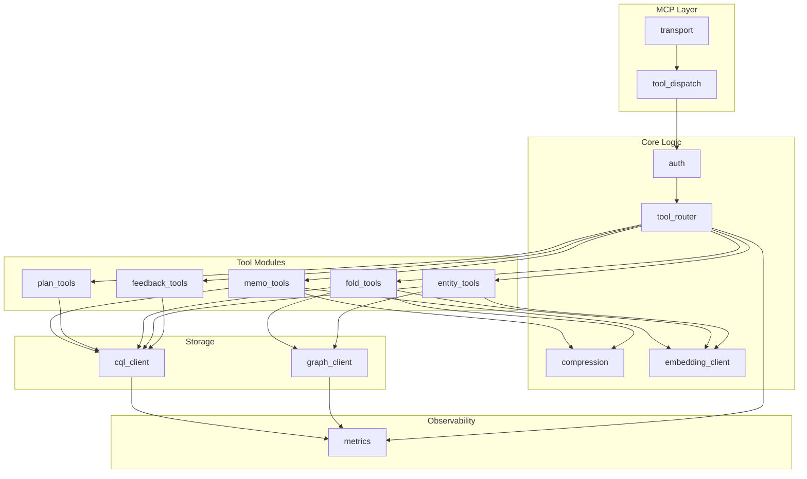

# Component Architecture

## Module Map

## Components

### 1. `transport` — MCP Protocol Layer

**Responsibility:** Accept MCP connections over stdio or HTTP+SSE, frame JSON-RPC messages.

**Interface:**
- `serve_stdio()` — reads stdin, writes stdout
- `serve_http(addr)` — binds HTTP listener, manages SSE connections
- Deserializes incoming `tools/call` requests, serializes responses

**Dependencies:** `tokio`, `serde_json`, `hyper` (HTTP mode only)

**Size estimate:** ~80 lines

---

### 2. `tool_dispatch` — Tool Registry and Dispatch

**Responsibility:** Maps MCP tool names to handler functions. Validates input schemas before dispatch.

**Interface:**
- `dispatch(tool_name, params) -> Result<Value>` — routes to the correct tool handler
- `list_tools() -> Vec<ToolSchema>` — returns all 12 tool definitions for MCP `tools/list`

**Dependencies:** `transport`, `auth`

**Size estimate:** ~60 lines

---

### 3. `auth` — Authentication and Tenant Isolation

**Responsibility:** Extracts tenant identity from session. Ensures all downstream queries are scoped to the authenticated tenant.

**Interface:**
- `authenticate(request) -> Result<TenantContext>` — validates credentials, returns `TenantContext { tenant_id, session_origin }`
- `TenantContext` is threaded through all tool handlers — `tenant_id` is never client-supplied

**Behavior:**
- stdio mode: inherits process owner credentials (local trust)
- HTTP mode: HTTP Basic auth against CQL credentials
- Rejects tool calls from unrecognized session origins (MCPShield pattern)

**Dependencies:** None (leaf module)

**Size estimate:** ~40 lines

---

### 4. `tool_router` — SRLM-Inspired Strategy Router

**Responsibility:** Selects the optimal retrieval strategy before invoking storage. Implements the finding that program selection is the primary performance driver (SRLM).

**Interface:**
- `route(query_text, query_embedding, task_complexity, session_context) -> Strategy`

**Decision tree:**
1. `content_hash` in `memo_cache`? -> `MemoHit`
2. Named entity search? -> `Phonetic` + ANN on `entity_store`
3. Plan-hierarchy traversal? -> `BTreeRange` on `plan_state`
4. Fold-level semantic search? -> `HnswAnn` on `trajectory_folds`
5. Graph multi-hop? -> `CypherTraversal`
6. Default -> `HnswAnn` on `trajectory_folds`

**Routing signals:** embedding cosine similarity to prior successful queries, task complexity classification, entity name presence, Fractured CoT axis defaults.

**Dependencies:** `cql_client` (reads `feedback_outcomes` for routing optimization), `metrics`

**Size estimate:** ~100 lines

---

### 5. `memo_tools` — Memoization Cache Tools

**Responsibility:** `check_memo_cache` and `store_memo_result` — avoid redundant LLM sub-calls.

**Tools exposed:**
- `check_memo_cache { prompt, context_slice, model_version }` -> `{ hit, result?, hit_count? }`
- `store_memo_result { prompt, context_slice, model_version, result, embedding, ttl_days? }` -> `{ stored, content_hash }`

**Write path:** SHA-256 of `normalize(prompt) + context_slice` -> lookup -> miss triggers LLM -> write result. Hit returns immediately, increments `hit_count`.

**Dependencies:** `cql_client`, `embedding_client`, `compression`, `metrics`

**Size estimate:** ~80 lines

---

### 6. `plan_tools` — Plan State Tools

**Responsibility:** Durable hierarchical plan trees implementing ReCAP's structured re-injection.

**Tools exposed:**
- `write_plan_node { session_id, depth, subtask_id, parent_subtask?, goal_text }` -> `{ written }`
- `get_plan_context { session_id, max_depth? }` -> `{ nodes, active_path }`
- `update_plan_node { session_id, depth, subtask_id, status, outcome_summary? }` -> `{ updated }`

**Query pattern:** `WHERE session_id = ? AND tenant_id = ? AND depth <= ?` — O(depth) range scan.

**Dependencies:** `cql_client`, `metrics`

**Size estimate:** ~70 lines

---

### 7. `fold_tools` — Trajectory Fold Tools

**Responsibility:** Branch-and-collapse trajectory management (Context-Folding pattern). Graph edges for fold hierarchy.

**Tools exposed:**
- `start_fold { session_id, depth, parent_fold_id?, initial_context }` -> `{ fold_id }`
- `append_to_fold { fold_id, repl_turn }` -> `{ appended, token_count }`
- `complete_fold { fold_id, summary, embedding }` -> `{ folded, compression_ratio }`
- `retrieve_fold_context { session_id, query_embedding, k?, include_raw? }` -> `{ folds }`

**Graph:** Each fold is a Cypher vertex; `FOLDED_INTO` edges connect child to parent.

**Dependencies:** `cql_client`, `graph_client`, `compression`, `embedding_client`, `metrics`

**Size estimate:** ~120 lines

---

### 8. `entity_tools` — Entity Store and Retrieval Tools

**Responsibility:** Named entity tracking with phonetic deduplication and multi-hop graph queries.

**Tools exposed:**
- `upsert_entity { session_id, entity_name, entity_type, context_snippet, embedding, source_fold_id?, confidence? }` -> `{ entity_id, is_new }`
- `retrieve_entities { session_id, query, embedding?, strategy?, k? }` -> `{ entities }`

**Deduplication:** Phonetic match on `entity_name` before insert. Prevents duplicate vertices from variant spellings.

**Dependencies:** `cql_client`, `graph_client`, `embedding_client`, `metrics`

**Size estimate:** ~90 lines

---

### 9. `feedback_tools` — Feedback Loop Tools

**Responsibility:** Records retrieval strategy outcomes for offline guideline refinement (ACON/SRLM).

**Tools exposed:**
- `record_outcome { session_id, query_id, program_type, task_complexity, succeeded, latency_ms, token_cost }` -> `{ recorded }`

**Constraint:** Write-only via MCP. The feedback store cannot be queried through MCP tools — only via direct CQL by the batch job with separate credentials.

**Dependencies:** `cql_client`, `metrics`

**Size estimate:** ~30 lines

---

### 10. `cql_client` — CQL Storage Client

**Responsibility:** Manages CQL connection pool, prepared statements, and query execution against Ferrosa.

**Interface:**
- `connect(config) -> Result<CqlClient>`
- `execute(statement, params) -> Result<Rows>`
- `execute_batch(statements) -> Result<()>`
- Prepared statement cache for all 6 tables

**Dependencies:** `cdrs-tokio` or `scylla-rust-driver`, `metrics`

**Size estimate:** ~100 lines

---

### 11. `graph_client` — Cypher Graph Client

**Responsibility:** Executes Cypher queries against Ferrosa's graph layer for multi-hop traversals and edge management.

**Interface:**
- `create_vertex(label, properties) -> Result<()>`
- `create_edge(from, to, edge_type, properties) -> Result<()>`
- `traverse(cypher_query) -> Result<Vec<Row>>`

**Edge types managed:** `FOLDED_INTO`, `CO_OCCURS_WITH`, `MENTIONED_IN`, `SUPERSEDES`

**Dependencies:** `cql_client` (Cypher may route through CQL in Ferrosa), `metrics`

**Size estimate:** ~80 lines

---

### 12. `compression` — Rust-Native Compression Engine

**Responsibility:** Compress fold trajectories and memo results to reduce storage and retrieval cost. Replaces the spec's original Python/LLMLingua dependency with a Rust-native implementation.

**Interface:**
- `compress(text, target_ratio) -> Result<CompressedText>`
- `decompress(compressed) -> Result<String>`

**Strategy:** Token-importance-weighted compression — score each token by TF-IDF or information-theoretic weight, drop low-importance tokens, preserve semantic structure. This captures the core LLMLingua algorithm without requiring a model inference call.

**Dependencies:** None (leaf module, pure Rust)

**Size estimate:** ~150 lines

---

### 13. `embedding_client` — Embedding Generation Client

**Responsibility:** HTTP client to Ollama (or compatible) embedding endpoint.

**Interface:**
- `embed(text) -> Result<Vec<f32>>`
- `embed_batch(texts) -> Result<Vec<Vec<f32>>>`

**Configuration:** `provider` (ollama/openai/local), `base_url`, `model`, `dimensions`

**Dependencies:** `reqwest`, `serde_json`

**Size estimate:** ~50 lines

---

### 14. `metrics` — Observability

**Responsibility:** Prometheus metrics emission. Populates `system_observability.memory_summary` virtual table.

**Key metrics:**
- `ferrosa_memory_memo_hits_total` / `memo_misses_total`
- `ferrosa_memory_fold_token_count` / `fold_compression_ratio`
- `ferrosa_memory_retrieval_latency_ms` (by strategy)
- `ferrosa_memory_routing_strategy_total` (by task complexity)
- `ferrosa_memory_poisoning_flags_total`
- `ferrosa_memory_entity_upserts_total`

**Dependencies:** `prometheus` crate

**Size estimate:** ~60 lines

---

## Size Summary

| Module | Lines (est.) |
|--------|-------------|
| transport | 80 |
| tool_dispatch | 60 |
| auth | 40 |
| tool_router | 100 |
| memo_tools | 80 |
| plan_tools | 70 |
| fold_tools | 120 |
| entity_tools | 90 |
| feedback_tools | 30 |
| cql_client | 100 |
| graph_client | 80 |
| compression | 150 |
| embedding_client | 50 |
| metrics | 60 |
| config + main | 50 |
| **Total** | **~1,160** |

The spec estimated 300-500 lines for a "thin adapter." The actual total is higher because we're including the compression engine (150 lines) and embedding client (50 lines) that the spec originally delegated to Python, plus the routing layer (100 lines) which is non-trivial logic. The core MCP adapter (transport + dispatch + auth + tool handlers) is ~500 lines, consistent with the spec estimate.
