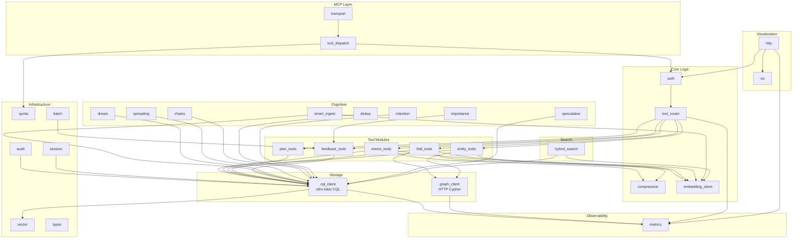

# Component Architecture

> Last updated: 2026-03-23
> Status: 31 modules — cognitive memory, hybrid search, visualization, and infrastructure layers complete

## Module Map

**Note:** `graph_client` (M11) uses the HTTP Cypher endpoint, which is working. Graph writes go through CQL (vertex/edge table INSERTs via `CqlStorage`), and graph reads/traversals go through HTTP POST against `/graph/query` via `reqwest`.

## Components

### 1. `transport` — MCP Protocol Layer

**Responsibility:** Accept MCP connections over stdio or HTTP+SSE, frame JSON-RPC messages.

**Interface:**
- `serve_stdio()` — reads stdin, writes stdout
- `serve_http(addr)` — binds HTTP listener, manages SSE connections
- Deserializes incoming `tools/call` requests, serializes responses

**Dependencies:** `tokio`, `serde_json`, `hyper` (HTTP mode only)

**Size estimate:** ~180 lines

---

### 2. `tool_dispatch` — Tool Registry and Dispatch

**Responsibility:** Maps MCP tool names to handler functions. Validates input schemas before dispatch.

**Interface:**
- `dispatch(tool_name, params) -> Result<Value>` — routes to the correct tool handler
- `list_tools() -> Vec<ToolSchema>` — returns all tool definitions for MCP `tools/list`

**Dependencies:** `transport`, `auth`, `quota`

**Size estimate:** ~2,700 lines

---

### 3. `auth` — Authentication and Tenant Isolation

**Responsibility:** Extracts tenant identity from session. Ensures all downstream queries are scoped to the authenticated tenant.

**Interface:**
- `authenticate(request) -> Result<TenantContext>` — validates credentials, returns `TenantContext { tenant_id, session_origin }`
- `TenantContext` is threaded through all tool handlers — `tenant_id` is never client-supplied

**Behavior:**
- stdio mode: inherits process owner credentials (local trust)
- HTTP mode: HTTP Basic auth against CQL credentials
- Rejects tool calls from unrecognized session origins (MCPShield pattern)

**Dependencies:** None (leaf module)

**Size estimate:** ~130 lines

---

### 4. `tool_router` — SRLM-Inspired Strategy Router

**Responsibility:** Selects the optimal retrieval strategy before invoking storage. Implements the finding that program selection is the primary performance driver (SRLM).

**Interface:**
- `route(query_text, query_embedding, task_complexity, session_context) -> Strategy`

**Decision tree:**
1. `content_hash` in `memo_cache`? -> `MemoHit`
2. Named entity search? -> `Phonetic` + ANN on `entity_store`
3. Plan-hierarchy traversal? -> `BTreeRange` on `plan_state`
4. Fold-level semantic search? -> `HnswAnn` on `trajectory_folds`
5. Graph multi-hop? -> `CypherTraversal`
6. Default -> `HnswAnn` on `trajectory_folds`

**Routing signals:** embedding cosine similarity to prior successful queries, task complexity classification, entity name presence, Fractured CoT axis defaults.

**Dependencies:** `cql_client` (reads `feedback_outcomes` for routing optimization), `metrics`

**Size estimate:** ~240 lines

---

### 5. `memo_tools` — Memoization Cache Tools

**Responsibility:** `check_memo_cache` and `store_memo_result` — avoid redundant LLM sub-calls.

**Tools exposed:**
- `check_memo_cache { prompt, context_slice, model_version }` -> `{ hit, result?, hit_count? }`
- `store_memo_result { prompt, context_slice, model_version, result, embedding, ttl_days? }` -> `{ stored, content_hash }`

**Write path:** SHA-256 of `normalize(prompt) + context_slice` -> lookup -> miss triggers LLM -> write result. Hit returns immediately, increments `hit_count`.

**Dependencies:** `cql_client`, `embedding_client`, `compression`, `metrics`

**Size estimate:** ~370 lines

---

### 6. `plan_tools` — Plan State Tools

**Responsibility:** Durable hierarchical plan trees implementing ReCAP's structured re-injection.

**Tools exposed:**
- `write_plan_node { session_id, depth, subtask_id, parent_subtask?, goal_text }` -> `{ written }`
- `get_plan_context { session_id, max_depth? }` -> `{ nodes, active_path }`
- `update_plan_node { session_id, depth, subtask_id, status, outcome_summary? }` -> `{ updated }`

**Query pattern:** `WHERE session_id = ? AND tenant_id = ? AND depth <= ?` — O(depth) range scan.

**Dependencies:** `cql_client`, `metrics`

**Size estimate:** ~260 lines

---

### 7. `fold_tools` — Trajectory Fold Tools

**Responsibility:** Branch-and-collapse trajectory management (Context-Folding pattern). Graph edges for fold hierarchy.

**Tools exposed:**
- `start_fold { session_id, depth, parent_fold_id?, initial_context }` -> `{ fold_id }`
- `append_to_fold { fold_id, repl_turn }` -> `{ appended, token_count }`
- `complete_fold { fold_id, summary, embedding }` -> `{ folded, compression_ratio }`
- `retrieve_fold_context { session_id, query_embedding, k?, include_raw? }` -> `{ folds }`

**Graph:** Each fold is a Cypher vertex; `FOLDED_INTO` edges connect child to parent.

**Dependencies:** `cql_client`, `graph_client`, `compression`, `embedding_client`, `metrics`

**Size estimate:** ~380 lines

---

### 8. `entity_tools` — Entity Store and Retrieval Tools

**Responsibility:** Named entity tracking with phonetic deduplication and multi-hop graph queries.

**Tools exposed:**
- `upsert_entity { session_id, entity_name, entity_type, context_snippet, embedding, source_fold_id?, confidence? }` -> `{ entity_id, is_new }`
- `retrieve_entities { session_id, query, embedding?, strategy?, k? }` -> `{ entities }`

**Deduplication:** Phonetic match on `entity_name` before insert. Prevents duplicate vertices from variant spellings.

**Dependencies:** `cql_client`, `graph_client`, `embedding_client`, `metrics`

**Size estimate:** ~570 lines

---

### 9. `feedback_tools` — Feedback Loop Tools

**Responsibility:** Records retrieval strategy outcomes for offline guideline refinement (ACON/SRLM).

**Tools exposed:**
- `record_outcome { session_id, query_id, program_type, task_complexity, succeeded, latency_ms, token_cost }` -> `{ recorded }`

**Constraint:** Write-only via MCP. The feedback store cannot be queried through MCP tools — only via direct CQL by the batch job with separate credentials.

**Dependencies:** `cql_client`, `metrics`

**Size estimate:** ~80 lines

---

### 10. `cql_client` — CQL Storage Client

**Responsibility:** Manages CQL connection pool, prepared statements, and query execution against Ferrosa.

**Interface:**
- `connect(config) -> Result<CqlClient>`
- `execute(statement, params) -> Result<Rows>`
- `execute_batch(statements) -> Result<()>`
- Prepared statement cache for all tables

**Dependencies:** `cdrs-tokio`, `vector`, `metrics`

**Size estimate:** ~1,680 lines

---

### 11. `graph_client` — HTTP Cypher Client

**Responsibility:** Executes Cypher MATCH queries against Ferrosa's HTTP graph endpoint for multi-hop traversals.

**Implementation note (updated 2026-03-21):** Switched from neo4rs (Bolt v4) to HTTP POST against `/graph/query` in commit de901d1. Ferrosa's Bolt endpoint is v5, which neo4rs 0.8 does not support. The HTTP Cypher approach is working. Graph writes (vertex/edge creation) go through CQL INSERTs into graph-annotated tables via `CqlStorage`, not through this client.

**Interface:**
- `connect(config) -> Result<GraphClient>` — HTTP connection with Basic auth
- `get_fold_ancestors(fold_id) -> Result<Vec<Uuid>>` — `FOLDED_INTO` traversal
- `find_related_entities(entity_id, hops) -> Result<Vec<Value>>` — `CO_OCCURS_WITH` N-hop
- `get_entities_in_fold(fold_id) -> Result<Vec<Value>>` — `MENTIONED_IN` lookup
- `get_supersession_chain(event_id) -> Result<Vec<Value>>` — `SUPERSEDES` chain

**Edge types queried:** `FOLDED_INTO`, `CO_OCCURS_WITH`, `MENTIONED_IN`, `SUPERSEDES`

**Dependencies:** `reqwest` (HTTP), `serde_json` — no dependency on `cql_client` or `metrics`

**Size estimate:** ~240 lines

---

### 12. `compression` — Rust-Native Compression Engine

**Responsibility:** Compress fold trajectories and memo results to reduce storage and retrieval cost. Replaces the spec's original Python/LLMLingua dependency with a Rust-native implementation.

**Interface:**
- `compress(text, target_ratio) -> Result<CompressedText>`
- `decompress(compressed) -> Result<String>`

**Strategy:** Token-importance-weighted compression — score each token by TF-IDF or information-theoretic weight, drop low-importance tokens, preserve semantic structure. This captures the core LLMLingua algorithm without requiring a model inference call.

**Dependencies:** None (leaf module, pure Rust)

**Size estimate:** ~340 lines

---

### 13. `embedding_client` — Embedding Generation Client

**Responsibility:** HTTP client to Ollama (or compatible) embedding endpoint.

**Interface:**
- `embed(text) -> Result<Vec<f32>>`
- `embed_batch(texts) -> Result<Vec<Vec<f32>>>`

**Configuration:** `provider` (ollama/openai/local), `base_url`, `model`, `dimensions`

**Dependencies:** `reqwest`, `serde_json`

**Size estimate:** ~140 lines

---

### 14. `metrics` — Observability

**Responsibility:** Prometheus metrics emission. Populates `system_observability.memory_summary` virtual table.

**Key metrics:**
- `ferrosa_memory_memo_hits_total` / `memo_misses_total`
- `ferrosa_memory_fold_token_count` / `fold_compression_ratio`
- `ferrosa_memory_retrieval_latency_ms` (by strategy)
- `ferrosa_memory_routing_strategy_total` (by task complexity)
- `ferrosa_memory_poisoning_flags_total`
- `ferrosa_memory_entity_upserts_total`

**Dependencies:** `prometheus` crate

**Size estimate:** ~180 lines

---

### 15. `smart_ingest` — Prediction Error Gated Ingestion

**Responsibility:** Decides whether new content should CREATE a new entity, UPDATE an existing one, or SUPERSEDE outdated information. Implements prediction error gating (Sinclair & Bhavnani 2020): only store what is surprising relative to existing memories.

**Interface:**
- `smart_ingest(storage, ctx, session_id, name, type, snippet, embedding) -> IngestDecision`
- Returns `Created`, `Updated`, or `Superseded` with entity IDs and similarity scores

**Dependencies:** `cql_client`, `embedding_client`

**Size estimate:** ~460 lines

---

### 16. `intention` — Prospective Memory Tracking

**Responsibility:** "Remember to do X when Y happens." Implements prospective memory (Brandimonte et al. 1996) — deferred actions that trigger when a context condition is met.

**Interface:**
- `set_intention(description, trigger, priority)` — create a new intention
- `check_intentions(context)` — evaluate triggers against current context
- `complete_intention(id)` — mark as done
- `snooze_intention(id, until)` — defer until a later time
- `list_intentions()` — list active intentions

**Trigger types:** topic mention, time-based, or keyword match.

**Dependencies:** `cql_client`

**Size estimate:** ~250 lines

---

### 17. `dream` — Dream Consolidation Engine

**Responsibility:** Periodic memory processing inspired by vestige's dream cycle. Groups entities by source fold, discovers co-occurrence relationships, creates `CO_OCCURS` graph edges, and identifies entity clusters as insights.

**Interface:**
- `run_consolidation(storage, ctx, session_id) -> DreamResult`
- Returns entity count, connections created, and insight strings

**Dependencies:** `cql_client`

**Size estimate:** ~180 lines

---

### 18. `spreading` — Spreading Activation Search

**Responsibility:** Collins & Loftus semantic network retrieval. Propagates activation energy from seed entities through the knowledge graph, decaying at each hop. Returns the most activated non-seed entities for associative recall.

**Interface:**
- `spread(storage, ctx, seed_ids, decay, depth, limit) -> Vec<ActivatedNode>`
- Seeds start at activation 1.0; energy decays multiplicatively per hop

**Dependencies:** `cql_client`

**Size estimate:** ~290 lines

---

### 19. `importance` — Multi-Channel Importance Scoring

**Responsibility:** Neuroscience-inspired 4-channel importance model (vestige pattern). Scores memories on novelty, arousal, reward, and attention to prioritize retrieval and guide promotion/demotion.

**Interface:**
- `compute_importance(similarity, retrieval_count, recency, success_rate) -> ImportanceScore`
- Channels: novelty (1 - similarity), arousal (keyword heuristic), reward (feedback success), attention (recency decay)

**Dependencies:** None (pure computation, uses `feedback_tools` data indirectly)

**Size estimate:** ~75 lines

---

### 20. `chains` — Memory Chain Path Discovery

**Responsibility:** BFS traversal to find shortest paths between two entities via graph edges. Explains how concepts are connected through the knowledge graph.

**Interface:**
- `find_chain(storage, ctx, source_id, dest_id, max_depth) -> Option<MemoryChain>`
- Returns path steps with edge types; confidence decays with hop count

**Dependencies:** `cql_client`

**Size estimate:** ~230 lines

---

### 21. `speculative` — Speculative Retrieval

**Responsibility:** Predicts which memories will be needed based on co-access patterns. When entities A and B are frequently retrieved together, retrieving A suggests B.

**Interface:**
- `CoAccessTracker::record(entity_id)` — tracks access within a sliding window
- `CoAccessTracker::predict(entity_id) -> Vec<Prediction>` — returns co-accessed entities ranked by confidence

**Dependencies:** `cql_client`

**Size estimate:** ~250 lines

---

### 22. `dedup` — Duplicate Entity Detection

**Responsibility:** Finds semantically similar entities that may be duplicates. Uses Jaccard coefficient on context snippets to surface merge candidates.

**Interface:**
- `find_duplicates(storage, ctx, session_id, threshold) -> Vec<DuplicatePair>`
- Returns pairs with similarity scores above the given threshold

**Dependencies:** `cql_client`

**Size estimate:** ~270 lines

---

### 23. `hybrid_search` — Cross-Type Search with RRF

**Responsibility:** Searches across entities, folds, and memos simultaneously using Reciprocal Rank Fusion to merge ranked result lists into a single unified ranking.

**Interface:**
- `hybrid_search(storage, ctx, query, embedding, k) -> Vec<SearchResult>`
- RRF merge with k=60 across multiple retrieval strategies

**Dependencies:** `cql_client`, `embedding_client`

**Size estimate:** ~230 lines

---

### 24. `audit` — Audit Logging and Anomaly Detection

**Responsibility:** Append-only audit log (STRIDE R1). Records every write operation to the `audit_log` table. Audit rows are write-only through this module — they cannot be deleted via MCP tools. Also tracks entity retrieval frequency for anomaly detection (FMEA F19).

**Interface:**
- `log_write(storage, ctx, operation, target_table, target_id, session_id) -> Uuid`
- `check_anomaly(storage, ctx, config) -> Option<AnomalyAlert>`

**Dependencies:** `cql_client`, `metrics`

**Size estimate:** ~180 lines

---

### 25. `quota` — Per-Tenant Storage Quotas

**Responsibility:** Enforces per-tenant entity and memo result limits (FMEA D1). Rejects writes when configured limits are exceeded.

**Interface:**
- `check_quota(current_count, max) -> Result<(), QuotaExceeded>`
- `check_memo_quota(current_count, config) -> Result<(), QuotaExceeded>`

**Dependencies:** `config`

**Size estimate:** ~75 lines

---

### 26. `session` — Session Deletion Cascade

**Responsibility:** Right-to-deletion implementation. Cascade deletes all memory objects for a session across plan_state, trajectory_folds, entity_store, temporal_events, and feedback_outcomes.

**Interface:**
- `delete_session(storage, ctx, session_id) -> DeleteSessionResult`
- Returns count of objects removed

**Dependencies:** `cql_client`

**Size estimate:** ~145 lines

---

### 27. `vector` — Vector Serialization

**Responsibility:** Encode/decode `Vec<f32>` to CQL `VECTOR<float, N>` wire format. Workaround for cdrs-tokio v9 lacking native VECTOR type support (type ID 0x0023). Serializes as big-endian IEEE 754 f32 bytes (Blob).

**Interface:**
- `encode_vector(values) -> Vec<u8>` — f32 slice to CQL wire bytes
- `decode_vector(bytes) -> Vec<f32>` — CQL wire bytes to f32 vec

**Dependencies:** None (leaf module, pure Rust)

**Size estimate:** ~70 lines

---

### 28. `types` — Shared Type Definitions

**Responsibility:** Core domain types shared across all modules: `TenantContext`, `PlanNode`, `PlanStatus`, `FeedbackOutcome`, `TemporalEvent`, `AuditEntry`, and tool parameter/result structs.

**Dependencies:** `serde`, `uuid`, `chrono`

**Size estimate:** ~200 lines

---

### 29. `batch` — Batch Job Logic

**Responsibility:** Offline strategy accuracy computation and guideline generation (ADR-002). Reads feedback outcomes, groups by `(program_type, task_complexity)`, and produces updated routing guidelines.

**Interface:**
- `compute_strategy_accuracy(outcomes) -> Vec<StrategyStats>`
- `generate_guidelines(stats) -> Vec<RoutingGuideline>`

**Dependencies:** `feedback_tools` (data), `types`

**Size estimate:** ~190 lines

---

### 30. `viz` — Visualizer Event Bus

**Responsibility:** Typed event system for the memory graph dashboard. Provides a broadcast channel that tool handlers emit events to and the WebSocket endpoint subscribes from. Events include full `Snapshot` on connect, then incremental deltas (`NodeAdded`, `EdgeAdded`, `NodeUpdated`) as the graph mutates.

**Interface:**
- `VizBus::new() -> VizBus` — creates broadcast channel
- `VizBus::send(event)` — emit a `VizEvent` to all subscribers
- `VizBus::subscribe() -> Receiver<VizEvent>` — subscribe to event stream

**Event types:** `Snapshot`, `NodeAdded`, `EdgeAdded`, `NodeUpdated`, `NodeRemoved`

**Dependencies:** `tokio::sync::broadcast`

**Size estimate:** ~250 lines

---

### 31. `http` — HTTP Server and WebSocket Endpoint

**Responsibility:** HTTP+SSE transport for remote MCP clients. Serves JSON-RPC via POST, Prometheus metrics scrape, health check, and the memory graph visualizer dashboard with live WebSocket updates. TLS support for production.

**Endpoints:**
- `POST /mcp` — JSON-RPC request/response
- `GET /metrics` — Prometheus metrics scrape
- `GET /health` — health check
- `GET /viz` — memory graph visualizer HTML (viz port)
- `GET /viz/ws` — WebSocket for live graph events (viz port)

**Security:** TLS required in production, HTTP Basic auth, per-IP connection limits (FMEA F30), idle connection timeout.

**Dependencies:** `viz`, `auth`, `metrics`, `tokio`, `tokio-tungstenite`

**Size estimate:** ~800 lines

---

## Size Summary

| Module | Lines (actual) |
|--------|---------------|
| transport | 180 |
| tool_dispatch | 2,700 |
| auth | 130 |
| tool_router | 240 |
| memo_tools | 370 |
| plan_tools | 260 |
| fold_tools | 380 |
| entity_tools | 570 |
| feedback_tools | 80 |
| cql_client | 1,680 |
| graph_client | 240 |
| compression | 340 |
| embedding_client | 140 |
| metrics | 180 |
| smart_ingest | 460 |
| intention | 250 |
| dream | 180 |
| spreading | 290 |
| importance | 75 |
| chains | 230 |
| speculative | 250 |
| dedup | 270 |
| hybrid_search | 230 |
| audit | 180 |
| quota | 75 |
| session | 145 |
| vector | 70 |
| types | 200 |
| batch | 190 |
| viz | 250 |
| http | 800 |
| config + storage | 1,320 |
| **Total** | **~12,350** |
