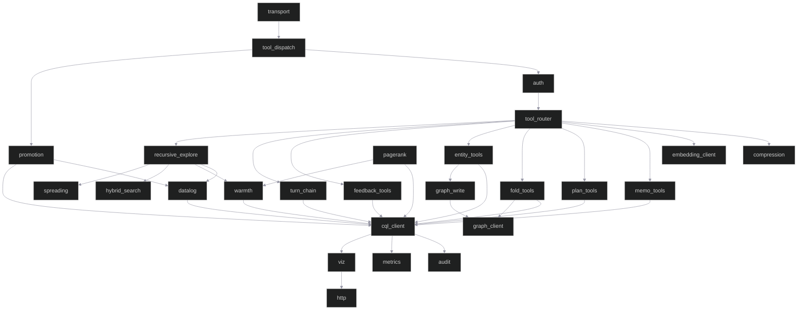

# Component Architecture

> Last updated: 2026-06-11
> Status: Graph-boundary serving path corrected; remaining risk is hotspot concentration in dispatch/storage and maintenance-only backing-table tooling.

## Module Map

**Note:** Shows the current serving path. Full dependency analysis and refactor direction are in `dsm-analysis.md`.

**Boundary correction:** Serving-path graph mutations now flow through
`graph_write` and `GraphClient` behind `ReconnectingStorage`. Direct
`CqlStorage` graph-edge writer methods fail loud, while CQL remains acceptable
for app-owned tables. A maintenance utility still has explicit graph backing-row
repair code; keep that isolated from runtime serving paths.

## Target Module Boundary

The runtime should converge on three public-interface adapters for operator query surfaces and graph mutations:

- `public_cql_client`
- `public_sparql_client`
- `public_cypher_client`

The workbench and MCP layers should orchestrate auth, tenant mapping, request shaping, and presentation on top of those clients, but not implement substitute query semantics locally. App-table CQL access may remain direct in the serving path where it matches the supported role boundary. The Datalog evaluator remains an explicit local engine in `ferrosa-memory`.

## Components

### 1. `transport` — MCP Protocol Layer

**Responsibility:** Accept MCP connections over stdio or HTTP+SSE, frame JSON-RPC messages.

**Interface:**
- `serve_stdio()` — reads stdin, writes stdout
- `serve_http(addr)` — binds HTTP listener, manages SSE connections
- Deserializes incoming `tools/call` requests, serializes responses

**Dependencies:** `tokio`, `serde_json`, `hyper` (HTTP mode only)

**Size estimate:** ~180 lines

---

### 2. `tool_dispatch` — Tool Registry and Dispatch

**Responsibility:** Maps MCP tool names to handler functions. Validates input schemas before dispatch.

**Interface:**
- `dispatch(tool_name, params) -> Result<Value>` — routes to the correct tool handler
- `tool_definitions(entity_types) -> Vec<ToolSchema>` — builds tool schemas dynamically from the type registry (entity_type enums are not hardcoded)

**Dependencies:** `transport`, `auth`, `quota`

**Size estimate:** ~2,700 lines

---

### 3. `auth` — Authentication and Tenant Isolation

**Responsibility:** Extracts tenant identity from session. Ensures all downstream queries are scoped to the authenticated tenant.

**Interface:**
- `authenticate(request) -> Result<TenantContext>` — validates credentials, returns `TenantContext { tenant_id, session_origin }`
- `TenantContext` is threaded through all tool handlers — `tenant_id` is never client-supplied

**Behavior:**
- stdio mode: inherits process owner credentials (local trust)
- HTTP mode: must validate a real principal and map it to a tenant
- Rejects tool calls from unrecognized session origins (MCPShield pattern)

**Current state:** the live HTTP path now uses `auth::FileAuthValidator` from `ferrosa-memory-mcp/src/main.rs`, mapping one principal to one tenant through a file-backed auth database with SIGHUP reload support.

**Blueprint requirement:** shared HTTP mode must fail startup unless an auth backend is configured. One principal maps to exactly one tenant; `tenant_id` remains server-derived only.

**Dependencies:** None (leaf module)

**Size estimate:** ~130 lines

---

### 4. `tool_router` — SRLM-Inspired Strategy Router

**Responsibility:** Selects the optimal retrieval strategy before invoking storage. Implements the finding that program selection is the primary performance driver (SRLM).

**Interface:**
- `route(query_text, query_embedding, task_complexity, session_context) -> Strategy`

**Decision tree:**
1. `content_hash` in `memo_cache`? -> `MemoHit`
2. Named entity search? -> `Phonetic` + ANN on `entity_store`
3. Plan-hierarchy traversal? -> `BTreeRange` on `plan_state`
4. Fold-level semantic search? -> `HnswAnn` on `trajectory_folds`
5. Graph multi-hop? -> `CypherTraversal`
6. Default -> `HnswAnn` on `trajectory_folds`

**Routing signals:** embedding cosine similarity to prior successful queries, task complexity classification, entity name presence, Fractured CoT axis defaults.

**Dependencies:** `cql_client` (reads `feedback_outcomes` for routing optimization), `metrics`

**Size estimate:** ~240 lines

---

### 5. `memo_tools` — Memoization Cache Tools

**Responsibility:** `check_memo_cache` and `store_memo_result` — avoid redundant LLM sub-calls.

**Tools exposed:**
- `check_memo_cache { prompt, context_slice, model_version }` -> `{ hit, result?, hit_count? }`
- `store_memo_result { prompt, context_slice, model_version, result, embedding, ttl_days? }` -> `{ stored, content_hash }`

**Write path:** SHA-256 of `normalize(prompt) + context_slice` -> lookup -> miss triggers LLM -> write result. Hit returns immediately, increments `hit_count`.

**Dependencies:** `cql_client`, `embedding_client`, `compression`, `metrics`

**Size estimate:** ~370 lines

---

### 6. `plan_tools` — Plan State Tools

**Responsibility:** Durable hierarchical plan trees implementing ReCAP's structured re-injection.

**Tools exposed:**
- `write_plan_node { session_id, depth, subtask_id, parent_subtask?, goal_text }` -> `{ written }`
- `get_plan_context { session_id, max_depth? }` -> `{ nodes, active_path }`
- `update_plan_node { session_id, depth, subtask_id, status, outcome_summary? }` -> `{ updated }`

**Query pattern:** `WHERE session_id = ? AND tenant_id = ? AND depth <= ?` — O(depth) range scan.

**Dependencies:** `cql_client`, `metrics`

**Size estimate:** ~260 lines

---

### 7. `fold_tools` — Trajectory Fold Tools

**Responsibility:** Branch-and-collapse trajectory management (Context-Folding pattern). Graph edges for fold hierarchy.

**Tools exposed:**
- `start_fold { session_id, depth, parent_fold_id?, initial_context }` -> `{ fold_id }`
- `append_to_fold { fold_id, repl_turn }` -> `{ appended, token_count }`
- `complete_fold { fold_id, summary, embedding }` -> `{ folded, compression_ratio }`
- `retrieve_fold_context { session_id, query_embedding, k?, include_raw? }` -> `{ folds }`

**Graph:** Each fold is a Cypher vertex; `FOLDED_INTO` edges connect child to parent.

**Dependencies:** `cql_client`, `graph_client`, `compression`, `embedding_client`, `metrics`

**Size estimate:** ~380 lines

---

### 8. `entity_tools` — Entity Store and Retrieval Tools

**Responsibility:** Named entity tracking with phonetic deduplication and multi-hop graph queries.

**Tools exposed:**
- `upsert_entity { session_id, entity_name, entity_type, context_snippet, embedding, source_fold_id?, confidence? }` -> `{ entity_id, is_new }`
- `retrieve_entities { session_id, query, embedding?, strategy?, k? }` -> `{ entities }`

**Deduplication:** Phonetic match on `entity_name` before insert. Prevents duplicate vertices from variant spellings.

**Dependencies:** `cql_client`, `graph_client`, `embedding_client`, `metrics`

**Size estimate:** ~570 lines

---

### 8b. `bulk_ingest` — Server-Owned Entity + Edge Batch Ingest

**Responsibility:** Accept one semantic batch of entities and typed edges, validate it, optionally compute missing embeddings, persist app-owned rows, and route graph-owned mutations through the supported boundary.

**Tools exposed:**
- `ingest_entities { session_id, entities[], edges[], options }` -> `{ entities, edges, embeddings, schema_version, duration_ms }`

**Contract rules:**
- request rows are validated before any write-side success is reported
- failures are row-granular and explicit; no silent drop path is allowed
- `on_conflict` controls `update`, `skip`, or `error`
- `strict_edges=true` resolves endpoints against batch rows plus already-resident rows in the same `(tenant, session)`
- `dry_run=true` performs validation, endpoint resolution, and embedding planning without writes

**Boundary note:** clients do not own CQL column mapping or embedding policy. `bulk_ingest` is the compatibility seam that absorbs app-table schema drift so forge and future ingestors remain semantic clients instead of storage clients.

**Dependencies:** `cql_client`, `graph_client`, `embedding_client`, `auth`, `metrics`

**Size estimate:** ~450 lines plus validation/types

---

### 9. `feedback_tools` — Feedback Loop Tools

**Responsibility:** Records retrieval strategy outcomes for offline guideline refinement (ACON/SRLM).

**Tools exposed:**
- `record_outcome { session_id, query_id, program_type, task_complexity, succeeded, latency_ms, token_cost }` -> `{ recorded }`

**Constraint:** Write-only via MCP. The feedback store cannot be queried through MCP tools; analytics and batch refinement should read it through Ferrosa's public CQL interface with separate credentials.

**Dependencies:** `cql_client`, `metrics`

**Size estimate:** ~80 lines

---

### 10. `cql_client` — App-Table Storage Client

**Current responsibility:** Manages a direct CQL connection pool, prepared statements, and table-level query execution against Ferrosa. Loads dynamic type registry at startup.

**Boundary:** this module is the serving-path client for app-owned tables. Graph
edge mutation methods intentionally return graph-write errors in direct
`CqlStorage`; production serving paths use `ReconnectingStorage` to route graph
writes through `GraphClient`.

**Interface:**
- `connect(config) -> Result<CqlClient>`
- `execute(statement, params) -> Result<Rows>`
- `execute_batch(statements) -> Result<()>`
- `load_entity_types() -> Vec<String>` — reads from `entity_types` table, falls back to defaults
- `load_edge_types() -> Vec<String>` — reads from `edge_types` table
- Prepared statement cache for all tables (44 statements)

**Resilience:**
- Ghost rows (NULL required fields) are skipped in `entity_list_session` and `entity_find_phonetic`
- Stale prepared statement errors (after node restart) trigger automatic reconnection via `ReconnectingStorage`
- `entity_put` uses base INSERT with required fields only; optional fields (source_fold_id, entity_embedding) written via separate UPDATE to avoid cdrs-tokio Option serialization issues with Ferrosa VECTOR columns

**Dependencies:** `cdrs-tokio`, `vector`, `metrics`

**Target correction:** keep direct prepared statements where they operate on
app-owned tables under the supported CQL role boundary. Do not reintroduce
serving-path graph-owned table mutations here.

**Size estimate:** ~1,680 lines

---

### 11. `graph_client` — HTTP Graph Client

**Responsibility:** Executes graph reads and graph-owned edge mutations against
Ferrosa's HTTP graph endpoint.

**Implementation note (updated 2026-06-11):** Serving-path graph writes for
`typed_edges`, `folded_into`, `mentioned_in`, `co_occurs_with`, and
`supersedes` route through this client via `ReconnectingStorage`. The graph
endpoint accepts scoped one-hop `TYPED_EDGE` traversals; multi-hop typed-edge
path discovery is implemented in the MCP `chains` module over typed-edge reads.

**Interface:**
- `connect(config) -> Result<GraphClient>` — HTTP connection with Basic auth
- `get_fold_ancestors(fold_id) -> Result<Vec<Uuid>>` — `FOLDED_INTO` traversal
- `find_related_entities(tenant_id, entity_id, session_id, hops) -> Result<Vec<Value>>` — scoped one-hop `TYPED_EDGE` graph lookup
- `put_typed_edge(...)` / `delete_typed_edge(...)` — typed entity-edge mutation
- `put_folded_into_edge(...)`, `put_mentioned_in_edge(...)`, `put_co_occurs_edge(...)`, `put_supersedes_edge(...)` — specialized graph edge mutation
- `get_entities_in_fold(fold_id) -> Result<Vec<Value>>` — `MENTIONED_IN` lookup
- `get_supersession_chain(event_id) -> Result<Vec<Value>>` — `SUPERSEDES` chain

**Edge types queried/written:** `TYPED_EDGE`, `FOLDED_INTO`,
`CO_OCCURS_WITH`, `MENTIONED_IN`, `SUPERSEDES`

**Dependencies:** `reqwest` (HTTP), `serde_json` — no dependency on `cql_client` or `metrics`

**Size estimate:** ~240 lines

---

### 12. `compression` — Rust-Native Compression Engine

**Responsibility:** Compress fold trajectories and memo results to reduce storage and retrieval cost. Replaces the spec's original Python/LLMLingua dependency with a Rust-native implementation.

**Interface:**
- `compress(text, target_ratio) -> Result<CompressedText>`
- `decompress(compressed) -> Result<String>`

**Strategy:** Token-importance-weighted compression — score each token by TF-IDF or information-theoretic weight, drop low-importance tokens, preserve semantic structure. This captures the core LLMLingua algorithm without requiring a model inference call.

**Dependencies:** None (leaf module, pure Rust)

**Size estimate:** ~340 lines

---

### 13. `embedding_client` — Embedding Generation Client

**Responsibility:** HTTP client to Ollama (or compatible) embedding endpoint.

**Interface:**
- `embed(text) -> Result<Vec<f32>>`
- `embed_batch(texts) -> Result<Vec<Vec<f32>>>`

**Configuration:** `provider` (ollama/openai/local), `base_url`, `model`, `dimensions`

**Dependencies:** `reqwest`, `serde_json`

**Size estimate:** ~140 lines

---

### 14. `metrics` — Observability

**Responsibility:** Prometheus metrics emission. Populates `system_observability.memory_summary` virtual table.

**Key metrics:**
- `ferrosa_memory_memo_hits_total` / `memo_misses_total`
- `ferrosa_memory_fold_token_count` / `fold_compression_ratio`
- `ferrosa_memory_retrieval_latency_ms` (by strategy)
- `ferrosa_memory_routing_strategy_total` (by task complexity)
- `ferrosa_memory_poisoning_flags_total`
- `ferrosa_memory_entity_upserts_total`

**Dependencies:** `prometheus` crate

**Size estimate:** ~180 lines

---

### 15. `smart_ingest` — Prediction Error Gated Ingestion

**Responsibility:** Decides whether new content should CREATE a new entity, UPDATE an existing one, or SUPERSEDE outdated information. Implements prediction error gating (Sinclair & Bhavnani 2020): only store what is surprising relative to existing memories.

**Interface:**
- `smart_ingest(storage, ctx, session_id, name, type, snippet, embedding) -> IngestDecision`
- Returns `Created`, `Updated`, or `Superseded` with entity IDs and similarity scores

**Dependencies:** `cql_client`, `embedding_client`

**Size estimate:** ~460 lines

---

### 16. `intention` — Prospective Memory Tracking

**Responsibility:** "Remember to do X when Y happens." Implements prospective memory (Brandimonte et al. 1996) — deferred actions that trigger when a context condition is met.

**Interface:**
- `set_intention(description, trigger, priority)` — create a new intention
- `check_intentions(context)` — evaluate triggers against current context
- `complete_intention(id)` — mark as done
- `snooze_intention(id, until)` — defer until a later time
- `list_intentions()` — list active intentions

**Trigger types:** topic mention, time-based, or keyword match.

**Dependencies:** `cql_client`

**Size estimate:** ~250 lines

---

### 17. `dream` — Dream Consolidation Engine

**Responsibility:** Periodic memory processing inspired by vestige's dream cycle. Groups entities by source fold, discovers co-occurrence relationships, creates `CO_OCCURS` graph edges, and identifies entity clusters as insights.

**Interface:**
- `run_consolidation(storage, ctx, session_id) -> DreamResult`
- Returns entity count, connections created, and insight strings

**Dependencies:** `cql_client`

**Size estimate:** ~180 lines

---

### 18. `spreading` — Spreading Activation Search

**Responsibility:** Collins & Loftus semantic network retrieval. Propagates activation energy from seed entities through the knowledge graph, decaying at each hop. Returns the most activated non-seed entities for associative recall.

**Interface:**
- `spread(storage, ctx, seed_ids, decay, depth, limit) -> Vec<ActivatedNode>`
- Seeds start at activation 1.0; energy decays multiplicatively per hop

**Dependencies:** `cql_client`

**Size estimate:** ~290 lines

---

### 19. `importance` — Multi-Channel Importance Scoring

**Responsibility:** Neuroscience-inspired 4-channel importance model (vestige pattern). Scores memories on novelty, arousal, reward, and attention to prioritize retrieval and guide promotion/demotion.

**Interface:**
- `compute_importance(similarity, retrieval_count, recency, success_rate) -> ImportanceScore`
- Channels: novelty (1 - similarity), arousal (keyword heuristic), reward (feedback success), attention (recency decay)

**Dependencies:** None (pure computation, uses `feedback_tools` data indirectly)

**Size estimate:** ~75 lines

---

### 20. `chains` — Memory Chain Path Discovery

**Responsibility:** BFS traversal to find shortest paths between two entities via graph edges. Explains how concepts are connected through the knowledge graph.

**Interface:**
- `find_chain(storage, ctx, session_id, source_id, dest_id, max_depth) -> Option<MemoryChain>`
- Returns path steps with edge types; confidence decays with hop count

**Current behavior:** combines legacy `edge_list_for_entity` neighbors with
session-scoped outgoing `typed_edge_list_from` neighbors, so edges created by
MCP `edge` / `create_edge` or the graph API are traversable by
`find_memory_chain`.

**Dependencies:** `cql_client`

**Size estimate:** ~230 lines

### 20b. `turn_chain` — Captured Agent Turn Threading

**Responsibility:** Links newly ingested `turn` entities into a temporal
session thread and walks that thread for inspection.

**Interface:**
- `link_turn_to_predecessor(storage, ctx, session_id, new_turn)` — creates
  bidirectional `next_turn` / `previous_turn` temporal edges when a prior turn
  exists with an earlier timestamp
- `walk_turn_chain_forward(storage, ctx, session_id, start_turn_id, limit)` —
  returns turn entities in chronological arrival order
- MCP tool: `get_turn_chain` / compact alias `turn_chain`

**Dependencies:** `storage`, `types`

**Size estimate:** ~500 lines including tests

---

### 21. `speculative` — Speculative Retrieval

**Responsibility:** Predicts which memories will be needed based on co-access patterns. When entities A and B are frequently retrieved together, retrieving A suggests B.

**Interface:**
- `CoAccessTracker::record(entity_id)` — tracks access within a sliding window
- `CoAccessTracker::predict(entity_id) -> Vec<Prediction>` — returns co-accessed entities ranked by confidence

**Dependencies:** `cql_client`

**Size estimate:** ~250 lines

---

### 22. `dedup` — Duplicate Entity Detection

**Responsibility:** Finds semantically similar entities that may be duplicates. Uses Jaccard coefficient on context snippets to surface merge candidates.

**Interface:**
- `find_duplicates(storage, ctx, session_id, threshold) -> Vec<DuplicatePair>`
- Returns pairs with similarity scores above the given threshold

**Dependencies:** `cql_client`

**Size estimate:** ~270 lines

---

### 23. `hybrid_search` — Cross-Type Search with RRF

**Responsibility:** Searches across entities, folds, and memos simultaneously using Reciprocal Rank Fusion to merge ranked result lists into a single unified ranking.

**Interface:**
- `hybrid_search(storage, ctx, query, embedding, k) -> Vec<SearchResult>`
- RRF merge with k=60 across multiple retrieval strategies

**Dependencies:** `cql_client`, `embedding_client`

**Size estimate:** ~230 lines

---

### 24. `audit` — Audit Logging and Anomaly Detection

**Responsibility:** Append-only audit log (STRIDE R1). Records every write operation to the `audit_log` table. Audit rows are write-only through this module — they cannot be deleted via MCP tools. Also tracks entity retrieval frequency for anomaly detection (FMEA F19).

**Interface:**
- `log_write(storage, ctx, operation, target_table, target_id, session_id) -> Uuid`
- `check_anomaly(storage, ctx, config) -> Option<AnomalyAlert>`

**Dependencies:** `cql_client`, `metrics`

**Size estimate:** ~180 lines

---

### 25. `quota` — Per-Tenant Storage Quotas

**Responsibility:** Enforces per-tenant entity and memo result limits (FMEA D1). Rejects writes when configured limits are exceeded.

**Interface:**
- `check_quota(current_count, max) -> Result<(), QuotaExceeded>`
- `check_memo_quota(current_count, config) -> Result<(), QuotaExceeded>`

**Dependencies:** `config`

**Size estimate:** ~75 lines

---

### 26. `session` — Session Deletion Cascade

**Responsibility:** Right-to-deletion implementation. Cascade deletes all memory objects for a session across plan_state, trajectory_folds, entity_store, temporal_events, and feedback_outcomes.

**Interface:**
- `delete_session(storage, ctx, session_id) -> DeleteSessionResult`
- Returns count of objects removed

**Dependencies:** `cql_client`

**Size estimate:** ~145 lines

---

### 27. `vector` — Vector Serialization

**Responsibility:** Encode/decode `Vec<f32>` to CQL `VECTOR<float, N>` wire format. Workaround for cdrs-tokio v9 lacking native VECTOR type support (type ID 0x0023). Serializes as big-endian IEEE 754 f32 bytes (Blob).

**Interface:**
- `encode_vector(values) -> Vec<u8>` — f32 slice to CQL wire bytes
- `decode_vector(bytes) -> Vec<f32>` — CQL wire bytes to f32 vec

**Dependencies:** None (leaf module, pure Rust)

**Size estimate:** ~70 lines

---

### 28. `types` — Shared Type Definitions

**Responsibility:** Core domain types shared across all modules: `TenantContext`, `PlanNode`, `PlanStatus`, `FeedbackOutcome`, `TemporalEvent`, `AuditEntry`, and tool parameter/result structs.

**Dependencies:** `serde`, `uuid`, `chrono`

**Size estimate:** ~200 lines

---

### 29. `batch` — Batch Job Logic

**Responsibility:** Offline strategy accuracy computation and guideline generation (ADR-002). Reads feedback outcomes, groups by `(program_type, task_complexity)`, and produces updated routing guidelines.

**Interface:**
- `compute_strategy_accuracy(outcomes) -> Vec<StrategyStats>`
- `generate_guidelines(stats) -> Vec<RoutingGuideline>`

**Dependencies:** `feedback_tools` (data), `types`

**Size estimate:** ~190 lines

---

### 30. `viz` — Visualizer Event Bus

**Responsibility:** Typed event system for the memory graph dashboard. Provides a broadcast channel that tool handlers emit events to and the WebSocket endpoint subscribes from. Events include full `Snapshot` on connect, then incremental deltas (`NodeAdded`, `EdgeAdded`, `NodeUpdated`) as the graph mutates.

**Current shipped surface:** Viz is the only operator-facing UI shipped today. It is still served from `/viz` on a dedicated listener rather than from a workbench rooted at `/`.

**Interface:**
- `VizBus::new() -> VizBus` — creates broadcast channel
- `VizBus::send(event)` — emit a `VizEvent` to all subscribers
- `VizBus::subscribe() -> Receiver<VizEvent>` — subscribe to event stream

**Event types:** `Snapshot`, `NodeAdded`, `EdgeAdded`, `NodeUpdated`, `NodeRemoved`

**Dependencies:** `tokio::sync::broadcast`

**Size estimate:** ~250 lines

---

### 31. `http` — HTTP Server and WebSocket Endpoint

**Responsibility:** HTTP+SSE transport for remote MCP clients. The main shared listener serves JSON-RPC via POST, Prometheus metrics scrape, and health probes. Viz and anomaly routes are served from the separate viz listener. TLS support exists for production.

**Endpoints:**
- `POST /mcp` — JSON-RPC request/response
- `GET /metrics` — Prometheus metrics scrape
- `GET /healthz/live` — liveness probe
- `GET /healthz/ready` — readiness probe
- `GET /viz` — memory graph visualizer HTML (viz port)
- `GET /viz/ws` — WebSocket for live graph events (viz port)
- `GET /viz/snapshot` — graph snapshot (viz port)
- `GET /viz/api/derived_facts` — derived-fact side panel data (viz port)
- `GET /viz/api/enrich/models` — enrichment model proxy (viz port)
- `POST /consolidate` — consolidation trigger (viz port)
- `GET /subscribe/anomalies` — SSE stream of anomaly alerts (viz port, Sprint 4.9)

**Security:** TLS required in production, HTTP Basic auth, per-IP connection limits (FMEA F30), idle connection timeout.

**Current state:** the main HTTP surface now serves an authenticated operator workbench at `/` plus `/workbench/api/cql/query`, `/workbench/api/datalog/query`, `/workbench/api/rules`, `/workbench/api/approvals`, and `/workbench/api/summary`. CQL/SPARQL query routes are now wired as public-pass-through clients; Datalog remains a local ferrosa-memory engine and should stay explicitly documented that way.

**Dependencies:** `viz`, `auth`, `metrics`, `tokio`, `tokio-tungstenite`

**Size estimate:** ~876 lines

---

### 32. `datalog` — Transition-State Local Datalog Evaluator

**Current responsibility:** Semi-naive Datalog evaluator with rule parsing, canonical fact extraction, query-time derivation, provenance tracking, and ephemeral cache integration. It normalizes storage edges into canonical predicates (`edge(Src, Pred, Dst)`, `node(Id)`) at query time to drive local inference. Supports built-in rule families for taxonomy closure, part-of closure, transitive co-occurrence, and multi-edge-type reachability.

**Architectural role:** this module is intentionally repo-owned. Ferrosa exposes public query protocols like CQL and SPARQL for contract-level access; this Datalog layer is a ferrosa-memory-owned feature implemented over Ferrosa-backed graph/app data.

**Interface:**
- `load_session_facts(storage, ctx, session_id) -> FactSet` — normalize storage into canonical predicates
- `evaluate(rules, initial_facts, max_iterations, max_facts) -> (FactSet, Vec<DerivedFact>)` — semi-naive fixpoint evaluation with provenance
- `parse_rule(text) -> Result<DatalogRule>` — parse Datalog syntax into rule AST
- `query_predicate(storage, ctx, session_id, predicate, params) -> Vec<DerivedFact>` — query-time derivation with cache check

**Current dependencies:** `cql_client`, `types`, `config`

**Target shape:** keep derivation semantics here, but ensure the surrounding operator surfaces and docs distinguish local Datalog from public Ferrosa query protocols.

**Size estimate:** ~800 lines

---

### 33. `warmth` — Persistent Spreading Activation with Ebbinghaus Decay

**Responsibility:** Persistent spreading activation with Ebbinghaus decay. Boosts entity warmth on access, spreads to 1-hop neighbors at 50%, applies zone-based decay multipliers (Identity 0.1x, Knowledge 1.0x, Operational 3.0x). Prunes entries below configurable threshold.

**Interface:**
- `boost_on_access(storage, ctx, entity_id, session_id, decay_zone)` — increment warmth, boost 1-hop neighbors
- `compute_warmth_score(storage, ctx, entity_id) -> f64` — live score with time-decay applied
- `run_decay_pass(storage, ctx, session_id) -> usize` — batch Ebbinghaus decay, prune below threshold
- `get_warmth_scores(storage, ctx, session_id) -> HashMap<Uuid, f64>` — bulk read with live decay

**Dependencies:** `cql_client`, `types`, `config`

**Size estimate:** ~300 lines

---

### 34. `pagerank` — Personalized PageRank via Power Iteration

**Responsibility:** Personalized PageRank via power iteration (alpha=0.45). Computes authority scores over the entity graph seeded from the retrieval tracker, writes resulting ranks to the warmth table for use in 5-signal RRF fusion.

**Interface:**
- `compute_ppr(storage, ctx, session_id, alpha, iterations, seeds) -> HashMap<Uuid, f64>` — power iteration PPR
- `update_pagerank_scores(storage, ctx, session_id, ranks)` — write to warmth table

**Dependencies:** `cql_client`, `types`, `config`

**Size estimate:** ~200 lines

---

### 35. `recursive_explore` — Recursive Query Decomposition

**Responsibility:** Recursive query decomposition with multi-pass retrieval. Decomposes complex queries into sub-queries, runs iterative passes through hybrid search and Datalog evaluation, discovers connected entity clusters via transitive closure, and detects convergence via Datalog fixpoint or novelty threshold. All returned entities receive warmth boosts with provenance tracking.

**Interface:**
- `decompose_query(query) -> Vec<SubQuery>` — heuristic decomposition (split on conjunctions, extract entity names, keyword extraction)
- `explore(storage, ctx, session_id, query, embedding, config) -> RecursiveExploreResult` — multi-pass retrieval with Datalog integration

**Dependencies:** `cql_client`, `types`, `datalog`, `warmth`, `hybrid_search`, `spreading`

**Size estimate:** ~500 lines

---

### 36. `promotion` — Workload-Driven Promotion Pipeline

**Responsibility:** Evaluate derived predicate heat (query frequency x compute cost) and promote hot predicates from ephemeral cache to durable materialized storage. Implements the promotion scoring formula from the Datalog graph materialization spec.

**Interface:**
- `compute_promotion_score(heat, config) -> f64` — promotion score formula
- `should_promote(heat, estimated_rows, config) -> bool` — threshold + size budget gate
- `batch_materialize(storage, ctx, session_id, predicate, config) -> usize` — materialize derived facts durably
- `check_and_promote(storage, ctx, session_id, config) -> Vec<String>` — auto-promote hot predicates

**Dependencies:** `storage`, `types`, `config`, `datalog`

**Size estimate:** ~250 lines

---

### 37. `ner` — Named Entity Recognition

**Responsibility:** Three-tier named entity extraction and classification from free-text content. Tier 1: explicit caller-provided name (handled upstream). Tier 2: heuristic extraction via capitalized phrase detection and `infer_entity_type`. Tier 3: LLM extraction via Ollama `/api/generate` when heuristics produce low-confidence results (sentence fragment fallback). Also provides standalone entity classification that tries heuristics first and falls back to LLM for ambiguous ("concept") cases.

**Interface:**
- `extract_entity_from_content(http, ollama_url, model, content, caller_type) -> (String, String)` — three-tier extraction returning `(name, type)`
- `classify_entity(http, ollama_url, model, entity_name, context) -> String` — heuristic-first classification with LLM fallback
- `llm_classify_entity(http, ollama_url, model, entity_name, context) -> String` — direct LLM classification via Ollama
- `heuristic_extract_entity(content) -> (String, String)` — capitalized phrase extraction with candidate ranking
- `parse_extraction_response(raw) -> (String, String)` — parse LLM JSON `{"name", "type"}` responses

**Valid types:** person, organization, tool, project, place, event, concept

**Dependencies:** `reqwest` (HTTP to Ollama), `smart_ingest` (for `infer_entity_type` and `extract_entity_candidates` heuristics)

**Size estimate:** ~315 lines (logic), ~560 lines (tests), ~877 lines total

---

## Expert-System Knowledge Plane Status

The expert-system runtime seams are implemented in core and wired through `dispatch`; the list below remains useful for ownership and test-surface boundaries.

| Planned seam | Placement | Why it belongs here |
|--------------|-----------|---------------------|
| `EffectiveRuleSet` loader | core inference layer (`datalog` + `storage`) | Runtime inference now uses one merged effective-set path for `manage_rules`, `query_derived`, `recursive_explore`, and `promotion`. |
| `manage_claims` / `manage_approvals` / `manage_aliases` | core storage + `dispatch` tool surface | Governance operations are entity-backed claims plus dual-write approvals plus exact alias operations, with MCP as transport. |
| `explain_derived` | core provenance query path + tool surface | Binds approval state, rule source, and provenance support chain for operator diagnostics. |
| Operator workbench | HTTP/operator UI layer above viz | Implemented as an authenticated `/` shell with shared navigation; still in progress for deeper UX and remaining governance views. |
| CQL / Datalog / Rules explorers | operator UI backed by authenticated query services | CQL/SPARQL should be public passthroughs; Datalog remains a local ferrosa-memory capability and should be labeled that way in UI/docs/tests. |

### Knowledge-Plane Placement Notes

- The MCP layer remains transport and schema only; core owns symbolic governance state and effective-rule loading.
- `dispatch.rs` routes to core service boundaries and does not own business rules for claims, approvals, aliases, or loader semantics.
- Today, `cql_storage.rs` and `storage.rs` are the integration points for durable claim, approval, alias, and explanation reads/writes. The target architecture is to keep those seams thin and move serving-path semantics behind Ferrosa public interfaces.
- Backend surfaces now use the converged effective-rule path across `manage_rules`, `query_derived`, `recursive_explore`, and `promotion`.
- The operator workbench and query explorers are now shipped through HTTP assets/routes, even though they are not modeled as separate Rust modules in `lib.rs`.

---

## Size Summary

| Module | Lines (actual) |
|--------|---------------|
| transport | 180 |
| tool_dispatch | 2,700 |
| auth | 130 |
| tool_router | 240 |
| memo_tools | 370 |
| plan_tools | 260 |
| fold_tools | 380 |
| entity_tools | 570 |
| feedback_tools | 80 |
| cql_client | 1,680 |
| graph_client | 240 |
| compression | 340 |
| embedding_client | 140 |
| metrics | 180 |
| smart_ingest | 460 |
| intention | 250 |
| dream | 180 |
| spreading | 290 |
| importance | 75 |
| chains | 230 |
| speculative | 250 |
| dedup | 270 |
| hybrid_search | 230 |
| audit | 180 |
| quota | 75 |
| session | 145 |
| vector | 70 |
| types | 200 |
| batch | 190 |
| viz | 250 |
| http | 800 |
| config + storage | 1,320 |
| datalog | 800 |
| warmth | 300 |
| pagerank | 200 |
| recursive_explore | 500 |
| promotion | 250 |
| ner | 315 |
| **Total** | **~14,715** |
