# Data Flow Diagrams

## Boundary Correction

These diagrams distinguish between:

- **current implementation** — where `ferrosa-memory` has completed public CQL/SPARQL/Cypher adaptation in operator surfaces, but still needs graph-boundary cleanup in serving-path writes
- **target implementation** — where `ferrosa-memory` uses public protocols/contracts at the right abstraction level

The target boundary is defined in [ADR-005](./decisions/adr-005-endpoint-only-ferrosa-client.md). Direct CQL is acceptable where `ferrosa-memory` is acting as an application client over app-owned tables. The remaining boundary gap is direct mutation of graph-owned backing tables from serving-path writes. If Ferrosa public query interfaces do not satisfy the required semantics, that is a Ferrosa bug and `ferrosa-memory` should fail loudly instead of papering over behavior locally.

## 1. Tool Call Flow (All Tools)

Target MCP tool flow:

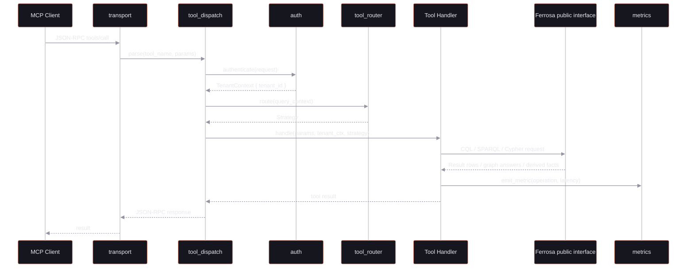

Current implementation note: the serving path still includes graph-table writes through direct `CqlStorage` access while Datalog remains an explicit local inference layer.

Unless otherwise labeled as target-state, the remaining diagrams document the current implementation paths that still need to be refactored behind graph/public interfaces. They should not be read as the desired long-term architecture.

## 1b. Bulk `ingest_entities` Flow

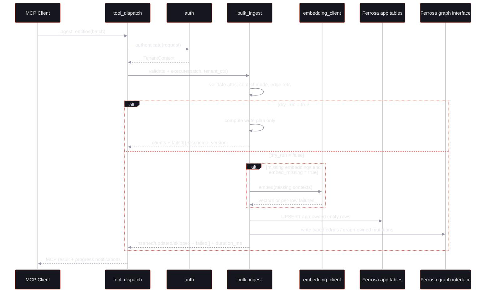

Current implementation note: this is target-state architecture. The current codebase has adjacent ingest tools, but not yet a single server-owned `ingest_entities` contract with structured batch failure semantics.

## 2. Memoization Write Path

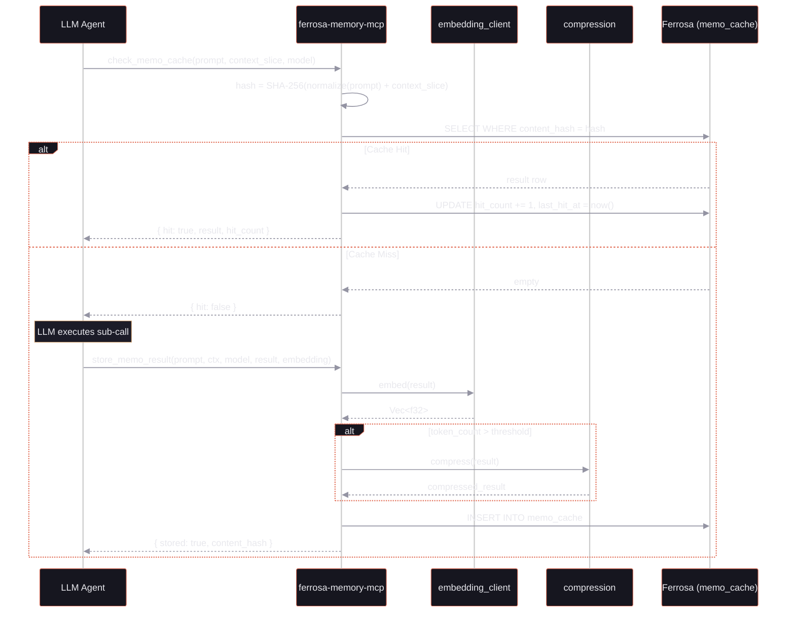

## 3. Fold Lifecycle

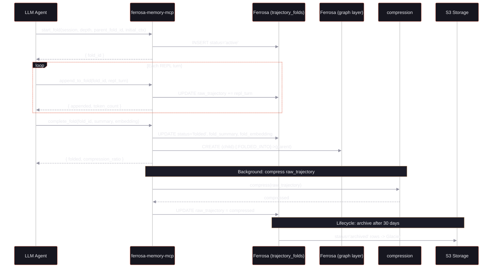

## 4. Entity Discovery and Retrieval

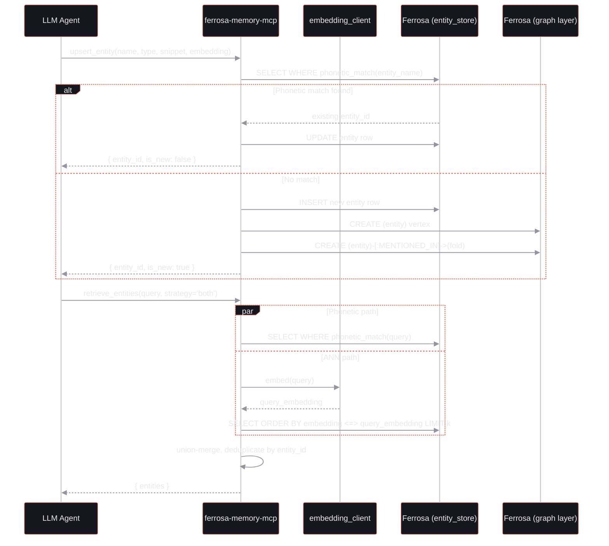

## 5. Temporal Event Chain

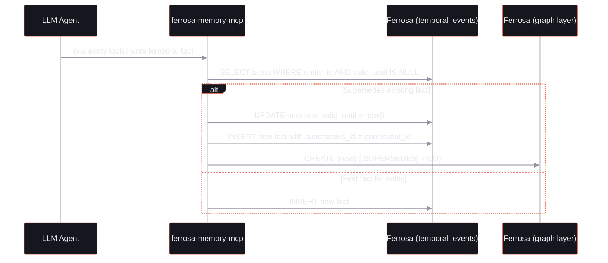

## 6. Feedback and Routing Learning Loop

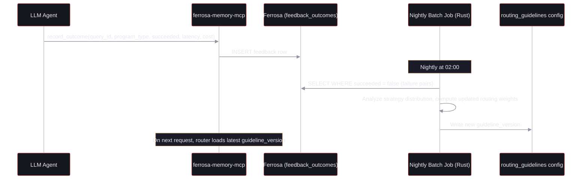

## 7. Recursive Exploration Flow

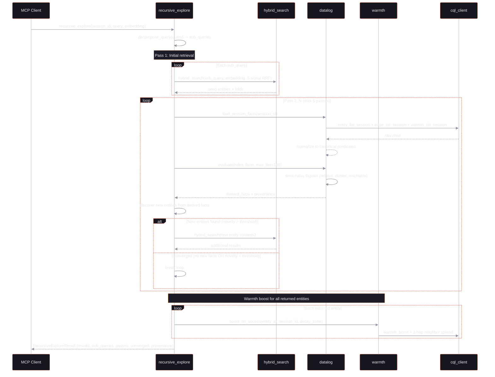

## 8. Data Tiering Path

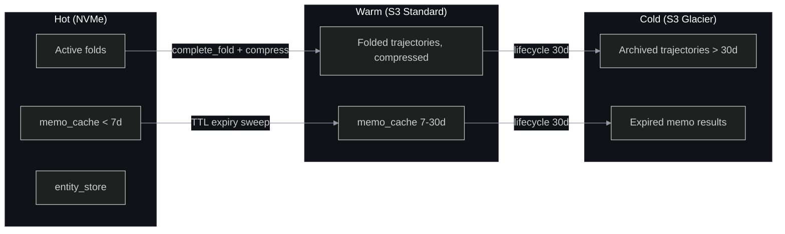

## 9. Type Registry and Tool Schema Generation

Current implementation note: startup still loads type metadata through direct CQL storage bindings. That is acceptable only if those remain app-owned tables compatible with the `app_reader` role boundary; it should not require graph-table mutation or privileged graph ownership.

Target behavior: type/system metadata should come from Ferrosa public interfaces or an explicitly versioned metadata contract where possible, but direct CQL reads remain acceptable if they stay within supported app-table scope.

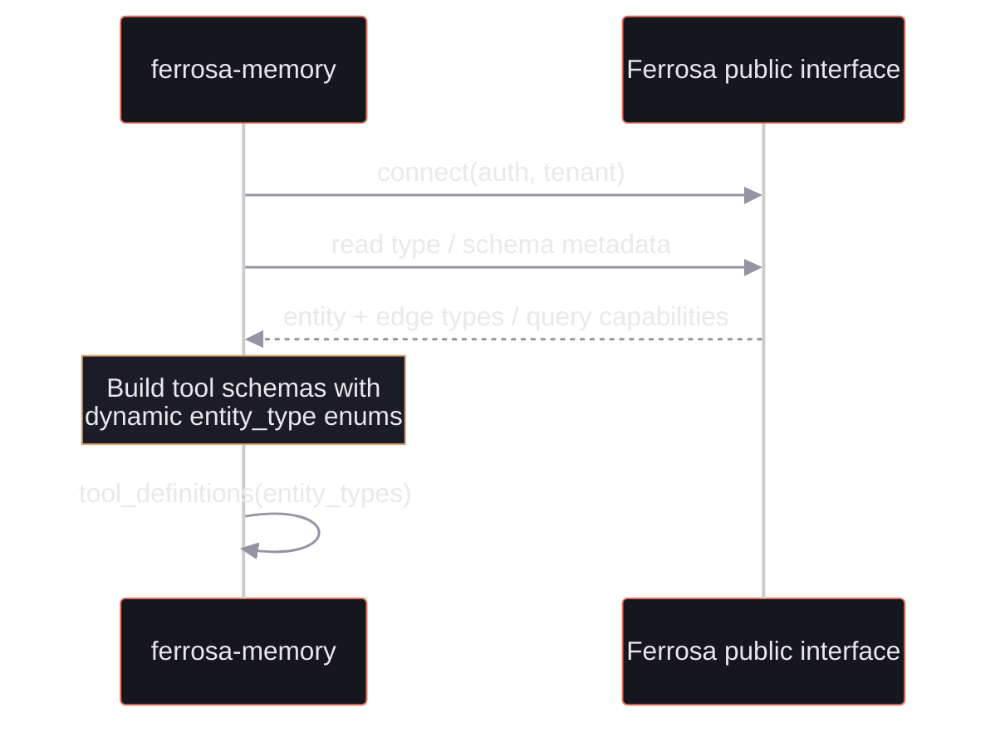

## 10. Tool Usage Logging (DDL 009)

Every MCP tool call is logged to the `tool_usage_log` table for token usage analytics. The table is partitioned by `(tenant_id, day)` with `call_id` (timeuuid) clustering in descending order for efficient recent-first queries.

**Columns recorded:** `tool_name`, `repo`, `input_bytes`, `output_bytes`, `estimated_tokens`, `latency_ms`, `error` (boolean).

**Write path:** After each tool handler returns, `tool_dispatch` writes a row to `tool_usage_log` with the call metrics. This is fire-and-forget (does not block the tool response).

**Read path:** Analytics queries aggregate by day and tool name for cost attribution and usage trending. Not exposed as an MCP tool — queried via Ferrosa's public CQL interface.

## 11. External Codebase Ingestion (via forge)

Current implementation note: external ingestion still uses direct CQL/table ownership. The corrected architecture should treat graph publication as another Ferrosa client and target graph/public write interfaces instead of direct graph-table inserts.

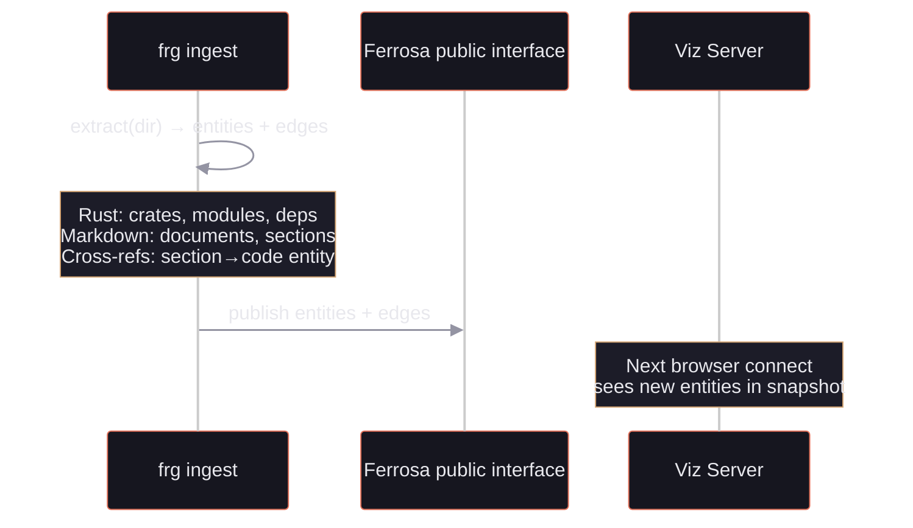

## 12. Expert-System Knowledge Plane Flow

The expert-system path extends the existing Datalog layer with an explicit effective-rule-set loader, governance-backed symbolic artifacts, and explanation queries. Backend convergence is implemented: the effective loader is the active source for runtime rule evaluation in registry-facing paths.

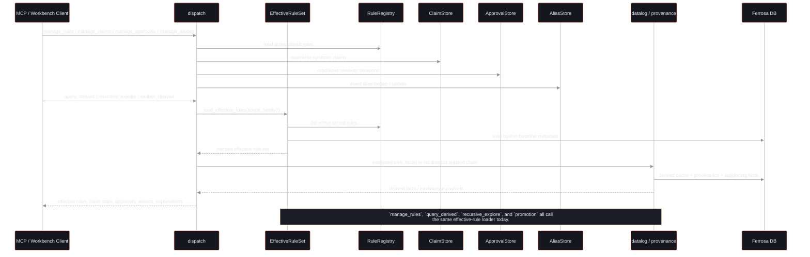

## 13. Operator Workbench

The operator surface should stop treating `/viz` as the de facto home page. Instead, expose an integrated workbench that links the operator workflows together and makes raw data exploration explicit.

Current implementation note: backend convergence and governance APIs are implemented in MCP/core, and the operator workbench is now rooted at `/` with API-backed CQL, Datalog, rules, approvals, and summary routes. The remaining architectural correction is to keep CQL/SPARQL on Ferrosa public APIs while documenting Datalog honestly as a local ferrosa-memory engine over Ferrosa-backed state.

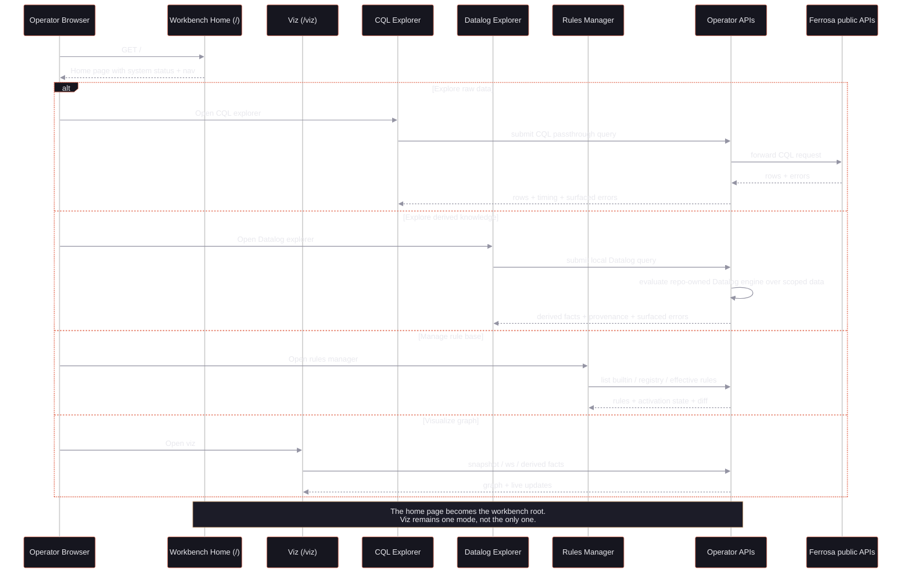
