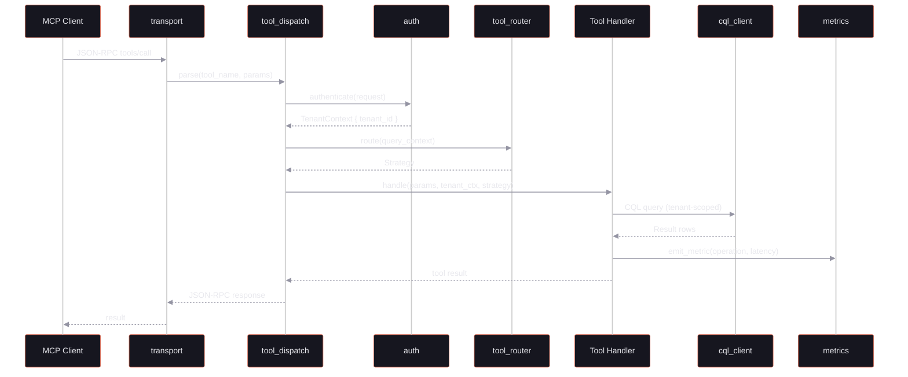
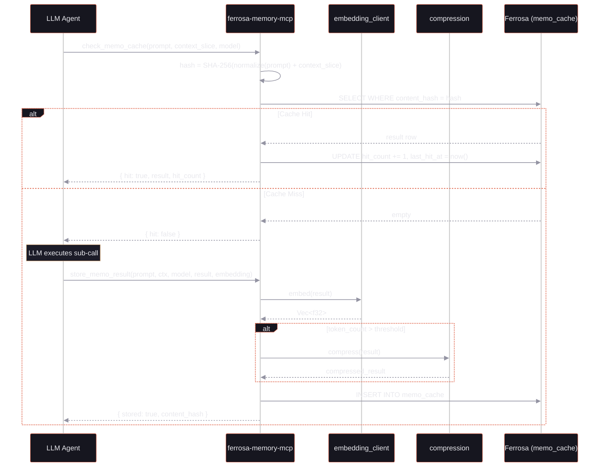
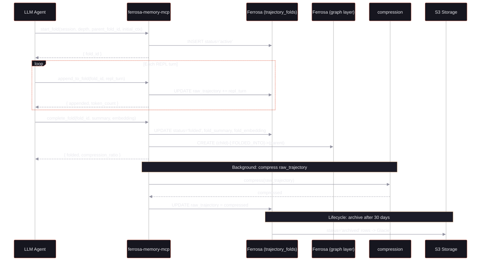
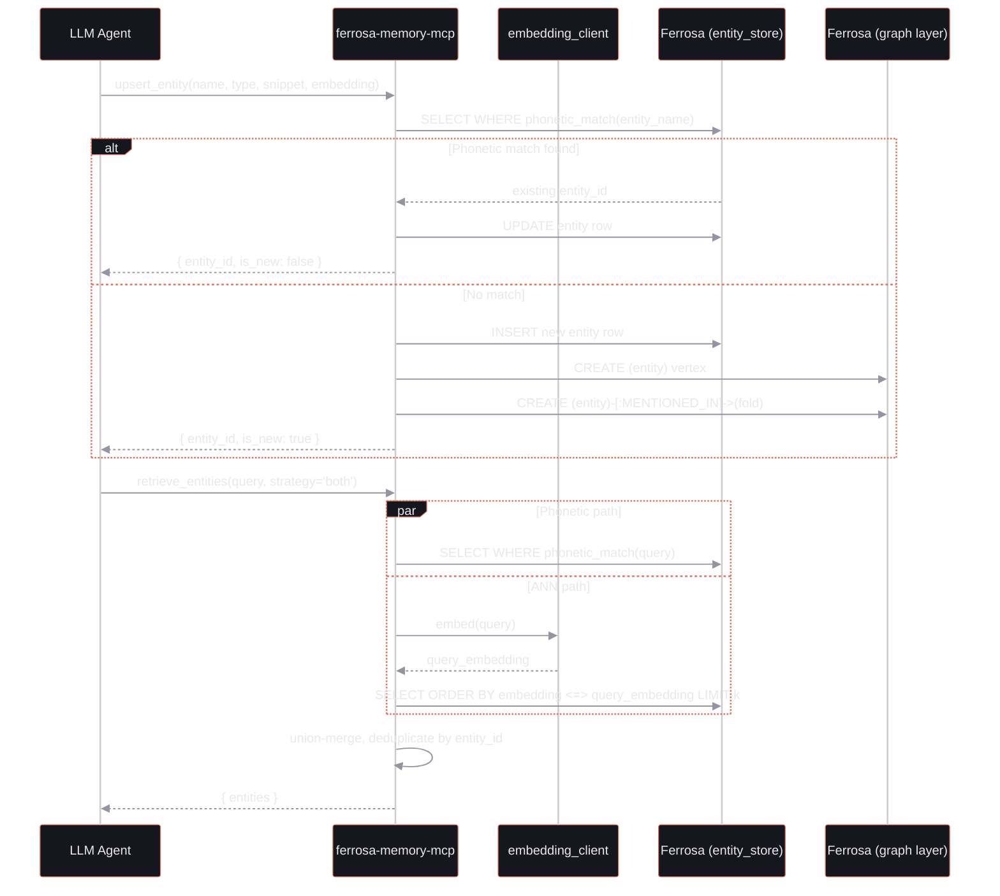
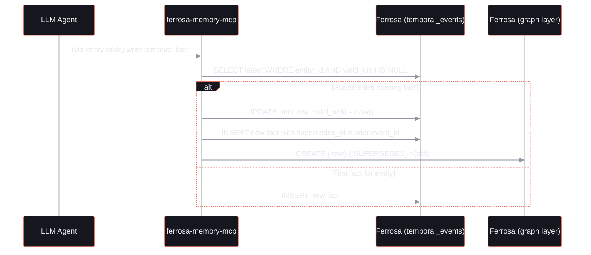
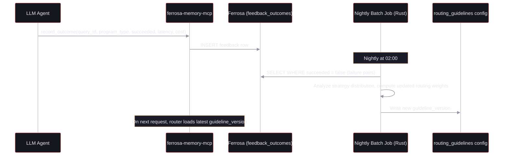
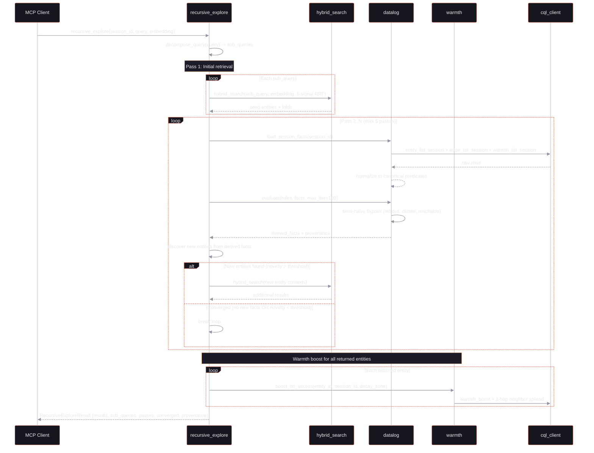
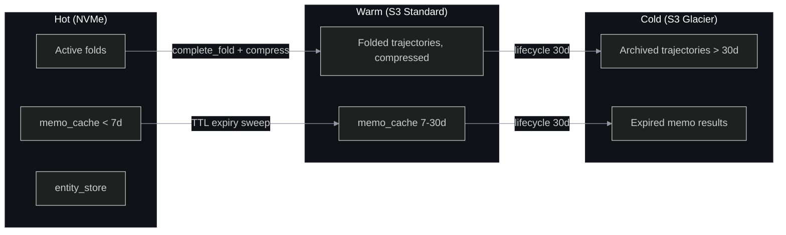

# Data Flow Diagrams

## 1. Tool Call Flow (All Tools)

Every MCP tool call follows this path:

## 2. Memoization Write Path

## 3. Fold Lifecycle

## 4. Entity Discovery and Retrieval

## 5. Temporal Event Chain

## 6. Feedback and Routing Learning Loop

## 7. Recursive Exploration Flow

## 8. Data Tiering Path

