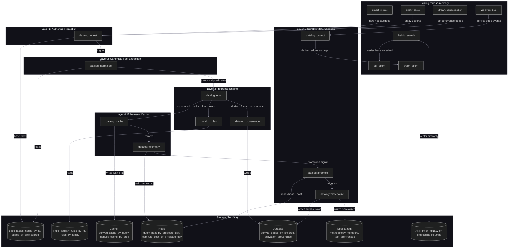
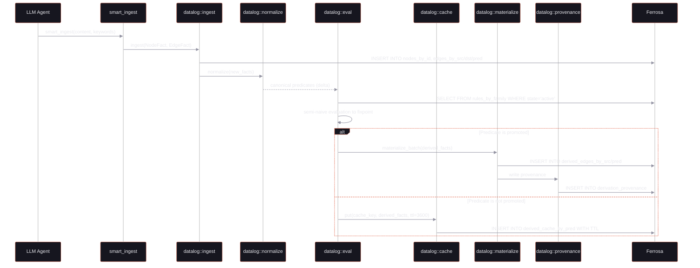
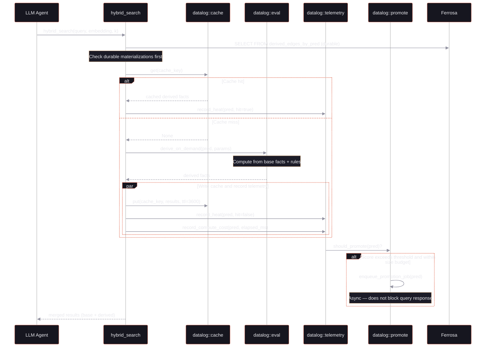
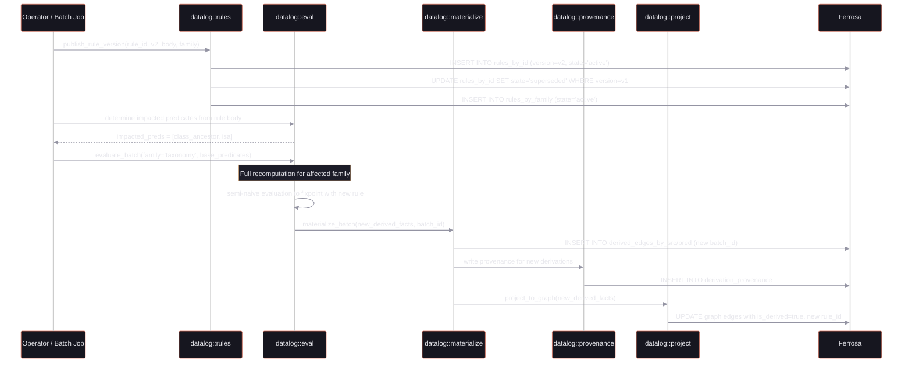

# Datalog Graph Materialization — Architecture Specification

> Status: Phase 1 draft
> Date: 2026-03-26
> Source: `product/datalog-graph-materialization.md`

## 1. Overview

### What This Subsystem Does

The Datalog Graph Materialization subsystem adds a logical inference layer to ferrosa-memory. It takes the existing property graph (nodes, edges, entities) and:

1. Normalizes graph data into canonical Datalog-style predicates (`edge(src, pred, dst)`, `instance_of(entity, class)`, etc.).
2. Evaluates declarative rules over those predicates to derive new facts (transitive closure, membership rollup, tool recommendations).
3. Caches ephemeral inferred results in TTL-backed CQL tables for short-lived reuse.
4. Promotes high-value derived predicates into durable materialized tables based on observed query heat and compute cost.
5. Preserves provenance for every derived fact so derivations are explainable.

### How It Relates to Existing ferrosa-memory

The existing system stores raw memories (memos, folds, entities, temporal facts) and retrieves them via vector search, phonetic matching, and graph traversal. This subsystem adds a reasoning layer on top of that raw storage:

- `smart_ingest` feeds the **Authoring / Ingestion Layer** with new nodes and edges.
- `dream::run_consolidation` is enhanced (not replaced) by the **Inference Layer**, which can derive richer relationships than co-occurrence alone.
- `hybrid_search` queries both base and derived facts, expanding recall without additional LLM calls.
- The viz dashboard shows derived edges alongside base edges, marked with `is_derived = true`.

The inference engine operates on the same Ferrosa cluster (same `agent_memory` keyspace) using new tables described in Section 4.

---

## 2. Architecture Diagram



---

## 3. Component Design

### Layer 1: Authoring / Ingestion

**Purpose:** Accept new nodes and edges into the base graph. Serve as the entry point from existing ferrosa-memory tool handlers.

**Module:** `crates/ferrosa-memory-core/src/datalog/ingest.rs`

**Key types and traits:**

```rust
/// A base fact written to the graph — either a node or an edge.
pub enum BaseFact {
    Node(NodeFact),
    Edge(EdgeFact),
}

pub struct NodeFact {
    pub tenant: String,
    pub node_id: String,
    pub primary_label: String,
    pub kind: String,
    pub name: String,
    pub state: String,
    pub confidence: f64,
    pub props: HashMap<String, String>,
}

pub struct EdgeFact {
    pub tenant: String,
    pub src_id: String,
    pub pred: String,
    pub dst_id: String,
    pub is_derived: bool,
    pub confidence: f64,
    pub props: HashMap<String, String>,
}

#[async_trait]
pub trait FactIngester {
    /// Write a base fact and trigger normalization.
    async fn ingest(&self, ctx: &TenantContext, fact: BaseFact) -> Result<()>;
    /// Batch ingest for import pipelines.
    async fn ingest_batch(&self, ctx: &TenantContext, facts: Vec<BaseFact>) -> Result<usize>;
}
```

**Dependencies on existing code:** `cql_client` (writes to base tables), `types::TenantContext`, `viz` (emits `NodeAdded`/`EdgeAdded` events).

**Size estimate:** ~200 lines

---

### Layer 2: Canonical Fact Extraction

**Purpose:** Normalize property graph data into canonical Datalog predicates. Translates CQL rows into the logical schema (`edge(src, pred, dst)`, `node_label(id, label)`, `instance_of(entity, class)`, etc.).

**Module:** `crates/ferrosa-memory-core/src/datalog/normalize.rs`

**Key types and traits:**

```rust
/// A canonical predicate in the logical schema.
pub enum Predicate {
    Node { id: String },
    NodeLabel { id: String, label: String },
    NodeName { id: String, name: String },
    NodeKind { id: String, kind: String },
    Edge { src: String, pred: String, dst: String },
    EdgeConfidence { src: String, pred: String, dst: String, score: f64 },
    InstanceOf { entity: String, class: String },
    SubclassOf { child: String, parent: String },
    PartOf { child: String, parent: String },
    SameAs { a: String, b: String },
    Alias { id: String, alias: String },
}

#[async_trait]
pub trait Normalizer {
    /// Extract canonical predicates from a set of base facts.
    fn normalize(&self, facts: &[BaseFact]) -> Vec<Predicate>;
    /// Load and normalize all base facts for a tenant (batch mode).
    async fn normalize_all(&self, ctx: &TenantContext) -> Result<Vec<Predicate>>;
}
```

**Dependencies on existing code:** `cql_client` (reads base tables), `datalog::ingest` (receives `BaseFact` structs).

**Size estimate:** ~250 lines

---

### Layer 3: Inference Engine

**Purpose:** Evaluate Datalog rules over base and derived predicates. Supports batch rematerialization, incremental delta propagation, and query-time derivation.

**Modules:**

| File | Responsibility |
|------|---------------|
| `crates/ferrosa-memory-core/src/datalog/rules.rs` | Rule registry: load, version, deprecate rules |
| `crates/ferrosa-memory-core/src/datalog/eval.rs` | Rule evaluation engine (semi-naive, stratified) |
| `crates/ferrosa-memory-core/src/datalog/provenance.rs` | Provenance tracking and explanation queries |

**Key types and traits:**

```rust
/// A Datalog rule definition.
pub struct Rule {
    pub rule_id: String,
    pub version: i32,
    pub name: String,
    pub family: String,
    pub state: RuleState,  // Active, Deprecated, Superseded
    pub body: RuleBody,
    pub weight: f64,
    pub incremental: bool,
}

/// Parsed rule body — head predicate + conjunction of body predicates.
pub struct RuleBody {
    pub head: HeadAtom,
    pub body: Vec<BodyAtom>,
    pub guards: Vec<Guard>,  // e.g., N >= 3
}

/// A derived fact with full provenance.
pub struct DerivedFact {
    pub src: String,
    pub pred: String,
    pub dst: String,
    pub rule_id: String,
    pub batch_id: String,
    pub confidence: f64,
    pub support_count: i32,
    pub parents: Vec<ParentRef>,
}

pub struct ParentRef {
    pub src: String,
    pub pred: String,
    pub dst: String,
    pub kind: ParentKind,  // Base or Derived
}

#[async_trait]
pub trait RuleRegistry {
    async fn load_active_rules(&self, ctx: &TenantContext, family: &str) -> Result<Vec<Rule>>;
    async fn publish_rule_version(&self, ctx: &TenantContext, rule: &Rule) -> Result<()>;
    async fn deprecate_rule(&self, ctx: &TenantContext, rule_id: &str, version: i32) -> Result<()>;
}

#[async_trait]
pub trait InferenceEngine {
    /// Batch evaluate all rules for a family. Returns all derived facts.
    async fn evaluate_batch(
        &self,
        ctx: &TenantContext,
        family: &str,
        base_predicates: &[Predicate],
    ) -> Result<Vec<DerivedFact>>;

    /// Incremental evaluate: given a delta of new base facts, derive new conclusions.
    async fn evaluate_incremental(
        &self,
        ctx: &TenantContext,
        delta: &[Predicate],
    ) -> Result<Vec<DerivedFact>>;

    /// Query-time derivation for a specific predicate pattern.
    async fn derive_on_demand(
        &self,
        ctx: &TenantContext,
        pred: &str,
        params: &QueryParams,
    ) -> Result<Vec<DerivedFact>>;
}
```

**Evaluation strategy:** Semi-naive evaluation with stratification. Recursive rules (e.g., `class_ancestor`) are evaluated to fixpoint within their stratum. Non-recursive rules execute in a single pass. The engine is not a general Datalog solver — it handles the specific rule patterns from spec sections 10.1-10.6 with hard-coded evaluation strategies per family, extensible via the `RuleBody` DSL.

**Dependencies on existing code:** `cql_client` (reads/writes rule registry and derived tables), `datalog::normalize`, `metrics` (rule evaluation latency).

**Size estimate:** ~800 lines (rules: ~200, eval: ~400, provenance: ~200)

---

### Layer 4: Ephemeral Cache

**Purpose:** Store recently-computed inferred results in TTL-backed CQL tables. Record query heat and compute cost for promotion decisions.

**Modules:**

| File | Responsibility |
|------|---------------|
| `crates/ferrosa-memory-core/src/datalog/cache.rs` | Read/write ephemeral derived results |
| `crates/ferrosa-memory-core/src/datalog/telemetry.rs` | Heat counters and compute cost tracking |

**Key types and traits:**

```rust
pub struct CacheKey {
    pub tenant: String,
    pub pred: String,
    pub params_hash: String,  // SHA-256 of normalized query params
}

pub struct CachedResult {
    pub rows: Vec<DerivedFact>,
    pub computed_at: DateTime<Utc>,
}

#[async_trait]
pub trait DerivedCache {
    /// Look up cached derivation results.
    async fn get(&self, key: &CacheKey) -> Result<Option<CachedResult>>;
    /// Write results with TTL (default 3600s).
    async fn put(&self, key: &CacheKey, results: &[DerivedFact], ttl_seconds: u32) -> Result<()>;
}

#[async_trait]
pub trait HeatTracker {
    /// Record a cache hit or miss for a predicate.
    async fn record_heat(&self, ctx: &TenantContext, pred: &str, hit: bool) -> Result<()>;
    /// Record compute cost for a derivation.
    async fn record_compute_cost(&self, ctx: &TenantContext, pred: &str, compute_ms: u64) -> Result<()>;
    /// Read heat + cost for promotion decisions.
    async fn get_promotion_stats(&self, ctx: &TenantContext, pred: &str, days: u32) -> Result<PromotionStats>;
}

pub struct PromotionStats {
    pub query_count_7d: u64,
    pub median_compute_ms: u64,
    pub total_requests: u64,
}
```

**Dependencies on existing code:** `cql_client` (reads/writes cache and heat tables), `metrics` (cache hit/miss rates).

**Size estimate:** ~300 lines (cache: ~150, telemetry: ~150)

---

### Layer 5: Durable Materialization

**Purpose:** Persist promoted derived relations in durable tables. Project derived edges back into the queryable graph. Manage the promotion lifecycle.

**Modules:**

| File | Responsibility |
|------|---------------|
| `crates/ferrosa-memory-core/src/datalog/materialize.rs` | Write durable materialization batches |
| `crates/ferrosa-memory-core/src/datalog/promote.rs` | Promotion scoring and decision logic |
| `crates/ferrosa-memory-core/src/datalog/project.rs` | Project derived edges into Cypher-visible graph |

**Key types and traits:**

```rust
pub struct MaterializationBatch {
    pub batch_id: String,
    pub family: String,
    pub rule_version: i32,
    pub facts: Vec<DerivedFact>,
    pub materialized_at: DateTime<Utc>,
}

pub struct PromotionCandidate {
    pub pred: String,
    pub score: f64,
    pub estimated_rows: u64,
    pub size_budget: u64,
}

#[async_trait]
pub trait Materializer {
    /// Write a batch of derived facts to durable tables + provenance.
    async fn materialize_batch(
        &self,
        ctx: &TenantContext,
        batch: &MaterializationBatch,
    ) -> Result<usize>;

    /// Rematerialize all facts for a rule family (after rule version change).
    async fn rematerialize_family(
        &self,
        ctx: &TenantContext,
        family: &str,
        version: i32,
    ) -> Result<usize>;
}

#[async_trait]
pub trait PromotionEvaluator {
    /// Evaluate whether a predicate should be promoted to durable materialization.
    fn should_promote(&self, stats: &PromotionStats, budget: &SizeBudget) -> bool;

    /// Compute promotion score.
    /// score = query_count_7d * median_compute_ms * reuse_factor / max(update_rate_7d, 1)
    fn promotion_score(&self, stats: &PromotionStats) -> f64;
}

#[async_trait]
pub trait GraphProjector {
    /// Write derived edges back to the graph as relationships with is_derived=true.
    async fn project_to_graph(
        &self,
        ctx: &TenantContext,
        facts: &[DerivedFact],
    ) -> Result<usize>;
}
```

**Dependencies on existing code:** `cql_client` (writes durable tables), `graph_client` (projects derived edges to Cypher), `viz` (emits `EdgeAdded` events for derived edges), `metrics`.

**Size estimate:** ~450 lines (materialize: ~200, promote: ~100, project: ~150)

---

### Module Tree Summary

```
crates/ferrosa-memory-core/src/
├── datalog/
│   ├── mod.rs            # Public re-exports
│   ├── ingest.rs         # Layer 1: base fact ingestion
│   ├── normalize.rs      # Layer 2: canonical fact extraction
│   ├── rules.rs          # Layer 3: rule registry
│   ├── eval.rs           # Layer 3: rule evaluation engine
│   ├── provenance.rs     # Layer 3: provenance tracking
│   ├── cache.rs          # Layer 4: ephemeral cache
│   ├── telemetry.rs      # Layer 4: heat + cost tracking
│   ├── materialize.rs    # Layer 5: durable batch writes
│   ├── promote.rs        # Layer 5: promotion scoring
│   └── project.rs        # Layer 5: graph projection
├── ...existing modules...
```

All new code lives under `datalog/` within `ferrosa-memory-core`. No new workspace crates are needed — the datalog subsystem is a library consumed by both the MCP server (query-time derivation) and the batch job (batch rematerialization).

---

## 4. Data Model

All tables live in the `agent_memory` keyspace alongside existing tables.

### Layer 1: Base Graph Tables

These tables store the raw property graph. They are the source of truth.

**`nodes_by_id`** — One row per graph node.

```sql
CREATE TABLE nodes_by_id (
  tenant text,
  node_id text,
  primary_label text,
  kind text,
  state text,
  confidence double,
  created_at timestamp,
  name text,
  props map<text, text>,
  PRIMARY KEY ((tenant, node_id))
);
```

**`edges_by_src`** — Outgoing edges, sharded to bound partition size.

```sql
CREATE TABLE edges_by_src (
  tenant text,
  src_id text,
  shard smallint,
  pred text,
  dst_id text,
  is_derived boolean,
  rule_id text,
  confidence double,
  created_at timestamp,
  props map<text, text>,
  PRIMARY KEY ((tenant, src_id, shard), pred, dst_id)
);
```

**`edges_by_dst`** — Incoming edges (reverse index).

```sql
CREATE TABLE edges_by_dst (
  tenant text,
  dst_id text,
  shard smallint,
  pred text,
  src_id text,
  is_derived boolean,
  rule_id text,
  confidence double,
  created_at timestamp,
  props map<text, text>,
  PRIMARY KEY ((tenant, dst_id, shard), pred, src_id)
);
```

**`edges_by_pred`** — All edges of a given type (predicate scan).

```sql
CREATE TABLE edges_by_pred (
  tenant text,
  pred text,
  shard smallint,
  src_id text,
  dst_id text,
  is_derived boolean,
  confidence double,
  created_at timestamp,
  PRIMARY KEY ((tenant, pred, shard), src_id, dst_id)
);
```

### Layer 3: Rule Registry Tables

**`rules_by_id`** — Versioned rule definitions.

```sql
CREATE TABLE rules_by_id (
  tenant text,
  rule_id text,
  version int,
  name text,
  family text,
  state text,
  rule_body text,
  rule_weight double,
  incremental boolean,
  created_at timestamp,
  updated_at timestamp,
  PRIMARY KEY ((tenant, rule_id), version)
);
```

**`rules_by_family`** — Family index for loading active rules by family.

```sql
CREATE TABLE rules_by_family (
  tenant text,
  family text,
  state text,
  rule_id text,
  version int,
  updated_at timestamp,
  PRIMARY KEY ((tenant, family, state), rule_id, version)
);
```

### Layer 4: Ephemeral Cache Tables

**`derived_cache_by_query`** — Cache by query pattern (TTL 1 hour).

```sql
CREATE TABLE derived_cache_by_query (
  tenant text,
  cache_key text,
  seq int,
  src_id text,
  pred text,
  dst_id text,
  confidence double,
  rule_id text,
  computed_at timestamp,
  PRIMARY KEY ((tenant, cache_key), seq)
) WITH default_time_to_live = 3600;
```

**`derived_cache_by_pred`** — Cache by predicate + time bucket (TTL 1 hour).

```sql
CREATE TABLE derived_cache_by_pred (
  tenant text,
  pred text,
  bucket text,
  src_id text,
  dst_id text,
  confidence double,
  rule_id text,
  computed_at timestamp,
  PRIMARY KEY ((tenant, pred, bucket), src_id, dst_id)
) WITH default_time_to_live = 3600;
```

### Layer 4: Heat / Promotion Telemetry Tables

**`query_heat_by_predicate_day`** — Query frequency counter per predicate per day.

```sql
CREATE TABLE query_heat_by_predicate_day (
  tenant text,
  day text,
  pred text,
  hits counter,
  PRIMARY KEY ((tenant, day), pred)
);
```

**`compute_cost_by_predicate_day`** — Compute cost counter per predicate per day.

```sql
CREATE TABLE compute_cost_by_predicate_day (
  tenant text,
  day text,
  pred text,
  total_compute_ms counter,
  total_requests counter,
  PRIMARY KEY ((tenant, day), pred)
);
```

### Layer 5: Durable Materialization Tables

**`derived_edges_by_src`** — Durable derived edges by source node.

```sql
CREATE TABLE derived_edges_by_src (
  tenant text,
  src_id text,
  shard smallint,
  pred text,
  dst_id text,
  rule_id text,
  support_count int,
  confidence double,
  batch_id text,
  materialized_at timestamp,
  PRIMARY KEY ((tenant, src_id, shard), pred, dst_id)
);
```

**`derived_edges_by_pred`** — Durable derived edges by predicate type.

```sql
CREATE TABLE derived_edges_by_pred (
  tenant text,
  pred text,
  shard smallint,
  src_id text,
  dst_id text,
  rule_id text,
  support_count int,
  confidence double,
  batch_id text,
  materialized_at timestamp,
  PRIMARY KEY ((tenant, pred, shard), src_id, dst_id)
);
```

**`derivation_provenance`** — Parent fact chain for every derived edge.

```sql
CREATE TABLE derivation_provenance (
  tenant text,
  derived_edge_id text,
  seq int,
  parent_src text,
  parent_pred text,
  parent_dst text,
  parent_kind text,
  PRIMARY KEY ((tenant, derived_edge_id), seq)
);
```

### Layer 5: Specialized Durable Tables (Promoted Predicates)

**`methodology_members_by_methodology`** — Rolled-up methodology membership.

```sql
CREATE TABLE methodology_members_by_methodology (
  tenant text,
  methodology_id text,
  member_type text,
  member_id text,
  source_pred text,
  confidence double,
  batch_id text,
  PRIMARY KEY ((tenant, methodology_id), member_type, member_id)
);
```

**`tool_preferences_by_context`** — Materialized tool recommendations.

```sql
CREATE TABLE tool_preferences_by_context (
  tenant text,
  context_id text,
  better_tool_id text,
  worse_tool_id text,
  confidence double,
  rule_id text,
  batch_id text,
  PRIMARY KEY ((tenant, context_id), better_tool_id, worse_tool_id)
);
```

### Sharding Strategy

Shard formula for edge tables: `shard = hash(src_id or pred) % N` where N defaults to 8.

Cache bucket formula: `bucket = YYYYMMDDHH` (hourly buckets to align TTL expiration windows and reduce tombstone scatter).

---

## 5. Data Flow

### 5.1 Ingestion Flow: Base Fact to Derived Knowledge



### 5.2 Query-Time Derivation



### 5.3 Rule Version Change and Rematerialization



---

## 6. Integration Points

### 6.1 `smart_ingest` Feeds the Authoring Layer

The existing `smart_ingest` module (M25) decides whether to CREATE, UPDATE, or SUPERSEDE entities. After making that decision, it now also calls `datalog::ingest::ingest()` to register the resulting nodes and edges as base facts. This triggers incremental normalization and evaluation.

**Change required in `smart_ingest`:** After entity upsert, call:

```rust
fact_ingester.ingest(ctx, BaseFact::Edge(EdgeFact {
    tenant: ctx.tenant_id.clone(),
    src_id: entity_id,
    pred: edge_type,
    dst_id: target_id,
    is_derived: false,
    confidence: entity.confidence,
    props: HashMap::new(),
})).await?;
```

### 6.2 `dream::run_consolidation` Enhanced by Inference

The existing `dream` module (M20) discovers co-occurrence relationships and creates `CO_OCCURS` graph edges. The inference layer adds value on top:

- Co-occurrence edges become base facts fed into the normalizer.
- Rule families like "Weak Evidence Promotion" (spec section 10.5) evaluate co-occurrence counts and promote `candidate_related` pairs when support >= 3.
- The dream cycle can trigger batch evaluation for the `evidence_promotion` rule family after consolidation completes.

**Change required in `dream`:** After creating co-occurrence edges, call `datalog::ingest::ingest_batch()` with the new edges, then trigger `InferenceEngine::evaluate_incremental()` for the delta.

### 6.3 `hybrid_search` Queries Both Base and Derived Facts

The existing `hybrid_search` module (M21) uses RRF to merge results across entities, folds, and memos. With derived facts, it gains additional result sources:

1. Check `derived_edges_by_pred` for durably materialized derived facts matching the query.
2. Check `derived_cache_by_query` for recently-computed ephemeral derivations.
3. If both miss, trigger `derive_on_demand` for the relevant predicate.
4. Merge derived results into the RRF ranking alongside base results.

**Change required in `hybrid_search`:** Add a new retrieval lane for derived facts. Derived results enter the RRF merge with their own rank list.

### 6.4 `viz` Shows Derived Edges

The existing viz event bus (M34) emits `NodeAdded`, `EdgeAdded`, `NodeUpdated` events. Derived edges are surfaced through the same bus:

- `datalog::project` emits `EdgeAdded` events with metadata `{ is_derived: true, rule_id, confidence }`.
- The dashboard renders derived edges in a visually distinct style (dashed lines, different color).
- Explanation queries are accessible from the viz UI: clicking a derived edge shows its provenance chain.

**Change required in `viz`:** Extend `VizEvent::EdgeAdded` to carry `is_derived`, `rule_id`, and `confidence` fields. The frontend renders derived edges distinctly.

---

## 7. ANN Indexing for Fast Semantic Search

### Current State

The existing system uses HNSW vector indexes on `entity_store.embedding` and `trajectory_folds.fold_embedding` for ANN retrieval. These are Ferrosa-managed indexes created via DDL:

```sql
CREATE CUSTOM INDEX entity_embedding_idx ON entity_store (embedding)
USING 'org.apache.cassandra.index.sai.StorageAttachedIndex'
WITH OPTIONS = { 'similarity_function': 'cosine' };
```

### Extension for Datalog Subsystem

The datalog subsystem introduces node-level embeddings for semantic node similarity and derived-fact retrieval. Two new ANN indexes are needed:

**Node embedding index** — allows vector search over graph nodes to find semantically similar concepts.

```sql
ALTER TABLE nodes_by_id ADD embedding VECTOR<float, 768>;

CREATE CUSTOM INDEX nodes_embedding_idx ON nodes_by_id (embedding)
USING 'org.apache.cassandra.index.sai.StorageAttachedIndex'
WITH OPTIONS = { 'similarity_function': 'cosine' };
```

**Derived edge embedding index** — allows semantic search over derived facts. The embedding represents the triple `(src_name, pred, dst_name)` encoded as a single vector, enabling queries like "find derived facts similar to 'X is related to Y'."

```sql
ALTER TABLE derived_edges_by_src ADD embedding VECTOR<float, 768>;

CREATE CUSTOM INDEX derived_edges_embedding_idx ON derived_edges_by_src (embedding)
USING 'org.apache.cassandra.index.sai.StorageAttachedIndex'
WITH OPTIONS = { 'similarity_function': 'cosine' };
```

### How ANN Improves Search Performance

| Query type | Without ANN | With ANN |
|-----------|-------------|----------|
| "Find entities related to testing" | Full scan of `edges_by_pred` for all test-related predicates | Single ANN query on `nodes_by_id` embedding, then expand via edges |
| "What derived facts are similar to X?" | Enumerate all derived predicates, evaluate each | Single ANN query on `derived_edges_by_src` embedding |
| "Find concepts near this embedding" | Not supported on node table | Direct HNSW lookup on `nodes_by_id` |

### Integration with `hybrid_search`

The ANN index on `nodes_by_id` becomes a new retrieval lane in `hybrid_search`:

1. Embed the query text via `embedding_client`.
2. ANN search on `nodes_by_id` for semantically similar graph nodes (top-k).
3. For each matching node, retrieve its outgoing base and derived edges.
4. Merge into the RRF ranking alongside entity, fold, and memo results.

This gives `hybrid_search` access to the full concept graph without requiring explicit predicate enumeration.

### Embedding Generation

Node embeddings are generated at ingest time by `datalog::ingest`:

1. Construct a text representation: `"{name} ({kind}): {primary_label}"`.
2. Call `embedding_client.embed(text)` to get the 768-dim vector.
3. Write the embedding alongside the node row.

Derived edge embeddings are generated at materialization time by `datalog::materialize`:

1. Look up source and destination node names.
2. Construct: `"{src_name} {pred} {dst_name}"`.
3. Embed and write alongside the derived edge row.

---

## 8. MVP Scope

Based on product spec section 24, the MVP delivers the minimal viable inference pipeline end-to-end.

### Must-Have (Sprint 5)

| # | Task | Layer | Size |
|---|------|-------|------|
| 5.1 | DDL for base graph tables (`nodes_by_id`, `edges_by_src`, `edges_by_dst`, `edges_by_pred`) | Storage | S |
| 5.2 | DDL for rule registry tables (`rules_by_id`, `rules_by_family`) | Storage | S |
| 5.3 | DDL for ephemeral cache tables (`derived_cache_by_query`, `derived_cache_by_pred`) | Storage | S |
| 5.4 | DDL for durable materialization tables (`derived_edges_by_src`, `derived_edges_by_pred`, `derivation_provenance`) | Storage | S |
| 5.5 | DDL for heat/promotion telemetry tables (`query_heat_by_predicate_day`, `compute_cost_by_predicate_day`) | Storage | S |
| 5.6 | `datalog::ingest` — base fact ingestion from `smart_ingest` and `entity_tools` | Layer 1 | M |
| 5.7 | `datalog::normalize` — canonical fact extraction from base tables | Layer 2 | M |
| 5.8 | `datalog::rules` — rule registry (load, publish, deprecate) | Layer 3 | M |
| 5.9 | `datalog::eval` — semi-naive evaluation for 5 rule families: taxonomy closure, part-of closure, methodology membership, tool preference, practice-to-methodology | Layer 3 | L |
| 5.10 | `datalog::provenance` — provenance writes + explanation queries | Layer 3 | M |
| 5.11 | `datalog::cache` — ephemeral cache read/write with TTL | Layer 4 | S |
| 5.12 | `datalog::telemetry` — heat + cost counter writes | Layer 4 | S |

### Must-Have (Sprint 6)

| # | Task | Layer | Size |
|---|------|-------|------|
| 6.1 | `datalog::materialize` — durable batch writes | Layer 5 | M |
| 6.2 | `datalog::promote` — promotion scoring + decision | Layer 5 | S |
| 6.3 | `datalog::project` — project derived edges to graph | Layer 5 | M |
| 6.4 | Integration: `smart_ingest` calls `datalog::ingest` on entity writes | Integration | S |
| 6.5 | Integration: `dream` triggers incremental evaluation after consolidation | Integration | S |
| 6.6 | Integration: `hybrid_search` queries derived facts via new retrieval lane | Integration | M |
| 6.7 | Integration: `viz` renders derived edges with distinct styling | Integration | S |
| 6.8 | ANN index on `nodes_by_id.embedding` + embedding generation in `datalog::ingest` | ANN | M |
| 6.9 | DDL for specialized tables (`methodology_members_by_methodology`, `tool_preferences_by_context`) | Storage | S |
| 6.10 | First 4 durable materializations: `isa`, `class_ancestor`, `methodology_member`, `tool_preferences_by_context` | Layer 5 | M |

### First Rule Families (MVP)

| Family | Rules | Source |
|--------|-------|--------|
| `taxonomy` | `class_ancestor`, `isa` | Spec 10.1 |
| `part_of` | `ancestor_part` | Spec 10.2 |
| `methodology` | `has_phase`, `includes_activity`, `methodology_member` | Spec 10.3 |
| `tool_recommendation` | `prefers_tool`, `recommended_tool` | Spec 10.4 |
| `practice_links` | `embodies_principle`, `practice_applies_to` | Spec 10.6 |

### First Durable Materializations (MVP)

| Predicate | Table | Rationale |
|-----------|-------|-----------|
| `isa` | `derived_edges_by_pred` | High reuse, bounded size, core taxonomy query |
| `class_ancestor` | `derived_edges_by_pred` | Transitive closure is expensive to recompute |
| `methodology_member` | `methodology_members_by_methodology` | Specialized table for direct methodology lookup |
| `prefers_tool` | `tool_preferences_by_context` | Specialized table for tool recommendation queries |

### Deferred (Post-MVP)

- Weak evidence promotion (spec 10.5) — requires `cooccur_support` aggregation
- ANN index on `derived_edges_by_src.embedding`
- NVMe pinning for cache tables (requires Ferrosa storage policy configuration)
- Incremental delta propagation (MVP uses batch evaluation; incremental is an optimization)
- Promotion automation (MVP evaluates promotion criteria but requires operator approval to promote)
- Rule body DSL parser (MVP hardcodes the 5 rule families; a DSL parser enables user-defined rules later)
