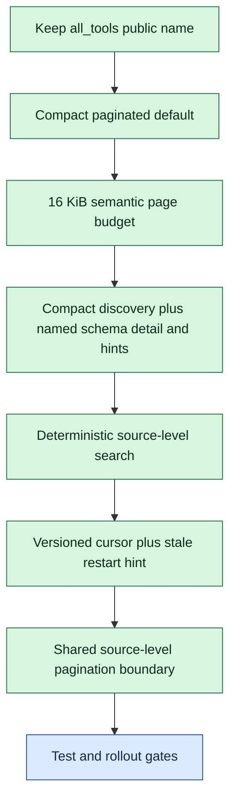

# Bounded MCP Tool Catalog Decision Tree

The tree separates confirmed constraints from decisions that still affect the
API contract, failure behavior, and verification plan.

## Confirmed branch

1. Preserve the `all_tools` name.
2. Return a compact first page instead of the complete catalog.
3. Return an explicit continuation cursor for subsequent pages.
4. Cap each serialized page at 16 KiB.
5. Split pages only between complete tool entries and fill toward the byte cap.
6. Keep compact discovery and full schema detail inside `all_tools`.
7. Allow direct schema lookup with `names: [...]`.
8. Return actionable next-call hints with every paginated response.
9. Embed a server-owned catalog version in every cursor.
10. Reject stale cursors with a typed result and exact restart hint.
11. Reuse one paginator across `all_tools`, MCP `tools/list`, and operator
    catalog responses.
12. Page at the catalog source, retaining only the current page and bounded
    look-ahead rather than materializing the complete result.
13. Require database cursor/limit pushdown for any database-backed catalog
    source.
14. Add deterministic lexical `query` and exact category filters to `all_tools`
    rather than adding a separate `tool_search` tool.
15. Bind normalized search and detail arguments into the cursor fingerprint.

## Derived implementation gates

The confirmed decisions imply deterministic contract, boundary, memory, and
client-integration tests. Technical analysis will define exact tests and rollout
ordering without another product decision.

## Remaining questions

No stakeholder question remains. Live client compatibility and performance
measurements remain verification work rather than architecture ambiguity.
