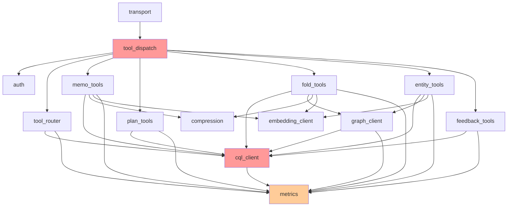

# Design Structure Matrix — ferrosa-memory-mcp

## Module Inventory

14 modules identified from component architecture:

| ID | Module | Type |
|----|--------|------|
| M1 | transport | MCP protocol layer |
| M2 | tool_dispatch | Tool registry/dispatch |
| M3 | auth | Tenant authentication |
| M4 | tool_router | Strategy selection |
| M5 | memo_tools | Memoization handlers |
| M6 | plan_tools | Plan state handlers |
| M7 | fold_tools | Trajectory fold handlers |
| M8 | entity_tools | Entity store handlers |
| M9 | feedback_tools | Feedback recording |
| M10 | cql_client | CQL storage client |
| M11 | graph_client | Cypher graph client |
| M12 | compression | Rust-native compression |
| M13 | embedding_client | Ollama HTTP client |
| M14 | metrics | Prometheus metrics |

## Dependency Matrix

Reads as: row depends on column. `X` = direct dependency.

```
        M1  M2  M3  M4  M5  M6  M7  M8  M9  M10 M11 M12 M13 M14
M1  .   .   .   .   .   .   .   .   .   .   .   .   .   .
M2  X   .   X   X   X   X   X   X   X   .   .   .   .   .
M3  .   .   .   .   .   .   .   .   .   .   .   .   .   .
M4  .   .   .   .   .   .   .   .   .   X   .   .   .   X
M5  .   .   .   .   .   .   .   .   .   X   .   X   X   X
M6  .   .   .   .   .   .   .   .   .   X   .   .   .   X
M7  .   .   .   .   .   .   .   .   .   X   X   X   X   X
M8  .   .   .   .   .   .   .   .   .   X   X   .   X   X
M9  .   .   .   .   .   .   .   .   .   X   .   .   .   X
M10 .   .   .   .   .   .   .   .   .   .   .   .   .   X
M11 .   .   .   .   .   .   .   .   .   X   .   .   .   X
M12 .   .   .   .   .   .   .   .   .   .   .   .   .   .
M13 .   .   .   .   .   .   .   .   .   .   .   .   .   .
M14 .   .   .   .   .   .   .   .   .   .   .   .   .   .
```

## Dependency Graph



## Analysis

### Fan-In (modules that depend on this module)

| Module | Fan-In | Assessment |
|--------|--------|------------|
| cql_client (M10) | 8 | **High** — every tool module + graph_client + router |
| metrics (M14) | 9 | **High** — every module except transport, dispatch, auth, compression, embedding |
| embedding_client (M13) | 3 | Normal |
| compression (M12) | 2 | Normal |
| graph_client (M11) | 2 | Normal |
| auth (M3) | 1 | Normal |
| tool_router (M4) | 1 | Normal |
| All tool modules (M5-M9) | 1 each | Normal (only dispatch calls them) |

### Fan-Out (modules this depends on)

| Module | Fan-Out | Assessment |
|--------|---------|------------|
| fold_tools (M7) | 5 | **Highest** — cql, graph, compression, embedding, metrics |
| entity_tools (M8) | 4 | High |
| memo_tools (M5) | 4 | High |
| tool_dispatch (M2) | 7 | High but expected (orchestrator role) |

### Dependency Cycles

**None detected.** The dependency graph is a strict DAG:
- Leaf modules (no dependencies): `transport` (M1), `auth` (M3), `compression` (M12), `embedding_client` (M13), `metrics` (M14)
- Infrastructure layer: `cql_client` -> `metrics`, `graph_client` -> `cql_client` + `metrics`
- Tool layer: all tool modules -> infrastructure layer
- Dispatch layer: `tool_dispatch` -> `auth` + `tool_router` + tool modules
- Transport layer: `transport` -> `tool_dispatch`

### Propagation Cost

Propagation cost estimates how much of the system is affected by a change in one module.

| Module | Direct deps | Transitive reach | Propagation % |
|--------|------------|-------------------|---------------|
| cql_client (M10) | 8 dependents | 12/14 modules | **86%** |
| metrics (M14) | 9 dependents | 13/14 modules | **93%** |
| compression (M12) | 2 dependents | 4/14 modules | 29% |
| embedding_client (M13) | 3 dependents | 5/14 modules | 36% |
| graph_client (M11) | 2 dependents | 4/14 modules | 29% |

**System propagation cost: 39%** (average across all modules)

This is good for a project of this size. The high propagation for `cql_client` and `metrics` is expected and manageable through stable interfaces (trait abstractions).

### Structural Concerns

1. **`cql_client` is the critical bottleneck.** A breaking change to its interface propagates to 86% of the system. Mitigation: define a `Storage` trait early and keep the interface stable. All tool modules should depend on the trait, not the concrete client.

2. **`fold_tools` has the highest fan-out (5).** This is the most complex tool module. It touches CQL, graph, compression, embedding, and metrics. Risk: changes to any of those 5 modules may break fold_tools. Mitigation: fold_tools should compose via well-defined interfaces; integration test coverage here is critical.

3. **`tool_dispatch` fan-out (7) is architectural.** This is the orchestrator — high fan-out is its job. No concern as long as dispatch is a thin routing layer (which it is at ~60 lines).

4. **`metrics` fan-in (9) is non-functional.** Metrics is observability — high fan-in is expected and not a coupling concern. Changes to metrics signatures should be additive (new counters), not breaking.

### Module Clusters

The DSM reveals three natural clusters:

```
Cluster 1: MCP Protocol (M1, M2, M3)
  - transport, dispatch, auth
  - Testable in isolation with mock tool handlers

Cluster 2: Tool Handlers (M4, M5, M6, M7, M8, M9)
  - router + all tool modules
  - Testable against mock storage

Cluster 3: Infrastructure (M10, M11, M12, M13, M14)
  - cql_client, graph_client, compression, embedding, metrics
  - Testable against real Ferrosa / embedded test instance
```

These clusters map naturally to Rust modules and integration test boundaries.

### Recommended Build Order

Based on dependency ordering (build leaves first):

```
Phase 1: Leaf modules (no deps)
  compression, embedding_client, metrics, auth

Phase 2: Infrastructure
  cql_client (depends on metrics)
  graph_client (depends on cql_client, metrics)

Phase 3: Tool handlers
  memo_tools, plan_tools, fold_tools, entity_tools, feedback_tools
  tool_router

Phase 4: MCP layer
  tool_dispatch, transport
```

This matches the phased implementation plan in the spec (Section 8.2).
