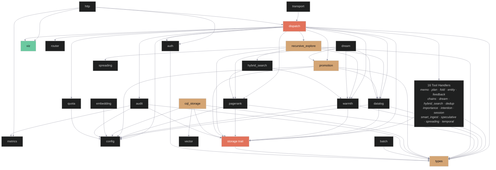

# Design Structure Matrix — ferrosa-memory-mcp

> Last updated: 2026-04-10
> Status: Full inventory plus shared-HTTP deployment review. The main new concern is not a new module but an overloaded deployment boundary around `main.rs`, `http`, and `viz`.

## Module Inventory

39 modules identified from `ferrosa-memory-core/src/lib.rs`:

### MCP Protocol Layer

| ID | Module | Type |
|----|--------|------|
| M1 | transport | JSON-RPC framing (stdio) |
| M2 | dispatch | Tool registry and dispatch |
| M3 | auth | Tenant authentication |
| M4 | router | SRLM-inspired strategy selection |
| M30 | http | HTTP/WebSocket server (Axum) |

### Tool Handlers

| ID | Module | Type |
|----|--------|------|
| M5 | memo | Memoization cache handlers |
| M6 | plan | Plan state handlers |
| M7 | fold | Trajectory fold handlers |
| M8 | entity | Entity store handlers |
| M9 | feedback | Feedback recording |
| M19 | chains | Memory chain traversal |
| M20 | dream | Offline consolidation (sleep/dream) |
| M21 | hybrid_search | Combined text + vector search |
| M24 | session | Session lifecycle management |
| M25 | smart_ingest | Auto-entity extraction on ingest |
| M27 | spreading | Spreading activation search |
| M28 | temporal | Temporal fact versioning |
| M17 | dedup | Duplicate entity detection |

### Cognitive / Scoring

| ID | Module | Type |
|----|--------|------|
| M22 | importance | Multi-channel importance scoring |
| M23 | intention | Prospective memory (intentions) |
| M26 | speculative | Speculative retrieval (co-access) |

### Inference & Cognitive

| ID | Module | Type |
|----|--------|------|
| M35 | datalog | Semi-naive Datalog evaluator |
| M36 | warmth | Persistent warmth field |
| M37 | pagerank | Personalized PageRank |
| M38 | recursive_explore | Recursive query exploration |
| M39 | promotion | Workload-driven materialization promotion |

### Infrastructure — Storage

| ID | Module | Type |
|----|--------|------|
| M10 | cql_storage | CQL storage client (cdrs-tokio) |
| M11 | graph | HTTP Cypher graph client |
| M29 | storage | Storage trait abstraction |
| M33 | vector | CQL VECTOR<float,N> codec |

### Infrastructure — Support

| ID | Module | Type |
|----|--------|------|
| M12 | compression | Rust-native compression |
| M13 | embedding | Ollama HTTP embedding client |
| M14 | metrics | Prometheus metrics |
| M15 | audit | Write audit log + anomaly detection |
| M16 | batch | Routing guideline refinement job |
| M18 | config | TOML configuration parsing |
| M31 | quota | Memory quota enforcement |
| M34 | viz | Visualization event bus + types |

### Shared Types

| ID | Module | Type |
|----|--------|------|
| M32 | types | Domain types (TenantContext, etc.) |

## Dependency Matrix

Reads as: row depends on column. `X` = direct dependency (from `use crate::` and `crate::` references in non-test code).

```
         M1  M2  M3  M4  M5  M6  M7  M8  M9  M10 M11 M12 M13 M14 M15 M16 M17 M18 M19 M20 M21 M22 M23 M24 M25 M26 M27 M28 M29 M30 M31 M32 M33 M34 M35 M36 M37 M38 M39
M1   .   .   .   .   .   .   .   .   .   .   .   .   .   .   .   .   .   .   .   .   .   .   .   .   .   .   .   .   .   .   .   .   .   .   .   .   .   .   .
M2   X   .   .   X   X   X   X   X   X   .   .   .   .   .   X   .   X   X   X   X   X   X   X   X   X   X   X   X   X   .   X   X   .   X   X   X   X   X   X
M3   .   .   .   .   .   .   .   .   .   .   .   .   .   .   .   .   .   .   .   .   .   .   .   .   .   .   .   .   .   .   .   X   .   .   .   .   .   .   .
M4   .   .   .   .   .   .   .   .   .   .   .   .   .   .   .   .   .   .   .   .   .   .   .   .   .   .   .   .   .   .   .   .   .   .   .   .   .   .   .
M5   .   .   .   .   .   .   .   .   .   .   .   .   .   .   .   .   .   .   .   .   .   .   .   .   .   .   .   .   X   .   .   X   .   .   .   .   .   .   .
M6   .   .   .   .   .   .   .   .   .   .   .   .   .   .   .   .   .   .   .   .   .   .   .   .   .   .   .   .   X   .   .   X   .   .   .   .   .   .   .
M7   .   .   .   .   .   .   .   .   .   .   .   .   .   .   .   .   .   .   .   .   .   .   .   .   .   .   .   .   X   .   .   X   .   .   .   .   .   .   .
M8   .   .   .   .   .   .   .   .   .   .   .   .   .   .   .   .   .   .   .   .   .   .   .   .   .   .   .   .   X   .   .   X   .   .   .   .   .   .   .
M9   .   .   .   .   .   .   .   .   .   .   .   .   .   .   .   .   .   .   .   .   .   .   .   .   .   .   .   .   X   .   .   X   .   .   .   .   .   .   .
M10  .   .   .   .   .   .   .   .   .   .   .   .   .   .   .   .   .   X   .   .   .   .   X   .   .   .   .   .   X   .   .   X   X   .   .   .   .   .   .
M11  .   .   .   .   .   .   .   .   .   .   .   .   .   .   .   .   .   .   .   .   .   .   .   .   .   .   .   .   .   .   .   .   .   .   .   .   .   .   .
M12  .   .   .   .   .   .   .   .   .   .   .   .   .   .   .   .   .   .   .   .   .   .   .   .   .   .   .   .   .   .   .   .   .   .   .   .   .   .   .
M13  .   .   .   .   .   .   .   .   .   .   .   .   .   .   .   .   .   X   .   .   .   .   .   .   .   .   .   .   .   .   .   .   .   .   .   .   .   .   .
M14  .   .   .   .   .   .   .   .   .   .   .   .   .   .   .   .   .   .   .   .   .   .   .   .   .   .   .   .   .   .   .   .   .   .   .   .   .   .   .
M15  .   .   .   .   .   .   .   .   .   .   .   .   .   X   .   .   .   X   .   .   .   .   .   .   .   .   .   .   X   .   .   X   .   .   .   .   .   .   .
M16  .   .   .   .   .   .   .   .   .   .   .   .   .   .   .   .   .   .   .   .   .   .   .   .   .   .   .   .   .   .   .   X   .   .   .   .   .   .   .
M17  .   .   .   .   .   .   .   .   .   .   .   .   .   .   .   .   .   .   .   .   .   .   .   .   .   .   .   .   X   .   .   X   .   .   .   .   .   .   .
M18  .   .   .   .   .   .   .   .   .   .   .   .   .   .   .   .   .   .   .   .   .   .   .   .   .   .   .   .   .   .   .   .   .   .   .   .   .   .   .
M19  .   .   .   .   .   .   .   .   .   .   .   .   .   .   .   .   .   .   .   .   .   .   .   .   .   .   .   .   X   .   .   X   .   .   .   .   .   .   .
M20  .   .   .   .   .   .   .   .   .   .   .   .   .   .   .   .   .   .   .   .   .   .   .   .   .   .   .   .   X   .   .   X   .   .   X   X   X   .   X
M21  .   .   .   .   .   .   .   .   .   .   .   .   .   .   .   .   .   .   .   .   .   .   .   .   .   .   .   .   X   .   .   X   .   .   .   X   X   .   .
M22  .   .   .   .   .   .   .   .   .   .   .   .   .   .   .   .   .   .   .   .   .   .   .   .   .   .   .   .   .   .   .   .   .   .   .   .   .   .   .
M23  .   .   .   .   .   .   .   .   .   .   .   .   .   .   .   .   .   .   .   .   .   .   .   .   .   .   .   .   .   .   .   .   .   .   .   .   .   .   .
M24  .   .   .   .   .   .   .   .   .   .   .   .   .   .   .   .   .   .   .   .   .   .   .   .   .   .   .   .   X   .   .   X   .   .   .   .   .   .   .
M25  .   .   .   .   .   .   .   .   .   .   .   .   .   .   .   .   .   .   .   .   .   .   .   .   .   .   .   .   X   .   .   X   .   .   .   .   .   .   .
M26  .   .   .   .   .   .   .   .   .   .   .   .   .   .   .   .   .   .   .   .   .   .   .   .   .   .   .   .   .   .   .   .   .   .   .   .   .   .   .
M27  .   .   .   .   .   .   .   .   .   .   .   .   .   .   .   .   .   .   .   .   .   .   .   .   .   .   .   .   X   .   .   X   .   .   .   .   .   .   .
M28  .   .   .   .   .   .   .   .   .   .   .   .   .   .   .   .   .   .   .   .   .   .   .   .   .   .   .   .   X   .   .   X   .   .   .   .   .   .   .
M29  .   .   .   .   .   .   .   .   .   .   .   .   .   .   .   .   .   .   .   .   .   .   .   .   .   .   .   .   .   .   .   X   .   .   .   .   .   .   .
M30  .   X   X   .   .   .   .   .   .   .   .   .   .   X   .   .   .   .   .   .   .   .   .   .   .   .   .   .   X   .   .   X   .   X   .   .   .   .   .
M31  .   .   .   .   .   .   .   .   .   .   .   .   .   .   .   .   .   X   .   .   .   .   .   .   .   .   .   .   .   .   .   .   .   .   .   .   .   .   .
M32  .   .   .   .   .   .   .   .   .   .   .   .   .   .   .   .   .   .   .   .   .   .   .   .   .   .   .   .   .   .   .   .   .   .   .   .   .   .   .
M33  .   .   .   .   .   .   .   .   .   .   .   .   .   .   .   .   .   .   .   .   .   .   .   .   .   .   .   .   .   .   .   .   .   .   .   .   .   .   .
M34  .   .   .   .   .   .   .   .   .   .   .   .   .   .   .   .   .   .   .   .   .   .   .   .   .   .   .   .   .   .   .   .   .   .   .   .   .   .   .
M35  .   .   .   .   .   .   .   .   .   .   .   .   .   .   .   .   .   X   .   .   .   .   .   .   .   .   .   .   X   .   .   X   .   .   .   .   .   .   .
M36  .   .   .   .   .   .   .   .   .   .   .   .   .   .   .   .   .   X   .   .   .   .   .   .   .   .   .   .   X   .   .   X   .   .   .   .   .   .   .
M37  .   .   .   .   .   .   .   .   .   .   .   .   .   .   .   .   .   X   .   .   .   .   .   .   .   .   .   .   X   .   .   X   .   .   .   .   .   .   .
M38  .   .   .   .   .   .   .   .   .   .   .   .   .   .   .   .   .   .   .   .   X   .   .   .   .   .   X   .   X   .   .   X   .   .   X   X   .   .   .
M39  .   .   .   .   .   .   .   .   .   .   .   .   .   .   .   .   .   X   .   .   .   .   .   .   .   .   .   .   X   .   .   X   .   .   X   .   .   .   .
```

## Dependency Graph



## Analysis

### Fan-In (modules that depend on this module)

| Module | Fan-In | Assessment |
|--------|--------|------------|
| types (M32) | 26 | **Critical** — nearly every module imports domain types |
| storage (M29) | 25 | **Critical** — the Storage trait is the universal abstraction |
| config (M18) | 8 | Normal (cql_storage, embedding, audit, quota, datalog, warmth, pagerank, promotion) |
| datalog (M35) | 4 | Normal (dispatch, dream, recursive_explore, promotion) |
| warmth (M36) | 4 | Normal (dispatch, dream, recursive_explore, hybrid_search) |
| pagerank (M37) | 3 | Normal (dispatch, dream, hybrid_search) |
| metrics (M14) | 2 | Low (audit, http) — most modules no longer import metrics directly |
| transport (M1) | 1 | Normal (dispatch reads constants) |
| dispatch (M2) | 2 | Normal (http, transport) |
| auth (M3) | 1 | Normal (http) |
| router (M4) | 1 | Normal (dispatch) |
| viz (M34) | 2 | Normal (dispatch, http) |
| intention (M23) | 2 | Normal (dispatch, cql_storage) |
| hybrid_search (M21) | 1 | Normal (recursive_explore) |
| spreading (M27) | 1 | Normal (recursive_explore) |
| vector (M33) | 1 | Normal (cql_storage only) |
| promotion (M39) | 2 | Normal (dispatch, dream) |
| recursive_explore (M38) | 1 | Normal (dispatch only) |
| All tool modules (M5-M9, M17, M19-M20, M24-M25, M28) | 1 each | Normal (only dispatch calls them) |
| importance (M22), speculative (M26) | 1 each | Normal (dispatch only) |
| graph (M11), compression (M12), batch (M16), quota (M31), session (M24) | 1 each | Normal |

### Fan-Out (modules this depends on)

| Module | Fan-Out | Assessment |
|--------|---------|------------|
| dispatch (M2) | 29 | **Extreme** — orchestrates every tool + infra + inference module |
| recursive_explore (M38) | 6 | **High** — orchestrates storage, types, datalog, warmth, hybrid_search, spreading |
| http (M30) | 6 | High — HTTP server wires up auth, dispatch, metrics, storage, types, viz |
| cql_storage (M10) | 5 | Moderate — config, intention, storage, types, vector |
| dream (M20) | 6 | Moderate — storage, types, datalog, warmth, pagerank, promotion |
| hybrid_search (M21) | 4 | Moderate — storage, types, warmth, pagerank |
| audit (M15) | 4 | Moderate — config, metrics, storage, types |
| promotion (M39) | 4 | Moderate — storage, types, config, datalog |
| datalog (M35) | 3 | Low — storage, types, config |
| warmth (M36) | 3 | Low — storage, types, config |
| pagerank (M37) | 3 | Low — storage, types, config |
| All remaining tool handlers | 2 each | Low — storage + types only |
| Leaf modules | 0 | graph, compression, importance, intention, speculative, vector, viz, types, config, metrics, router, transport |

### Dependency Cycles

**None detected.** The dependency graph remains a strict DAG:
- Leaf modules (no intra-crate deps): `graph` (M11), `compression` (M12), `metrics` (M14), `config` (M18), `importance` (M22), `intention` (M23), `speculative` (M26), `router` (M4), `transport` (M1), `types` (M32), `vector` (M33), `viz` (M34)
- Trait layer: `storage` -> `types`
- Infrastructure: `cql_storage` -> `config` + `intention` + `storage` + `types` + `vector`; `embedding` -> `config`; `audit` -> `config` + `metrics` + `storage` + `types`
- Inference layer: `datalog`, `warmth`, `pagerank` -> `storage` + `types` + `config`; `promotion` -> `storage` + `types` + `config` + `datalog`; `recursive_explore` -> `storage` + `types` + `datalog` + `warmth` + `hybrid_search` + `spreading`
- Tool layer: all tool modules -> `storage` + `types`; `dream` additionally -> `datalog` + `warmth` + `pagerank` + `promotion`; `hybrid_search` additionally -> `warmth` + `pagerank`
- Dispatch layer: `dispatch` -> everything
- Server layer: `http` -> `auth` + `dispatch` + `metrics` + `storage` + `types` + `viz`

### Propagation Cost

Propagation cost estimates how much of the system is affected by a change in one module.

| Module | Direct dependents | Transitive reach | Propagation % |
|--------|-------------------|-------------------|---------------|
| types (M32) | 26 | 38/39 modules | **97%** |
| storage (M29) | 25 | 37/39 modules | **95%** |
| config (M18) | 8 | 14/39 modules | 36% |
| datalog (M35) | 4 | 6/39 modules | 15% |
| warmth (M36) | 4 | 6/39 modules | 15% |
| promotion (M39) | 2 | 3/39 modules | 8% |
| pagerank (M37) | 3 | 5/39 modules | 13% |
| metrics (M14) | 2 | 4/39 modules | 10% |
| intention (M23) | 2 | 3/39 modules | 8% |
| hybrid_search (M21) | 1 | 2/39 modules | 5% |
| spreading (M27) | 1 | 2/39 modules | 5% |
| vector (M33) | 1 | 2/39 modules | 5% |
| viz (M34) | 2 | 3/39 modules | 8% |
| graph (M11) | 0 | 0/39 modules | 0% |

**System propagation cost: ~27%** (average across all modules)

This is healthy for a 39-module system. The high propagation for `types` and `storage` is expected and desirable — they are the shared vocabulary and abstraction boundary. Their interfaces should be treated as stable contracts.

Compared to the 34-module analysis (29%), the average propagation cost *decreased* slightly despite adding 5 new modules. The inference modules (`datalog`, `warmth`, `pagerank`) and the promotion pipeline (`promotion`) follow the established pattern of depending on the trait layer (`storage` + `types` + `config`) rather than on concrete implementations. The `recursive_explore` module is the only new module with high fan-out (6), which is addressed in Structural Concerns below.

### Structural Concerns

1. **`dispatch` fan-out (29) is the primary concern.** It grew from 24 to 29 dependencies as Sprint 5 inference modules and the B10 promotion pipeline were added. This is architecturally expected (it is the tool orchestrator), but the module is now large. Mitigation: dispatch should remain a thin routing layer — each arm should be a one-liner call into the corresponding tool module. If dispatch accumulates business logic, extract it.

2. **`types` (M32) is the most critical module at 97% propagation.** Any breaking change to a shared type ripples through nearly the entire system. Mitigation: keep types additive (new fields with defaults, new enum variants). Avoid removing or renaming existing type fields.

3. **`storage` (M29) trait at 95% propagation (was 91%).** The storage trait now has 25 direct dependents (was 19), reflecting Sprint 5's 15 new trait methods for warmth, rules, derived cache, provenance, and heat telemetry, plus B10's promotion and materialization methods. Adding a new method to the `Storage` trait requires updating both `CqlStorage` and `MockStorage`. Mitigation: use default method implementations for new trait methods where possible. The trait is the primary abstraction boundary and should evolve carefully.

4. **`recursive_explore` (M38) has high fan-out (6).** It depends on `storage`, `types`, `datalog`, `warmth`, `hybrid_search`, and `spreading`. This is acceptable because `recursive_explore` is an orchestration module (similar to `dispatch`) — it composes multiple subsystems to implement multi-pass recursive query resolution. Unlike `dispatch`, its fan-out is bounded by its specific purpose and unlikely to grow unbounded. Monitor for scope creep.

5. **`cql_storage` (M10) depends on `intention` (M23).** This is a mild inversion — a storage implementation importing domain-specific types for serialization. The dependency exists because `cql_storage` must serialize/deserialize `Intention` structs for CQL persistence. This is acceptable but worth monitoring; if more domain modules leak into `cql_storage`, consider moving serialization into the `storage` trait or `types` module.

6. **`metrics` fan-in dropped dramatically** (from 8 to 2). Most modules no longer import metrics directly. This is a positive architectural change — observability is now concentrated in `audit` and `http` rather than scattered across every module.

7. **Tool handler uniformity.** All 13 base tool handler modules (M5-M9, M17, M19, M24-M25, M27-M28) have identical dependency profiles: `storage` + `types` only. This is excellent — it means tool handlers are testable against `MockStorage` with no other infrastructure dependencies. The Sprint 5 modules (`dream`, `hybrid_search`) now have additional dependencies on inference modules, breaking this uniformity for those two handlers, but this is justified by their new responsibilities.

8. **`config` (M18) fan-in increased from 4 to 8.** The three inference modules (`datalog`, `warmth`, `pagerank`) and the promotion pipeline each depend on config for tuning parameters (`[rmh]`, `[datalog]`, and `[promotion]` sections). This is healthy — config is designed to be a shared foundation module, and the increase reflects proper externalization of tuning knobs.

### Module Clusters

The DSM reveals six natural clusters:

```
Cluster 1: MCP Protocol (M1, M2, M3, M30)
  - transport, dispatch, auth, http
  - dispatch is the hub; http is the alternative entry point to transport

Cluster 2: Tool Handlers (M4-M9, M17, M19-M21, M24-M25, M27-M28)
  - router + 13 tool modules
  - All depend only on storage trait + types (with dream and hybrid_search
    now additionally depending on inference modules)
  - Testable against MockStorage

Cluster 3: Cognitive Modules (M22, M23, M26)
  - importance, intention, speculative
  - Pure computation — no storage dependencies
  - Testable as pure functions

Cluster 4: Inference & Cognitive (M35, M36, M37, M38, M39)
  - datalog, warmth, pagerank, recursive_explore, promotion
  - Sprint 5 additions: Datalog inference engine, persistent warmth field,
    personalized PageRank, recursive query exploration
  - B10 addition: workload-driven promotion pipeline
  - datalog, warmth, pagerank, promotion depend on storage + types + config
  - promotion additionally depends on datalog for derived fact evaluation
  - recursive_explore orchestrates datalog + warmth + hybrid_search + spreading
  - Testable against MockStorage

Cluster 5: Infrastructure (M10, M11, M12, M13, M14, M33)
  - cql_storage, graph, compression, embedding, metrics, vector
  - Concrete implementations of storage and external I/O

Cluster 6: Shared Foundation (M15, M16, M18, M29, M31, M32, M34)
  - audit, batch, config, storage, quota, types, viz
  - Cross-cutting concerns used by multiple clusters
```

### Recommended Build Order

Based on dependency ordering (build leaves first):

```
Phase 1: Leaf modules (no intra-crate deps)
  types, config, metrics, compression, vector, router, transport,
  graph, importance, intention, speculative, viz

Phase 2: Trait layer
  storage (depends on types)

Phase 3: Infrastructure
  cql_storage (depends on config, intention, storage, types, vector)
  embedding (depends on config)
  audit (depends on config, metrics, storage, types)
  quota (depends on config)
  batch (depends on types)
  auth (depends on types)

Phase 4: Tool handlers + Inference engines
  memo, plan, fold, entity, feedback, chains, dedup,
  session, smart_ingest, spreading, temporal
  (all depend on storage + types)
  datalog, warmth, pagerank
  (depend on storage + types + config)

Phase 5: Inference orchestration + Enhanced tools
  promotion (depends on storage, types, config, datalog)
  hybrid_search (depends on storage, types, warmth, pagerank)
  recursive_explore (depends on storage, types, datalog, warmth,
    hybrid_search, spreading)
  dream (depends on storage, types, datalog, warmth, pagerank, promotion)

Phase 6: Orchestration
  dispatch (depends on nearly everything)
  http (depends on auth, dispatch, metrics, storage, types, viz)
```

## 2026-04-10 Deployment Notes

1. `crates/ferrosa-memory-mcp/src/main.rs` is now the highest-risk deployment hotspot. Git churn and bug-fix history both concentrate there because it owns transport selection, tenant defaults, viz startup, and the HTTP validator wiring.
2. Module coupling does not require an immediate viz crate split. The stronger requirement is deployment separation: `http` and `viz` may stay code-coupled, but they should not remain equally exposed surfaces in a shared service.
3. The recommended next refactor is to move shared-HTTP bootstrap rules into a dedicated deployment config path so auth/TLS/probe policy stops living as ad hoc wiring in `main.rs`.
