# Design Structure Matrix — ferrosa-memory-mcp

> Last updated: 2026-03-23
> Status: Full inventory — 34 modules (M1-M34), up from 14

## Module Inventory

34 modules identified from `ferrosa-core/src/lib.rs`:

### MCP Protocol Layer

| ID | Module | Type |
|----|--------|------|
| M1 | transport | JSON-RPC framing (stdio) |
| M2 | dispatch | Tool registry and dispatch |
| M3 | auth | Tenant authentication |
| M4 | router | SRLM-inspired strategy selection |
| M30 | http | HTTP/WebSocket server (Axum) |

### Tool Handlers

| ID | Module | Type |
|----|--------|------|
| M5 | memo | Memoization cache handlers |
| M6 | plan | Plan state handlers |
| M7 | fold | Trajectory fold handlers |
| M8 | entity | Entity store handlers |
| M9 | feedback | Feedback recording |
| M19 | chains | Memory chain traversal |
| M20 | dream | Offline consolidation (sleep/dream) |
| M21 | hybrid_search | Combined text + vector search |
| M24 | session | Session lifecycle management |
| M25 | smart_ingest | Auto-entity extraction on ingest |
| M27 | spreading | Spreading activation search |
| M28 | temporal | Temporal fact versioning |
| M17 | dedup | Duplicate entity detection |

### Cognitive / Scoring

| ID | Module | Type |
|----|--------|------|
| M22 | importance | Multi-channel importance scoring |
| M23 | intention | Prospective memory (intentions) |
| M26 | speculative | Speculative retrieval (co-access) |

### Infrastructure — Storage

| ID | Module | Type |
|----|--------|------|
| M10 | cql_storage | CQL storage client (cdrs-tokio) |
| M11 | graph | HTTP Cypher graph client |
| M29 | storage | Storage trait abstraction |
| M33 | vector | CQL VECTOR<float,N> codec |

### Infrastructure — Support

| ID | Module | Type |
|----|--------|------|
| M12 | compression | Rust-native compression |
| M13 | embedding | Ollama HTTP embedding client |
| M14 | metrics | Prometheus metrics |
| M15 | audit | Write audit log + anomaly detection |
| M16 | batch | Routing guideline refinement job |
| M18 | config | TOML configuration parsing |
| M31 | quota | Memory quota enforcement |
| M34 | viz | Visualization event bus + types |

### Shared Types

| ID | Module | Type |
|----|--------|------|
| M32 | types | Domain types (TenantContext, etc.) |

## Dependency Matrix

Reads as: row depends on column. `X` = direct dependency (from `use crate::` and `crate::` references in non-test code).

```
         M1  M2  M3  M4  M5  M6  M7  M8  M9  M10 M11 M12 M13 M14 M15 M16 M17 M18 M19 M20 M21 M22 M23 M24 M25 M26 M27 M28 M29 M30 M31 M32 M33 M34
M1   .   .   .   .   .   .   .   .   .   .   .   .   .   .   .   .   .   .   .   .   .   .   .   .   .   .   .   .   .   .   .   .   .   .
M2   X   .   .   X   X   X   X   X   X   .   .   .   .   .   X   .   X   X   X   X   X   X   X   X   X   X   X   X   X   .   X   X   .   X
M3   .   .   .   .   .   .   .   .   .   .   .   .   .   .   .   .   .   .   .   .   .   .   .   .   .   .   .   .   .   .   .   X   .   .
M4   .   .   .   .   .   .   .   .   .   .   .   .   .   .   .   .   .   .   .   .   .   .   .   .   .   .   .   .   .   .   .   .   .   .
M5   .   .   .   .   .   .   .   .   .   .   .   .   .   .   .   .   .   .   .   .   .   .   .   .   .   .   .   .   X   .   .   X   .   .
M6   .   .   .   .   .   .   .   .   .   .   .   .   .   .   .   .   .   .   .   .   .   .   .   .   .   .   .   .   X   .   .   X   .   .
M7   .   .   .   .   .   .   .   .   .   .   .   .   .   .   .   .   .   .   .   .   .   .   .   .   .   .   .   .   X   .   .   X   .   .
M8   .   .   .   .   .   .   .   .   .   .   .   .   .   .   .   .   .   .   .   .   .   .   .   .   .   .   .   .   X   .   .   X   .   .
M9   .   .   .   .   .   .   .   .   .   .   .   .   .   .   .   .   .   .   .   .   .   .   .   .   .   .   .   .   X   .   .   X   .   .
M10  .   .   .   .   .   .   .   .   .   .   .   .   .   .   .   .   .   X   .   .   .   .   X   .   .   .   .   .   X   .   .   X   X   .
M11  .   .   .   .   .   .   .   .   .   .   .   .   .   .   .   .   .   .   .   .   .   .   .   .   .   .   .   .   .   .   .   .   .   .
M12  .   .   .   .   .   .   .   .   .   .   .   .   .   .   .   .   .   .   .   .   .   .   .   .   .   .   .   .   .   .   .   .   .   .
M13  .   .   .   .   .   .   .   .   .   .   .   .   .   .   .   .   .   X   .   .   .   .   .   .   .   .   .   .   .   .   .   .   .   .
M14  .   .   .   .   .   .   .   .   .   .   .   .   .   .   .   .   .   .   .   .   .   .   .   .   .   .   .   .   .   .   .   .   .   .
M15  .   .   .   .   .   .   .   .   .   .   .   .   .   X   .   .   .   X   .   .   .   .   .   .   .   .   .   .   X   .   .   X   .   .
M16  .   .   .   .   .   .   .   .   .   .   .   .   .   .   .   .   .   .   .   .   .   .   .   .   .   .   .   .   .   .   .   X   .   .
M17  .   .   .   .   .   .   .   .   .   .   .   .   .   .   .   .   .   .   .   .   .   .   .   .   .   .   .   .   X   .   .   X   .   .
M18  .   .   .   .   .   .   .   .   .   .   .   .   .   .   .   .   .   .   .   .   .   .   .   .   .   .   .   .   .   .   .   .   .   .
M19  .   .   .   .   .   .   .   .   .   .   .   .   .   .   .   .   .   .   .   .   .   .   .   .   .   .   .   .   X   .   .   X   .   .
M20  .   .   .   .   .   .   .   .   .   .   .   .   .   .   .   .   .   .   .   .   .   .   .   .   .   .   .   .   X   .   .   X   .   .
M21  .   .   .   .   .   .   .   .   .   .   .   .   .   .   .   .   .   .   .   .   .   .   .   .   .   .   .   .   X   .   .   X   .   .
M22  .   .   .   .   .   .   .   .   .   .   .   .   .   .   .   .   .   .   .   .   .   .   .   .   .   .   .   .   .   .   .   .   .   .
M23  .   .   .   .   .   .   .   .   .   .   .   .   .   .   .   .   .   .   .   .   .   .   .   .   .   .   .   .   .   .   .   .   .   .
M24  .   .   .   .   .   .   .   .   .   .   .   .   .   .   .   .   .   .   .   .   .   .   .   .   .   .   .   .   X   .   .   X   .   .
M25  .   .   .   .   .   .   .   .   .   .   .   .   .   .   .   .   .   .   .   .   .   .   .   .   .   .   .   .   X   .   .   X   .   .
M26  .   .   .   .   .   .   .   .   .   .   .   .   .   .   .   .   .   .   .   .   .   .   .   .   .   .   .   .   .   .   .   .   .   .
M27  .   .   .   .   .   .   .   .   .   .   .   .   .   .   .   .   .   .   .   .   .   .   .   .   .   .   .   .   X   .   .   X   .   .
M28  .   .   .   .   .   .   .   .   .   .   .   .   .   .   .   .   .   .   .   .   .   .   .   .   .   .   .   .   X   .   .   X   .   .
M29  .   .   .   .   .   .   .   .   .   .   .   .   .   .   .   .   .   .   .   .   .   .   .   .   .   .   .   .   .   .   .   X   .   .
M30  .   X   X   .   .   .   .   .   .   .   .   .   .   X   .   .   .   .   .   .   .   .   .   .   .   .   .   .   X   .   .   X   .   X
M31  .   .   .   .   .   .   .   .   .   .   .   .   .   .   .   .   .   X   .   .   .   .   .   .   .   .   .   .   .   .   .   .   .   .
M32  .   .   .   .   .   .   .   .   .   .   .   .   .   .   .   .   .   .   .   .   .   .   .   .   .   .   .   .   .   .   .   .   .   .
M33  .   .   .   .   .   .   .   .   .   .   .   .   .   .   .   .   .   .   .   .   .   .   .   .   .   .   .   .   .   .   .   .   .   .
M34  .   .   .   .   .   .   .   .   .   .   .   .   .   .   .   .   .   .   .   .   .   .   .   .   .   .   .   .   .   .   .   .   .   .
```

## Dependency Graph

```mermaid
graph TD
    %% MCP Protocol Layer
    M1[transport] --> M2[dispatch]
    M30[http] --> M2
    M30 --> M3[auth]
    M30 --> M14[metrics]
    M30 --> M29[storage]
    M30 --> M32[types]
    M30 --> M34[viz]

    %% Dispatch — the mega-hub
    M2 --> M1
    M2 --> M3
    M2 --> M4[router]
    M2 --> M5[memo]
    M2 --> M6[plan]
    M2 --> M7[fold]
    M2 --> M8[entity]
    M2 --> M9[feedback]
    M2 --> M15[audit]
    M2 --> M17[dedup]
    M2 --> M18[config]
    M2 --> M19[chains]
    M2 --> M20[dream]
    M2 --> M21[hybrid_search]
    M2 --> M22[importance]
    M2 --> M23[intention]
    M2 --> M24[session]
    M2 --> M25[smart_ingest]
    M2 --> M26[speculative]
    M2 --> M27[spreading]
    M2 --> M28[temporal]
    M2 --> M29
    M2 --> M31[quota]
    M2 --> M32
    M2 --> M34

    %% Tool handlers -> storage trait + types
    M5 --> M29
    M5 --> M32
    M6 --> M29
    M6 --> M32
    M7 --> M29
    M7 --> M32
    M8 --> M29
    M8 --> M32
    M9 --> M29
    M9 --> M32
    M17 --> M29
    M17 --> M32
    M19 --> M29
    M19 --> M32
    M20 --> M29
    M20 --> M32
    M21 --> M29
    M21 --> M32
    M24 --> M29
    M24 --> M32
    M25 --> M29
    M25 --> M32
    M27 --> M29
    M27 --> M32
    M28 --> M29
    M28 --> M32

    %% Infrastructure
    M10[cql_storage] --> M18
    M10 --> M23
    M10 --> M29
    M10 --> M32
    M10 --> M33[vector]
    M13[embedding] --> M18
    M15 --> M14
    M15 --> M18
    M15 --> M29
    M15 --> M32
    M16[batch] --> M32
    M29 --> M32
    M31 --> M18
    M3 --> M32

    %% Style — high fan-in/fan-out nodes
    style M2 fill:#ff9999
    style M29 fill:#ff9999
    style M32 fill:#ffcc99
    style M10 fill:#ffcc99
    style M34 fill:#ccffcc
    style M11 fill:#ccffcc
    style M22 fill:#ccffcc
    style M23 fill:#ccffcc
    style M26 fill:#ccffcc
```



## Analysis

### Fan-In (modules that depend on this module)

| Module | Fan-In | Assessment |
|--------|--------|------------|
| types (M32) | 21 | **Critical** — nearly every module imports domain types |
| storage (M29) | 19 | **Critical** — the Storage trait is the universal abstraction |
| config (M18) | 4 | Normal (cql_storage, embedding, audit, quota) |
| metrics (M14) | 2 | Low (audit, http) — most modules no longer import metrics directly |
| transport (M1) | 1 | Normal (dispatch reads constants) |
| dispatch (M2) | 2 | Normal (http, transport) |
| auth (M3) | 1 | Normal (http) |
| router (M4) | 1 | Normal (dispatch) |
| viz (M34) | 2 | Normal (dispatch, http) |
| intention (M23) | 2 | Normal (dispatch, cql_storage) |
| vector (M33) | 1 | Normal (cql_storage only) |
| All tool modules (M5-M9, M17, M19-M21, M24-M25, M27-M28) | 1 each | Normal (only dispatch calls them) |
| importance (M22), speculative (M26) | 1 each | Normal (dispatch only) |
| graph (M11), compression (M12), batch (M16), quota (M31), session (M24) | 1 each | Normal |

### Fan-Out (modules this depends on)

| Module | Fan-Out | Assessment |
|--------|---------|------------|
| dispatch (M2) | 24 | **Extreme** — orchestrates every tool + infra module |
| http (M30) | 6 | High — HTTP server wires up auth, dispatch, metrics, storage, types, viz |
| cql_storage (M10) | 5 | Moderate — config, intention, storage, types, vector |
| audit (M15) | 4 | Moderate — config, metrics, storage, types |
| All tool handlers | 2 each | Low — storage + types only |
| Leaf modules | 0 | graph, compression, importance, intention, speculative, vector, viz, types, config, metrics, router, transport |

### Dependency Cycles

**None detected.** The dependency graph remains a strict DAG:
- Leaf modules (no intra-crate deps): `graph` (M11), `compression` (M12), `metrics` (M14), `config` (M18), `importance` (M22), `intention` (M23), `speculative` (M26), `router` (M4), `transport` (M1), `types` (M32), `vector` (M33), `viz` (M34)
- Trait layer: `storage` -> `types`
- Infrastructure: `cql_storage` -> `config` + `intention` + `storage` + `types` + `vector`; `embedding` -> `config`; `audit` -> `config` + `metrics` + `storage` + `types`
- Tool layer: all tool modules -> `storage` + `types`
- Dispatch layer: `dispatch` -> everything
- Server layer: `http` -> `auth` + `dispatch` + `metrics` + `storage` + `types` + `viz`

### Propagation Cost

Propagation cost estimates how much of the system is affected by a change in one module.

| Module | Direct dependents | Transitive reach | Propagation % |
|--------|-------------------|-------------------|---------------|
| types (M32) | 21 | 33/34 modules | **97%** |
| storage (M29) | 19 | 31/34 modules | **91%** |
| config (M18) | 4 | 8/34 modules | 24% |
| metrics (M14) | 2 | 4/34 modules | 12% |
| intention (M23) | 2 | 3/34 modules | 9% |
| vector (M33) | 1 | 2/34 modules | 6% |
| viz (M34) | 2 | 3/34 modules | 9% |
| graph (M11) | 0 | 0/34 modules | 0% |

**System propagation cost: ~29%** (average across all modules)

This is healthy for a 34-module system. The high propagation for `types` and `storage` is expected and desirable — they are the shared vocabulary and abstraction boundary. Their interfaces should be treated as stable contracts.

Compared to the 14-module analysis (37%), the average propagation cost *decreased* despite more than doubling the module count. This reflects good architecture: new modules depend on the trait layer (`storage` + `types`) rather than on concrete implementations.

### Structural Concerns

1. **`dispatch` fan-out (24) is the primary concern.** It grew from 7 to 24 dependencies as new tools were added. This is architecturally expected (it is the tool orchestrator), but the module is now large. Mitigation: dispatch should remain a thin routing layer — each arm should be a one-liner call into the corresponding tool module. If dispatch accumulates business logic, extract it.

2. **`types` (M32) is the most critical module at 97% propagation.** Any breaking change to a shared type ripples through nearly the entire system. Mitigation: keep types additive (new fields with defaults, new enum variants). Avoid removing or renaming existing type fields.

3. **`storage` (M29) trait at 91% propagation.** Adding a new method to the `Storage` trait requires updating both `CqlStorage` and `MockStorage`. Mitigation: use default method implementations for new trait methods where possible. The trait is the primary abstraction boundary and should evolve carefully.

4. **`cql_storage` (M10) depends on `intention` (M23).** This is a mild inversion — a storage implementation importing domain-specific types for serialization. The dependency exists because `cql_storage` must serialize/deserialize `Intention` structs for CQL persistence. This is acceptable but worth monitoring; if more domain modules leak into `cql_storage`, consider moving serialization into the `storage` trait or `types` module.

5. **`metrics` fan-in dropped dramatically** (from 8 to 2). Most modules no longer import metrics directly. This is a positive architectural change — observability is now concentrated in `audit` and `http` rather than scattered across every module.

6. **Tool handler uniformity.** All 13 tool handler modules (M5-M9, M17, M19-M21, M24-M25, M27-M28) have identical dependency profiles: `storage` + `types` only. This is excellent — it means tool handlers are testable against `MockStorage` with no other infrastructure dependencies.

### Module Clusters

The DSM reveals five natural clusters:

```
Cluster 1: MCP Protocol (M1, M2, M3, M30)
  - transport, dispatch, auth, http
  - dispatch is the hub; http is the alternative entry point to transport

Cluster 2: Tool Handlers (M4-M9, M17, M19-M21, M24-M25, M27-M28)
  - router + 13 tool modules
  - All depend only on storage trait + types
  - Testable against MockStorage

Cluster 3: Cognitive Modules (M22, M23, M26)
  - importance, intention, speculative
  - Pure computation — no storage dependencies
  - Testable as pure functions

Cluster 4: Infrastructure (M10, M11, M12, M13, M14, M33)
  - cql_storage, graph, compression, embedding, metrics, vector
  - Concrete implementations of storage and external I/O

Cluster 5: Shared Foundation (M15, M16, M18, M29, M31, M32, M34)
  - audit, batch, config, storage, quota, types, viz
  - Cross-cutting concerns used by multiple clusters
```

### Recommended Build Order

Based on dependency ordering (build leaves first):

```
Phase 1: Leaf modules (no intra-crate deps)
  types, config, metrics, compression, vector, router, transport,
  graph, importance, intention, speculative, viz

Phase 2: Trait layer
  storage (depends on types)

Phase 3: Infrastructure
  cql_storage (depends on config, intention, storage, types, vector)
  embedding (depends on config)
  audit (depends on config, metrics, storage, types)
  quota (depends on config)
  batch (depends on types)
  auth (depends on types)

Phase 4: Tool handlers
  memo, plan, fold, entity, feedback, chains, dedup, dream,
  hybrid_search, session, smart_ingest, spreading, temporal
  (all depend on storage + types)

Phase 5: Orchestration
  dispatch (depends on nearly everything)
  http (depends on auth, dispatch, metrics, storage, types, viz)
```
