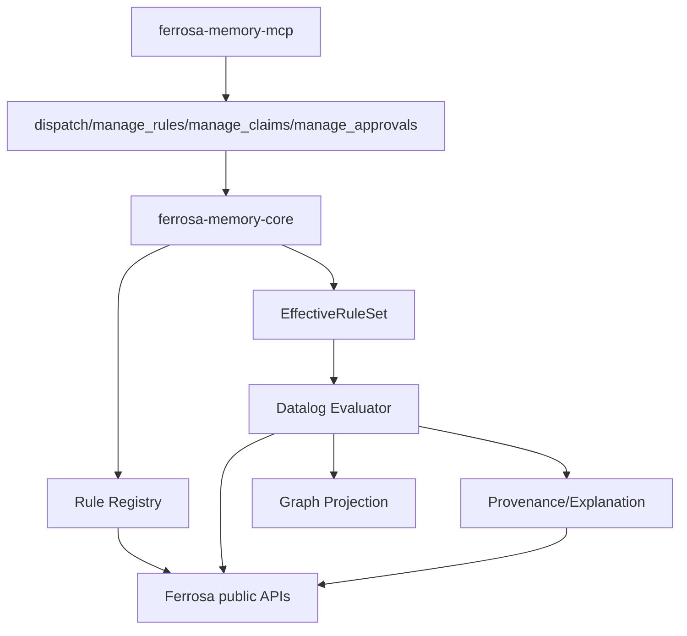
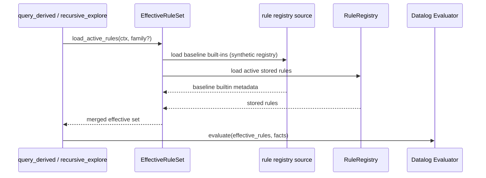

# Expert System Knowledge Plane

> Last updated: 2026-04-20
> Status: Backend Converged; Operator Surface In Progress; graph-boundary and query-passthrough refactor required

## Overview

This spec covers the ferrosa-memory side of human-in-the-loop expert-system development.

Per [ADR-005](./decisions/adr-005-endpoint-only-ferrosa-client.md), the serving path should use Ferrosa at the right abstraction level. Direct CQL for app-owned tables is acceptable; direct graph-table mutation and local operator-query emulation are not. The current graph-table coupling and local query interpretation remain transition-state debt.

From a DSM perspective, this belongs in ferrosa-memory because it is primarily about:

- rule registry and effective rule loading
- claim, approval, and alias storage
- Datalog evaluation and derived facts
- provenance and explanation queries
- and the symbolic knowledge model shared across sessions

The Foundry-side workflow, UI, approvals, and context injection live in `../../foundry/specs/expert-system-workbench.md`.

## DSM Placement

The ferrosa-memory DSM is now decisive:

- `ferrosa-memory-core` is the stable foundation with fan-in from MCP and batch layers
- `ferrosa-memory-mcp` is the transport and tool surface
- `ferrosa-memory-batch` and `ferrosa-memory-sync` are secondary consumers

That means the expert-system rule base, claim model, approval storage, derived-fact explanations, and effective-rule-set logic live in `ferrosa-memory-core`, with MCP exposure in `ferrosa-memory-mcp`. Their graph-facing behavior should route through Ferrosa graph/public interfaces, and their operator query surfaces should be passthroughs rather than local emulators.

## Current Rule State

The rule engine now converges through one effective path:

- **stored rules** in `rules_by_id` and `rules_by_family`
- **synthetic built-ins** synthesized into registry form

Evidence of convergence:

- storage tables: [ddl/012_datalog_rules.cql](../ddl/012_datalog_rules.cql)
- MCP CRUD tool: [crates/ferrosa-memory-core/src/dispatch.rs](../crates/ferrosa-memory-core/src/dispatch.rs:3370)
- shared rule load helper in [crates/ferrosa-memory-core/src/datalog.rs](../crates/ferrosa-memory-core/src/datalog.rs:433)
- convergence entry points:
  - [crates/ferrosa-memory-core/src/dispatch.rs](../crates/ferrosa-memory-core/src/dispatch.rs:3370)
  - [crates/ferrosa-memory-core/src/recursive_explore.rs](../crates/ferrosa-memory-core/src/recursive_explore.rs:148)
  - [crates/ferrosa-memory-core/src/promotion.rs](../crates/ferrosa-memory-core/src/promotion.rs:60)
  - [crates/ferrosa-memory-core/src/dispatch.rs: get_effective_rule_set](../crates/ferrosa-memory-core/src/dispatch.rs)

### Architectural conclusion

ferrosa-memory now follows an **effective rule set** model where **all active rules are loaded through one Ferrosa-backed path**:

1. built-in defaults land as synthetic registry entries
2. active stored rules and synthetic built-ins are loaded through one registry path
3. one merged active rule set is used uniformly by inference paths

## Component Diagram

## Core Components

### 1. `RuleRegistry`

- **Purpose**: durable storage of rule versions and states
- **Backed by** Ferrosa rule-registry storage exposed through public interfaces
- **Responsibilities**:
  - hold synthetic built-in registry rows and stored rules
  - store rule versions
  - deprecate rules
  - list active rules by family
  - expose full metadata, not just rule body

### 2. `EffectiveRuleSet`

- **Purpose**: unify synthetic built-in rules and stored active rules into one runtime set
- **Responsibilities**:
  - load synthetic built-in registry rules
  - load active stored rules
  - merge them into a stable evaluation set
  - attach provenance source:
    - `builtin`
    - `registry`
  - expose loaded-rule diagnostics
  - gate default runtime on approved state while leaving review surfaces intact

### 3. `ClaimStore`

- **Purpose**: symbolic claim persistence for human-reviewable recommendations and decisions, surfaced through Ferrosa public interfaces rather than direct serving-path table ownership
- **Responsibilities**:
  - create and list proposed/approved/rejected claims
  - attach provenance, scope, and status transitions
  - keep claim state available for runtime loaders
  - support workspace/session/global scoping

Suggested claim fields:

- `claim_id`
- `claim_text`
- `domain`
- `status`
- `confidence`
- `source_ref`
- `workspace_scope`
- `support_count`

### 4. `ApprovalStore`

- **Purpose**: durable record of human approvals and rejections, with runtime access mediated through Ferrosa public interfaces
- **Responsibilities**:
  - persist operator decisions on claims, rules, aliases, and skills
  - attach scope and reviewer metadata
  - support audit and replay from authoritative approval writes
  - dual-write by design: authoritative append-only log plus entity/graph mirror

Suggested approval fields:

- `artifact_kind`
- `artifact_ref`
- `decision`
- `review_note`
- `reviewer`
- `scope`
- `workspace_scope`
- `session_scope`

### 5. `AliasStore`

- **Purpose**: durable alias mappings for tool-call correction, with exact lookup behavior sourced from Ferrosa-backed public contracts
- **Responsibilities**:
  - store canonical tool mappings
  - store argument remaps
  - store fixed args and templates
  - support exact scoped lookup in execution path
  - optionally project aliases through semantic mirror for browsing

Suggested alias fields:

- `alias_name`
- `canonical_tool`
- `parameter_map`
- `fixed_arguments`
- `args_templates`
- `status`
- `scope`

### 6. `Provenance/Explanation`

- **Purpose**: explain why a derived fact or recommendation exists
- **Responsibilities**:
  - expose support chain for a derived fact
  - show which rule and which base facts produced it
  - distinguish built-in-rule vs stored-rule provenance
  - explain approvals and supersession

This should be queryable from MCP, not just internal.

## MCP Tool Surface

Current and planned MCP surfaces should be:

### Existing

- `manage_rules`
- `query_derived`
- `recursive_explore`
- `manage_claims`
- `manage_approvals`
- `manage_aliases`
- `explain_derived`
- `get_effective_rule_set`

### Proposed

`approve_draft_claim`, `approval_history`, and `approval_impact` helper queries are still planned as follow-up surface extensions once operator UI work is fully synchronized.

## Operator UI Surface

Backend governance endpoints are now available; UI composition remains in-progress.

This should not stop at the existing graph viz page.

The operator-facing UI should become an integrated workbench rooted above viz with at least these primary modes:

1. **Home / Overview** — system status, recent changes, and linked investigation entry points
2. **Viz** — graph-oriented exploration and live updates
3. **CQL Explorer** — authenticated passthrough to Ferrosa's public CQL interface for operators
4. **SPARQL Explorer** — authenticated passthrough to Ferrosa's public SPARQL interface for graph/RDF-oriented inspection
5. **Datalog Explorer** — ferrosa-memory-owned derived-fact explorer with provenance over Ferrosa-backed graph/app data
6. **Rules Manager** — browse synthetic built-ins, stored rules, and effective rules; review activation state
7. **Approvals / Explanations** — review decisions and inspect why derived facts or recommendations exist

### UI design implications

- Viz becomes one mode inside the workbench, not the whole app.
- The CQL and Datalog interfaces are complementary:
  - CQL answers "what rows exist?" through Ferrosa's public CQL contract
  - Datalog answers "what can be derived?" through ferrosa-memory's local inference layer
- Rules management should be grounded in the effective rule set, not only raw stored rules.
- The workbench should share navigation, scope filters, and artifact drill-down across views.
- The console should live behind the same operator auth boundary as any reviewer-facing approval tooling.

## Data Model

### Rule storage

Keep the existing tables:

- `rules_by_id`
- `rules_by_family`

Keep the effective-rule loader in core; additional registry tables were deferred to avoid surface churn.

### Claim storage

Use entity-backed claims with typed scope edges as the default.

This is implemented as entity-backed claims plus typed edges in the current code path.

### Approval storage

Approvals are implemented as:

- authoritative append-only approval table
- entity/graph mirror for browsing and context retrieval

### Alias storage

Alias mappings now follow this pattern:

- exact runtime lookup storage (authoritative)
- optional mirror path for semantic browsing and operator query tooling

## Effective Rule Set Loading

Runtime paths now use the same merged effective-rule source; direct built-in-only loading is no longer the default path.

## Derived Fact Visibility

Derived facts should remain visible as first-class query outputs, including:

- predicate
- src/dst ids
- confidence
- rule id
- support count
- provenance chain
- whether the generating rule was built-in or stored

This is necessary for the Foundry workbench to show the current derived knowledge state while workbench UIs themselves are still being finished.

## Primary Workstreams

### Workstream 1: Effective rule set

Deliver:

- [Implemented] merge built-in and stored rules
- [Implemented] replace direct `builtin_rules()` runtime calls in key runtime entry points (`manage_rules`, `query_derived`, `recursive_explore`, `promotion`, `dream`)
- [Implemented] expose active loaded rule set through MCP (`get_effective_rule_set`, `manage_rules`)

### Workstream 2: Claim and approval model

Deliver:

- [Implemented] first-class `claim` and `approval` storage patterns
- [Implemented] scoped approval metadata
- [Implemented] query surfaces for proposed vs approved artifacts

### Workstream 3: Alias persistence

Deliver:

- [Implemented] durable exact `tool_alias` storage
- [Implemented] exact lookup path in execution flow
- [Implemented] semantic browsing path where present

### Workstream 4: Explanation API

Deliver:

- [Implemented] explanation queries for derived facts and rule provenance (`explain_derived`)
- [Implemented] MCP tool support for explanation/query tools

## Design Decisions

### Decision 1: Core owns the knowledge plane

The symbolic artifact model belongs in `ferrosa-memory-core`, not the MCP layer.

### Decision 2: Built-ins stay, but stop being special at evaluation time

Built-in rules should remain as baseline defaults, but runtime evaluation should use the merged effective rule set.

### Decision 3: Explanation is part of the data model

Derived facts without explanation support are not sufficient for a human-in-the-loop expert system.

### Decision 4: UI surface is implementation-phased

Backend convergence is complete for symbolic governance and rule loading. The integrated operator workbench remains the remaining explicit in-flight scope.

## Resolved Blueprint Assumptions

For blueprint completion, the following choices are now fixed by [adr-004-expert-system-knowledge-plane-defaults.md](decisions/adr-004-expert-system-knowledge-plane-defaults.md):

- built-in rules are mirrored into the registry as **synthetic registry entries**
- claims remain **entity-backed initially**
- approvals are **dual-written**: append-only table plus entity/graph mirror
- explanations use **bounded on-demand reconstruction first**, and explanation statistics are collected from day one
- the operator UI is an **integrated workbench rooted above viz** (API surfaces now available at `/` and `/workbench/api/*`; remaining work is deeper UI coverage and remaining governance views)

## Related Specs

- [datalog-materialization.md](datalog-materialization.md)
- [project-plan.md](project-plan.md)
- [../../foundry/specs/expert-system-workbench.md](../../foundry/specs/expert-system-workbench.md)
