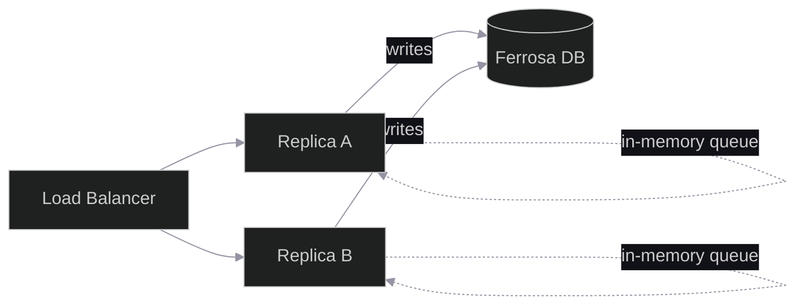
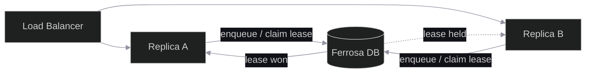
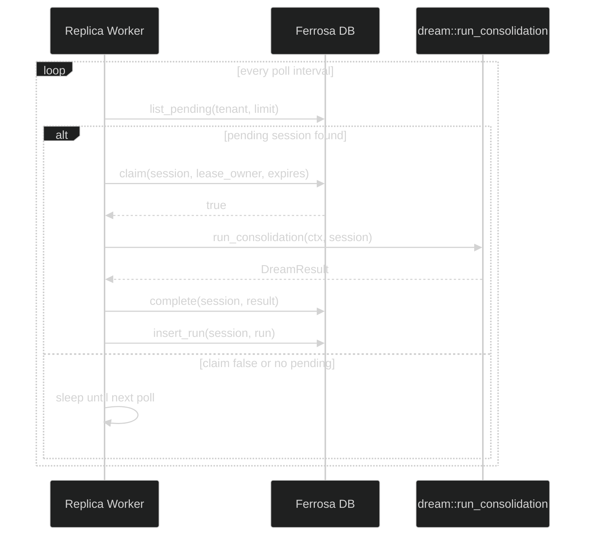

# Cross-Replica Consolidation Coordination

## Problem

When `ferrosa-memory` runs as multiple replicas serving the same tenant, each
replica independently queues and runs consolidation for the same `(tenant,
session)`. This produces duplicate `dream` runs and makes `replicaCount > 1`
unsafe. See
[ferrosadb/ferrosa-memory#130](https://github.com/ferrosadb/ferrosa-memory/issues/130).

## Goal

Exactly one replica consolidates a given `(tenant, session)` at a time, using
the shared HA database as the coordination plane.

## Non-Goals

- Replace the Ferrosa DB cluster or introduce a separate coordination service.
- Change the semantic output of `dream` consolidation.
- Make consolidation synchronous or blocking for the caller.

## Current State



Each replica:

1. Sets `dirty = true` on write tools.
2. On the idle timer tick, drains `consolidation_queue` and calls
   `run_idle_consolidation`.
3. Runs `dream::run_consolidation(storage, ctx, session_id)`.
4. Records status in `last_consolidation_status`.

Deduplication is per-process only.

## Proposed State



1. Write path upserts a durable request row in the queue table keyed by
   `(tenant_id, session_id)`.
2. Each replica runs a lightweight poll loop.
3. Poll loop uses an LWT `UPDATE ... IF lease_owner = NULL` to claim a
   pending row.
4. Winner runs consolidation, renews the lease while running, and marks the
   row completed.
5. Losers skip and poll again.

## Schema Additions

Migration `049_consolidation_lease_queue.cql`:

```cql
CREATE TABLE IF NOT EXISTS agent_memory.consolidation_requests (
    tenant_id uuid,
    session_id uuid,
    state text,
    requested_at timestamp,
    lease_owner text,
    lease_expires_at timestamp,
    attempt_count int,
    last_error text,
    completed_at timestamp,
    PRIMARY KEY ((tenant_id, session_id))
);

CREATE INDEX IF NOT EXISTS agent_memory.consolidation_requests_state_idx
    ON agent_memory.consolidation_requests (state);

CREATE TABLE IF NOT EXISTS agent_memory.consolidation_runs (
    tenant_id uuid,
    session_id uuid,
    run_id timeuuid,
    lease_owner text,
    started_at timestamp,
    finished_at timestamp,
    status text,
    entities_processed int,
    connections_created int,
    error text,
    PRIMARY KEY ((tenant_id, session_id), run_id)
) WITH CLUSTERING ORDER BY (run_id DESC);
```

Notes:

- `consolidation_requests` holds the single active coordination row per session.
- `state` values: `pending`, `leased`, `completed`, `failed`.
- The global secondary index on `state` lets replicas find pending work.
- `consolidation_runs` is an append-only audit log; retention is handled by
  `stale_edge_max_days`-style TTL or a future janitor.

## Storage Trait Additions

Add to `crates/ferrosa-memory-core/src/storage.rs`:

```rust
fn consolidation_request_upsert(
    &self,
    ctx: &TenantContext,
    session_id: Uuid,
) -> impl Future<Output = anyhow::Result<()>> + Send;

fn consolidation_request_claim(
    &self,
    ctx: &TenantContext,
    session_id: Uuid,
    lease_owner: &str,
    lease_expires_at: DateTime<Utc>,
) -> impl Future<Output = anyhow::Result<bool>> + Send;

fn consolidation_request_renew(
    &self,
    ctx: &TenantContext,
    session_id: Uuid,
    lease_owner: &str,
    lease_expires_at: DateTime<Utc>,
) -> impl Future<Output = anyhow::Result<bool>> + Send;

fn consolidation_request_complete(
    &self,
    ctx: &TenantContext,
    session_id: Uuid,
    lease_owner: &str,
    result: ConsolidationResult,
) -> impl Future<Output = anyhow::Result<()>> + Send;

fn consolidation_request_list_pending(
    &self,
    ctx: &TenantContext,
    limit: usize,
) -> impl Future<Output = anyhow::Result<Vec<Uuid>>> + Send;

fn consolidation_run_insert(
    &self,
    ctx: &TenantContext,
    session_id: Uuid,
    run: ConsolidationRun,
) -> impl Future<Output = anyhow::Result<()>> + Send;
```

`ConsolidationResult` and `ConsolidationRun` reuse the existing
`ConsolidationRunStatus` fields plus `lease_owner`.

## Worker Flow



Worker responsibilities:

1. Poll the queue at `consolidation_poll_seconds` (default 5).
2. For each pending session, attempt to claim with LWT.
3. If claim succeeds, run consolidation and renew the lease periodically if
   it runs longer than half the TTL.
4. On success, mark `completed` and insert a run row.
5. On failure, mark `failed`, increment `attempt_count`, and let the row be
   reclaimed after a backoff.
6. Clean up completed rows older than a retention window (initially 24 h).

## Dispatch Changes

In `crates/ferrosa-memory-mcp/src/main.rs`:

1. Replace `idle_consolidation_loop` with `consolidation_worker_loop`.
2. Remove `consolidation_queue`, `dirty`, and `last_consolidation_status` from
   `SessionState`.
3. In `queue_session_for_consolidation`, upsert a `consolidation_requests`
   row instead of pushing to the in-memory queue.
4. Keep a per-process `last_activity` notify only for metrics or future use;
   it no longer gates consolidation.
5. Spawn one worker per configured tenant (or a single worker that iterates
   all tenants it has contexts for).

## Configuration

New `[consolidation]` section:

```toml
[consolidation]
enabled = true
poll_seconds = 5
lease_ttl_seconds = 30
lease_renew_seconds = 15
max_attempts = 3
retry_base_seconds = 5
retention_hours = 24
```

Existing `server.idle_consolidation_*` keys are deprecated and mapped to the
new section for one migration cycle.

## Deployment

- Helm chart can keep `replicaCount: 1` as the default for existing single-replica
  tenants until the operator validates multi-replica behavior.
- Once shipped, `replicaCount > 1` becomes safe.
- Documentation note from issue 130 is added immediately and removed once the
  feature is verified.

## Acceptance Criteria

1. Two replicas behind a load balancer for the same tenant consolidate a
   session only once per dirty cycle.
2. A crashing winner releases the lease after TTL and a surviving replica
   picks up the session.
3. Operator can query `get_stats` to see the latest run per session.
4. MockStorage implements the new trait methods and unit tests pass.
5. Migration 049 applies cleanly and is reversible by restore from backup.
6. CI adds a multi-replica integration test.
