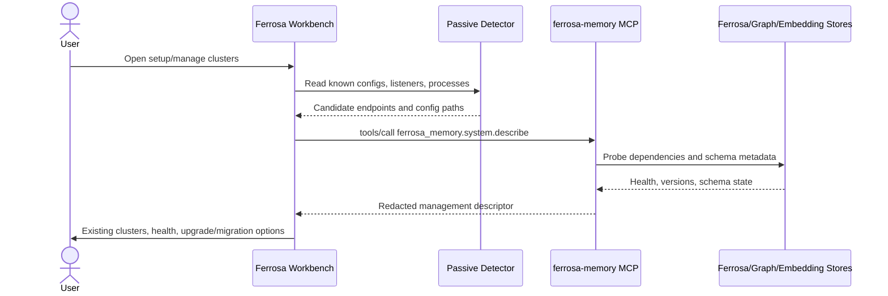

# Ferrosa Memory Management Introspection Tool

> Last updated: 2026-06-10
> Status: Server side implemented (ferrosa-memory). Workbench side pending.

## Overview

Ferrosa Workbench needs a reliable way to discover and manage existing `ferrosa-memory` clusters without guessing from config files, process tables, or listener ports. Passive discovery remains useful for first contact and older versions, but a running memory server should expose a first-class MCP tool that reports the complete, redacted, management-safe description of itself.

This spec defines a `ferrosa_memory.system.describe` MCP tool. Workbench will call it after it discovers or is pointed at a memory endpoint. The response becomes the authoritative source for cluster identity, runtime health, configuration, schema drift, compatible upgrade path, attached stores, installed agent harness endpoints, and allowed management actions.

## Diagram



## User Requirements

| ID | Requirement |
| --- | --- |
| URS-FMINT-001 | Workbench shall detect a running `ferrosa-memory` cluster as the first setup/manage experience before prompting to create another cluster. |
| URS-FMINT-002 | Workbench shall use a server-provided self-description when available instead of inferring tenant/session/runtime state from local files. |
| URS-FMINT-003 | The self-description shall contain enough information to inspect, query, upgrade, migrate, alias, and health-check the cluster, but shall not expose secrets. |
| URS-FMINT-004 | The self-description shall distinguish identity, runtime, storage dependencies, schema state, binary/release state, configured agent harnesses, and allowed management actions. |
| URS-FMINT-005 | Workbench shall require explicit user confirmation before any mutation suggested by the descriptor, including binary upgrade, schema migration, config rewrite, or standard-install migration. |

## Functional Specification

### MCP Tool

- **Tool name**: `ferrosa_memory.system.describe`
- **Transport**: existing `ferrosa-memory` MCP transports, including HTTP and stdio.
- **Mutation**: read-only.
- **Auth**: same authentication policy as other management-sensitive memory tools.
- **Idempotence**: repeated calls must not alter runtime, schema, or config.

### Request

```json
{
  "include": [
    "identity",
    "runtime",
    "configuration",
    "stores",
    "schema",
    "binaries",
    "harnesses",
    "capabilities",
    "managementActions"
  ],
  "redaction": "management-safe",
  "caller": {
    "name": "ferrosa-workbench",
    "version": "0.1.0"
  }
}
```

`include` is optional. If omitted, the server returns all sections. `redaction` defaults to `management-safe`; the first version does not need an unredacted mode.

### Response Contract

```json
{
  "contract": "ferrosa-memory.system.describe.v1",
  "server": {
    "name": "ferrosa-memory",
    "binary": "ferrosa-memory-mcp",
    "version": "0.12.0",
    "commit": "abc1234",
    "channel": "stable",
    "startedAt": "2026-06-10T12:00:00Z",
    "pid": 13432
  },
  "identity": {
    "clusterId": "tenant:session:http:18765:agent_memory",
    "tenantId": "9a5f8fbf-d842-4d30-8ea5-1aa931e618a8",
    "sessionId": "00000000-0000-0000-0000-000000000000",
    "alias": null,
    "configPath": "/Users/bkearns/.config/ferrosa-memory.toml",
    "configHash": "sha256:...",
    "installKind": "custom"
  },
  "runtime": {
    "transport": "http",
    "endpointUrl": "http://127.0.0.1:18765",
    "requireTls": false,
    "health": "ready",
    "readiness": "ready",
    "liveness": "live",
    "vizUrl": "http://127.0.0.1:18766",
    "errors": []
  },
  "configuration": {
    "effectiveConfig": {
      "server.httpPort": 18765,
      "server.requireTls": false,
      "ferrosa.keyspace": "agent_memory",
      "embeddings.provider": "ollama",
      "embeddings.model": "nomic-embed-text-v2-moe",
      "embeddings.dimensions": 768,
      "graph.boltUri": "bolt://localhost:17687",
      "viz.enabled": true,
      "viz.port": 18766
    },
    "redactedKeys": [
      "client.http_password",
      "graph.password"
    ]
  },
  "stores": {
    "ferrosa": {
      "contactPoints": ["localhost:19042", "localhost:19043", "localhost:19044"],
      "keyspace": "agent_memory",
      "health": "ready",
      "schemaVersion": "2026.06.10"
    },
    "graph": {
      "uri": "bolt://localhost:17687",
      "health": "ready",
      "schemaVersion": "2026.06.10"
    },
    "embeddings": {
      "provider": "ollama",
      "baseUrl": "http://127.0.0.1:11434",
      "model": "nomic-embed-text-v2-moe",
      "dimensions": 768,
      "health": "ready"
    }
  },
  "schema": {
    "currentVersion": "2026.06.10",
    "expectedVersion": "2026.06.10",
    "drift": "none",
    "pendingMigrations": [],
    "requiresBackupBeforeMigration": true
  },
  "binaries": {
    "currentVersion": "0.12.0",
    "latestStable": "0.12.0",
    "latestNightly": "0.13.0-nightly.20260610",
    "upgradeState": "current",
    "supportedUpgradeChannels": ["stable", "nightly", "semver"]
  },
  "harnesses": [
    {
      "name": "codex",
      "configured": true,
      "configPath": "/Users/bkearns/.codex/config.toml",
      "serverName": "ferrosa-memory",
      "endpointUrl": "http://127.0.0.1:18765"
    }
  ],
  "capabilities": {
    "tools": [
      "memory.search",
      "memory.ingest",
      "memory.link",
      "memory.consolidate",
      "ferrosa_memory.system.describe"
    ],
    "features": [
      "dikw-tags",
      "claim-nodes",
      "semantic-search",
      "datalog-query"
    ]
  },
  "managementActions": [
    {
      "id": "inspect-read-only",
      "label": "Inspect cluster",
      "mutation": false,
      "requiresConfirmation": false
    },
    {
      "id": "upgrade-binary",
      "label": "Upgrade ferrosa-memory binary",
      "mutation": true,
      "requiresConfirmation": true,
      "preconditions": ["backup-current-binary", "compatible-schema"]
    },
    {
      "id": "migrate-schema",
      "label": "Apply schema migrations",
      "mutation": true,
      "requiresConfirmation": true,
      "preconditions": ["backup-data", "binary-current"]
    },
    {
      "id": "migrate-standard-install",
      "label": "Migrate config to Workbench standard install",
      "mutation": true,
      "requiresConfirmation": true,
      "preconditions": ["write-preview-approved"]
    }
  ],
  "warnings": []
}
```

## Configuration And Design Specification

### Server Responsibilities

- Load the effective runtime configuration from the same source the server actually used at startup.
- Preserve the original config path if known; if config came from environment or generated runtime state, report that explicitly.
- Redact all secret values and report secret presence through `redactedKeys`.
- Probe dependent stores with bounded timeouts and return degraded health instead of hanging.
- Report schema version and drift from actual database metadata, not from binary defaults alone.
- Report compatible upgrade channels without downloading or applying anything.
- Report management actions as recommendations only; Workbench owns confirmation and orchestration.

### Workbench Responsibilities

- Continue passive discovery for first contact, stale servers, and servers that predate this tool.
- Prefer `ferrosa_memory.system.describe` over inferred config when the tool is available.
- Show descriptor errors as meaningful blocking messages, not as mock cluster data.
- Treat every `mutation: true` action as unavailable until the user confirms the exact proposed change.
- Cache descriptors only for display freshness; re-query before any mutation.

### Health States

| State | Meaning |
| --- | --- |
| `ready` | MCP endpoint responds and all required stores are usable. |
| `live-not-ready` | MCP endpoint responds, but one or more required stores or schemas are not ready. |
| `configured` | Workbench has config evidence but no live self-description. |
| `error` | Server responded but reported a blocking runtime error. |
| `unknown` | Workbench cannot establish a reliable state. |

## Verification Plan

| Test ID | Type | Given / When / Then |
| --- | --- | --- |
| T-FMINT-001 | Unit | Given a config with server, ferrosa, embeddings, graph, and viz sections, when `system.describe` runs, then the response contains the effective redacted config and stable identity. |
| T-FMINT-002 | Unit | Given config secrets, when `system.describe` serializes, then secret values are absent and `redactedKeys` lists the redacted paths. |
| T-FMINT-003 | Contract | Given a running HTTP MCP server, when Workbench calls `ferrosa_memory.system.describe`, then the response validates against `ferrosa-memory.system.describe.v1`. |
| T-FMINT-004 | Integration | Given Ferrosa, graph, and embedding stores are healthy, when describe probes them, then store health and schema versions are `ready`. |
| T-FMINT-005 | Integration | Given the graph store is down, when describe probes dependencies, then the response is returned with `live-not-ready` and a specific graph error. |
| T-FMINT-006 | Security | Given auth is enabled, when an unauthenticated caller invokes describe, then the call is rejected without leaking config. |
| T-FMINT-007 | Workbench OQ | Given passive discovery finds an endpoint with this tool, when the setup screen opens, then Workbench displays the self-described cluster before offering to create another cluster. |
| T-FMINT-008 | Workbench OQ | Given `managementActions` includes `upgrade-binary`, when the user has not confirmed, then Workbench only shows a dry-run/preview action. |
| T-FMINT-009 | PQ | Given an existing user cluster and a new Workbench Dev cluster, when both are running, then descriptors keep tenant/session/config/ports separate and selectable. |

## Traceability

| Requirement | Functional Area | Design Area | Verification |
| --- | --- | --- | --- |
| URS-FMINT-001 | Discovery ordering | Workbench passive-plus-active discovery | T-FMINT-007, T-FMINT-009 |
| URS-FMINT-002 | MCP describe tool | Server self-description contract | T-FMINT-001, T-FMINT-003 |
| URS-FMINT-003 | Redacted management data | Secret redaction and auth | T-FMINT-002, T-FMINT-006 |
| URS-FMINT-004 | Full cluster management metadata | Identity/runtime/stores/schema/actions sections | T-FMINT-004, T-FMINT-005 |
| URS-FMINT-005 | Confirm-before-mutation | Management action semantics | T-FMINT-008 |

## Open Questions

- Should `system.describe` be exposed as `ferrosa_memory.system.describe`, `memory.system.describe`, or both with one deprecated alias?
- Should latest release metadata be fetched by `ferrosa-memory`, by Workbench, or by a separate release service?
- Should descriptor responses include signed attestations for release provenance, or should that remain in the Workbench release-bundle flow?
- Should stdio servers report an `endpointUrl` of `stdio` or a structured launch command descriptor?
- Which schema metadata table or graph node should be authoritative for `schema.currentVersion`?

## Implementation Notes (ferrosa-memory server)

The server side is implemented in `crates/ferrosa-memory-core/src/system_describe.rs`,
wired into the MCP dispatcher and built from the effective config at process
start. Decisions taken where the spec left room:

- **Tool name / aliasing.** The advertised tool name is `describe`. The
  dispatcher also accepts the dotted contract names `ferrosa_memory.system.describe`
  and `system.describe`, plus `system_describe`, as aliases. (Resolves Open
  Question 1: one short canonical name, dotted contract forms accepted.)
- **Live cluster info + statistics.** `stores.ferrosa` reports both the
  *configured* values from the `[ferrosa]` config (`configuredReplicationFactor`,
  `configuredConsistency`, contact points, keyspace) and a live `cluster` object
  queried from ferrosa's CQL system tables (`system.local`, `system.peers_v2`,
  `system_schema.keyspaces`): cluster name, release/CQL/protocol version,
  partitioner, datacenter/rack, host id, node/peer counts, and the keyspace
  replication map. A new `statistics` section returns summary memory counts
  (entities, folds, memos + hit rate, temporal facts, edges, intentions),
  matching `get_stats`. Nothing is hardcoded — config values come from the
  config layer's own defaults; cluster values are read live and reported as
  `clusterError` (fail-loud) when the cluster cannot be reached.
- **Discoverability.** `system_describe` is a management tool, not part of the
  agent memory loop, so it is intentionally excluded from the tier-1 default
  `tools/list`. Management clients should call `tools/list` with
  `include_all: true` (or invoke it directly).
- **Schema version source.** The authoritative version is the integer migration
  version in `{keyspace}.schema_version` (via `Storage::migration_status`),
  surfaced as a string. `ReconnectingStorage::migration_status` was changed to
  delegate to the live CQL session instead of returning the binary default, so
  the value reflects the actual database (fail-loud when disconnected).
  (Resolves Open Question 5.)
- **Release metadata.** `binaries.latestStable` / `latestNightly` are **not**
  fetched by the server. They are reported as `null` with `upgradeState:
  "unknown"` and a `warnings[]` entry, rather than invented. (Open Question 2
  left to Workbench/release service.)
- **Harnesses.** Returned as an empty list in v1 — the server has no reliable
  signal for which agent harnesses point at it. Honest empty over fabricated.
- **stdio endpoint.** `runtime.endpointUrl` is the literal string `"stdio"` for
  stdio transport. (Resolves Open Question 4 for v1; no structured launch
  descriptor yet.)
- **Probes.** Each dependency probe (ferrosa/schema, graph, embeddings) runs
  under a 3s timeout; on timeout or failure the store reports
  `error`/`degraded` with a specific message instead of hanging or faking
  `ready`.

Verification: `T-FMINT-001`, `-002`, `-003` (shape) and the health/redaction
rules are covered by unit + async tests in `system_describe.rs`. The remaining
integration/OQ/PQ cases (`-004` … `-009`) require a live cluster and/or the
Workbench client and are out of scope for the server crate.

## Related Specs

- [GAMP 5 V-Model](gamp5-v-model.md)
- [User Requirements Specification](urs.md)
- [Functional Specification](functional-specification.md)
- [Configuration Design Specification](configuration-design-specification.md)
- [Test Specification](test-specification.md)
