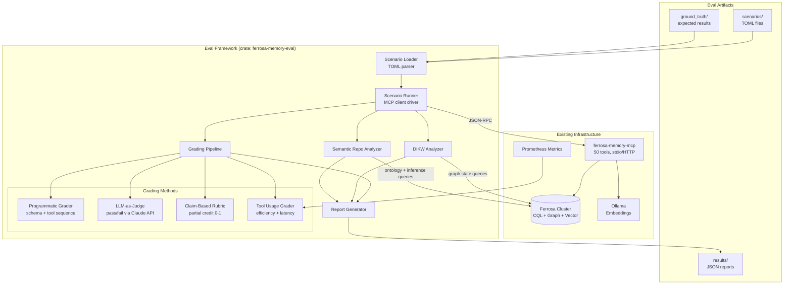
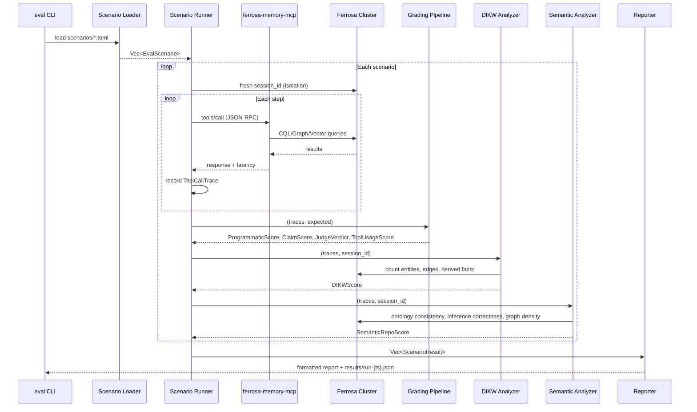

# MCP Evaluation Framework for ferrosa-memory-mcp

## Architecture Specification

### 1. Introduction

This document specifies an evaluation framework for ferrosa-memory-mcp that grades the MCP server on three levels:

- **Level 1: Standard MCP Metrics** — tool correctness, completeness, relevance, clarity, reasoning (1-5 scale)
- **Level 2: DIKW Knowledge Transformation** — does the system enable data→information→knowledge→wisdom transitions?
- **Level 3: Semantic Repository Maturity** — does the system function as a semantic repository with inference, ontological consistency, graph completeness, and emergent relationship discovery?

The framework replays structured scenarios against a live Ferrosa cluster, applies multiple grading methods, and produces aggregate reports.

### 2. Evaluation Philosophy

#### Information → Knowledge Transformation

Information becomes knowledge when it is processed, contextualized, and applied. The eval framework measures this by tracking whether the memory system:

1. **Contextualizes** raw data (entity types, temporal scoping, session isolation)
2. **Analyzes & synthesizes** to find patterns (consolidation, spread activation, recursive explore, Datalog derivation)
3. **Applies** knowledge to meet goals (intention triggering, predict_needed, smart_ingest decisions)
4. **Discovers relationships** autonomously — the LLM should be given instruction that it can create new relationships to link related information. The eval measures whether this actually happens.

#### Semantic Repository Criteria

A semantic repository goes beyond a key-value store by providing:

- **Inference**: deriving new facts from existing ones (Datalog `query_derived`, `run_consolidation` CO_OCCURS discovery, `spread_activation`)
- **Ontological typing**: consistent entity/edge type assignments that enable structured reasoning
- **Graph completeness**: value scales with edge density — isolated entities are data, connected entities are knowledge
- **Query expressiveness**: multi-hop reasoning ("find all decisions that affected bugs in this project")
- **Semantic deduplication**: recognizing that overlapping descriptions refer to the same concept (`find_duplicates`, `smart_ingest` SUPERSEDE logic)

### 3. Component Diagram



### 4. Data Flow



### 5. Module Breakdown

New crate: `crates/ferrosa-memory-eval/`

```
crates/ferrosa-memory-eval/
    Cargo.toml
    src/
        main.rs              # CLI entry point
        lib.rs               # Re-exports
        scenario.rs          # TOML parser for EvalScenario, EvalStep, GroundTruth
        runner.rs            # Drives MCP server, records traces
        mcp_client.rs        # JSON-RPC client (stdio or HTTP)
        grading/
            mod.rs           # GradingPipeline orchestrator
            programmatic.rs  # Schema validation, tool sequence matching
            llm_judge.rs     # Claude API pass/fail judgment
            claim_rubric.rs  # Substring/regex claim checking, partial credit
            tool_usage.rs    # Latency, token cost, unnecessary call detection
        dikw/
            mod.rs           # DIKWAnalyzer orchestrator
            data_info.rs     # Data->Information (contextualization)
            info_knowledge.rs # Information->Knowledge (synthesis, consolidation)
            knowledge_wisdom.rs # Knowledge->Wisdom (intentions, predict_needed)
            emergence.rs     # Relationship emergence, edge density growth
        semantic/
            mod.rs           # SemanticRepoAnalyzer orchestrator
            inference.rs     # Derived fact correctness, Datalog evaluation
            ontology.rs      # Entity/edge type consistency, type coverage
            graph_quality.rs # Density, connectivity, path completeness
            dedup.rs         # Semantic deduplication accuracy
            multi_hop.rs     # Multi-hop query expressiveness
        report.rs            # CLI text + JSON serializer
        config.rs            # [eval] section from ferrosa-memory.toml
    scenarios/
        README.md
        level1/              # Standard MCP metrics
            memo_cache.toml
            entity_crud.toml
            fold_lifecycle.toml
            search_retrieval.toml
            intention_lifecycle.toml
            plan_hierarchy.toml
            temporal_facts.toml
            graph_edges.toml
            datalog_rules.toml
            batch_operations.toml
        level2/              # DIKW knowledge transformation
            contextualization.toml
            consolidation_discovery.toml
            recursive_exploration.toml
            smart_ingest_decisions.toml
            intention_triggering.toml
            emergent_relationships.toml
        level3/              # Semantic repository maturity
            inference_correctness.toml
            ontological_consistency.toml
            graph_completeness.toml
            multi_hop_reasoning.toml
            semantic_dedup.toml
        regression/
            co_occurs_session_mismatch.toml
    ground_truth/
        *.json
```

### 6. Key Data Structures

#### 6.1 Scenario Definition (TOML)

```toml
[scenario]
id = "smart_ingest_create_update_supersede"
name = "Smart Ingest: CREATE -> UPDATE -> SUPERSEDE lifecycle"
description = "Verifies prediction error gating makes correct decisions"
level = 2                             # 1=MCP, 2=DIKW, 3=Semantic
dikw_transition = "knowledge_wisdom"
tags = ["smart_ingest", "prediction_error", "entity_lifecycle"]
timeout_ms = 30000

[[steps]]
tool = "smart_ingest"
arguments = { content = "Alice is a senior engineer at Acme Corp", entity_type = "person" }
expect_in_response = ["Created", "entity_id"]
expect_action = "Created"

[[steps]]
tool = "smart_ingest"
arguments = { content = "Alice is a senior engineer at Acme Corp who leads the backend team", entity_type = "person" }
expect_in_response = ["Updated", "similarity"]
expect_action = "Updated"

[[steps]]
tool = "smart_ingest"
arguments = { content = "Alice left Acme Corp and joined Ferrosa as VP of Engineering", entity_type = "person" }
expect_in_response = ["Superseded", "old_entity_id"]
expect_action = "Superseded"

[grading]
methods = ["programmatic", "claim_rubric", "llm_judge"]

[grading.claim_rubric]
claims = [
    "First ingest creates a new entity",
    "Second ingest updates existing entity (high similarity, consistent content)",
    "Third ingest supersedes (contradictory: 'left Acme' vs 'at Acme')",
    "Entity history preserved through supersession chain"
]
passing_threshold = 0.75

[grading.llm_judge]
rubric = """
Evaluate whether smart_ingest correctly distinguished between:
1. Novel content (CREATE) - content unlike any existing memory
2. Reinforcing content (UPDATE) - similar and consistent
3. Contradictory content (SUPERSEDE) - similar but conflicts
Judge PASS if all three decisions are correct.
"""

[dikw]
expect_entity_count_gte = 2
expect_edge_types = ["SUPERSEDES"]
expect_temporal_chain = true

[semantic]
expect_type_consistency = true    # entity types should be stable across updates
expect_dedup_on_update = true     # second ingest should find existing, not create new
```

#### 6.2 Grading Result Types

```rust
/// Level 1: Standard MCP quality scores (1-5 scale).
pub struct McpQualityScores {
    pub accuracy: f64,
    pub completeness: f64,
    pub relevance: f64,
    pub clarity: f64,
    pub reasoning: f64,
    pub composite: f64,
}

/// Level 2: DIKW Knowledge Transformation scores.
pub struct DIKWScore {
    pub data_to_info: TransitionScore,
    pub info_to_knowledge: TransitionScore,
    pub knowledge_to_wisdom: TransitionScore,
    pub emergence: EmergenceScore,
    pub composite: f64,
}

/// Level 3: Semantic Repository Maturity scores.
pub struct SemanticRepoScore {
    pub inference_correctness: f64,   // derived facts are correct
    pub ontological_consistency: f64, // types are stable and meaningful
    pub graph_completeness: f64,      // density, connectivity, paths
    pub query_expressiveness: f64,    // multi-hop reasoning works
    pub dedup_accuracy: f64,          // overlapping concepts merged correctly
    pub composite: f64,
}

/// Emergent relationship tracking.
pub struct EmergenceScore {
    pub entities_before: usize,
    pub entities_after: usize,
    pub edges_before: usize,
    pub edges_after: usize,
    pub derived_facts_created: usize,
    pub new_edge_types: Vec<String>,
    pub graph_density: f64,
    pub density_delta: f64,
    pub score: f64,
}

/// Aggregate result for one scenario.
pub struct ScenarioResult {
    pub scenario_id: String,
    pub level: u8,
    pub mcp_quality: McpQualityScores,
    pub programmatic: ProgrammaticScore,
    pub judge: Option<JudgeVerdict>,
    pub claims: Option<ClaimScore>,
    pub tool_usage: ToolUsageScore,
    pub dikw: Option<DIKWScore>,
    pub semantic: Option<SemanticRepoScore>,
    pub passed: bool,
    pub duration: Duration,
}
```

### 7. Integration Points

| Integration | How | Source |
|---|---|---|
| Tool schemas | Compile-time dep on ferrosa-memory-core, calls `tool_definitions()` | dispatch.rs:174-829 |
| MCP protocol | JSON-RPC over stdio (spawn child) or HTTP+SSE | transport.rs types |
| Storage queries (DIKW/Semantic) | Ferrosa public query interfaces; current runtime still contains direct `CqlStorage` coupling that should be removed | storage.rs:31-558 |
| Prometheus metrics | Scrape `/metrics` (HTTP) or query `tool_usage_daily` table | metrics.rs |
| Session isolation | Fresh `session_id` per scenario, `delete_session` on cleanup | dispatch.rs |

### 8. ADR-003: Test Against Real Servers, Not Mocks

**Decision:** The eval framework tests against a live Ferrosa cluster exclusively. No mock storage.

**Rationale:**
1. MockStorage diverges from CqlStorage in meaningful ways (no ANN, no graph traversal)
2. DIKW and Semantic layers are untestable with mocks — knowledge emerges from real data
3. This project exists to exercise Ferrosa (CLAUDE.md: "test program for the Ferrosa database")
4. Dev cluster is already available via `podman compose up -d`
5. Cost is bounded: 15 scenarios in ~60s, no external API cost for storage

### 9. Report Output Format

```
=== ferrosa-memory-mcp Evaluation Report ===
Run: 2026-04-05T14:32:00Z  |  Scenarios: 15 run, 13 passed, 2 failed  |  Duration: 47.3s

--- Level 1: Standard MCP Metrics (target: 3.5/5.0) ---
  memo_cache ............... PASS  4.2/5.0  [prog:1.00 claims:1.00 judge:PASS eff:0.95]
  entity_crud .............. PASS  4.5/5.0  [prog:1.00 claims:0.88 judge:PASS eff:0.90]
  search_retrieval ......... FAIL  2.8/5.0  [claims:0.50 < 0.75 threshold]

--- Level 2: DIKW Knowledge Transformation (target: 0.60) ---
  Data->Info:       0.85  (types:6/7, temporal:PASS, session:PASS)
  Info->Knowledge:  0.78  (consolidation:4 edges, spread:3 hops, recall@10:0.80)
  Knowledge->Wisdom: 0.70 (intentions:2/3, predict:PASS, ingest:3/3)
  Emergence:        0.65  (density:0.03->0.12, +300%, new types:[CO_OCCURS, SUPERSEDES])
  DIKW Composite:   0.75

--- Level 3: Semantic Repository Maturity (target: 0.60) ---
  Inference:     0.80  (derived facts correct: 12/15)
  Ontology:      0.90  (type consistency: 95%, coverage: 8/9 types used)
  Graph:         0.65  (density: 0.12, components: 3, avg path: 2.4)
  Multi-hop:     0.70  (2-hop: PASS, 3-hop: PARTIAL, 4-hop: FAIL)
  Dedup:         0.75  (precision: 0.80, recall: 0.70)
  Semantic Composite: 0.76

--- Aggregate ---
  MCP Quality:     3.9/5.0  PASS
  DIKW:            0.75     PASS
  Semantic Repo:   0.76     PASS
  Total tokens:    12,847
  Total latency:   3.2s
```

### 10. Implementation Plan

**Sprint 1 (Foundation):** Crate scaffold, scenario parser, MCP client (stdio), programmatic + claim graders, 5 Level 1 scenarios. Deliverable: basic eval runner.

**Sprint 2 (DIKW + Semantic):** LLM judge, tool usage grader, DIKW analyzer (4 sub-modules), semantic analyzer (5 sub-modules), 5 Level 2 + 5 Level 3 scenarios. Deliverable: full three-level grading.

**Sprint 3 (Polish):** HTTP transport, parallel execution, JSON output, CI integration, regression scenarios, documentation. Deliverable: production-ready eval framework.
