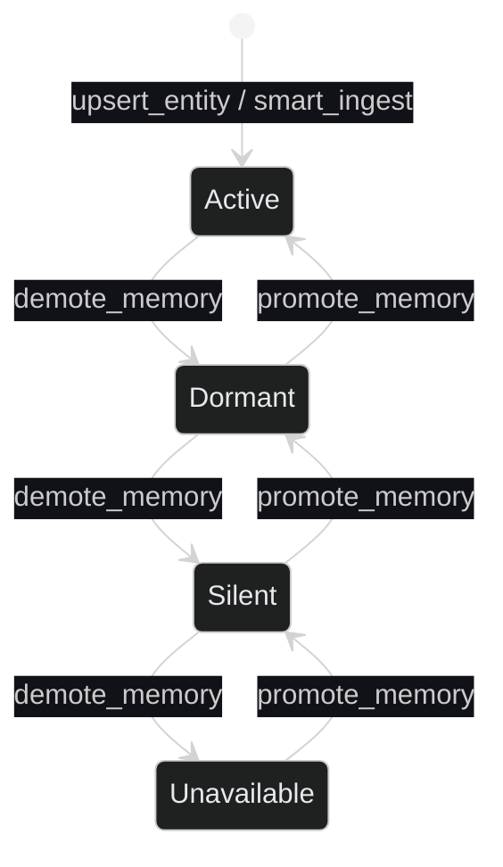
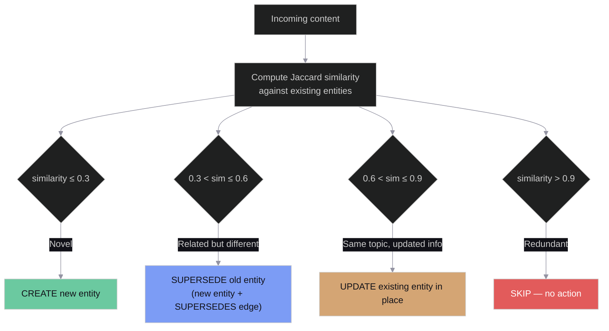
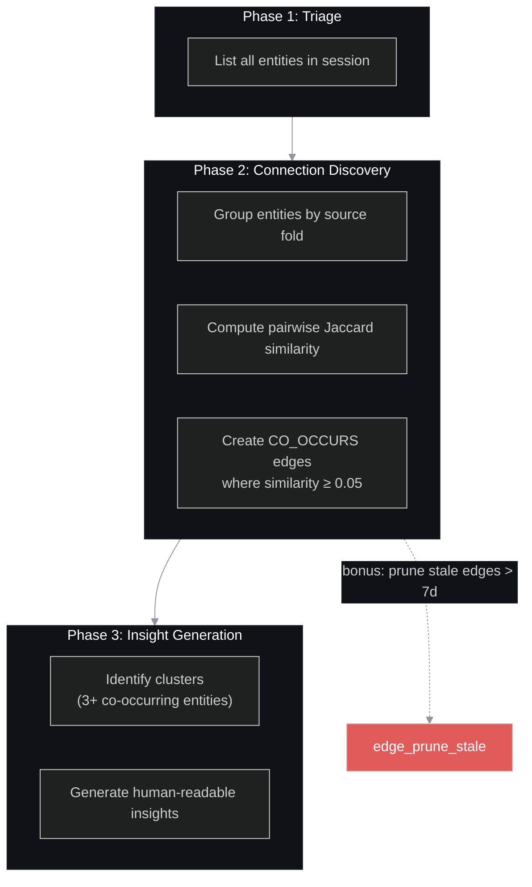
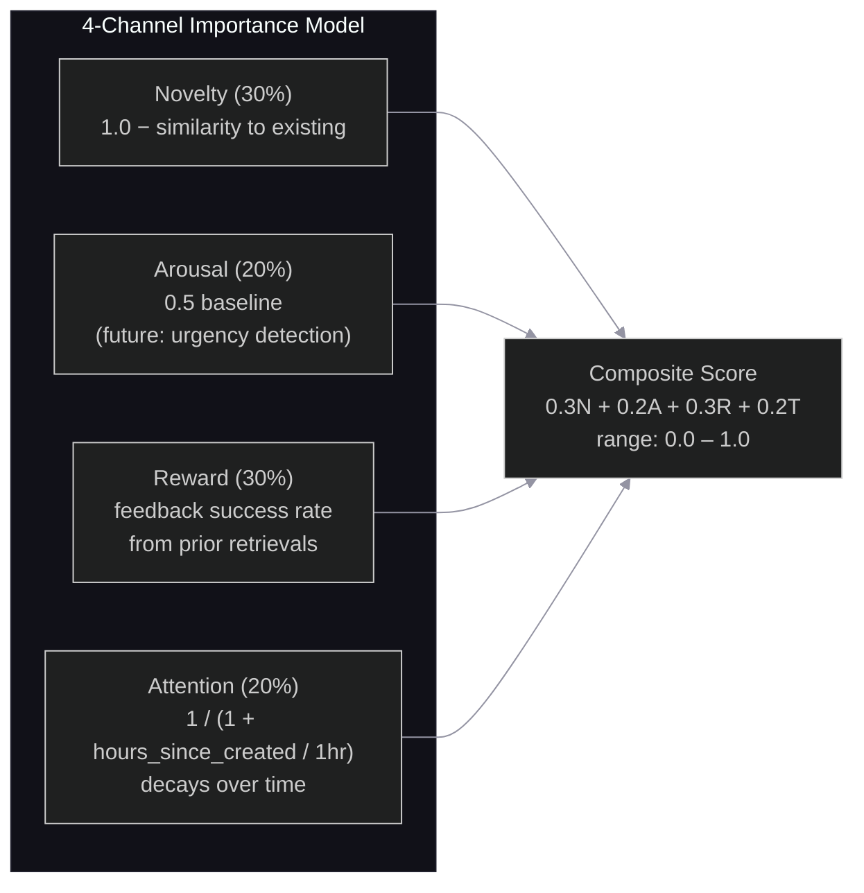
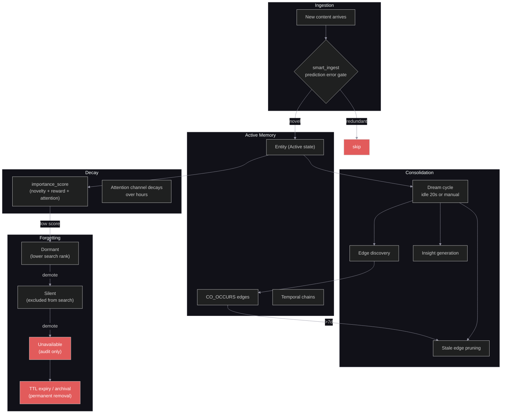

# Memory Lifecycle — Consolidation & Forgetting

> Last updated: 2026-03-25
> Status: Documents implemented behavior as of Sprint 4.9

This document describes how memories enter the system, get consolidated into a coherent knowledge graph, and eventually fade or get removed. The design draws on neuroscience-inspired models (spreading activation, importance scoring, dream consolidation) adapted for an LLM agent memory store.

## Core Principle

Memories follow a lifecycle analogous to human memory consolidation:

1. **Ingestion** — new information enters with prediction-error gating (novel → store, redundant → skip)
2. **Consolidation** — periodic "dream" cycles discover connections between memories
3. **Decay** — importance scores decrease over time; low-importance memories get demoted
4. **Forgetting** — demoted memories become progressively less accessible, eventually unavailable

## Memory State Machine

Every entity in the system has a `memory_state` that controls its visibility in searches.



| State | Search behavior | Purpose |
|-------|----------------|---------|
| **Active** | Returned in all searches | Default state for new and relevant memories |
| **Dormant** | Lower ranking priority | Memory is aging out but still accessible |
| **Silent** | Excluded from search results | Effectively hidden; retained for explicit lookup |
| **Unavailable** | Inaccessible via tools | Logically deleted; retained only for audit trail |

**Promotion** (`promote_memory`) moves a memory one level up. **Demotion** (`demote_memory`) moves it one level down. Both emit `StateChanged` visualization events.

---

## Phase 1: Ingestion — Prediction Error Gating

Not everything gets stored. `smart_ingest` compares incoming content against existing memories using Jaccard similarity on word tokens, then makes a decision:



The thresholds are configurable (`IngestConfig`):

| Threshold | Default | Meaning |
|-----------|---------|---------|
| `create_threshold` | 0.3 | Below this → genuinely novel, create new |
| `update_threshold` | 0.6 | Below this but above create → supersede old |
| `skip_threshold` | 0.9 | Above this → too similar, skip entirely |

**Supersession** creates a temporal chain: the new entity gets a `SUPERSEDES` edge pointing to the old one, allowing the system to trace how facts evolved over time via `get_temporal_chain`.

Additional write-time guards:
- **Confidence gate**: entities with `confidence < 0.7` are rejected (MemoryGraft defense)
- **Session quota**: max 1,000 entities per session (storage flood defense)
- **Phonetic dedup**: on `upsert_entity`, checks for Double Metaphone matches before creating duplicates

---

## Phase 2: Consolidation — Dream Cycles

Consolidation discovers relationships between memories that weren't explicit at ingestion time. It runs in two modes:

### Automatic (Idle Consolidation)

A background task monitors tool call activity. When the session has been idle for **20 seconds** (configurable via `idle_consolidation_seconds`) and at least one write has occurred since the last consolidation (tracked by a `dirty` flag), it automatically triggers a dream cycle.

**Write operations that set the dirty flag:**
`store_memo_result`, `upsert_entity`, `smart_ingest`, `write_plan_node`, `update_plan_node`, `start_fold`, `append_to_fold`, `complete_fold`, `write_temporal_fact`, `set_intention`, `complete_intention`

### Manual (`run_consolidation`)

The agent can explicitly trigger consolidation at any time, typically at session end or when instructed to "wrap up."

### The Dream Algorithm (3 Phases)



**Phase 1 — Triage:** Loads all entities for the session from the entity store.

**Phase 2 — Connection Discovery:** Groups entities by their `source_fold_id` (entities mentioned in the same fold are candidates for connection). For each pair of co-located entities, computes Jaccard similarity on their word tokens. If similarity ≥ 0.05, creates a `CO_OCCURS` edge in the graph layer. During idle consolidation, also prunes `CO_OCCURS` edges older than 7 days to prevent stale connections from accumulating.

**Phase 3 — Insight Generation:** Identifies clusters of 3+ entities connected by `CO_OCCURS` edges and generates natural-language insights describing the cluster (e.g., "These 4 entities relate to the authentication refactor").

**Output:**
```
DreamResult {
    entity_count: 42,
    connections_created: 7,
    insights: ["auth module connects to..."],
    edges: [(entity_a, entity_b), ...]
}
```

All edge creations emit visualization events for the real-time graph dashboard.

### Duplicate Detection (`find_duplicates`)

A separate tool that performs O(n²) pairwise comparison of all session entities, returning pairs with Jaccard similarity ≥ 0.7. This is a diagnostic tool — it surfaces candidates for manual merge but does not automatically merge them. Useful as a pre-consolidation check.

---

## Phase 3: Decay — Importance Scoring

Importance scoring determines which memories are worth keeping. The model uses four neuroscience-inspired channels:



| Channel | Weight | Source | Behavior |
|---------|--------|--------|----------|
| **Novelty** | 30% | `1.0 − max_similarity_to_existing` | High for genuinely new information |
| **Arousal** | 20% | 0.5 (placeholder) | Future: detect urgency keywords, emotional valence |
| **Reward** | 30% | `feedback_success_rate` from `feedback_outcomes` | High for memories that led to successful retrievals |
| **Attention** | 20% | `1.0 / (1.0 + seconds_since_created / 3600)` | Decays: 1.0 at creation → ~0.5 at 1hr → ~0.1 at 9hrs |

The `importance_score` tool computes this on demand. High scores indicate memories worth retaining; low scores indicate candidates for demotion.

**Attention decay curve:**

| Age | Attention score |
|-----|----------------|
| 0 min | 1.00 |
| 30 min | 0.67 |
| 1 hour | 0.50 |
| 3 hours | 0.25 |
| 9 hours | 0.10 |
| 24 hours | 0.04 |

---

## Phase 4: Forgetting

Memories leave the system through several mechanisms, operating at different timescales:

### Active Forgetting (Agent-Driven)

| Mechanism | Trigger | Effect |
|-----------|---------|--------|
| `demote_memory` | Agent decides memory is irrelevant | State moves down one level (Active → Dormant → Silent → Unavailable) |
| `delete_session` | Session cleanup or right-to-deletion | Cascade deletes all memory objects: plans, folds, entities, feedback, audit logs |

### Passive Forgetting (Time-Based)

| Mechanism | Timescale | Target |
|-----------|-----------|--------|
| **Memo TTL** | 7 days (default) | `memo_cache` rows auto-expire via Cassandra TTL |
| **Fold archival** | 30 days | `trajectory_folds` transition to `archived` status, raw trajectory compressed and moved to S3 Glacier |
| **Stale edge pruning** | 7 days | `CO_OCCURS` edges older than 7 days are pruned during consolidation cycles |

### The Full Lifecycle



---

## Discovery Mechanisms

Two tools help surface memories that are relevant but not directly searched for:

### Spreading Activation (`spread_activation`)

Implements the Collins & Loftus (1975) semantic network model. Starting from seed entities, activation spreads outward through graph edges with configurable decay:

- **Initial activation**: 1.0 on seed nodes
- **Decay factor**: 0.7 per hop (configurable, range 0.0–1.0)
- **Traversal**: Breadth-first across all edge types (CO_OCCURS, MENTIONED_IN, SUPERSEDES, FOLDED_INTO)
- **Accumulation**: Multiple paths to the same node sum their activation
- **Pruning**: Nodes below 0.01 activation are dropped
- **Output**: Top N non-seed nodes sorted by activation descending

### Speculative Retrieval (`predict_needed`)

Tracks entity co-access patterns across tool calls. When entity A and entity B are frequently retrieved together, retrieving A causes the system to predict B will be needed. Returns entities with co-access frequency above a configurable threshold (default 0.3).

---

## Configuration Reference

All consolidation and forgetting parameters are set in `ferrosa-memory.toml`:

```toml
[memory]
default_ttl_days = 7              # memo cache expiry
fold_ttl_days = 30                # fold archival threshold
archive_after_days = 30           # transition to S3 Glacier
confidence_gate = 0.7             # minimum confidence for entity writes
max_entities = 10000              # per-session entity cap
idle_consolidation_enabled = true
idle_consolidation_seconds = 20   # idle time before auto-consolidation
```

Smart ingest thresholds (in `IngestConfig`, currently hardcoded):

```
create_threshold  = 0.3   # below → create new entity
update_threshold  = 0.6   # below → supersede old entity
skip_threshold    = 0.9   # above → skip (redundant)
```

Dream consolidation (currently hardcoded):

```
co_occurs_edge_threshold = 0.05   # min Jaccard similarity for CO_OCCURS edge
stale_edge_max_age       = 7d     # CO_OCCURS edges pruned after this age
cluster_min_size         = 3      # min entities for insight generation
```
