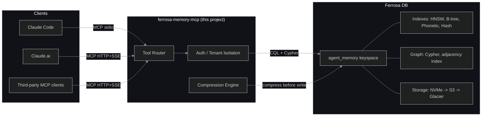

# System Overview

## Purpose

ferrosa-memory-mcp is a Rust MCP server (~12,350 lines) that exposes Ferrosa DB's index and graph infrastructure as typed tools for LLM agent trajectories. It provides durable, structured memory for Recursive Language Model (RLM) workloads — memoization, hierarchical plan state, trajectory fold/summarization, semantic retrieval, phonetic entity search, spreading activation, dream consolidation, intention tracking, and a feedback loop for retrieval strategy refinement.

## Positioning



| Layer | Role | Owns |
|-------|------|------|
| Claude Code (RLM runtime) | Orchestrates agent loop, spawns sub-agents | Prompt construction, recursion control |
| ferrosa-memory-mcp (this project) | Typed memory interface, MCP protocol | Tool schemas, query translation, auth |
| Ferrosa DB (storage) | Durable store, indexes, graph | Data, indexes, replication, S3 tiering |

## Transport

- **stdio** — default for Claude Code local usage (`~/.claude/settings.json`)
- **HTTP + SSE** — remote / multi-user deployment, Claude.ai connectors

Authentication: HTTP Basic (same credentials as CQL) in HTTP mode; stdio inherits process owner credentials.

## Technology Stack

- **Language:** Rust (Tokio async runtime)
- **MCP protocol:** JSON-RPC over stdio or HTTP+SSE
- **CQL driver:** `cdrs-tokio` v9 (selected over `scylla-rust-driver` — see risk register)
- **Graph client:** HTTP POST to Ferrosa's `/graph/query` endpoint via `reqwest` (neo4rs Bolt v4 incompatible with Ferrosa Bolt v5)
- **Compression:** Rust-native implementation (no Python — LLMLingua algorithm ported to Rust)
- **Embedding:** HTTP call to Ollama endpoint (nomic-embed-text, 768 dimensions)
- **Serialization:** `serde` + `serde_json`

## Workspace Structure

```
ferrosa-memory/
├── crates/
│   ├── ferrosa-memory-core/          # Shared library: storage traits, tool handlers, config
│   ├── ferrosa-memory-mcp/    # MCP server binary (stdio + HTTP)
│   └── ferrosa-memory-batch/  # Nightly batch job binary
├── ddl/                       # CQL schema files (001_keyspace, 002_folds_entities)
├── docker-compose.yml         # Dev cluster (3-node Ferrosa + RustFS + Ollama)
└── specs/                     # Architecture documentation
```

## Keyspace

All tables in `agent_memory` keyspace, RF=3 (configurable).

Six tables:
1. `memo_cache` — sub-call memoization
2. `plan_state` — hierarchical plan trees
3. `trajectory_folds` — fold summaries with graph edges
4. `entity_store` — named entities with phonetic + vector indexes
5. `temporal_events` — timestamped facts with supersession chains
6. `feedback_outcomes` — retrieval strategy success/failure pairs

## Research Foundation

Design grounded in: RLM (memoization), SRLM (tool routing), ReCAP (plan state), Context-Folding (trajectory folds), Zep (temporal chaining), MIRIX (memory type taxonomy), ACON (feedback learning), MCPShield + MemoryGraft (security model). See spec Section 2 for full citations.
