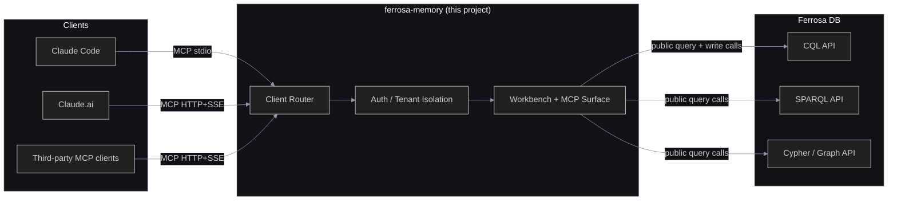

# System Overview

## Purpose

`ferrosa-memory` is a Rust MCP server and operator console that should behave as a client to Ferrosa, not as a second storage engine. It provides durable, structured memory workflows for Recursive Language Model (RLM) workloads — memoization, hierarchical plan state, trajectory fold/summarization, semantic retrieval, phonetic entity search, spreading activation, dream consolidation, intention tracking, and operator-facing query/explanation surfaces — but the storage and graph semantics are supposed to come from Ferrosa public interfaces.

## Positioning



| Layer | Role | Owns |
|-------|------|------|
| Claude Code (RLM runtime) | Orchestrates agent loop, spawns sub-agents | Prompt construction, recursion control |
| ferrosa-memory (this project) | Client surface over Ferrosa public APIs | MCP schemas, operator UI, auth, tenant mapping, request shaping |
| Ferrosa | Durable store and query engine | Data, indexes, graph, Datalog, CQL/SPARQL/Cypher semantics |

## Boundary Correction

Current code reality and target architecture are not the same.

- **Current reality:** the runtime still embeds direct CQL storage through `cdrs-tokio` and `CqlStorage`; graph traversals already use the public HTTP Cypher endpoint, but graph writes still bypass that interface and target graph-owned backing tables directly.
- **Required target:** direct CQL driver usage remains acceptable for app-owned tables and compatible with the `app_reader` rollout, but graph writes must go through Ferrosa's graph interfaces. `ferrosa-memory` should fail loudly when public query interfaces do not behave as advertised, rather than emulating missing semantics locally.

This correction is tracked in [ADR-005](./decisions/adr-005-endpoint-only-ferrosa-client.md).

## Bulk Ingest Boundary

`ferrosa-memory` also needs a server-owned bulk ingest surface for application data. The current tool mix (`batch_ingest`, `smart_ingest`, skill-specific ingest flows, and external loaders) is not yet the clean contract future ingestors need.

Required direction:

- clients send semantic entities and typed edges in one `ingest_entities` MCP call
- `ferrosa-memory` owns schema mapping, idempotency, dry-run behavior, and structured per-row failures
- direct CQL remains a server-internal implementation detail for app-owned tables
- clients stop owning CQL schema details, subprocess loaders, or Ollama access for required embeddings

This keeps CQL ownership where it belongs: inside `ferrosa-memory` for app tables, while still keeping graph mutations behind public graph interfaces.

## Transport

- **stdio** — default for Claude Code local usage (`~/.claude/settings.json`)
- **HTTP + SSE** — remote / multi-user deployment, Claude.ai connectors

Authentication:

- `stdio` remains local-trust only and may use a fixed configured tenant for development.
- Shared HTTP must use real authenticated principals mapped to tenants; it must not reuse stdio-style tenant fallback.
- Public viz exposure is not part of the shared MCP endpoint decision.

## Shared HTTP Deployment Posture

The codebase now supports both local stdio and remote HTTP, but they are different trust models:

- **Local stdio** — developer-owned process, fixed/default tenant acceptable, viz can stay enabled.
- **Shared HTTP** — multi-user service, TLS required, one authenticated principal per tenant, readiness probes required, viz disabled by default.

The rule-loader convergence and governance backend surfaces are now implemented in core and dispatcher. Shared HTTP now uses a file-backed principal map with auth reload support plus startup validation for TLS/auth-file/fallback-tenant posture. Remaining work is concentrated in higher-level rollout coverage and workbench UX completion rather than permissive-auth cleanup.

## Technology Stack

- **Language:** Rust (Tokio async runtime)
- **MCP protocol:** JSON-RPC over stdio or HTTP+SSE
- **Current storage implementation:** direct CQL driver via `cdrs-tokio` v9 in the runtime path
- **Current graph client:** HTTP POST to Ferrosa's public Cypher endpoint via `reqwest` for reads; write routing still needs to move behind the same public graph interface
- **Target Ferrosa integration:** direct CQL for app tables, graph writes through Cypher/graph interfaces, public CQL/SPARQL passthrough for operator inspection, repo-owned Datalog evaluation in `ferrosa-memory`, and a server-owned `ingest_entities` bulk ingest contract for app data
- **Compression:** Rust-native implementation (no Python — LLMLingua algorithm ported to Rust)
- **Embedding:** HTTP call to Ollama endpoint (nomic-embed-text, 768 dimensions)
- **Serialization:** `serde` + `serde_json`

## Workspace Structure

```
ferrosa-memory/
├── crates/
│   ├── ferrosa-memory-core/          # Shared library: storage traits, tool handlers, config
│   ├── ferrosa-memory-mcp/    # MCP server binary (stdio + HTTP)
│   └── ferrosa-memory-batch/  # Nightly batch job binary
│   ├── ferrosa-memory-sync/    # Cross-device sync binary
├── ddl/                       # CQL schema files (001–019)
├── docker-compose.yml         # Dev cluster via podman compose (3-node Ferrosa + RustFS + Ollama)
└── specs/                     # Architecture documentation
```

## Keyspace

All tables in `agent_memory` keyspace, RF=3 (configurable).

Eight tables:
1. `memo_cache` — sub-call memoization
1. `plan_state` — hierarchical plan trees
1. `trajectory_folds` — fold summaries with graph edges
1. `entity_store` — named entities with phonetic + vector indexes
1. `temporal_events` — timestamped facts with supersession chains
1. `feedback_outcomes` — retrieval strategy success/failure pairs
1. `entity_types` — dynamic type registry for entity types (DDL 019)
1. `edge_types` — dynamic type registry for edge types with source/destination constraints (DDL 019)

## Dynamic Type Registry

Entity and edge types are stored in `entity_types` and `edge_types` tables rather than hardcoded in the binary. Current code still loads them via `CqlStorage::load_entity_types()` and `load_edge_types()`. That is acceptable so long as those remain app-owned tables and stay compatible with the `app_reader` role boundary; the tighter correction is to avoid graph-internal table ownership in the serving path.

Seeded types include: person, place, event, concept, org, decision, pattern, preference, bug, document, section. Edge types: depends_on, contains, calls, references, CO_OCCURS, MENTIONED_IN, FOLDED_INTO, SUPERSEDES.

## Datalog and Recursive Exploration

Current code reality:

- The Datalog layer is still implemented locally over direct storage reads and local rule evaluation.
- Recursive exploration is therefore partly coupled to local storage and inference semantics instead of delegating query semantics to Ferrosa.

Target architecture:

- Datalog remains a ferrosa-memory-owned local evaluation layer over Ferrosa-backed graph/app data.
- `ferrosa-memory` may still orchestrate query decomposition, session/auth scoping, and response presentation, but only CQL/SPARQL/graph semantics are sourced from Ferrosa public interfaces.

## Expert-System Knowledge Plane

The expert-system knowledge plane is implemented in `ferrosa-memory-core` and includes symbolic runtime convergence plus governance backends:

- **Effective rule set** — unify baseline built-in rules with active stored rules so `manage_rules`, `query_derived`, `recursive_explore`, and `promotion` all evaluate the same runtime rule surface.
- **Claims and approvals** — persist proposed claims plus reviewer decisions with scope, provenance, and audit semantics suited to human-in-the-loop workflows.
- **Alias registry** — persist exact tool-alias corrections and scoped argument remaps without depending on semantic retrieval as the primary lookup path.
- **Explanation API** — expose derived-fact support chains, rule provenance, and approval state through MCP so external workbenches can render why a recommendation or derived fact exists.
- **Operator console** — backend API surfaces are present at `/` plus `/workbench/api/*`, but the query surfaces must be refactored into authenticated passthroughs over Ferrosa public interfaces rather than local substitute implementations.

## Public vs Internal Boundary

The key distinction is not "CQL good" or "CQL bad." It is whether `ferrosa-memory` is operating against a public contract or an internal storage layout.

| Layer | Example | Classification |
|-------|---------|----------------|
| Wire protocol | CQL over port `9042` via `cdrs-tokio` | Public protocol |
| Graph engine contract | Cypher / graph API queries and mutations | Public graph interface |
| Graph backing tables | `typed_edges`, `folded_into`, `mentioned_in`, `co_occurs_with`, `supersedes`, `derived_edges_by_pred`, `derived_edges_by_src` | Internal `ferrosa-graph` storage schema |

Analogy: using PostgreSQL over its wire protocol is public; writing directly to `pg_index` instead of issuing `CREATE INDEX` is not. Ferrosa's graph tables are closer to `pg_index` than to a supported application table.

The rule runtime gap is now closed for backend flows: `manage_rules`, `query_derived`, `recursive_explore`, `promotion`, and `dream` now converge on the same effective-rule path. Current work not yet completed is broader acceptance coverage plus the remaining operator-facing workbench UX.

## Research Foundation

Design grounded in: RLM (memoization), SRLM (tool routing), ReCAP (plan state), Context-Folding (trajectory folds), Zep (temporal chaining), MIRIX (memory type taxonomy), ACON (feedback learning), MCPShield + MemoryGraft (security model), Recursive Memory Harness (persistent warmth, recursive exploration), and Datalog graph materialization (semi-naive inference, provenance, ephemeral caching). See spec Section 2 for full citations.
