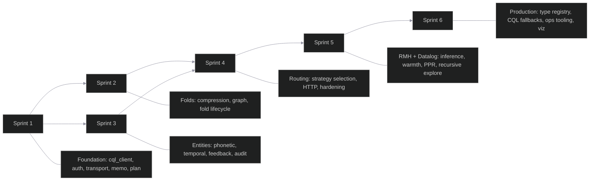

# Project Plan — ferrosa-memory-mcp

> Last updated: 2026-04-02
> Status: Sprints 1-6 complete. Sprint 6 (Production Hardening) covers Apr 1-2 work.

## Overview

4 sprints (2 weeks each) + backlog. Prioritized by risk: FMEA RPN scores and STRIDE threat ratings determine sprint ordering.

## Progress Summary

| Sprint | Status | Completion |
|--------|--------|------------|
| Sprint 1 | **COMPLETE** | 14/14 tasks done |
| Sprint 2 | **COMPLETE** | 8/8 tasks done |
| Sprint 3 | **COMPLETE** | 10/10 tasks done |
| Sprint 4 | **COMPLETE** | 11/11 tasks done |
| Sprint 4.9 | **COMPLETE** | SUBSCRIBE anomaly alerts, get_stats enrichment |
| Sprint 5 | **COMPLETE** | RMH + Datalog + Promotion (12+4 tasks) |
| Sprint 5b | **COMPLETE** | Durable materialization pipeline (4 tasks) |
| Sprint 6 | **COMPLETE** | Production hardening, type registry, infra (14 items) |

---

## Sprint 1: Foundation + Core Memoization

**Goal:** Working MCP server with stdio transport, tenant auth, memo cache, and plan state tools. Covers critical security invariants from day 1.

**Status: COMPLETE** (all tasks verified in commits 24cf28b through cbe7a34)

| # | Task | Size | Source | Success Criteria | Tests |
|---|------|------|--------|-----------------|-------|
| 1.1 | Cargo workspace setup: `ferrosa-memory-mcp` binary + `ferrosa-memory-batch` binary + shared `ferrosa-memory-core` lib | S | architect | `cargo build` succeeds for both targets | `cargo build --workspace` |
| 1.2 | `config` module: parse `ferrosa-memory.toml` via `serde` + `toml` | S | architect | All config fields from spec Section 10 deserialized. Invalid config returns clear error. | Unit tests: valid config, missing fields, invalid values |
| 1.3 | `metrics` module: Prometheus counters/histograms for all 8 metrics in spec Section 9.1 | S | architect, FMEA F01 | Metrics registered. `GET /metrics` returns Prometheus text format. | Unit: metric registration. Integration: increment + scrape. |
| 1.4 | `auth` module: extract `TenantContext` from stdio (process owner) and HTTP Basic | S | STRIDE S1, S2 | `tenant_id` is never client-supplied. Type system enforces `TenantContext` as required param. | TC22 (TLS rejection), unit: auth extraction |
| 1.5 | `cql_client` module: connection pool, prepared statement cache, parameterized queries | M | DSM (86% propagation), FMEA F01-F05, STRIDE T4 | Pool configurable. All queries parameterized. Reconnect on node failure. | TC09 (pool exhaustion), TC16 (schema change), TC17 (timeout) |
| 1.6 | `Storage` trait: abstract CQL operations for testability | S | DSM recommendation | All tool modules depend on trait, not concrete client. Mock implementation for unit tests. | Compiles with mock backend |
| 1.7 | `transport` module: stdio JSON-RPC framing | M | architect, FMEA F29 | Reads stdin, writes stdout. Handles malformed JSON-RPC without panic. | TC18 (malformed JSON), TC29 (fuzz) |
| 1.8 | `tool_dispatch` module: registry, schema validation, dispatch | S | architect | `tools/list` returns all 12 tool schemas. Invalid params rejected before dispatch. | Unit: schema validation, unknown tool name |
| 1.9 | `embedding_client` module: Ollama HTTP client with timeout and health check | S | FMEA F25 | `embed(text)` returns `Vec<f32>` of configured dimensions. Timeout after 10s. | TC21 (Ollama down), unit: response parsing |
| 1.10 | `memo_tools`: `check_memo_cache` + `store_memo_result` | M | spec Phase 1, FMEA F09-F12 | Cache hit returns stored result. Cache miss returns `{ hit: false }`. Model version in cache key. TTL respected. | TC10 (model version), TC19 (thundering herd), TC20 (TTL expiry) |
| 1.11 | `plan_tools`: `write_plan_node` + `get_plan_context` + `update_plan_node` | M | spec Phase 1 | Plan tree queryable by depth. Status transitions work. Active path computed correctly. | Unit: tree construction, depth filtering, status transitions |
| 1.12 | DDL scripts for `memo_cache` and `plan_state` tables | S | spec Section 4.1-4.2 | Tables created in `agent_memory` keyspace. Indexes created. | DDL executes without error on Ferrosa |
| 1.13 | Claude Code integration: `~/.claude/settings.json` example config | S | spec Section 3.2 | Documented example. `claude-code` can discover and call tools. | Manual: Claude Code connects, `tools/list` returns tools |
| 1.14 | Integration test: RLM memo round-trip | M | spec Phase 1 | Store memo -> check memo -> hit. Different model version -> miss. | End-to-end with real Ferrosa |

**Sprint 1 exit criteria:** `cargo test --workspace` passes. MCP server starts, Claude Code connects via stdio, memo cache and plan state tools functional against Ferrosa. **MET** — live CQL persistence confirmed (cbe7a34).

---

## Sprint 2: Fold Hierarchy + Compression

**Goal:** Trajectory fold lifecycle with graph edges, Rust-native compression, and S3 tiering.

**Status: COMPLETE** — compression engine, fold lifecycle, fold search, graph edge creation, and S3 lifecycle all done.

| # | Task | Size | Source | Success Criteria | Tests |
|---|------|------|--------|-----------------|-------|
| 2.1 | `compression` module: token-importance-weighted compression in pure Rust | L | ADR-001, FMEA F27 | `compress(text, ratio)` produces readable output. `decompress(compress(x)) == x`. Ratio < 1.0 for text > threshold. | TC24 (round-trip property test), unit: various text types |
| 2.2 | DDL for `trajectory_folds` table + HNSW index on `fold_embedding` | S | spec Section 4.3 | Table and index created. Vector search returns ordered results. | DDL execution + sample vector query |
| 2.3 | `graph_client` module: Cypher query execution, vertex/edge creation | M | architect, STRIDE T5 | Parameterized Cypher only. `FOLDED_INTO` edge type works. Timeout configurable. | TC07 (orphan detection), unit: parameterized queries |
| 2.4 | `fold_tools`: `start_fold` + `append_to_fold` + `complete_fold` | L | spec Phase 2, FMEA F13-F15 | Fold lifecycle: active -> folded. Graph edge created on complete. Append rejected on non-active fold. Token count tracked. | TC07 (partial write), TC15 (status check), integration: full lifecycle |
| 2.5 | `fold_tools`: `retrieve_fold_context` with HNSW ANN search | M | spec Phase 2, FMEA F17 | Top-k fold summaries by embedding similarity. Relevance scores returned. `include_raw` works for hot folds, errors for archived. | TC06 (relevance), TC13 (archived fold error) |
| 2.6 | Background compression job: compress `raw_trajectory` on fold completion | M | spec Section 4.3, FMEA F14 | Compression runs async after `complete_fold`. Failure doesn't block fold completion. Checksum stored. | Integration: fold -> verify compressed within timeout |
| 2.7 | S3 lifecycle configuration for `status='archived'` rows | S | spec Section 4.3 | Documented `ferrosa-ctl` commands for Glacier lifecycle rule. Lifecycle triggers after 30 days. | Manual verification with Ferrosa tiering config |
| 2.8 | Integration test: fold hierarchy with nested folds and graph traversal | M | spec Phase 2 | Create 3-level fold tree. Cypher traversal returns correct hierarchy. Fold summaries retrievable by ANN. | End-to-end with Ferrosa |

**Sprint 2 exit criteria:** Fold lifecycle works end-to-end. Compression produces valid output. Graph edges queryable via Cypher. `retrieve_fold_context` returns ranked results. **MET** — graph edge creation implemented (ca207aa), S3 lifecycle documented (1a953b5), vector column gap resolved (e5c9a27).

---

## Sprint 3: Entity Graph + Temporal Events + Feedback

**Goal:** Entity discovery with phonetic dedup, temporal fact chains, and feedback recording for routing optimization.

**Status: COMPLETE** — phonetic entity matching, temporal chains, feedback recording, ANN entity search, graph edges, anomaly detection, and audit log all working.

| # | Task | Size | Source | Success Criteria | Tests |
|---|------|------|--------|-----------------|-------|
| 3.1 | DDL for `entity_store` + phonetic index + HNSW index | S | spec Section 4.4 | Double Metaphone index functional. Vector search functional. Both queryable in same table. | DDL + sample phonetic + vector queries |
| 3.2 | `entity_tools`: `upsert_entity` with phonetic dedup + embedding distance check | L | spec Phase 3, FMEA F18-F19 | Phonetic match found -> check embedding distance -> merge or create new. Confidence gating rejects < threshold. Rate limit per session. | TC01 (confidence gate), TC02 (rate limit), TC04/TC05 (false merge prevention) |
| 3.3 | `entity_tools`: `retrieve_entities` with `ann`, `phonetic`, `both` strategies | M | spec Phase 3 | Union-merge deduplicates by `entity_id`. Each strategy returns correct result type. | Unit: each strategy. Integration: `both` merges correctly. |
| 3.4 | Graph annotations: `CO_OCCURS_WITH`, `MENTIONED_IN` edge types for entities | M | spec Section 4.4 | Entity vertices created. Edges created on upsert. Cypher multi-hop queries work. | Integration: create entities, query 2-hop relationship |
| 3.5 | DDL for `temporal_events` + supersession logic | M | spec Section 4.5, FMEA F21-F22 | `valid_until` set atomically on superseded fact. `SUPERSEDES` graph edge created. Batch read-invalidate-write is atomic. | TC11 (supersession), TC23 (duplicate detection) |
| 3.6 | `feedback_tools`: `record_outcome` (write-only) | S | spec Phase 3, STRIDE E2 | Writes to `feedback_outcomes`. No read path via MCP. | Unit: write succeeds. Attempt read via MCP -> rejected. |
| 3.7 | DDL for `feedback_outcomes` table | S | spec Section 4.6 | Table created. Batch job can query with separate credentials. | DDL + sample query |
| 3.8 | Anomaly detection: materialized view on entity retrieval frequency | M | STRIDE T1, FMEA F19 | Entities retrieved at >3σ from session baseline flagged in `system_observability`. Metric emitted. | TC03 (anomaly flag) |
| 3.9 | Audit log: append-only write log for entity, fold, and memo writes | M | STRIDE R1 | All writes emit audit row. Audit rows not deletable via MCP tools. | Integration: write entity -> verify audit row. Attempt delete -> rejected. |
| 3.10 | Integration test: entity discovery + temporal chain + graph traversal | M | spec Phase 3 | Discover entities from fold context. Create temporal facts. Traverse entity graph via Cypher. | End-to-end with Ferrosa |

**Sprint 3 exit criteria:** Entity upsert with phonetic dedup works. Temporal chains maintain integrity. Feedback recording functional. Anomaly detection and audit log operational. **MET** — ANN strategy fixed via vector column support (e5c9a27), graph edges implemented (ca207aa), anomaly detection added (2226409), audit log persistence implemented (12c0a4a).

---

## Sprint 4: Routing Layer + HTTP Transport + Security Hardening

**Goal:** SRLM-inspired routing, HTTP+SSE transport, and all security mitigations from threat model.

**Status: COMPLETE** — routing layer, HTTP+TLS, batch job, session deletion, quotas, security hardening, integration tests, and anomaly alert subscription all done.

| # | Task | Size | Source | Success Criteria | Tests |
|---|------|------|--------|-----------------|-------|
| 4.1 | `tool_router`: implement all 6 strategy paths with decision tree | L | spec Section 6, FMEA F06-F08 | Router selects correct strategy for each query type. Default fallback works. < 1ms overhead. | TC08 (routing accuracy), benchmark: latency |
| 4.2 | `tool_router`: routing signal computation (embedding similarity, complexity, entity presence) | M | spec Section 6.2 | Signals computed from request context. Strategy selection adapts based on signals. | Unit: each signal type. Integration: signal-driven selection. |
| 4.3 | `ferrosa-memory-batch`: nightly guideline refinement job | L | ADR-002, spec Section 6.3 | Reads failure pairs from `feedback_outcomes`. Computes strategy accuracy. Writes updated `routing_guidelines`. | Integration: seed failures -> run batch -> verify updated guidelines |
| 4.4 | `transport`: HTTP+SSE mode with TLS | L | spec Section 3.2, FMEA F30, STRIDE S1 | HTTP listener, SSE streaming, TLS required, connection timeout, idle cleanup. | TC15 (SSE leak), TC22 (TLS), TC30 (connection limit) |
| 4.5 | Fractured CoT axis defaults per task complexity | S | spec Section 6.2 | `k` and `include_raw` defaults scaled to `task_complexity`. | Unit: defaults for simple/linear/quadratic |
| 4.6 | Right-to-deletion: `DELETE WHERE session_id AND tenant_id` cascade | M | spec Section 7.4 | Deletes all memory objects (memo, plan, fold, entity, temporal, feedback) for a session. | Integration: populate all tables -> cascade delete -> verify empty |
| 4.7 | Per-tenant storage quotas | M | FMEA D1 | Reject writes when tenant exceeds configured storage limit. Clear error message. | Integration: write to quota -> verify rejection |
| 4.8 | `system_observability.memory_summary` virtual table | M | spec Section 9.2 | Per-tenant summary queryable via CQL: hit rate, fold count, entity count, cost savings. | Integration: populate data -> query summary -> verify accuracy |
| 4.9 | `SUBSCRIBE` integration for anomaly alerts | S | spec Section 9.3 | Real-time stream of anomaly flags via Ferrosa SUBSCRIBE. | Integration: trigger anomaly -> verify event on stream |
| 4.10 | Security hardening sweep: verify all mitigations from threat model | M | STRIDE all | Checklist verification of all Critical and High threat mitigations. | Run TC01-TC24 as regression suite |
| 4.11 | Integration test: full routing + feedback + guideline refresh cycle | L | spec Phase 4 | Query -> route -> retrieve -> record outcome -> batch job -> updated routing. Full loop. | End-to-end with Ferrosa |

**Sprint 4 exit criteria:** HTTP+SSE transport functional with TLS. Router selects strategies with >80% accuracy on test workload. All Critical/High threat mitigations verified. Batch job produces routing guidelines. **MET** — all tasks complete. SUBSCRIBE integration (4.9) implemented via EventBus + SSE endpoint (Ferrosa native SUBSCRIBE deferred to backlog).

---

## Sprint 4.9: Anomaly Alerts + Stats Enrichment

**Goal:** Real-time anomaly alert subscription and enriched memory health statistics.

**Status: COMPLETE** — SSE anomaly endpoint, get_stats with memory health metrics, rotating hints.

| # | Task | Size | Source | Success Criteria | Tests |
|---|------|------|--------|-----------------|-------|
| 4.9.1 | `GET /subscribe/anomalies` SSE endpoint | M | spec Section 9.3, FMEA F19 | SSE stream emits `AnomalyDetected` events from EventBus. Requires auth. | Integration: trigger anomaly -> verify SSE event |
| 4.9.2 | Enrich `get_stats` with memory health metrics | S | spec Section 9.2 | Returns memo_count, memo_hit_rate, entity_count, fold counts by status, temporal_fact_count, edge_count, intention_count, hint | Unit: verify all fields populated |
| 4.9.3 | Rotating memory formation hints | S | User experience | Hints rotate through pool, encouraging proactive memory formation | Manual: call get_stats multiple times, verify rotating hints |

**Sprint 4.9 exit criteria:** SSE anomaly subscription functional. get_stats returns comprehensive health metrics. **MET** — all tasks complete (commits 8409733, 2f0f957, 16c8976).

---

## Sprint 5: Recursive Memory Harness + Datalog Graph Inference

**Goal:** Datalog-style inference engine with semi-naive evaluation, persistent warmth field with Ebbinghaus decay, Personalized PageRank, enhanced 5-signal fusion, and recursive query exploration with convergence detection. Adds 3 new MCP tools: `recursive_explore`, `query_derived`, `manage_rules`.

**Dependencies:** Requires all of Sprint 1-4 (complete). Builds on `spreading.rs`, `hybrid_search.rs`, `chains.rs`, `dream.rs`, `entity.rs`.

**Sources:** [RMH/Ori Mnemos](https://orimnemos.com/rmh/), [RLM paper](https://arxiv.org/abs/2512.24601) (MIT CSAIL), [`~/datalog_graph_materialization_spec.md`](file:///Users/bkearns/datalog_graph_materialization_spec.md).

**Status: COMPLETE**

### Phase A: Foundation (parallelizable)

| # | Task | Size | Source | Success Criteria | Tests |
|---|------|------|--------|-----------------|-------|
| 5.1 | DDL: `entity_warmth`, `rules_by_id`, `rules_by_family`, `derived_cache_by_query`, `derived_cache_by_pred`, `derivation_provenance` tables | M | Datalog spec §8.4-8.8, RMH warmth | Tables created in `agent_memory` keyspace. TTL on cache tables. Graph annotations where needed. | DDL executes without error on Ferrosa |
| 5.2 | Types: `WarmthEntry`, `DecayZone`, `Term`, `Atom`, `BuiltinFilter`, `DatalogRule`, `RuleEntry`, `RuleState`, `FactSet`, `DerivedFact`, `ProvenanceStep`, `RecursiveExploreResult`, `SubQuery` | M | Datalog spec §6, RMH | All types compile. Serde round-trip. `DecayZone::decay_multiplier()` returns correct factors. | Unit: serde round-trip, decay multiplier values |
| 5.3 | Config: `[rmh]` and `[datalog]` sections with all parameters defaulted | S | Config pattern | Config parses with/without new sections. All defaults correct. | Unit: parse with defaults, parse with overrides, parse without section |

### Phase B: Storage + Engine (depends on Phase A)

| # | Task | Size | Source | Success Criteria | Tests |
|---|------|------|--------|-----------------|-------|
| 5.4 | Storage trait: 15 new methods (warmth 5, rule registry 3, derived cache 3, provenance 2, heat 2) + MockStorage | L | DSM, Datalog spec §8 | Trait compiles. MockStorage CRUD tests pass. All methods tenant-scoped. | Unit: each MockStorage method |
| 5.5 | CQL Storage: 15 prepared statements for warmth, rules, cache, provenance, heat | L | CQL pattern | All methods pass integration tests against live Ferrosa. Prepared statements parameterized. TTL on cache writes. | Integration: round-trip each method against Ferrosa |
| 5.6 | Datalog engine: semi-naive evaluator, rule parser, canonical fact extraction, query-time derivation, provenance tracking | XL | Datalog spec §6,10,16 | Fixpoint reached on test graphs. Transitive closure + taxonomy derived correctly. Provenance tracks parent facts. Cache hit/miss works. | Unit: triangle closure, diamond graph, taxonomy isa 3-level, confidence propagation, parse round-trip, max iteration cap |

### Phase C: Cognitive Modules (depends on Phase B, parallelizable)

| # | Task | Size | Source | Success Criteria | Tests |
|---|------|------|--------|-----------------|-------|
| 5.7 | Warmth module: `boost_on_access`, `compute_warmth_score`, `run_decay_pass`, `get_warmth_scores` | L | RMH, Ori Mnemos | Warmth accumulates across accesses. Ebbinghaus decay reduces over time. Zone differentiation works. Neighbor spreading at 50%. | Unit: boost, repeated access, decay, zone rates, neighbor spread, pruning |
| 5.8 | PageRank: `compute_ppr` (power iteration, alpha=0.45), `update_pagerank_scores` | L | RMH PPR, Ori alpha=0.45 | PPR scores non-negative, sum ~1.0. High-connectivity entities get higher scores. Personalization biases toward seeds. | Unit: 3-node graph, diamond, disconnected, personalization effect |
| 5.9 | Enhanced fusion: 5-signal RRF (add warmth + pagerank), `FusionConfig` with per-signal weights | M | RMH 4-signal, Ori fusion | Warm+authoritative entities rank higher. Backward compatible when warmth/pagerank are None. | Unit: warmth boost ranking, pagerank boost, backward compat, existing RRF tests pass |

### Phase D: Recursive Exploration + Integration (depends on Phase C)

| # | Task | Size | Source | Success Criteria | Tests |
|---|------|------|--------|-----------------|-------|
| 5.10 | Recursive explore: `decompose_query`, `explore` with Datalog-driven multi-pass, convergence detection | XL | RMH recursive resolution, RLM paper | Surfaces 2-hop entities that single-pass misses. Convergence stops when graph exhausted. Guard rails respected. | Unit: single-pass convergence, multi-pass discovery, convergence detection, max_passes cap, dedup, empty graph |
| 5.11 | MCP tools: `recursive_explore`, `query_derived`, `manage_rules` + warmth boost wiring in all retrieval handlers | L | MCP tool pattern | Tools in `tools/list`. Valid invocations return results. Warmth boosts fire on all retrievals. | Unit: dispatch with MockStorage, JSON structure, param validation |
| 5.12 | Consolidation: Datalog batch inference + PPR + warmth decay + cache invalidation in `run_consolidation` | M | Dream pattern, Datalog spec §16.1 | Consolidation computes derived facts, PPR, and decays warmth. DreamResult includes new counters. | Unit: consolidation with entities+edges produces non-zero derived facts and PPR scores |

**Sprint 5 exit criteria:**
1. `cargo test --workspace` passes with all new + existing tests
2. `recursive_explore` tool in `tools/list`, produces multi-pass results with provenance
3. `query_derived` returns derived facts with explanation chains
4. `manage_rules` supports CRUD on rule registry
5. Datalog engine reaches fixpoint, derives transitive closure + taxonomy correctly
6. Warmth persists, decays with zone differentiation, boosts on access
7. PageRank computed during consolidation, feeds into 5-signal fusion
8. Derived fact cache with TTL works (hit → fast, miss → compute + cache)
9. Provenance tracks parent facts for all derivations
10. All Sprint 1-4 tests pass (no regressions)

---

## Sprint 5b: Durable Materialization Pipeline (B10)

**Goal:** Workload-driven promotion pipeline — heat telemetry, promotion scoring, batch materialization, and automatic promotion during dream consolidation.

**Status: COMPLETE** — promotion.rs module, promote_predicate MCP tool, consolidation Phase 7, DDL 015-016.

| # | Task | Size | Source | Success Criteria | Tests |
|---|------|------|--------|-----------------|-------|
| B10a | DDL: heat telemetry + durable materialization tables | S | Datalog spec §8.3, §8.8 | 2 DDL files, 5 tables created | DDL executes on Ferrosa |
| B10b | Types + Storage: MaterializedEdge, PromotedPredicate, 7 trait methods + MockStorage | L | Datalog spec §8.3, §15 | Trait compiles, MockStorage tests pass | Unit: CRUD round-trip for all 7 methods |
| B10c | Promotion engine: scoring, should_promote, batch_materialize, check_and_promote | L | Datalog spec §15 | Promotion formula correct, batch materialize writes to durable tables | Unit: 7 tests covering scoring, thresholds, budget, materialization |
| B10d | MCP tool + consolidation: promote_predicate tool, dream Phase 7 | M | MCP pattern, dream pattern | Tool in tools/list, consolidation runs promotion check | Unit: dispatch test, consolidation test |

**Sprint 5b exit criteria:** All 4 tasks complete. promote_predicate MCP tool functional. Consolidation Phase 7 runs promotion check. **MET.**

---

## Sprint 6: Production Hardening + Type Registry

**Goal:** Production stability, dynamic type system, operational tooling, visualization polish, and infrastructure for reliable cluster management.

**Status: COMPLETE** -- all items shipped Apr 1-2 (commits 1085955 through aedeba6).

### Type System + Schema

| # | Task | Size | Source | Status |
|---|------|------|--------|--------|
| 6.1 | Dynamic type registry with auto-type detection (entity_types + edge_types tables, DDL 019) | M | Production needs | **DONE** (1085955) |
| 6.2 | Tool usage logging for token analysis (tool_usage_log table, DDL 009) | S | Observability | **DONE** (325e3df) |
| 6.3 | Fixed-point notation for VECTOR CQL literals | S | Bug fix | **DONE** (0254f1e) |

### Resilience + Query Fixes

| # | Task | Size | Source | Status |
|---|------|------|--------|--------|
| 6.4 | ANN search ghost row resilience (skips null entity_id) | S | Bug fix, FMEA | **DONE** (bf74e93) |
| 6.5 | explore_connections CQL fallback for graph queries without graph backend | M | Feature | **DONE** (2ca1bd9, 6088d64) |
| 6.6 | edge_list_for_entity includes typed_edges | S | Bug fix | **DONE** (6088d64) |
| 6.7 | smart_ingest exact-name dedup | S | Bug fix | **DONE** (12ba1a6) |
| 6.8 | Viz typed edges from nil session, CQL broadcast config | S | Production fix | **DONE** (69b63a5) |

### Intentions + Scoping

| # | Task | Size | Source | Status |
|---|------|------|--------|--------|
| 6.9 | Repo-scoped intentions with CQL persistence | M | Feature | **DONE** (103ccbb, b9d6059) |
| 6.10 | Extract repo from MCP initialize roots via OnceLock | S | Infra | **DONE** (dbc1ad9) |

### Visualization

| # | Task | Size | Source | Status |
|---|------|------|--------|--------|
| 6.11 | Viz favicon, clickable entity type highlighting, hamburger menu for mobile | M | UX | **DONE** (aedeba6) |
| 6.12 | Viz session switching | S | UX | **DONE** (12ba1a6) |

### Infrastructure + Operations

| # | Task | Size | Source | Status |
|---|------|------|--------|--------|
| 6.13 | Backup/restore scripts (backup-memory.sh, restore-memory.sh, start-cluster.sh) | M | Ops | **DONE** (bd515ba, 51b2ec8, 95a7550) |
| 6.14 | LaunchAgent for auto-starting cluster on login | S | Ops | **DONE** |
| 6.15 | FERROSA_CQL_BROADCAST added to docker-compose for CQL driver peer discovery | S | Infra | **DONE** (69b63a5) |
| 6.16 | Backfill-embeddings script | S | Ops | **DONE** |

### Specs + Policy

| # | Task | Size | Source | Status |
|---|------|------|--------|--------|
| 6.17 | LSP-based code indexing spec (specs/lsp-code-indexing.md) | M | Research | **DONE** (70f4cb7) |
| 6.18 | "No Workarounds for Ferrosa Bugs" policy added to CLAUDE.md | S | Policy | **DONE** |

**Sprint 6 exit criteria:** Production cluster stable with auto-restart. Dynamic type registry operational. CQL fallback paths functional for graph-less deployments. Viz usable on mobile. Backup/restore tested. **MET.**

---

## Backlog (Post-v1.0)

| # | Task | Size | Source | Notes |
|---|------|------|--------|-------|
| B1 | OpenTelemetry trace export | M | spec Section 11 | v2 item per spec |
| B2 | Model-perplexity-based compression scoring | L | ADR-001 | Enhances compression quality by calling embedding endpoint for perplexity estimates |
| B3 | Embedding migration tool (re-embed on model change) | M | FMEA F26 | Semi-automated: enumerate rows with old model, re-embed, update |
| B4 | Online RL training loop for routing guidelines | XL | spec Section 11 | Replaces nightly batch with online ACON-style RL |
| B5 | Web dashboard for memory observability | L | spec Section 11 | Beyond Ferrosa console + Prometheus |
| B6 | WASM UDF for in-database compression | M | spec Section 4.3 | Moves compression into Ferrosa SSTable flush path |
| B7 | `INSERT IF NOT EXISTS` (LWT) for thundering herd | S | FMEA F11 | Blocked on Ferrosa LWT support |
| B8 | Native row TTL in Ferrosa | S | spec Section 8.3 | Replace application-managed TTL sweep if Ferrosa adds native TTL |
| B9 | Generic `nodes_by_id` / `edges_by_src/dst/pred` tables | XL | Datalog spec §8.1-8.2 | Replace entity_store + typed edge tables with generic schema. Major migration. |
| B11 | Specialized materialized tables (methodology_members, tool_preferences) | M | Datalog spec §8.9 | Depends on B10 promotion pipeline (complete) |
| B12 | NVMe pinning for cache tables | S | Datalog spec §13.3 | Infrastructure config for hierarchical storage placement |
| B13 | Incremental Datalog delta propagation | L | Datalog spec §16.2 | Replace batch recomputation with incremental fact propagation on bounded edits |
| B14 | Louvain community detection | M | RMH/Ori Mnemos | Graph community detection for cluster identification |
| B15 | BM25 full-text search signal | L | RMH/Ori Mnemos | TF-IDF ranking. Blocked on Ferrosa full-text index support. |
| B16 | LLM-powered query decomposition | M | RMH/RLM paper | Optional LLM-assisted sub-query generation for recursive_explore |
| B17 | LSP-based code indexing | XL | specs/lsp-code-indexing.md | Multi-language code intelligence via LSP servers. Spec written (Sprint 6). |

---

## Risk Register

| Risk | Likelihood | Impact | Mitigation | Status |
|------|-----------|--------|------------|--------|
| **cdrs-tokio v9 lacks vector column type** (FMEA F31, RPN 180) | **Confirmed** | **Critical** | Fixed via custom cdrs-tokio fork with vector column support (e5c9a27). Vector round-trip working end-to-end. | **Resolved** |
| **Graph edge creation not implemented** (FMEA F32, RPN 140) | **Confirmed** | **High** | Implemented in ca207aa. Edges written via CQL INSERTs into graph-annotated tables, reads via HTTP Cypher. | **Resolved** |
| Ferrosa CQL driver compatibility issues | Medium | High | Custom cdrs-tokio fork with vector support working. All CQL operations functional including vector columns. | **Resolved** |
| Ferrosa graph layer requires Cypher (not CQL annotations) | Medium | Medium | Validated: writes go through CQL graph-annotated tables, reads through HTTP Cypher. neo4rs replaced with HTTP client (de901d1). | **Resolved** |
| Ollama embedding latency too high for interactive use | Low | Medium | Embedding client working with 10s timeout. Latency acceptable in dev testing. | **Resolved** |
| WebSocket tenant scoping for entity broadcasts | Medium | High | **NEW** — WebSocket auth implemented, but per-tenant entity filtering needs verification (threat I6). | **Monitoring** |
| Ferrosa WASM UDF I/O limits prevent compression UDF | Medium | Low | ADR-001 already chose Rust-native compression in-process. WASM UDF is backlog (B6). | Mitigated |
| No native row TTL in Ferrosa beta | Medium | Low | Application-managed TTL sweep job as fallback (Sprint 1 task 1.10) | Mitigated |
| Compression quality insufficient without model inference | Low | Medium | ADR-001 accepts this tradeoff for v1. Backlog B2 adds perplexity-based scoring. | Accepted |
| **Datalog fact explosion on dense graphs** (FMEA F42, RPN 72) | Medium | High | max_facts=50000 cap, max_iterations=100, entity cap 1000 bounds input. Log warning and bail on cap hit. | **Open** |
| **Warmth runaway feedback loop** (FMEA F46, RPN 120) | Medium | Medium | Max warmth cap 10.0. Ebbinghaus decay in consolidation. Monitor warmth distribution in get_stats. | **Open** |
| **Derived cache staleness after rule change** (FMEA F45, RPN 140) | Medium | High | Invalidate cache for affected predicate families on rule change. Include rule_version in cache key. Cache invalidation implemented in manage_rules put action. | **Mitigated** |
| **Rule injection via manage_rules** (STRIDE S7) | Medium | High | Rule body validation (parse before storing). Rule family isolation. Audit log for all rule changes. | **Open** |
| Query decomposition quality without LLM | Medium | Medium | Heuristic v1. Always includes original query. Backlog B16: optional LLM-powered decomposition. | Accepted |
| 15 new Storage trait methods increases trait surface | Medium | Low | All follow established patterns. MockStorage straightforward. Fan-in analysis acceptable. | Accepted |

---

## Dependencies

Sprint 2 and Sprint 3 can run in parallel after Sprint 1 completes — they share infrastructure (cql_client, auth, metrics) but don't depend on each other's tool implementations. Sprint 4 requires both. Sprint 5 requires Sprint 4 (builds on entity graph, routing, feedback loop, and consolidation pipeline). Sprint 6 is production hardening work that spans the full stack.
