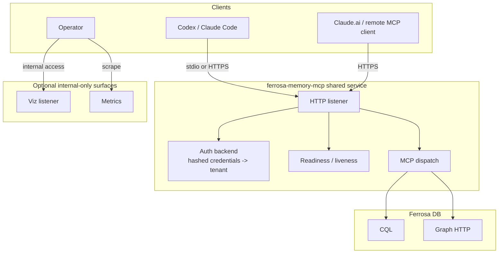

# Shared HTTP Deployment Blueprint

> Last updated: 2026-04-10
> Status: Blueprint update for shared-service deployment of `ferrosa-memory-mcp`

## Goal

Define a production-oriented deployment model for exposing `ferrosa-memory-mcp` over HTTP to multiple users while keeping stdio available for local development and fallback.

## Current Gaps

The current codebase is close to a deployable HTTP service, but the deployment boundary is not yet production-safe:

- `crates/ferrosa-memory-mcp/src/main.rs` currently accepts any HTTP username/password pair and maps it to the configured tenant.
- The viz server runs on a separate listener with a stdio-style tenant context rather than per-request authentication.
- `/health` reports process liveness only; there is no readiness signal for CQL connectivity or auth backend availability.
- TLS support exists, but secret sourcing and operational guidance are not defined.
- Multi-tenant behavior is implicit rather than documented as a strict policy.

## Deployment Decision

### Decision 1: Real auth for shared HTTP

Adopt per-principal HTTP authentication with explicit tenant mapping.

Baseline design:

- HTTP clients authenticate with Basic auth over TLS.
- Credentials are validated against a mounted auth file or env-configured secret source.
- Passwords are stored as hashes (`argon2id` preferred, `bcrypt` acceptable).
- Each principal maps to exactly one `tenant_id`.
- The service never derives `tenant_id` from request payloads, query strings, or default config in shared HTTP mode.

### Decision 2: Multi-tenant policy is principal-scoped

Shared HTTP mode is multi-tenant by credential principal, not by client-supplied `tenant_id`.

Rules:

- One authenticated principal maps to one tenant.
- All reads and writes remain scoped by the authenticated tenant context.
- `session_id` may remain client-provided where the API already expects it, but it is always interpreted inside the authenticated tenant.
- Default/random tenant generation is allowed only in local stdio mode.
- Shared HTTP mode must fail startup if no auth mapping source is configured.

### Decision 3: Viz is not part of the public shared endpoint

Keep viz code in the repo and binary for now, but treat it as a separate operational surface.

Short-term decision:

- Shared MCP HTTP endpoint exposes only MCP, liveness, readiness, and metrics.
- Viz is disabled by default in shared deployments.
- If viz is enabled, it binds to a separate listener and requires the same auth boundary as MCP or internal-network-only exposure behind an operator-controlled proxy.

### Decision 4: Health must distinguish liveness from readiness

Expose separate probe semantics:

- `/healthz/live` — process is running and request loop is responsive.
- `/healthz/ready` — service is ready to serve MCP traffic.

Readiness should require:

- CQL connection established.
- Auth backend loaded successfully.
- Config validation complete.
- If TLS is required, certificate and key loaded successfully.

Optional dependencies such as graph or enrichment endpoints should degrade readiness only if configured as required.

### Decision 5: Secret handling is file-first

Do not embed production secrets in `docker-compose.yml`, example configs, or committed env files.

Production secret sources:

- TLS cert/key mounted as files.
- Auth user database mounted as a file.
- Ferrosa credentials injected via environment or mounted config outside git.

## Recommended Runtime Modes

### Local development

- `transport = "stdio"`
- fixed `tenant_id` allowed
- viz enabled
- no shared auth requirement
- no TLS requirement

### Shared internal service

- `transport = "http"`
- real auth backend required
- TLS required
- fixed/default tenant disabled
- viz disabled by default
- liveness/readiness enabled

## Operational Shape

## Implementation Priorities

1. Replace permissive HTTP validator with real principal validation and tenant mapping.
2. Add startup validation for shared HTTP mode: auth source present, TLS configured, tenant fallback disabled.
3. Split probes into liveness and readiness.
4. Disable viz by default for shared HTTP and document safe operator-only exposure.
5. Add production container wiring for TLS/auth secret mounts.
6. Document client configs for Codex/Claude against the shared endpoint while preserving stdio fallback.
