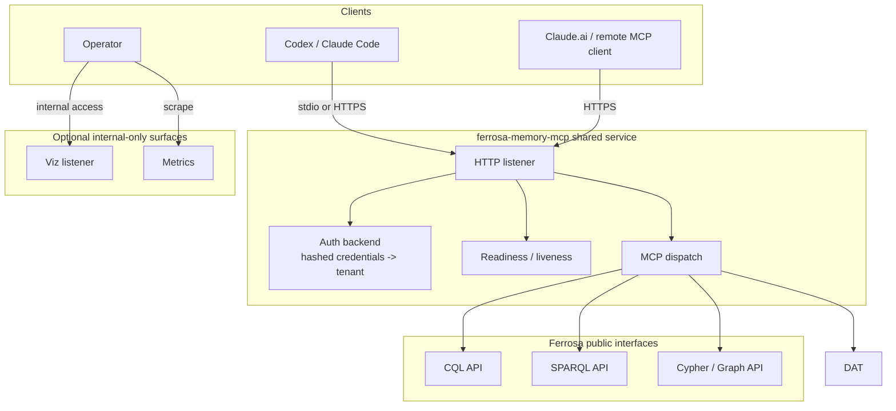

# Shared HTTP Deployment Rollout

> Last updated: 2026-04-19
> Status: Rollout docs aligned to the current shared-service behavior of `ferrosa-memory-mcp`, with the graph-boundary and query-passthrough correction called out explicitly

## Goal

Define a production-oriented deployment model for exposing `ferrosa-memory-mcp` over HTTP to multiple users while keeping stdio available for local development and fallback. The serving path should treat `ferrosa-memory` as a role-scoped client to Ferrosa rather than as an embedded table-level storage service.

## Current Code Reality

The shared HTTP boundary is now implemented with explicit startup validation and principal-scoped tenant routing:

- `validate_shared_http_config()` fails startup unless HTTP mode has TLS enabled, `cert_path`, `key_path`, and `auth_file` configured, and `server.tenant_id` omitted.
- HTTP authentication is file-backed Basic auth. `examples/http-auth.toml` maps one principal to one tenant, and the current on-disk password format is lowercase SHA-256 hex.
- `POST /mcp`, `GET /healthz/live`, `GET /healthz/ready`, and `GET /metrics` are served from the shared listener.
- Readiness is distinct from liveness. `/healthz/live` reports that the process is up; `/healthz/ready` reports role-aware Ferrosa client health for MCP serving (auth + app-table CQL + public query endpoints required by enabled features).
- Viz remains a separate surface. In HTTP mode it is unauthenticated, binds loopback only, and requires an explicit `[viz].tenant_id` if enabled.
- The auth file can be reloaded with `SIGHUP` without restarting the process.

The remaining rollout work is no longer operator query plumbing. CQL/SPARQL passthrough is now in place; the remaining correction is graph-table write cutover plus readiness/read-only gating under least-privilege `app_reader`.

## Boundary Rule

- Shared HTTP is an authenticated client boundary over Ferrosa at the supported abstraction level.
- Workbench CQL and SPARQL query surfaces should be authenticated passthroughs to Ferrosa public interfaces. Datalog remains a ferrosa-memory-owned query layer over Ferrosa-backed graph/app data.
- Direct CQL in the service is compatible with this deployment as long as it stays within app-table permissions; graph-table writes must not be required by the shared service.
- If a Ferrosa public API does not satisfy the required contract, `ferrosa-memory` should surface the failure clearly rather than emulate or patch around it locally.

## Deployment Rules

### Rule 1: Shared HTTP is principal-scoped multi-tenant

- One authenticated principal maps to one tenant.
- All reads and writes remain scoped by the authenticated tenant context.
- `session_id` may remain client-provided where the API already expects it, but it is always interpreted inside the authenticated tenant.
- Default/random tenant generation is allowed only in local stdio mode.
- Shared HTTP mode must fail startup if no auth mapping source is configured.

### Rule 2: Shared HTTP startup is fail-closed

- `transport = "http"` requires `require_tls = true`.
- `cert_path`, `key_path`, and `auth_file` must all be present before startup succeeds.
- `server.tenant_id` must be absent in shared HTTP mode.
- Startup validation happens before the listener binds.

### Rule 3: Health probes have different meanings

- `/healthz/live` — process is running and request loop is responsive.
- `/healthz/ready` — Ferrosa data-plane readiness. It should reflect auth, app-table CQL, and required public endpoints for the enabled features, and must not require graph-table `MODIFY`.
- TLS material and the auth file are startup prerequisites, not dynamic readiness inputs. If they are missing or unreadable at startup, the service does not start.

### Rule 4: Viz stays operator-only in HTTP deployments

- The public shared listener exposes MCP, probes, and metrics only.
- `viz.enabled = false` remains the default shared-service posture.
- If viz is enabled under HTTP mode, it binds `127.0.0.1` and requires `[viz].tenant_id`.
- Treat viz as a local/operator surface or keep it behind an operator-managed proxy. It is not covered by the per-request Basic-auth boundary.

### Rule 5: Secret handling remains file-first

- Mount TLS cert/key as files.
- Mount the auth principal database as a file.
- Keep Ferrosa credentials in non-git config or environment injection.
- Do not commit real credentials into repo examples or compose files.

## Recommended Runtime Modes

### Local development

- `transport = "stdio"`
- fixed `tenant_id` allowed
- viz enabled
- no shared auth requirement
- no TLS requirement

### Shared internal service

- `transport = "http"`
- real auth backend required
- TLS required
- fixed/default tenant disabled
- viz disabled by default
- liveness/readiness enabled

## Operational Shape

## Rollout Artifacts

These repo artifacts now carry the documented shared-HTTP posture:

- `examples/ferrosa-memory-http.toml` — shared HTTP server config with TLS/auth requirements and viz disabled by default
- `examples/http-auth.toml` — principal-to-tenant mapping file using the current SHA-256 digest format
- `examples/codex-shared-http.toml` — copy-pasteable remote MCP client config pointing at `https://.../mcp`
- `examples/claude-code-settings.json` — local stdio fallback client config
- `README.md` — operator guidance, probe semantics, and client snippets

## Remaining Operator Responsibilities

1. Replace placeholder certificates, keys, contact points, and principal entries before rollout.
2. Keep shared HTTP credentials and TLS materials mounted from outside git.
3. Trust the server certificate on clients before using the HTTPS endpoint.
4. Keep stdio config available as the fallback path for local development and debugging.
