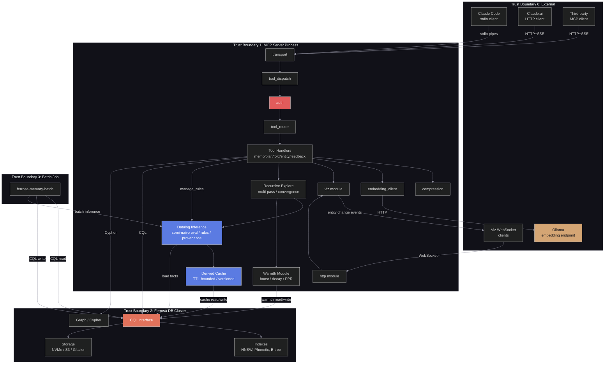
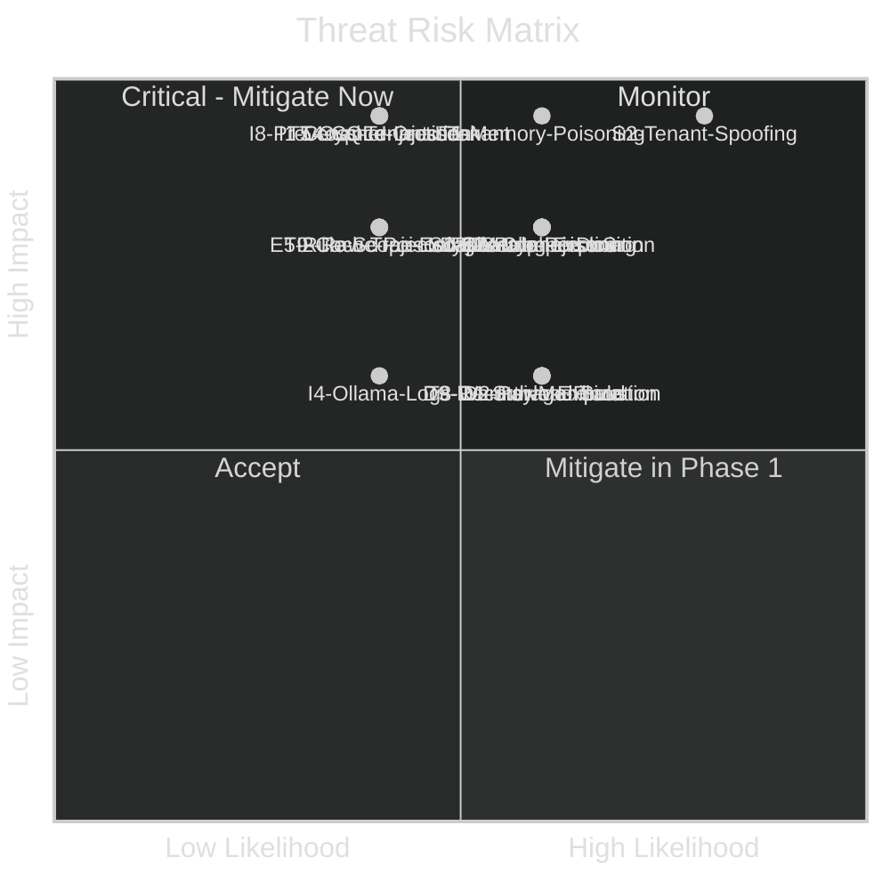

# STRIDE Threat Model — ferrosa-memory-mcp

> Last updated: 2026-04-22
> Status: Updated — shared HTTP deployment review added for auth boundary, probe semantics, secret handling, and viz exposure. The April 19 update adds expert-system knowledge-plane risks around effective rule loading, approvals, aliases, and explanation queries. The April 20 architecture correction narrows the boundary: direct CQL is acceptable for app-owned tables, but graph-owned table writes and local operator-query emulation are not acceptable serving-path behavior. The April 22 update adds `ingest_entities` bulk-ingest threats around silent row drops, schema drift, embedding exhaustion, and tenant enforcement.

## Scope

Full system: MCP clients -> ferrosa-memory-mcp -> Ferrosa DB. Includes stdio and HTTP transports, all MCP tools, graph layer, Datalog inference engine, embedding endpoint, viz dashboard surface, and nightly batch job. This update retains the shared HTTP deployment review and adds the planned expert-system knowledge plane: effective rule loading, symbolic claims, approvals, alias persistence, and explanation queries.

## Data Flow Diagram

## Trust Boundaries

| ID | Boundary | Crosses | Trust Level |
|----|----------|---------|-------------|
| TB0 | External clients -> MCP server | Network (HTTP) or process pipes (stdio) | Untrusted |
| TB1 | MCP server -> Ferrosa DB (CQL) | CQL wire protocol (TCP) | Authenticated, same-network |
| TB1b | MCP server -> Ferrosa DB (Graph) | HTTP POST to `/graph/query` | Authenticated (HTTP Basic), same-network |
| TB2 | MCP server -> Ollama | HTTP (local network) | Semi-trusted (no auth) |
| TB3 | Batch job -> Ferrosa DB | CQL wire protocol (TCP) | Authenticated, separate credentials |

## STRIDE Analysis

### S — Spoofing

| ID | Threat | Component | Risk | Mitigation |
|----|--------|-----------|------|------------|
| S1 | Attacker impersonates a legitimate MCP client over HTTP | transport (TB0) | **Critical** (L:4 x I:4 = 16) | Replace permissive validator with real principal validation. Require TLS. Fail startup when shared HTTP auth source is missing. |
| S2 | Client supplies a forged `tenant_id` in tool parameters | auth | **Critical** (L:4 x I:5 = 20) | `tenant_id` is NEVER client-supplied. Extracted from authenticated session only. Input schema rejects any `tenant_id` field in tool params. |
| S3 | Stdio client spoofing (local privilege escalation) | transport (TB0) | **Low** (L:1 x I:4 = 4) | stdio inherits process owner — OS-level trust. Document that stdio mode assumes local trust. |
| S4 | Batch job credentials compromised | batch job (TB3) | **Medium** (L:2 x I:4 = 8) | Separate CQL credentials for batch job with read-only on `feedback_outcomes`, write-only on `routing_guidelines`. Least privilege. |
| S5 | Viz and anomaly routes bypass MCP auth and reuse a stdio-style tenant context | viz module (TB0→TB1) | **High** (L:3 x I:4 = 12) | Do not expose viz on the public shared endpoint. If enabled, require the same auth boundary or internal-only exposure. |
| S7 | Rule injection via `manage_rules` tool — malicious agent injects rules that derive false facts, poisoning inference results | datalog (TB1) | **Medium** (L:3 x I:4 = 12) | Rule body validation (parse before storing — reject rules that don't produce valid AST). Rule family isolation (rules only operate within their declared family). Audit log for all rule changes with `tenant_id`, `session_id`, rule_id, old/new body. |

### T — Tampering

| ID | Threat | Component | Risk | Mitigation |
|----|--------|-----------|------|------------|
| T1 | Memory poisoning via crafted entity upserts (MemoryGraft attack) | entity_tools | **Critical** (L:3 x I:5 = 15) | Write-time confidence gating (reject < 0.7). Anomaly detection on retrieval frequency (>3σ flagged). Append-only audit log. |
| T2 | Poisoned memo cache entries returning wrong results | memo_tools | **High** (L:3 x I:4 = 12) | Content hash verification on read. TTL-based expiry limits poison window. Audit log on all writes. |
| T3 | Tampered fold summaries misleading future retrieval | fold_tools | **High** (L:2 x I:5 = 10) | Fold summaries written only by authenticated sessions. Compression is lossless-reversible for verification. `FOLDED_INTO` graph edges provide provenance chain. |
| T4 | CQL injection via tool parameters | cql_client | **High** (L:2 x I:5 = 10) | ALL queries use prepared statements with parameterized bindings. No string interpolation into CQL. |
| T5 | Cypher injection via entity names or queries | graph_client (HTTP) | **High** (L:2 x I:5 = 10) | Parameterized Cypher queries via HTTP POST. Entity names passed as parameters, never interpolated into query strings. Graph client uses HTTP Basic auth on same-network endpoint (TB1b). |
| T6 | Tampering with compressed data on S3 | storage (TB2) | **Medium** (L:1 x I:4 = 4) | S3 server-side encryption. Integrity check on decompression (store checksum alongside compressed data). |
| T7 | Smart ingest manipulation — adversarial content could game the prediction error gate to either flood entities or suppress legitimate ingestion | smart_ingest | **Low-Medium** (L:2 x I:3 = 6) | Rate limiting on ingest calls. Monitor prediction error distribution for anomalies. Confidence floor on entity extraction. |
| T8 | Warmth field manipulation — adversarial access patterns to artificially inflate warmth scores and bias retrieval toward attacker-controlled entities | warmth (TB1) | **Medium** (L:3 x I:3 = 9) | Max warmth cap (10.0) prevents unbounded inflation. Ebbinghaus decay normalization in consolidation. Anomaly detection on warmth distribution (flag entities with warmth >3σ above session mean). |
| T9 | Derived cache poisoning — corrupted or stale cache entries return wrong derived facts, leading to incorrect inference results | derived_cache (TB1→TB2) | **Low-High** (L:2 x I:4 = 8) | TTL limits exposure window (default 3600s). Cache key includes `rule_version` — rule changes invalidate affected entries. Provenance chain allows downstream verification of any derived fact. |
| T10 | Misconfigured shared HTTP startup uses default/fixed tenant for all users | auth / main bootstrap | **Critical** (L:3 x I:5 = 15) | Forbid fixed/default tenant fallback in shared HTTP mode. Startup validation must reject HTTP mode without explicit auth source and tenant mapping backend. |

### R — Repudiation

| ID | Threat | Component | Risk | Mitigation |
|----|--------|-----------|------|------------|
| R1 | Deny having written a poisoned entity or memo entry | entity_tools, memo_tools | **Medium** (L:3 x I:3 = 9) | Append-only audit log with `tenant_id`, `session_id`, timestamp, operation type. Audit rows cannot be deleted via MCP tools. **Status: PARTIAL** — CQL persistence added, but writes are best-effort (see R3). |
| R2 | Deny having submitted false feedback outcomes | feedback_tools | **Low** (L:2 x I:2 = 4) | `feedback_outcomes` is write-only via MCP, with `tenant_id` and `session_id` from auth context. |
| R3 | Audit log bypass via Ferrosa public CQL access outside the approved service path — if audit writes are best-effort (fire-and-forget), failed audit writes are invisible | audit_log | **Medium** (L:3 x I:3 = 9) | Audit writes must be synchronous or use a write-ahead log. Monitor audit write failure rate. Alert on gaps in audit sequence. |

### I — Information Disclosure

| ID | Threat | Component | Risk | Mitigation |
|----|--------|-----------|------|------------|
| I1 | Cross-tenant data leakage via crafted queries | cql_client | **Critical** (L:2 x I:5 = 10) | ALL CQL queries include `tenant_id` from auth context in WHERE clause. Partition key design ensures physical isolation. |
| I2 | Raw trajectory content exposed in hot storage | trajectory_folds | **High** (L:2 x I:4 = 8) | Compress within minutes of folding. Archive to Glacier within 30 days. `raw_trajectory` is the highest-risk field. |
| I3 | Embedding vectors reversed to reconstruct source text | all tables with embeddings | **Medium** (L:1 x I:3 = 3) | Embeddings alone are not reversible. Source text columns deleted with parent row on cascade delete. |
| I4 | Ollama endpoint logs contain sensitive prompt content | embedding_client (TB2) | **Medium** (L:2 x I:3 = 6) | Ollama runs on local/private network. Document that embedding requests contain text fragments. Configure Ollama to disable request logging in production. |
| I5 | Membership inference on agent memory store | all tables | **Medium** (L:2 x I:3 = 6) | Per "Unveiling Privacy Risks" paper. Mitigated by tenant isolation (attacker can only probe their own tenant). Rate limiting on retrieval tools. |
| I6 | Viz WebSocket broadcasts all entity changes to any connected client without tenant scoping | viz module | **High** (L:3 x I:4 = 12) | Not mitigated for shared deployment. Keep viz off the public shared endpoint unless it shares the MCP auth boundary and tenant scoping. |
| I7 | Spreading activation traversal could leak entity relationships across session boundaries | spread_activation | **Low-Medium** (L:2 x I:3 = 6) | Traversal queries must include `tenant_id` filter at every hop. Session-scoped activation should not cross into other sessions' private entities. |
| I8 | Provenance leaks cross-tenant facts — provenance chain for a derived fact references parent facts from other tenants, disclosing their existence or content | datalog / provenance (TB1→TB2) | **Critical** (L:2 x I:5 = 10) | All provenance queries scoped by `tenant_id` at the Storage trait level. `load_session_facts()` only loads facts for the authenticated tenant. Tenant isolation enforced in every Storage method (warmth, rules, cache, provenance). Integration test: derive facts in tenant A, query provenance in tenant B, verify empty result. |

### D — Denial of Service

| ID | Threat | Component | Risk | Mitigation |
|----|--------|-----------|------|------------|
| D1 | Flood of `store_memo_result` calls fills storage | memo_tools | **Medium** (L:3 x I:3 = 9) | `max_memo_results` config cap. TTL-based expiry. Per-tenant storage quotas (Ferrosa-level). **Status: MITIGATED** — quotas implemented (commit 57cf61b). |
| D2 | Large `raw_trajectory` payloads in `append_to_fold` | fold_tools | **Medium** (L:3 x I:3 = 9) | Max payload size on `repl_turn` input (configurable, default 64KB). Token count tracking surfaces growth to caller. |
| D3 | Expensive Cypher traversals on large entity graphs | graph_client | **High** (L:3 x I:4 = 12) | Query timeout on Cypher executions (configurable, default 5s). Limit traversal depth in all Cypher queries (max 3 hops). |
| D4 | HTTP connection exhaustion | transport | **Medium** (L:3 x I:3 = 9) | Connection limit per source IP. Tokio's async model handles backpressure naturally. |
| D5 | Ollama endpoint unavailable stalls tool calls | embedding_client | **Medium** (L:3 x I:3 = 9) | Timeout on embedding requests (default 10s). Graceful degradation: tools that require embedding fail fast with clear error, don't block other tools. |
| D6 | Spreading activation with large `max_hops` on dense graphs could exhaust CPU | spread_activation | **Medium** (L:3 x I:3 = 9) | `max_hops` capped at 5 in tool schema. Visited-node set bounds total work. Query timeout on underlying Cypher traversals. |
| D7 | Dream consolidation O(n^2) entity comparison could be slow for large sessions | run_consolidation | **Low** (L:2 x I:2 = 4) | Consolidation runs as background task. Limit batch size per invocation. Monitor execution time and abort if threshold exceeded. |
| D8 | Datalog fact explosion — recursive rules on dense graphs produce unbounded derived facts, exhausting memory and CPU | datalog (TB1) | **High** (L:3 x I:4 = 12) | `max_facts=50000` hard cap on total derived facts. `max_iterations=100` hard cap on semi-naive evaluation rounds. Entity cap 1000 bounds input graph size. Log warning and bail on any cap hit. Alert if >50 iterations on any single evaluation. |
| D9 | Recursive explore resource exhaustion — deep recursive passes with expensive sub-queries consume CPU and memory disproportionate to a single tool call | recursive_explore (TB1) | **Medium** (L:3 x I:3 = 9) | Max 5 passes hard cap. Per-pass 2s timeout. Max 50 entities total across all passes. Total exploration timeout. Convergence detection stops early when no new facts derived. |

### E — Elevation of Privilege

| ID | Threat | Component | Risk | Mitigation |
|----|--------|-----------|------|------------|
| E1 | MCP client escalates to batch job credentials | auth | **High** (L:1 x I:5 = 5) | Batch job uses separate CQL credentials, not accessible via MCP server process. Different auth context. |
| E2 | Tool call accesses `feedback_outcomes` read path | feedback_tools | **Medium** (L:2 x I:3 = 6) | `record_outcome` is write-only. No MCP tool exposes `SELECT` on `feedback_outcomes`. Read access only via batch job credentials. |
| E3 | Attacker chains memo poisoning + routing manipulation | tool_router + memo_tools | **High** (L:1 x I:5 = 5) | Routing guidelines are written only by batch job (separate credentials). Memo cache doesn't influence routing decisions directly — only `feedback_outcomes` does, and that table is write-only via MCP. |
| E4 | Session deletion without ownership verification — any authenticated tenant could delete another tenant's session | delete_session | **Critical** (L:2 x I:5 = 10) | `delete_session` must enforce `tenant_id` scoping — verify session belongs to requesting tenant before deletion. Return error if session not found within tenant scope. |
| E5 | `manage_rules` allows arbitrary Datalog execution — custom rules could access data outside session scope, enabling cross-session or cross-tenant fact inference | datalog / manage_rules (TB1) | **High** (L:2 x I:4 = 8) | Rules only operate on session-scoped fact sets loaded by `load_session_facts()`. No cross-session or cross-tenant fact loading — the evaluator receives a closed `FactSet`, not a storage handle. Rule body validation rejects predicates that don't match the canonical schema. |

## Expert-System Knowledge Plane Addendum

These are the new threats introduced by the planned rule/claim/approval/alias/explanation surface. They are not separate trust boundaries, but they do add new ways for symbolic state to be tampered with or surfaced incorrectly.

| ID | STRIDE | Threat | Component | Risk | Mitigation |
|----|--------|--------|-----------|------|------------|
| ES-S1 | Spoofing | Reviewer identity for approvals is caller-supplied instead of auth-derived, allowing fabricated human sign-off | approval store / MCP approval tools | **High** (L:3 x I:4 = 12) | Reviewer principal must come from authenticated context only. Approval rows are append-only and attributable. |
| ES-T1 | Tampering | Effective-rule-set drift: operators believe a stored rule is active, but runtime inference still evaluates only built-ins on some paths | rule registry / effective rule loader | **High** (L:4 x I:4 = 16) | One `EffectiveRuleSet` loader must back `manage_rules`, `query_derived`, `recursive_explore`, and `promotion`. No direct `builtin_rules()` runtime calls outside the loader. |
| ES-T2 | Tampering | Alias registry changes silently redirect tool calls or inject fixed arguments across the wrong scope | alias store | **High** (L:3 x I:4 = 12) | Exact scoped lookup first, approval gate for promoted aliases, audit trail on every alias mutation, and shadow-mode preview before activation. |
| ES-R1 | Repudiation | Approval and rejection decisions are not durable or immutable enough for audit and replay | approval store | **High** (L:3 x I:4 = 12) | Dedicated append-only approval/event log with reviewer, scope, decision, and timestamp. |
| ES-I1 | Information Disclosure | Explanation queries leak rejected claims, reviewer notes, or supporting facts outside the request scope | explanation API / provenance | **High** (L:2 x I:5 = 10) | Scope explanation reads exactly like fact/rule reads; redact reviewer-only fields unless explicitly authorized. |
| ES-D1 | Denial of Service | Explanation reconstruction walks large support chains on demand, causing unbounded query cost | explanation API | **Medium** (L:3 x I:3 = 9) | Bound chain depth and support count, cache hot explanations, and precompute indexes for the common workbench views. |
| ES-E1 | Elevation of Privilege | Unapproved claims or rules are treated as active inference inputs because approval state is not enforced at load time | claim / approval / effective rule integration | **Critical** (L:2 x I:5 = 10) | Loaders must filter to approved or explicitly-requested draft artifacts. Approval state is part of the runtime selection contract, not just UI metadata. |

## Endpoint-Only Client Boundary Addendum

These threats are introduced by the architectural correction itself: `ferrosa-memory` must act as a client at the correct abstraction boundary instead of treating graph-owned storage tables as a public API or hiding public query bugs behind local emulation.

| ID | STRIDE | Threat | Component | Risk | Mitigation |
|----|--------|--------|-----------|------|------------|
| EO-T1 | Tampering | Graph writes bypass the public Cypher/graph API and write directly into graph-owned backing tables, bypassing graph-engine invariants and audit hooks | graph write path / `cql_storage` | **Critical** (L:3 x I:5 = 15) | Route all graph mutations through the public Cypher/graph interface. No serving-path write may name graph-owned backing tables directly. |
| EO-T2 | Tampering | Workbench CQL or Datalog paths emulate Ferrosa semantics locally, masking public API bugs and returning misleading operator results | workbench query surfaces / `expert_system` | **High** (L:4 x I:4 = 16) | Replace local emulation with authenticated passthrough adapters. If the public API is wrong, surface the failure and fix Ferrosa. |
| EO-R1 | Repudiation | Direct writes to graph-owned backing tables bypass graph-interface telemetry and make it impossible to reason about who mutated graph state through the supported surface | serving-path graph/storage code | **High** (L:3 x I:4 = 12) | Constrain graph writes to public graph interfaces that carry auth, logging, and audit context. Move graph-table maintenance code out of the serving path. |
| EO-E1 | Elevation of Privilege | The service requires privileges beyond the planned `app_reader` role because startup or write paths still depend on graph-table MODIFY access | runtime storage/bootstrap | **Critical** (L:3 x I:5 = 15) | Make the serving path compatible with role-auth rollout: `app_reader` may read graph tables and read/write app tables, but graph mutations must go through graph-engine interfaces. |

## Risk Summary

The matrix above captures the established core system risks. The highest-priority expert-system and architecture-correction items are `ES-T1` (effective-rule-set drift), `ES-I1` (scope leaks through explanations), `ES-E1` (approval bypass on runtime loading), `EO-T1` (graph-write invariant bypass), and `EO-E1` (direct-storage privilege bypass).

## Bulk Ingest Addendum

These threats are introduced by the planned `ingest_entities` surface: one batch MCP call that owns schema mapping, embedding policy, and row-level failure semantics for application data.

| ID | STRIDE | Threat | Component | Risk | Mitigation |
|----|--------|--------|-----------|------|------------|
| BI-S1 | Spoofing | Caller supplies a `tenant_id` or `session_id` outside its authenticated scope and the server trusts it as routing input | bulk ingest auth / validation | **Critical** (L:3 x I:5 = 15) | Validate request tenant/session against authenticated context. `tenant_id` may be echoed in the payload for diagnostics, but it is not authoritative over auth context. |
| BI-T1 | Tampering | Row validation reproduces the old loader behavior of swallowing exceptions, causing silent entity or edge drops | bulk ingest execution | **Critical** (L:4 x I:5 = 20) | Every row failure must appear in `failed[]`. No catch-and-continue path may suppress row-level reasons. |
| BI-T2 | Tampering | Client schema drift causes fields or attrs to be written to the wrong columns or ignored silently | bulk ingest schema mapping | **High** (L:4 x I:4 = 16) | Server owns schema mapping and advertises `schema_version`. Unknown attrs fail loudly with structured reasons. |
| BI-T3 | Tampering | `on_conflict=update` overwrites resident data incorrectly or `skip` mutates data despite caller intent | conflict handling | **High** (L:3 x I:4 = 12) | Explicit per-mode tests. Response distinguishes inserted, updated, skipped, and failed rows. |
| BI-I1 | Information Disclosure | Batch failure details or progress notifications leak other-tenant entity existence through endpoint validation | bulk ingest response/progress | **High** (L:2 x I:5 = 10) | Scope endpoint resolution to the authenticated tenant/session only. Failure reasons must not disclose other-tenant residents. |
| BI-D1 | Denial of Service | `embed_missing=true` on large batches overwhelms Ollama or blocks all write progress | embedding pipeline | **High** (L:3 x I:4 = 12) | Bound batch size, rate limit embedding calls, emit progress, and report per-row embedding failures without hanging the batch indefinitely. |
| BI-R1 | Repudiation | Partial-ingest outcomes are ambiguous, so callers cannot prove what was or was not written | batch result/audit | **Medium** (L:3 x I:3 = 9) | Return structured counters plus `failed[]`. Add audit/event logging for batch id, tenant, and per-row outcomes. |
| BI-E1 | Elevation of Privilege | Bulk ingest bypasses graph-write boundary and directly mutates graph-owned tables for typed edges | bulk ingest edge path | **Critical** (L:3 x I:5 = 15) | Edge writes follow the same public-graph boundary as the rest of the serving path. No direct graph-table write path is introduced for ingest convenience. |

## Critical Threats (Must mitigate before v1.0)

1. **S2 — Tenant ID spoofing:** Architectural invariant — `tenant_id` never from client input. **Status: MITIGATED** — `TenantContext` required param in all handlers, type-system enforced.
1. **T1 — Memory poisoning (MemoryGraft):** Confidence gating + anomaly detection + audit log. **Status: PARTIAL** — confidence gating (>=0.7) implemented, rate limiting (1000/session) implemented. Anomaly detection on retrieval frequency implemented (commit 2226409). Audit log NOT yet implemented.
1. **T4/T5 — CQL/Cypher injection:** Prepared statements only, zero string interpolation. **Status: MITIGATED** — all 17 CQL prepared statements parameterized. Graph queries use HTTP POST with serialized parameters.
1. **I1 — Cross-tenant leakage:** Partition key design + auth-scoped queries. **Status: MITIGATED** — every CQL query includes `tenant_id` from auth context.

## High Threats (Mitigate in Phase 1-2)

5. **S1 — Client impersonation:** TLS + real principal validation. **Status: NOT MITIGATED FOR SHARED HTTP** — TLS code exists, but the current validator accepts any credentials and maps them to the configured tenant.
1. **S5 — Viz auth bypass:** separate listener currently does not share the MCP auth boundary. **Status: NOT MITIGATED FOR SHARED DEPLOYMENT** — safe only when viz remains local/internal.
1. **T10 — Shared tenant fallback:** HTTP mode can still rely on a configured/fallback tenant. **Status: NOT MITIGATED** — startup validation required.
1. **T2 — Memo cache poisoning:** Content hash verification + TTL. **Status: MITIGATED** — SHA-256 content hash, model version isolation, TTL support.
1. **D3 — Cypher DoS:** Query timeout + depth limit. **Status: PARTIAL** — depth limit in traversal queries, but no explicit query timeout configured on HTTP client.
1. **I2 — Raw trajectory exposure:** Compress fast, archive fast. **Status: PARTIAL** — compression engine working, but background compression job and S3 lifecycle not yet wired.

## Sprint 5 Threats (Mitigate during Sprint 5)

9. **I8 — Provenance cross-tenant leakage:** All provenance queries scoped by `tenant_id`. Fact loading is tenant-isolated. **Status: PLANNED** — Storage trait design enforces tenant scoping. Integration test required.
1. **S7 — Rule injection:** Parse and validate rule body before storage. Rule family isolation. Audit log. **Status: PLANNED** — `parse_rule()` validation gate required in `manage_rules` handler.
1. **D8 — Datalog fact explosion:** Hard caps on facts (50000), iterations (100), entities (1000). **Status: PLANNED** — caps configured in `[datalog]` config section.
1. **D9 — Recursive explore exhaustion:** Max 5 passes, per-pass timeout, max 50 entities. **Status: PLANNED** — guard rails configured in `[rmh]` config section.
1. **E5 — Rule scope escape:** Rules operate on closed `FactSet`, not storage handles. No cross-session fact loading. **Status: PLANNED** — architectural constraint in `evaluate()` API design.
1. **T8 — Warmth manipulation:** Max warmth cap 10.0, Ebbinghaus decay, anomaly detection. **Status: PLANNED** — cap enforced in `warmth_boost()`.
1. **T9 — Derived cache poisoning:** TTL limits window, `rule_version` in cache key, provenance allows verification. **Status: PLANNED** — cache key design includes rule version.
