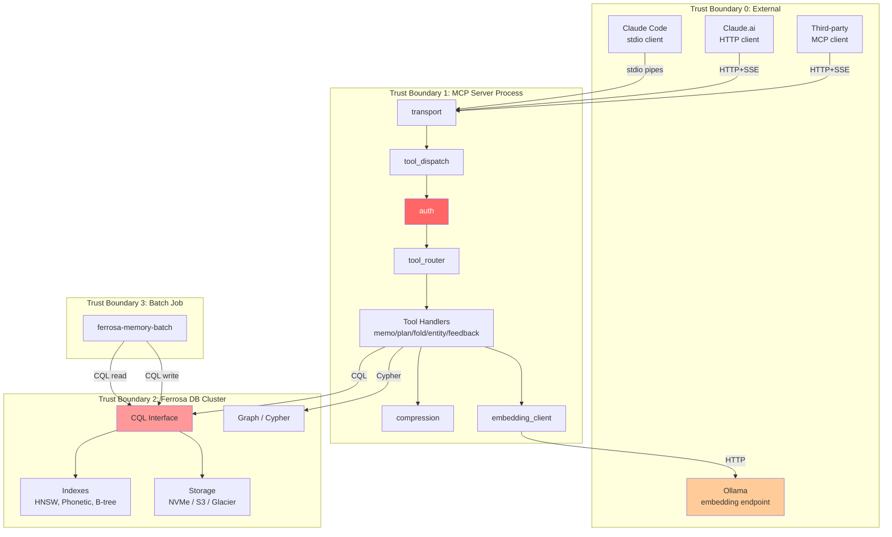
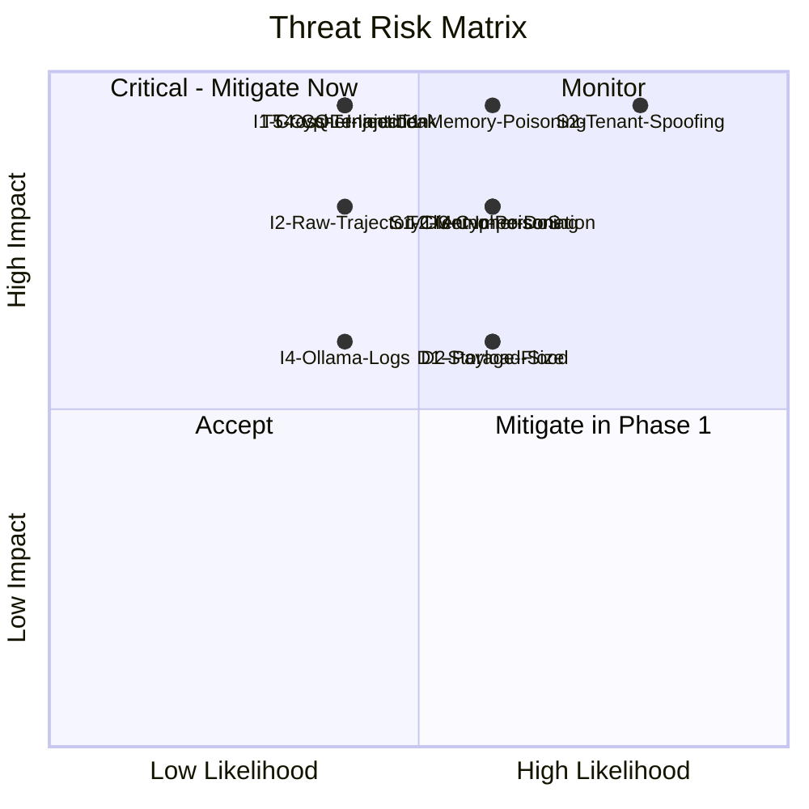

# STRIDE Threat Model — ferrosa-memory-mcp

> Last updated: 2026-03-21
> Status: Updated — graph path changed to HTTP, TLS enforcement status noted

## Scope

Full system: MCP clients -> ferrosa-memory-mcp -> Ferrosa DB. Includes stdio and HTTP+SSE transports, all 12 MCP tools, 6 CQL tables, graph layer, embedding endpoint, and nightly batch job.

## Data Flow Diagram

## Trust Boundaries

| ID | Boundary | Crosses | Trust Level |
|----|----------|---------|-------------|
| TB0 | External clients -> MCP server | Network (HTTP) or process pipes (stdio) | Untrusted |
| TB1 | MCP server -> Ferrosa DB (CQL) | CQL wire protocol (TCP) | Authenticated, same-network |
| TB1b | MCP server -> Ferrosa DB (Graph) | HTTP POST to `/graph/query` | Authenticated (HTTP Basic), same-network |
| TB2 | MCP server -> Ollama | HTTP (local network) | Semi-trusted (no auth) |
| TB3 | Batch job -> Ferrosa DB | CQL wire protocol (TCP) | Authenticated, separate credentials |

## STRIDE Analysis

### S — Spoofing

| ID | Threat | Component | Risk | Mitigation |
|----|--------|-----------|------|------------|
| S1 | Attacker impersonates a legitimate MCP client over HTTP | transport (TB0) | **High** (L:3 x I:4 = 12) | HTTP Basic auth over TLS. Reject connections without valid credentials. |
| S2 | Client supplies a forged `tenant_id` in tool parameters | auth | **Critical** (L:4 x I:5 = 20) | `tenant_id` is NEVER client-supplied. Extracted from authenticated session only. Input schema rejects any `tenant_id` field in tool params. |
| S3 | Stdio client spoofing (local privilege escalation) | transport (TB0) | **Low** (L:1 x I:4 = 4) | stdio inherits process owner — OS-level trust. Document that stdio mode assumes local trust. |
| S4 | Batch job credentials compromised | batch job (TB3) | **Medium** (L:2 x I:4 = 8) | Separate CQL credentials for batch job with read-only on `feedback_outcomes`, write-only on `routing_guidelines`. Least privilege. |

### T — Tampering

| ID | Threat | Component | Risk | Mitigation |
|----|--------|-----------|------|------------|
| T1 | Memory poisoning via crafted entity upserts (MemoryGraft attack) | entity_tools | **Critical** (L:3 x I:5 = 15) | Write-time confidence gating (reject < 0.7). Anomaly detection on retrieval frequency (>3σ flagged). Append-only audit log. |
| T2 | Poisoned memo cache entries returning wrong results | memo_tools | **High** (L:3 x I:4 = 12) | Content hash verification on read. TTL-based expiry limits poison window. Audit log on all writes. |
| T3 | Tampered fold summaries misleading future retrieval | fold_tools | **High** (L:2 x I:5 = 10) | Fold summaries written only by authenticated sessions. Compression is lossless-reversible for verification. `FOLDED_INTO` graph edges provide provenance chain. |
| T4 | CQL injection via tool parameters | cql_client | **High** (L:2 x I:5 = 10) | ALL queries use prepared statements with parameterized bindings. No string interpolation into CQL. |
| T5 | Cypher injection via entity names or queries | graph_client (HTTP) | **High** (L:2 x I:5 = 10) | Parameterized Cypher queries via HTTP POST. Entity names passed as parameters, never interpolated into query strings. Graph client uses HTTP Basic auth on same-network endpoint (TB1b). |
| T6 | Tampering with compressed data on S3 | storage (TB2) | **Medium** (L:1 x I:4 = 4) | S3 server-side encryption. Integrity check on decompression (store checksum alongside compressed data). |

### R — Repudiation

| ID | Threat | Component | Risk | Mitigation |
|----|--------|-----------|------|------------|
| R1 | Deny having written a poisoned entity or memo entry | entity_tools, memo_tools | **Medium** (L:3 x I:3 = 9) | Append-only audit log with `tenant_id`, `session_id`, timestamp, operation type. Audit rows cannot be deleted via MCP tools. |
| R2 | Deny having submitted false feedback outcomes | feedback_tools | **Low** (L:2 x I:2 = 4) | `feedback_outcomes` is write-only via MCP, with `tenant_id` and `session_id` from auth context. |

### I — Information Disclosure

| ID | Threat | Component | Risk | Mitigation |
|----|--------|-----------|------|------------|
| I1 | Cross-tenant data leakage via crafted queries | cql_client | **Critical** (L:2 x I:5 = 10) | ALL CQL queries include `tenant_id` from auth context in WHERE clause. Partition key design ensures physical isolation. |
| I2 | Raw trajectory content exposed in hot storage | trajectory_folds | **High** (L:2 x I:4 = 8) | Compress within minutes of folding. Archive to Glacier within 30 days. `raw_trajectory` is the highest-risk field. |
| I3 | Embedding vectors reversed to reconstruct source text | all tables with embeddings | **Medium** (L:1 x I:3 = 3) | Embeddings alone are not reversible. Source text columns deleted with parent row on cascade delete. |
| I4 | Ollama endpoint logs contain sensitive prompt content | embedding_client (TB2) | **Medium** (L:2 x I:3 = 6) | Ollama runs on local/private network. Document that embedding requests contain text fragments. Configure Ollama to disable request logging in production. |
| I5 | Membership inference on agent memory store | all tables | **Medium** (L:2 x I:3 = 6) | Per "Unveiling Privacy Risks" paper. Mitigated by tenant isolation (attacker can only probe their own tenant). Rate limiting on retrieval tools. |

### D — Denial of Service

| ID | Threat | Component | Risk | Mitigation |
|----|--------|-----------|------|------------|
| D1 | Flood of `store_memo_result` calls fills storage | memo_tools | **Medium** (L:3 x I:3 = 9) | `max_memo_results` config cap. TTL-based expiry. Per-tenant storage quotas (Ferrosa-level). |
| D2 | Large `raw_trajectory` payloads in `append_to_fold` | fold_tools | **Medium** (L:3 x I:3 = 9) | Max payload size on `repl_turn` input (configurable, default 64KB). Token count tracking surfaces growth to caller. |
| D3 | Expensive Cypher traversals on large entity graphs | graph_client | **High** (L:3 x I:4 = 12) | Query timeout on Cypher executions (configurable, default 5s). Limit traversal depth in all Cypher queries (max 3 hops). |
| D4 | HTTP connection exhaustion | transport | **Medium** (L:3 x I:3 = 9) | Connection limit per source IP. Tokio's async model handles backpressure naturally. |
| D5 | Ollama endpoint unavailable stalls tool calls | embedding_client | **Medium** (L:3 x I:3 = 9) | Timeout on embedding requests (default 10s). Graceful degradation: tools that require embedding fail fast with clear error, don't block other tools. |

### E — Elevation of Privilege

| ID | Threat | Component | Risk | Mitigation |
|----|--------|-----------|------|------------|
| E1 | MCP client escalates to batch job credentials | auth | **High** (L:1 x I:5 = 5) | Batch job uses separate CQL credentials, not accessible via MCP server process. Different auth context. |
| E2 | Tool call accesses `feedback_outcomes` read path | feedback_tools | **Medium** (L:2 x I:3 = 6) | `record_outcome` is write-only. No MCP tool exposes `SELECT` on `feedback_outcomes`. Read access only via batch job credentials. |
| E3 | Attacker chains memo poisoning + routing manipulation | tool_router + memo_tools | **High** (L:1 x I:5 = 5) | Routing guidelines are written only by batch job (separate credentials). Memo cache doesn't influence routing decisions directly — only `feedback_outcomes` does, and that table is write-only via MCP. |

## Risk Summary

## Critical Threats (Must mitigate before v1.0)

1. **S2 — Tenant ID spoofing:** Architectural invariant — `tenant_id` never from client input. **Status: MITIGATED** — `TenantContext` required param in all handlers, type-system enforced.
1. **T1 — Memory poisoning (MemoryGraft):** Confidence gating + anomaly detection + audit log. **Status: PARTIAL** — confidence gating (>=0.7) implemented, rate limiting (1000/session) implemented. Anomaly detection and audit log NOT yet implemented.
1. **T4/T5 — CQL/Cypher injection:** Prepared statements only, zero string interpolation. **Status: MITIGATED** — all 17 CQL prepared statements parameterized. Graph queries use HTTP POST with serialized parameters.
1. **I1 — Cross-tenant leakage:** Partition key design + auth-scoped queries. **Status: MITIGATED** — every CQL query includes `tenant_id` from auth context.

## High Threats (Mitigate in Phase 1-2)

5. **S1 — Client impersonation:** TLS + HTTP Basic auth. **Status: PARTIAL** — HTTP Basic auth implemented, but `require_tls: false` currently hardcoded in main.rs. TLS enforcement needed before production HTTP deployment.
1. **T2 — Memo cache poisoning:** Content hash verification + TTL. **Status: MITIGATED** — SHA-256 content hash, model version isolation, TTL support.
1. **D3 — Cypher DoS:** Query timeout + depth limit. **Status: PARTIAL** — depth limit in traversal queries, but no explicit query timeout configured on HTTP client.
1. **I2 — Raw trajectory exposure:** Compress fast, archive fast. **Status: PARTIAL** — compression engine working, but background compression job and S3 lifecycle not yet wired.
