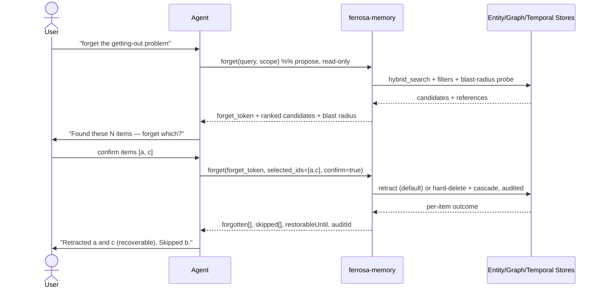

# Forget Memory — Candidate-Confirmed Forgetting

> Last updated: 2026-06-12
> Status: Implemented (v1) on branch `feat/forget-memory`. Known v1 limits: edges are deleted (not soft-marked) on retract and not auto-recreated on restore; full node+edge teardown completes once graph `DETACH DELETE` lands (ferrosa QEC Milestone 1); journal crash-recovery sweep (T-FORGET-012) is a follow-up.

## Overview

Today a user can only *forget* a memory if they already know its exact
`entity_id` (`demote_memory`, `batch_delete_entities`), nuke a whole session
(`delete_session`), or wait for time-based decay (`memory-lifecycle.md`, Phase 4).
There is no way for a user to say **"forget X"** in natural language and have the
system find what they mean, show them what it found, and remove only the items
they confirm.

This spec defines a **`forget`** MCP tool that closes that gap with a
**propose → confirm → forget** workflow:

1. **Propose** (read-only): search for candidate memories matching the intent,
   rank them, and disclose each candidate's *blast radius* (the edges, temporal
   chains, and folds that reference it).
2. **Confirm**: forget only the candidates the user explicitly approves.

Forgetting **defaults to a reversible retraction** (the item is excluded from all
recall but recoverable and audited); permanent deletion is opt-in via a `hard`
flag. The system **never destroys or hides anything without explicit
confirmation** — even for a single high-confidence match.

This mirrors the confirm-before-mutation contract established by the `describe`
management tool (`managementActions[].requiresConfirmation`) and the repo's
fail-loud / never-silently-drop-data rules.

## Diagram



## User Requirements

| ID | Requirement |
| --- | --- |
| URS-FORGET-001 | When a user expresses intent to forget, the system shall surface candidate memory items matching that intent rather than requiring exact IDs. |
| URS-FORGET-002 | The system shall never retract, hide, or delete a memory item without explicit user confirmation of the specific items, even when exactly one candidate matches. |
| URS-FORGET-003 | Forgetting shall default to a reversible retraction; permanent deletion shall require an explicit `hard` flag. |
| URS-FORGET-004 | Before confirmation, the system shall disclose each candidate's blast radius (dependent edges, temporal chains, folds, referencing entities). |
| URS-FORGET-005 | Every propose and forget action shall be recorded in the audit log with actor, timestamp, query, mode, and affected IDs. |
| URS-FORGET-006 | The system shall detect and refuse to forget a candidate that has materially changed since it was proposed (consistency / TOCTOU guard). |
| URS-FORGET-007 | Retracted items shall be excluded from all recall and search but remain restorable until they are permanently purged. |
| URS-FORGET-008 | The agent shall be guided to invoke the propose step automatically when the user expresses a "forget" intent, and to require confirmation before the forget step. |
| URS-FORGET-009 | Forgetting an item shall leave **no dangling edges**: every edge referencing the item — inbound (`dst = item`) and outbound (`src = item`), across all edge types (typed, `CO_OCCURS`, `MENTIONED_IN`, `FOLDED_INTO`, `SUPERSEDES`) — and every temporal supersession link shall be retracted (soft) or deleted (hard) **atomically** with the item, so no surviving edge points to a forgotten fact. |

## Functional Specification

### Tool

- **Tool name**: `forget` (short alias `forget`).
- **Phases**: a request is **propose** when it omits `forget_token`, and
  **confirm** when it supplies `forget_token` + `confirm: true`.
- **Mutation**: propose is read-only and idempotent; confirm is the only
  mutating path.
- **Tier**: tier-1 (this is a user-facing memory operation), unlike `describe`.

### Propose — request

```json
{
  "query": "the getting-out / outbound-port problem",
  "scope": {
    "session_id": "…",
    "repo": "/Users/bkearns/src/ferrosa-suite/ferrosa-memory",
    "entity_types": ["concept", "feedback"],
    "since": "2026-06-01T00:00:00Z",
    "until": null
  },
  "limit": 10,
  "include_edges": true,
  "include_temporal": true
}
```

`query` is required; everything in `scope` is optional and ANDed. Candidate
retrieval reuses `hybrid_search` plus the structured filters already available
to `list_entities` / `count_entities_by_type`.

### Propose — response

```json
{
  "forget_token": "ft_…",            // opaque, TTL-bounded, encodes candidate set + content hashes + scope
  "expires_at": "2026-06-12T12:10:00Z",
  "default_mode": "retract",
  "candidates": [
    {
      "id": "…",
      "type": "concept",
      "name": "outbound port exhaustion on sleep",
      "snippet": "laptop sleep + stale loop held outbound sockets…",
      "match_score": 0.82,
      "state": "active",
      "last_accessed": "2026-06-12T09:00:00Z",
      "content_hash": "sha256:…",
      "blast_radius": {
        "edges": 3,
        "temporal_chains": 1,
        "folds": 0,
        "referenced_by_entities": 2
      }
    }
  ],
  "summary": { "candidate_count": 1, "high_impact_count": 0 },
  "warnings": []
}
```

### Confirm — request

```json
{
  "forget_token": "ft_…",
  "selected_ids": ["…"],
  "mode": "retract",               // "retract" (default, reversible) | "hard" (permanent)
  "reason": "user said forget",
  "acknowledge_high_impact": false,
  "confirm": true
}
```

### Confirm — response

```json
{
  "forgotten": [
    { "id": "…", "outcome": "retracted", "new_state": "unavailable" }
  ],
  "skipped": [
    { "id": "…", "reason": "changed since proposed" }
  ],
  "restorable_until": "2026-07-12T00:00:00Z",
  "audit_id": "…"
}
```

### Companion — `restore_forgotten`

`restore_forgotten(id)` reverses a retraction (un-retracts: restores the prior
memory state and unmarks the referencing edges, temporal links, and derived rows
that were retracted with it). **Ships in v1, alongside `forget`.** Available only
while the item is restorable (not yet purged) and only for `retract`-mode
forgets — `hard` deletes are irreversible.

## Design Specification

### Candidate retrieval

- **Any memory object is forgettable** (URS-FORGET-001): entities, folds, memos,
  intentions, temporal facts, and edges. The propose step searches across all of
  these object types and returns a heterogeneous candidate list (each candidate
  carries its `object_type`).
- **Cross-session search.** Candidate retrieval reuses `hybrid_search` with
  `scope: "all"` so anything in the tenant's memory is reachable, but candidates
  in the **current session are ranked first** (current-session match gets a
  ranking boost). Intersect with the structured `scope` filters; de-prioritize
  items already in `Unavailable`/retracted state.
- Cap candidates at `limit` (default 10, max 50); `log()` when truncated so the
  user knows the set wasn't exhaustive.

### Blast radius

- For each candidate, count referencing `edges` (graph), `temporal_chains`
  (supersession/temporal facts), `folds`, and `referenced_by_entities`. These
  are read-only count queries with bounded timeouts. A candidate whose counts
  exceed a configured threshold is flagged `high_impact`.
- The edge count **must include both directions** — inbound (`dst = candidate`)
  and outbound (`src = candidate`) — because the cleanup must remove both, and
  the user needs to see the true blast radius. Inbound edges are the ones that
  would become dangling references if missed (URS-FORGET-009).

### Referential integrity (no dangling edges)

The single most important invariant: **after a forget, no surviving edge or
temporal link may reference the forgotten item.**

- Enumerate **all** referencing relationships in both directions before
  mutating. Legacy edges (`CO_OCCURS`, `MENTIONED_IN`, `SUPERSEDES`) are already
  bidirectional via `edge_list_for_entity` (matches source *or* target). **Typed
  edges only have an outbound query (`typed_edge_list_from`) today** — an
  inbound/by-destination lookup must be added first (see Prerequisites). Also
  enumerate `FOLDED_INTO` and temporal supersession chains.
- Apply the same disposition to those edges as to the item:
  - **retract** → mark each edge retracted (filtered from all traversal and
    materialization), recoverable on `restore_forgotten`;
  - **hard** → delete each edge via the graph API (`delete_typed_edge`,
    `delete_co_occurs_edge`, etc.).
- The item + its edges + its temporal links are dispositioned as **one unit**.
  If any disposition fails, the whole forget for that item fails loud and rolls
  back (or is reported `skipped` with the failure) — never a partial forget that
  leaves the item gone but edges pointing at a tombstone, or edges gone but the
  item retained.

### Atomicity strategy

CQL has no multi-row transactions, and edges/derived data span CQL and the graph
store, so the multi-object forget needs an explicit consistency mechanism:

- **Prefer Accord transactions** where they cover the affected keys: if Ferrosa's
  Accord support can disposition the item + its edges + temporal links + derived
  rows in one transaction, use it. Accord is the architecturally correct answer
  and avoids a bespoke journal. **If Accord doesn't behave as advertised, debug
  and fix it in Ferrosa** (`../ferrosa/`) rather than working around it here
  (per the repo's no-workarounds rule).
- **Forget-journal backstop** (for objects Accord can't span, or until Accord is
  wired in): write a `forget_journal` row recording `{forget_id, target_ids,
  mode, step_states}` *before* mutating, advance it as each step completes, and
  mark it `done` at the end. A resumable sweep finishes or rolls back any journal
  left `in_progress` (crash recovery). This makes the multi-step forget
  **idempotent and recoverable** even without a single transaction.
- If the underlying graph store does not cascade edge removal on node
  deletion, this tool removes the edges **explicitly** via the graph API
  (correct behavior, not a workaround). If the graph store *claims* to cascade
  but leaves orphans, that is a Ferrosa bug to file upstream per the repo's
  no-workarounds rule — not something to paper over here.
- **Derived and materialized data must be invalidated too** — leaving a derived
  artifact that references a forgotten item is just a slower dangling reference.
  On forget, also disposition/invalidate: `materialized_edges` (by src and by
  dst), `derived_cache` entries derived from the item, `warmth` rows, `pagerank`
  contributions, `confidence`/`provenance` rows, `context_segment` references,
  and `promoted_predicate` entries; and **exclude retracted items/edges from
  consolidation, spreading activation, and datalog materialization** so they are
  not re-derived. The integrity sweep covers derived stores as well as edges.
- A post-forget **integrity sweep** (also runnable standalone) scans for edges
  and derived rows whose `src`/`dst`/subject no longer resolves to a live,
  non-retracted object and reports/cleans them, so the invariant is verifiable,
  not just assumed.

### `forget_token` and the consistency guard

- The token is **stateless and HMAC-signed**: it encodes the candidate IDs,
  each candidate's `content_hash` at propose time, a scope hash, and
  `created_at`. No server-side session storage; TTL enforced by `created_at`.
- At confirm time the server recomputes each selected candidate's
  `content_hash`. On mismatch the item is **skipped** with
  `reason: "changed since proposed"` (URS-FORGET-006) — preventing a forget that
  would hit a now-different memory (TOCTOU).
- Expired token → confirm is rejected; the caller must re-propose
  (URS-FORGET-007 / T-FORGET-007).

### Retract (default, reversible)

- Move the entity to the terminal `Unavailable` state (reusing the
  `demote_memory` state machine, which already excludes `Unavailable` from
  recall) **plus** write a retraction record: `{ retracted_at, reason, actor,
  prior_state }`.
- Mark referencing edges as retracted (filtered from traversal, not deleted).
- Recoverable via `restore_forgotten` until purged.
- **Schema change** → requires an ordered, versioned, data-preserving migration
  (per `AGENTS.md`): add a retraction marker/table; never drop legacy rows.

### Hard delete (opt-in)

- Cascade-delete the entity and its edges, temporal facts, confidence, and
  provenance via the existing `batch_delete_entities` / delete paths. Audited.
  Irreversible. Requires `mode: "hard"` and, for `high_impact` candidates,
  `acknowledge_high_impact: true`.

### Guardrails

- **Always confirm** (URS-FORGET-002): the propose step never mutates; there is
  no auto-forget path.
- **Audit everything** (URS-FORGET-005): both propose and confirm write an audit
  row (`audit_put`) with actor, query, mode, and affected IDs.
- **High-impact gate**: confirming a `high_impact` candidate requires
  `acknowledge_high_impact: true`, else it is skipped with a clear reason.
- **Bounded selection**: `selected_ids` must be a subset of the token's
  candidates and is capped.

### Agent guidance (URS-FORGET-008)

The tool description and `MEMORY_GUIDE` instruct the agent: when the user
expresses a forget intent, call `forget` (propose), present the candidates, and
only call the confirm step after the user approves specific items. The agent
must not pass `confirm: true` on the user's behalf without an explicit
selection.

### Purge policy & configuration

- Retracted items are **auto-purged after a configurable retention window**,
  default **7 days**. This window is **read from the config file, never
  hardcoded** — add `[forget] retract_purge_days = 7` (with a `default_…`
  serde default). A periodic sweep (batch job / idle task) hard-deletes
  retractions older than `retract_purge_days`, applying the same referential
  cleanup as a hard forget. `restorable_until = retracted_at + retract_purge_days`.
- Other defaults (also config-overridable): candidate `limit`, high-impact edge
  threshold, and `forget_token` TTL.

### Prerequisites

1. **Inbound typed-edge query** (`typed_edge_list_to` / by-destination) on the
   `Storage` trait + `CqlStorage` + graph API. Required for both-direction edge
   cleanup (URS-FORGET-009); also broadly useful for ranking and traversal, so
   it is tracked as an independent task regardless of this feature.
2. **Accord transaction viability check** in Ferrosa: confirm Accord
   multi-key transactions are usable from this client for the forget unit; if
   not, debug/fix upstream (`../ferrosa/`) and use the forget-journal in the
   interim.
3. **Migration**: a versioned, data-preserving migration adds the retraction
   marker/record and the `forget_journal` table (per `AGENTS.md`).

## Verification Plan

| Test ID | Type | Given / When / Then |
| --- | --- | --- |
| T-FORGET-001 | Unit | Given entities matching a query, when `forget` is called in propose mode, then ranked candidates are returned and nothing is mutated. |
| T-FORGET-002 | Unit | Given a connected entity, when proposed, then its `blast_radius` counts (edges/temporal/folds/referencing) are populated. |
| T-FORGET-003 | Unit | Given a confirm request missing `confirm: true` or a valid `forget_token`, when called, then it is rejected without mutation. |
| T-FORGET-004 | Integration | Given a retract-mode forget, when confirmed, then the item is excluded from subsequent `hybrid_search` but remains visible to audit/restore. |
| T-FORGET-005 | Integration | Given a hard-mode forget, when confirmed, then the entity and its edges are removed and a subsequent get returns none. |
| T-FORGET-006 | Integration | Given a candidate that changed between propose and confirm, when confirmed, then it is skipped with `reason: "changed since proposed"`. |
| T-FORGET-007 | Integration | Given an expired `forget_token`, when confirm is called, then it is rejected and a re-propose is required. |
| T-FORGET-008 | Security | Given a forget action, when it runs, then an audit row records actor, query, mode, and affected IDs. |
| T-FORGET-009 | Integration | Given a retracted item, when `restore_forgotten` runs, then it reappears in search at its prior state. |
| T-FORGET-010 | Unit | Given a high-impact candidate, when confirmed without `acknowledge_high_impact`, then it is skipped with a clear reason. |
| T-FORGET-011 | Integration | Given an entity with inbound and outbound edges (multiple types) and a temporal supersession link, when it is forgotten (retract **and** hard, separately), then no surviving edge or temporal link references it — an integrity sweep finds zero dangling references in both directions. |
| T-FORGET-012 | Integration | Given an edge whose disposition fails mid-forget, when the forget runs, then the item is not partially forgotten (no orphaned tombstone, no orphaned edge) and the failure is surfaced. |

## Traceability

| Requirement | Functional Area | Design Area | Verification |
| --- | --- | --- | --- |
| URS-FORGET-001 | Candidate search | hybrid_search + scope filters | T-FORGET-001 |
| URS-FORGET-002 | Confirm-before-forget | propose/confirm split | T-FORGET-003 |
| URS-FORGET-003 | Reversible default | retract vs hard | T-FORGET-004, T-FORGET-005 |
| URS-FORGET-004 | Blast-radius disclosure | reference counts | T-FORGET-002, T-FORGET-010 |
| URS-FORGET-005 | Auditability | audit_put on both phases | T-FORGET-008 |
| URS-FORGET-006 | Consistency guard | content-hash recheck | T-FORGET-006 |
| URS-FORGET-007 | Restorability / token TTL | retraction record, token | T-FORGET-004, T-FORGET-007, T-FORGET-009 |
| URS-FORGET-008 | Agent trigger | tool description + MEMORY_GUIDE | (manual / eval) |
| URS-FORGET-009 | Referential integrity | both-direction edge cleanup, atomic disposition, integrity sweep | T-FORGET-011, T-FORGET-012 |

## Resolved Decisions

- **Forgettable objects:** anything — entities, folds, memos, intentions,
  temporal facts, edges.
- **Search scope:** cross-session (`scope: "all"`), current session ranked first.
- **Purge:** auto-purge retractions after `retract_purge_days` (default 7,
  config-driven, not hardcoded).
- **`restore_forgotten`:** ships in v1 beside `forget`.
- **Atomicity:** prefer Accord transactions (debug/fix Ferrosa if they
  misbehave); forget-journal backstop.

## Open Questions

- Does the consistency guard hash full content or a stable subset, so benign
  metadata touches (e.g. warmth boosts, `last_accessed`) don't spuriously skip a
  valid forget?
- For derived data, is invalidate-and-recompute or retract-in-place cheaper for
  `materialized_edges` / `derived_cache` at forget time?
- Should a hard delete that would orphan another live entity's *meaning* (high
  inbound reference count) be blocked, or just surfaced in the blast radius?

## Related Specs

- [Memory Lifecycle — Consolidation & Forgetting](../memory-lifecycle.md) (Phase 4)
- [KG Evolution — decay + threshold forgetting](../in-process/feat-kg-evolution.md)
- [Management Introspection Tool](../ferrosa-memory-management-introspection-tool.md) (confirm-before-mutation pattern)
