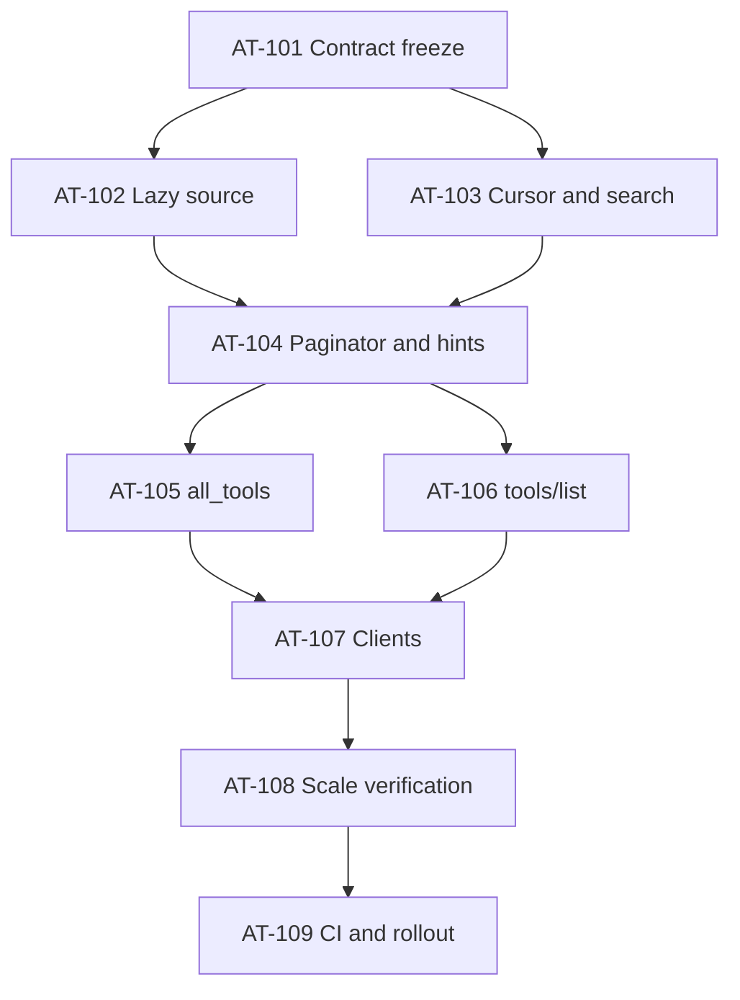

# Compiled Project Plan: Bounded Tool Catalog Pagination

**Generated:** 2026-08-12T00:00:00-07:00
**Source specs:**

- `overview.md` — `sha256:d1da30d45e99b8ec51ea083578afec46963ac291db313430502cbd296b29c4fc`
- `components.md` — `sha256:00357fb1d855fed17bd9099f253111e05a14a8993efbedd94992de5799a140b2`
- `data-flow.md` — `sha256:95cfa6d586ff5d4b183ad5d52678d5c74734ad1c2497864095c454376bef3531`
- `dsm-analysis.md` — `sha256:e515b997451a8ad5b0beabced8af55d714904d92e47d1c1a57e3d3adf2b0e5d9`
- `threat-model.md` — `sha256:a0276c46c02962f5d0b5ce1bd13b75dd4cc55a18c5eae56747e5b8dc0731c1e6`
- `fmea.md` — `sha256:c6718a8ce8662f881718878015fb77735faf50fee4662516025bffeedbda4263`
- `project-plan.md` — `sha256:2357b99bf8b477741f68a3359e822ca1696626cfc5c999b56169f22db39ad032`
- `test-specification.md` — `sha256:650996ebc3cd16178b753b41aff62e8d7fcd499d067db8b9aa679b84354a6a59`
- ADR-008 — `sha256:713a37cddb70ea36098a633d7fbe8a4cf84cf73663050cace4938055c9d9465a`

**Total tasks:** 9
**Estimated parallel batches:** 7
**Ambiguities resolved:** 7
**Ambiguities requiring human input:** 0

## Dependency graph



## Execution batches

| Batch | Parallel tasks | Boundary verification |
|---:|---|---|
| 1 | AT-101 | New contract tests exist and fail for the pre-change eager behavior |
| 2 | AT-102, AT-103 | `cargo test -p ferrosa-memory-core tool_catalog --lib` |
| 3 | AT-104 | Unit, property, and cross-surface encoder tests pass |
| 4 | AT-105, AT-106 | `make test-unit && make test-contracts` |
| 5 | AT-107 | `make test-integration && make test-system` |
| 6 | AT-108 | Performance, duration, and compatibility evidence |
| 7 | AT-109 | `make test-all` and release checks |

Tasks in the same mutable batch use isolated worktrees and are integrated only
after their declared boundary contracts pass.

## Ambiguity log

| ID | Ambiguity | Resolution | Source |
|---|---|---|---|
| A-01 | Which 16 KiB boundary is measured? | Stable caller-visible result: complete `CallToolResult`, complete `tools/list` result, or operator JSON body; exclude variable JSON-RPC ID and transport headers | FM-AT-002 plus architecture analysis |
| A-02 | How are hints represented in `tools/list`? | Protocol `nextCursor`; actionable text/args in `_meta.paginationHint` | Surface compatibility requirement |
| A-03 | What changes catalog version? | Canonical effective descriptors/schemas plus sorted runtime entity types | Current dynamic schema evidence |
| A-04 | Must cursor opacity use a deployment secret? | No. Cursor is untrusted public position state; strict validation and server-policy comparison provide authority safety | Threat model |
| A-05 | How does named lookup behave? | Reject unknown/empty/duplicate names; cap count/bytes; preserve canonical catalog order | Determinism and amplification controls |
| A-06 | What happens to `include_all`? | Retain as a paginated compatibility alias; do not restore one-shot materialization | Backward compatibility boundary |
| A-07 | Is a database migration needed? | No current catalog database exists; enforce future pushdown through the source interface and test double | Repository evidence |

## Task packets

### AT-101 — Freeze catalog contracts and tests

**Batch:** 1
**Goal ref:** G-bounded-catalog
**Goal summary:** Make every catalog response and source operation bounded
**Contribution:** Establishes the RED oracle and prevents implementation from
passing on inner-size or eager-source approximations.
**Priority / effort / critical:** 100 / medium / yes
**Depends on:** none
**Blocks:** AT-102, AT-103

**Context:** Current `all_tools` and `tools/list` call
`tool_definitions() -> Vec<ToolDef>`. The new contract must fail against that
behavior before production code changes.

**Deliverables:**

- Public normalized query/page/error Rust types and input limits.
- Reserved IDs T-U-020–024, T-C-008–009, T-I-017–019, T-S-016, T-P-005,
  T-PF-006, and T-D-005 in the repository test catalog.
- Exact encoders/fixtures defining the stable byte sequence measured for each
  surface.
- Failing tests for eager construction, 16 KiB overflow, stale/mismatch cursor,
  missing hints, and one-shot clients.

**Receives from:** ADR-008 and the focused test specification.
**Hands off to:** source, cursor, and paginator implementers.
**Reverse dependents:** core dispatch, MCP transports, HTTP, workbench, eval,
setup scripts.

**Verification:**

```bash
cargo test -p ferrosa-memory-core tool_catalog_contract --no-run
make test-contracts
```

**Completion criteria:** Tests compile, expected RED failures identify the old
eager behavior, and none pass merely by measuring an inner page.

### AT-102 — Implement lazy descriptor registry and source

**Batch:** 2
**Goal ref:** G-bounded-catalog
**Goal summary:** Make every catalog response and source operation bounded
**Contribution:** Removes full-catalog construction from discovery and creates
the database-pushdown-compatible source seam.
**Priority / effort / critical:** 96 / large / yes
**Depends on:** AT-101
**Blocks:** AT-104

**Context:** Extract stable key, public/canonical name, family, tags, explicit
bounded summary, visibility, and a lazy schema builder. Resolve execution names
through the same metadata without making discovery depend on execution.

**Deliverables:**

- `CatalogSource` with stable seek, incremental filter, projection, bounded
  fetch, and direct named lookup.
- Static descriptor registry that builds schemas only when selected.
- Streaming startup catalog-version digest including sorted dynamic entity
  types, and canonical per-entry schema digests.
- Test-only full collector that matches all 95 current definitions.
- Database-source conformance test double proving cursor/filter/projection/limit
  are source inputs.

**Receives from:** AT-101 query/source contracts.
**Hands off to:** AT-104 paginator and execution dispatch.
**Reverse dependents:** every catalog surface.

**Verification:**

```bash
cargo test -p ferrosa-memory-core tool_catalog_source --lib
cargo test -p ferrosa-memory-core tool_catalog_full_characterization --lib
```

**Completion criteria:** Deep seek and named lookup construct at most emitted
entries plus one look-ahead; the full collector is test-only.

### AT-103 — Implement cursor codec and deterministic search

**Batch:** 2
**Goal ref:** G-safe-discovery
**Goal summary:** Keep discovery deterministic and server-authorized
**Contribution:** Adds safe page jumps, integrated search, and actionable stale
recovery without a second public tool.
**Priority / effort / critical:** 94 / medium / yes
**Depends on:** AT-101
**Blocks:** AT-104

**Deliverables:**

- Bounded opaque Base64URL codec carrying codec/catalog version, after-key,
  surface, visibility identity, projection, and normalized query fingerprint.
- Normalizer and explicit maxima for cursor, query, names, and categories.
- Stable lexical precedence: exact name, name prefix, category/tag, summary
  token, then public name.
- Typed `INVALID_CURSOR`, `STALE_CURSOR`, `CURSOR_QUERY_MISMATCH`, and
  `UNKNOWN_TOOL_NAME` with safe restart arguments.
- Validation before source access; no tenant or authorization authority in a
  cursor.

**Receives from:** AT-101 contracts.
**Hands off to:** AT-104 paginator and all surface adapters.
**Reverse dependents:** `all_tools`, `tools/list`, operator HTTP.

**Verification:**

```bash
cargo test -p ferrosa-memory-core tool_catalog_cursor --lib
cargo test -p ferrosa-memory-core tool_catalog_search --lib
```

**Completion criteria:** Every fingerprint mutation is rejected, catalog input
changes yield stale restart, and rejected requests perform zero source pulls.

### AT-104 — Implement projections, exact packing, and hints

**Batch:** 3
**Goal ref:** G-bounded-catalog
**Goal summary:** Make every catalog response and source operation bounded
**Contribution:** Provides the shared semantic pagination primitive and the
final-envelope admission proof.
**Priority / effort / critical:** 98 / large / yes
**Depends on:** AT-102, AT-103
**Blocks:** AT-105, AT-106

**Deliverables:**

- Compact and schema projections with canonical schema digest.
- Page-plus-one paginator that admits only complete entries and guarantees
  forward progress.
- Surface encoders for `CallToolResult`, legacy/modern `tools/list`, and
  operator JSON; all include metadata and hints in byte accounting.
- Exact continuation, completion, invalid, mismatch, and stale restart hints.
- `ENTRY_TOO_LARGE` and `NO_CURSOR_PROGRESS` fail-loud paths.

**Receives from:** lazy source and cursor/search packets.
**Hands off to:** MCP and HTTP surface adapters.
**Reverse dependents:** all first-party discovery clients.

**Verification:**

```bash
cargo test -p ferrosa-memory-core tool_catalog_paginator --lib
cargo test -p ferrosa-memory-core --test tool_catalog_contract
```

**Completion criteria:** Random and boundary cases never exceed 16,384 bytes,
never split an entry, never repeat a cursor, and never pull beyond page plus one.

### AT-105 — Adapt `all_tools`

**Batch:** 4
**Goal ref:** G-compatible-discovery
**Goal summary:** Preserve the public entry point while changing its response safely
**Contribution:** Ships compact/search/schema discovery under the stable tool name.
**Priority / effort / critical:** 92 / medium / yes
**Depends on:** AT-104
**Blocks:** AT-107

**Deliverables:**

- Input schema for `detail`, `names`, `query`, `categories`, and `cursor`.
- Compact default and named/schema modes through shared catalog core.
- Actionable hint on success/final/stale/error pages.
- Exact byte accounting for duplicated text and `structuredContent`.
- Release-note fixture proving the intentional response-shape change.

**Verification:**

```bash
cargo test -p ferrosa-memory-core --test tool_catalog_contract all_tools
cargo test -p ferrosa-memory-core all_tools_pagination --lib
```

**Completion criteria:** Public name remains, every page/error is bounded, and
the production handler cannot reach the eager full-vector path.

### AT-106 — Adapt legacy and modern MCP `tools/list`

**Batch:** 4
**Goal ref:** G-compatible-discovery
**Goal summary:** Preserve the public entry point while changing its response safely
**Contribution:** Makes both MCP protocol eras use the same bounded semantics.
**Priority / effort / critical:** 91 / large / yes
**Depends on:** AT-104
**Blocks:** AT-107

**Deliverables:**

- Protocol `cursor` request and `nextCursor` response handling.
- Server-owned tier/full visibility with paginated `include_all` compatibility.
- Modern result/cache metadata included in final-size accounting.
- Structured dispatch error data sufficient for stale restart details.
- Cross-surface parity and visibility isolation tests.

**Verification:**

```bash
cargo test -p ferrosa-memory-core tools_list_pagination --lib
cargo test -p ferrosa-memory-mcp tools_list_pagination
make test-contracts
```

**Completion criteria:** Both protocol eras traverse all eligible definitions
once, never exceed the cap, and reject cross-surface/tier cursors.

### AT-107 — Migrate operator, workbench, eval, and setup clients

**Batch:** 5
**Goal ref:** G-client-continuity
**Goal summary:** Keep every first-party catalog consumer complete after pagination
**Contribution:** Prevents silent page-one regressions and hidden reassembly.
**Priority / effort / critical:** 88 / large / yes
**Depends on:** AT-105, AT-106
**Blocks:** AT-108

**Deliverables:**

- Operator route calls catalog service directly and accepts paging/filter input.
- Workbench incrementally loads compact pages and fetches named schema on
  selection.
- Eval and setup clients follow `nextCursor` or use exact names.
- Internal describe streams names without building full definitions.
- Client tests include a required tool beyond page one.

**Verification:**

```bash
cargo test -p ferrosa-memory-eval tools_list
cargo test -p ferrosa-memory-mcp workbench_tool_catalog
make test-integration
make test-system
```

**Completion criteria:** No production first-party consumer reconstructs and
retains all schema pages, and late-page tools remain discoverable.

### AT-108 — Prove scale, memory, duration, and compatibility

**Batch:** 6
**Goal ref:** G-release-evidence
**Goal summary:** Produce independent evidence that bounded behavior survives scale
**Contribution:** Detects eager work, memory growth, traversal gaps, and fleet
version faults before rollout.
**Priority / effort / critical:** 90 / large / yes
**Depends on:** AT-107
**Blocks:** AT-109

**Deliverables:**

- T-P-005 arbitrary-catalog property suite.
- T-PF-006 10,000-descriptor first/middle/deep benchmark with pull/retention
  assertions and recorded latency baseline.
- T-D-005 sustained mixed traffic with repeated RSS samples and version swaps.
- Full-catalog compatibility traversal compared with pre-change definitions.
- Independent verifier repetition of exact envelope and source-pull gates.

**Verification:**

```bash
make test-property
make test-load-smoke
make test-duration
```

**Completion criteria:** All invariant gates pass; no unbounded RSS slope, stuck
cursor, missing/duplicate definition, or page above 16 KiB occurs.

### AT-109 — Integrate CI, telemetry, documentation, and rollout

**Batch:** 7
**Goal ref:** G-release-evidence
**Goal summary:** Produce independent evidence that bounded behavior survives scale
**Contribution:** Makes the protections durable in CI and operationally visible.
**Priority / effort / critical:** 82 / medium / yes
**Depends on:** AT-108
**Blocks:** none

**Deliverables:**

- Register contract/property/performance/duration targets in Make and CI.
- Metrics and alert rules for final bytes, emitted/pulled entries, latency,
  cursor failures, and no-progress.
- Update README, protocol, progressive-disclosure, workbench, and operator docs.
- Compatibility and migration notes for callers that assumed one response.
- Fleet-consistent catalog-version/readiness evidence or documented affinity
  constraint for rolling deployments.

**Verification:**

```bash
make test-all
make test-load-smoke
make test-duration
cargo clippy --workspace --all-targets -- -D warnings
cargo fmt --all -- --check
```

**Completion criteria:** CI is fail-closed on new test IDs, operational alerts
exist, docs no longer promise one-shot full discovery, and rollout evidence is
reviewed.
