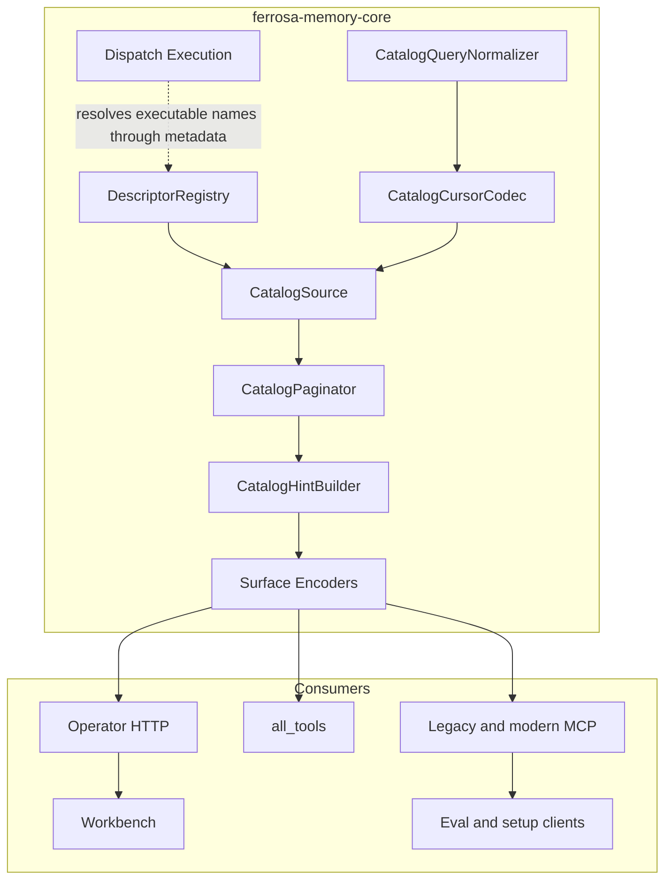

# Bounded Tool Catalog Components

The design extracts discovery responsibilities from the high-churn dispatch
module while preserving existing execution routing and public tool names.

## Target component diagram



## Component contracts

### `DescriptorRegistry`

Owns lightweight ordered metadata:

```rust
struct ToolDescriptor {
    stable_key: &'static str,
    public_name: &'static str,
    canonical_name: &'static str,
    family: ToolFamily,
    tags: &'static [&'static str],
    summary: &'static str,
    visibility: CatalogVisibility,
    build_schema: fn(&EntityTypes) -> ToolDef,
}
```

The registry may retain static descriptors because dispatch needs a tool
registry, but it must not eagerly construct descriptions and JSON Schemas for
every request. Summaries are explicit bounded metadata, not unchecked
description truncation.

### `CatalogSource`

Accepts normalized selection, projection, stable after-key, and bounded source
fetch size. It yields entries incrementally and supports direct named lookup.
The production static implementation seeks by descriptor key and constructs
only requested entries. A future database implementation must implement the
same contract with database keyset pagination and predicate pushdown.

For lexical search, the static implementation may scan lightweight descriptor
metadata in bounded retained memory, but it must yield matched descriptors in
stable `(match_rank, public_name)` order and build schemas only for admitted
matches. Source-pull metrics count yielded post-filter candidates; separate
metadata-scan metrics expose search cost. A database source must perform both
filtering and ordering in its bounded query.

### `CatalogQueryNormalizer`

Validates input byte sizes, bounded names/category counts, duplicate names,
unknown fields, detail mode, lexical query, visibility policy, and surface.
Visibility is injected by the server adapter rather than accepted from the
client. It produces a canonical query fingerprint.

### `CatalogCursorCodec`

Encodes codec version, catalog version, stable after-key, surface, and query
fingerprint as an opaque Base64URL value. Decoding is bounded and fail-loud.
Cursors do not carry tenant identity or authorization authority.

### `CatalogPaginator`

Greedily admits complete entries while the surface encoder confirms the final
envelope remains at most 16,384 bytes. It retains the current page and one
look-ahead entry. A single oversized entry returns a typed error with no
continuation cursor.

### `CatalogHintBuilder`

Produces exact next arguments while preserving query, category, names, detail,
and cursor. Final-page hints explain named schema lookup. Stale responses expose
the current catalog version and safe restart arguments without the stale cursor.

### Surface encoders

- `all_tools`: accounts for both text fallback and `structuredContent` in the
  final `CallToolResult`.
- MCP `tools/list`: uses protocol-native request `cursor` and response
  `nextCursor`; modern metadata and cache fields count toward the cap.
- Operator HTTP: returns one page and routing accepts cursor/filter query
  parameters or a bounded JSON request.

### First-party clients

The workbench lists compact pages and requests named schema on selection. Eval
and setup clients traverse `nextCursor` until completion or select known names.
No client-side helper may silently drain every page into one retained catalog.

## `all_tools` semantic contract

Browse and search mode accepts `detail`, `query`, `categories`, and `cursor`.
`query` and `categories` combine with AND semantics: an entry must be in an
allowed category and match the lexical query. Exact named lookup accepts
`detail: "schema"`, `names`, and an optional continuation `cursor`; `names` is
mutually exclusive with `query` and `categories`. These mode rules prevent a
caller from accidentally turning a direct lookup into a catalog scan.

```json
{
  "detail": "compact",
  "query": "remote MCP",
  "categories": ["remotes"]
}
```

A non-final semantic result includes the exact restartable arguments needed for
the next call:

```json
{
  "catalog_version": "sha256:effective-catalog",
  "detail": "compact",
  "tools": [
    {
      "name": "teach_remote",
      "category": "remotes",
      "summary": "Teach a remote memory server.",
      "schema_digest": "sha256:canonical-schema"
    }
  ],
  "has_more": true,
  "next_cursor": "opaque-base64url",
  "hint": {
    "message": "Continue this filtered catalog traversal.",
    "next_arguments": {
      "detail": "compact",
      "query": "remote MCP",
      "categories": ["remotes"],
      "cursor": "opaque-base64url"
    }
  }
}
```

The final-page hint sets no continuation and explains
`{"detail":"schema","names":["tool_name"]}`. A stale result names
`STALE_CURSOR`, returns the current `catalog_version`, and provides the original
normalized arguments without `cursor` as `restart_arguments`.

## Error model

| Error | Trigger | Required recovery |
|---|---|---|
| `INVALID_CURSOR` | Decode, size, codec, or integrity failure | Restart without cursor |
| `STALE_CURSOR` | Catalog version mismatch | Use returned restart arguments |
| `CURSOR_QUERY_MISMATCH` | Surface, visibility, query, names, or detail changed | Restart with normalized arguments |
| `UNKNOWN_TOOL_NAME` | Exact named lookup misses | Correct names; do not scan unrelated tools |
| `ENTRY_TOO_LARGE` | One final encoded entry cannot fit under 16 KiB | Fix schema/summary or revise protocol contract |
| `NO_CURSOR_PROGRESS` | Encoder/source would repeat the same key | Fail and emit diagnostic; never retry internally |

## Version and digest rules

The catalog version is a build-time or startup-cached digest over normalized
effective public descriptor/schema content, including sorted dynamic entity
types. It must be replica-stable for equivalent configuration and must not
require per-request full-catalog construction. Each compact entry carries a
canonical schema digest derived by the same normalization rules.

## Ownership boundary

Catalog visibility and execution authorization remain separate. A cursor can
resume only the server-selected visibility policy for its originating surface.
Discovering a tool never grants permission to execute it.
