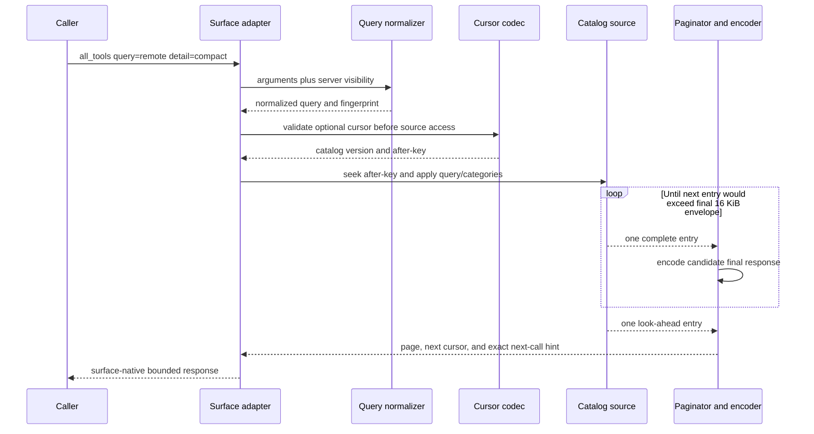
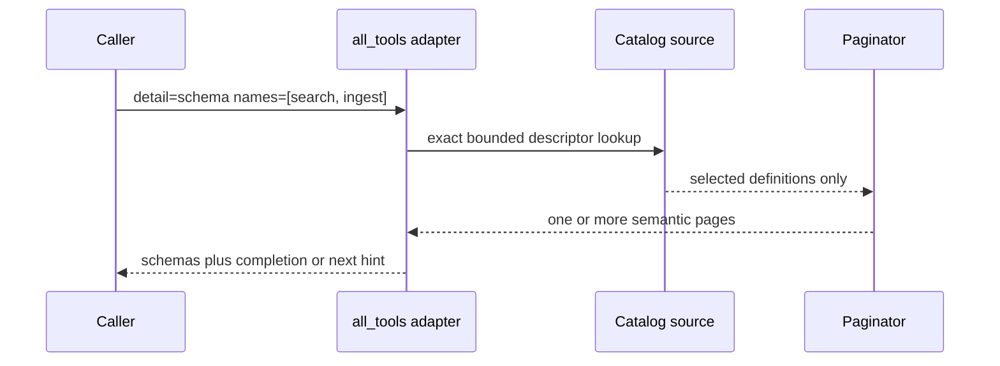
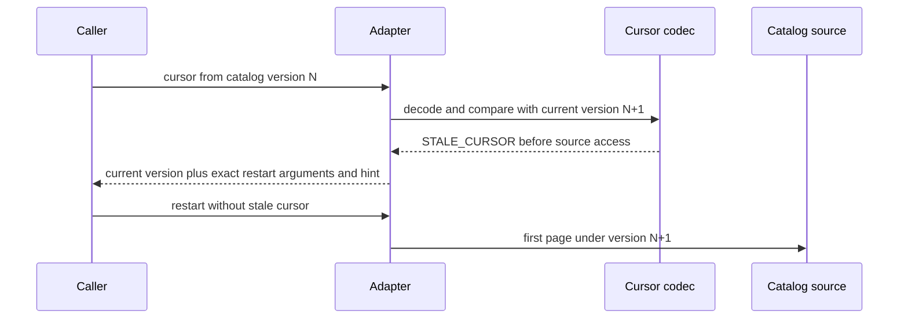

# Bounded Tool Catalog Data Flow

All catalog surfaces share semantic selection and paging, but each surface owns
its final protocol envelope.

## Compact search and continuation

Matching precedence is explicit and stable: exact public name, public-name
prefix, exact family/category or tag, then summary token match. Public name is
the final tie-breaker. The source skips nonmatches incrementally; it never
constructs their schema projection.

## Named schema jump

Unknown names fail structurally. Duplicate names are rejected or normalized
according to the contract tests; they never trigger a full scan.

## Stale cursor recovery

## Surface mappings

| Semantic field | `all_tools` | MCP `tools/list` | Operator HTTP |
|---|---|---|---|
| Continuation request | `cursor` | `cursor` | `cursor` |
| Continuation response | `next_cursor` | `nextCursor` | `next_cursor` |
| Version | `catalog_version` | `_meta.catalogVersion` | `catalog_version` |
| Hint | `hint` | `_meta.paginationHint` | `hint` |
| Visibility | Server full-discovery policy | Server tier policy | Server operator policy |
| Projection | Compact or schema | Schema | Compact, then named schema |

## Future database-backed source

The present catalog is static and requires no database work. If catalog entries
later become data-backed, the repository query must accept the normalized
filters, stable keyset cursor, projection, and bounded fetch limit. It must not
return all rows to the memory server. The service may request another bounded
micro-page only when filtering leaves room in the current 16 KiB page.

## Telemetry

Record surface, detail mode, final bytes, entries emitted, source entries
pulled, page latency, `has_more`, stale/invalid cursor totals, unknown-name
totals, and non-progress failures. Do not log raw cursors, queries, or name
lists. Alert on responses above the cap, empty pages with `has_more`, or source
pulls beyond the declared bounded algorithm.
