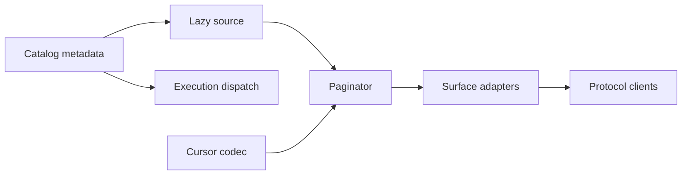

# Bounded Tool Catalog DSM Analysis

The repository-level Forge DSM reports five crate elements, five dependencies,
no crate cycle, a 36% propagation cost, and 50% cluster quality. The core crate
has fan-in four, so an incompatible discovery change can propagate to every
transport and test consumer even though Cargo has no cycle.

## Current logical matrix

An `X` means the row depends on the column.

| Module | Schemas | Dispatch | HTTP | Workbench | Eval/setup |
|---|---:|---:|---:|---:|---:|
| Schema builders | — | X |  |  |  |
| Dispatch | X | — |  |  |  |
| HTTP adapters |  | X | — |  |  |
| Workbench |  |  | X | — |  |
| Eval/setup clients |  | X | X |  | — |

`tool_schemas.rs` imports a public-name helper from its dispatch parent while
dispatch imports and materializes every schema. This is not a Cargo cycle, but
it couples discovery metadata, schema construction, and execution routing.

## Target logical matrix

| Module | Metadata | Source | Cursor | Pager | Adapters | Execution |
|---|---:|---:|---:|---:|---:|---:|
| Catalog metadata | — |  |  |  |  |  |
| Catalog source | X | — |  |  |  |  |
| Cursor codec |  |  | — |  |  |  |
| Paginator |  | X | X | — |  |  |
| Surface adapters | X |  | X | X | — |  |
| Execution dispatch | X |  |  |  |  | — |

The desired dependency direction is acyclic and inward: metadata is shared by
discovery and execution, while discovery never imports execution dispatch.

## Change impact

| Existing location | Current responsibility | Target responsibility |
|---|---|---|
| `dispatch/tool_schemas.rs` | Full schema DTOs and eager family builders | Schema projection builders plus descriptor metadata inputs |
| `dispatch.rs` | Discovery construction, tier filtering, execution, result wrapping | Execution and thin surface invocation only |
| New `dispatch/tool_catalog.rs` | None | Query, source, cursor, paging, version, hints, semantic errors |
| `http.rs` | Recursive internal full-list dispatch | Direct call to the shared catalog service |
| `assets/workbench.html` | One-shot full schema download | Compact page navigation and named schema fetch |
| Eval/setup clients | Assume one list response | Follow `nextCursor` or issue exact named lookup |

## Architectural controls

- Keep `CatalogSource` independent of MCP and HTTP response types.
- Inject server-owned visibility into normalized queries; do not deserialize it
  from cursor arguments.
- Give each surface an encoder that can measure its actual final stable result
  envelope before admitting an entry.
- Preserve full-catalog collection only in characterization tests.
- Stream names for internal describe output rather than reconstructing schemas.

## Verification

The implementation is structurally complete only when the DSM remains
cycle-free, `dispatch.rs` no longer constructs a full catalog for discovery,
and dependency tests show that future source implementations can paginate
without importing a surface adapter.
