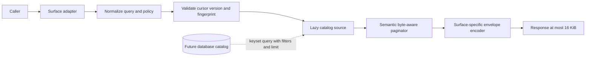

# Bounded Tool Catalog Pagination Overview

Ferrosa Memory uses progressive disclosure to keep its default MCP surface
compact. Before this change, its catalog-expansion paths serialized every
registered tool. The implementation replaces that behavior with bounded
discovery that remains useful as the catalog grows.

## Pre-change state

Repo-proven behavior:

- `all_tools` accepts no arguments and calls `tool_definitions`, which builds a
  complete `Vec<ToolDef>`.
- The current snapshot contains 95 definitions. The captured successful result
  is 132,145 minified characters before the outer MCP/JSON-RPC framing used by
  some transports.
- `wrap_tool_result` duplicates object results into `content[0].text` and
  `structuredContent`.
- `tools/list` constructs the full vector before applying the tier-1 filter.
- `/workbench/api/tools/list` requests `include_all: true`, while the browser
  downloads, sorts, and retains every schema.
- First-party eval and setup consumers assume one complete `tools/list` result.
- The catalog is not database-backed. Dynamic entity types loaded at startup
  affect several schemas and therefore the effective catalog version.

## Implemented state

The implementation introduces a family-lazy static source and a shared catalog
service. It retains only the bounded response page and one static tool family,
never the complete catalog. Surface adapters retain protocol-native field names
and envelopes while sharing source order, search, projections, versioning,
cursor validation, page admission, and hints. Canonical MCP text carries the
complete bounded page once; `structuredContent` carries navigation metadata and
public names without duplicating every schema.

## Locked requirements

1. Keep the public `all_tools` name.
1. Default to compact entries containing public name, family, short summary,
   and schema digest.
1. Support `detail: "schema"` and exact `names` lookup.
1. Support deterministic lexical `query` and exact `categories` filters inside
   `all_tools`; do not add `tool_search`.
1. Return actionable navigation hints with every paginated result, including
   final and stale-cursor results.
1. Cap the exact final serialized response for each surface at 16,384 UTF-8
   bytes. Split only between complete tool entries.
1. Embed a catalog version in opaque cursors and bind cursors to the normalized
   surface, visibility, query, filters, names, and detail mode.
1. Reject stale or mismatched cursors before source reads and return safe
   restart arguments.
1. Apply the shared pagination boundary to `all_tools`, MCP `tools/list`, and
   the operator/workbench catalog route.
1. Do not fetch or construct a complete result before slicing. Future
   database-backed implementations must push keyset position, filters,
   projection, stable ordering, and bounded limits into the database query.

## Scope

### In scope

- Catalog descriptors, stable ordering, families, compact summaries, schema
  digests, and effective catalog version.
- Search/filter request normalization and direct named lookup.
- Cursor codec, typed invalid/stale/mismatch errors, and restart hints.
- Surface-aware final-envelope admission under 16 KiB.
- Legacy and modern MCP `tools/list`, `all_tools`, operator HTTP, workbench,
  eval clients, setup checks, and documentation.
- Unit, contract, integration, system, property, performance, and duration
  verification.

### Out of scope

- A database table or migration for tool definitions.
- Semantic/vector search over tool descriptions.
- Tool execution authorization changes.
- Changing ordinary memory-query pagination.
- Reassembling all pages inside the operator server or browser.

## Acceptance gates

- Every successful catalog page and typed catalog error serializes to no more
  than 16,384 bytes at its final surface boundary.
- Stable traversals return every matching public entry exactly once, in stable
  order, with cursor progress on every non-final page.
- Source instrumentation proves no more than emitted entries plus one
  look-ahead are constructed, including deep-cursor traversal.
- The workbench pages compact entries and requests schema only for selected
  names.
- Existing definition schemas remain compatible through a test-only full
  catalog characterization collector.
- All first-party consumers follow pagination or use named lookup.

## Gaps and questions

No product decision remains open. Live third-party client compatibility and
cross-replica version consistency require implementation-time evidence before
release. The current database has no tool-catalog table, so database pushdown is
a source-interface invariant rather than a migration deliverable.
