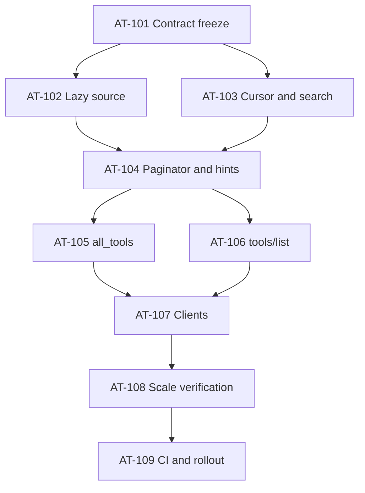

# Bounded Tool Catalog Project Plan

## Delivery overview

| Batch | Focus | Tasks | Exit gate |
|---:|---|---|---|
| 1 | Freeze contracts and test IDs | AT-101 | RED tests prove the eager implementation violates the new contract |
| 2 | Lazy source and cursor/search semantics | AT-102, AT-103 | Unit/property tests prove bounded seek, stable filters, and cursor rejection |
| 3 | Projection, exact envelope packing, hints | AT-104 | Every semantic page invariant and exact byte boundary passes |
| 4 | MCP catalog surfaces | AT-105, AT-106 | `all_tools` and both `tools/list` eras pass contract/integration tests |
| 5 | Operator and first-party clients | AT-107 | Workbench, eval, and setup traverse pages or jump by name |
| 6 | Scale and compatibility verification | AT-108 | System, property, performance, and duration gates pass |
| 7 | Rollout, CI, and docs | AT-109 | All gates are wired fail-closed and migration guidance is published |

## Risk-prioritized backlog

### AT-101 — Contract freeze and anti-false-pass harness

Define normalized request/response/error contracts, stable ordering, exact
surface byte boundaries, limits, and test IDs. Add failing characterization and
boundary tests before production code. This packet owns the resolution of
adapter-specific error mappings but may not weaken the locked semantic errors.

**Primary risks:** FM-01, FM-05, FM-06.
**Tests:** T-U-020 through T-U-024, T-C-008, T-C-009.

### AT-102 — Lazy descriptor registry and source

Extract bounded summaries, families/tags, visibility, stable keys, and schema
builder functions. Implement seek/direct-name source operations and stream the
effective catalog digest without constructing all `ToolDef` values. Preserve a
test-only full collector for schema compatibility.

**Primary risks:** FM-02, FM-04, FM-15.
**Tests:** T-U-021, T-U-024, T-PF-006.

### AT-103 — Cursor codec and deterministic search

Implement query normalization, limits, lexical ranking, category/name filters,
catalog-version checks, query fingerprints, and typed invalid/stale/mismatch
errors before source access. The cursor remains untrusted and carries no
authorization authority.

**Primary risks:** TM-2, TM-3, FM-02, FM-05, FM-11.
**Tests:** T-U-020, T-P-005.

### AT-104 — Projection, schema digests, paginator, and hints

Implement compact/schema projections, canonical schema digests, semantic
entry-boundary packing, surface encoders, one look-ahead, no-progress defense,
and exact continuation/final/restart hints.

**Primary risks:** FM-01, FM-04, FM-09, FM-12, FM-13.
**Tests:** T-U-021 through T-U-024, T-C-009, T-P-005.

### AT-105 — `all_tools` adapter

Keep the public name. Add compact default, schema detail, names, query,
categories, cursor, typed recovery, and bounded hints. Account for duplicated
text and `structuredContent` in `CallToolResult`; remove the eager call path.

**Primary risks:** FM-01, FM-07.
**Tests:** T-C-008, T-I-017.

### AT-106 — MCP `tools/list` legacy and modern adapters

Use protocol `cursor`/`nextCursor`, server-owned tier visibility, modern cache
metadata, and paginated `include_all` compatibility. Ensure structured error
data can carry stale restart information and that both protocol eras share the
same semantic core.

**Primary risks:** TM-9, FM-05, FM-06, FM-08.
**Tests:** T-C-009, T-I-018, T-S-016.

### AT-107 — Operator, workbench, eval, and setup clients

Replace recursive full-list dispatch with the catalog service. Add incremental
compact loading and named schema fetch to workbench. Update eval/setup clients
to follow protocol cursors or request known names, without retaining a hidden
full-catalog aggregate in production.

**Primary risks:** FM-07, FM-14.
**Tests:** T-I-019, T-S-016.

### AT-108 — Scale, memory, duration, and compatibility verification

Exercise 10,000 synthetic definitions, arbitrary sizes, deep cursor traversal,
dynamic-version changes, and repeated client traffic. Replace the current
single-snapshot duration check for this feature with a real traffic/sampling
loop and an RSS-slope assertion. Verify every catalog entry exactly once.

**Primary risks:** FM-02, FM-03, FM-04.
**Tests:** T-P-005, T-PF-006, T-D-005.

### AT-109 — CI, telemetry, documentation, and rollout

Add the new contract binary to `make test-contracts`, publish metrics and alert
rules, update catalog/client docs and exact count claims, and document the
intentional response-shape change. Require fleet-consistent catalog-version
evidence or traversal affinity before rollout.

**Primary risks:** TM-4, TM-6, FM-03, FM-08.
**Tests:** all new IDs plus existing unit/contract/system gates.

## Dependency graph

## Release gates

- No catalog surface can exceed 16,384 UTF-8 bytes in the defined final result
  envelope, including typed errors and hints.
- The source-pull and retained-state evidence must pass independently of the
  response-size evidence.
- No first-party caller may rely on a one-shot complete list.
- A test-only full traversal must match the pre-change catalog definitions by
  public name and schema.
- Cross-replica catalog-version behavior must be proven in the deployment
  topology or the rollout must provide request affinity.
