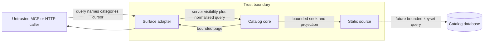

# Bounded Tool Catalog Threat Model

## Assets and boundaries

Protected assets are server memory, CPU, response budgets, catalog integrity,
server-owned visibility policy, stable traversal, and operator availability.

The cursor crosses the public boundary but is never an authority token. Its
contents are structurally validated, bounded, and compared with server-owned
surface, visibility, version, and normalized-query state before source access.

## STRIDE findings

| ID | Class | Threat | Risk | Required control |
|---|---|---|---:|---|
| TM-1 | Denial of service | A caller triggers full schema construction or retention repeatedly | 9 | Source seek, page-plus-one construction, request rate limits, pull telemetry |
| TM-2 | Tampering | Forged or modified cursor changes position, projection, or filters | 9 | Bounded strict decoder, query fingerprint, version and surface binding, fail before read |
| TM-3 | Information disclosure | Cursor or request selects a broader visibility tier | 6 | Visibility injected by adapter and compared to cursor; never accepted from caller |
| TM-4 | Tampering / availability | Replicas compute different catalog versions during traversal | 9 | Canonical runtime-aware digest, readiness check, fleet-consistent rollout or affinity |
| TM-5 | Denial of service | Huge `names`, query, categories, or cursor input amplifies work | 6 | Explicit byte/count caps and duplicate rejection before lookup |
| TM-6 | Repudiation | Operators cannot prove a response exceeded limits or stalled | 4 | Structured metrics for bytes, pulls, latency, cursor failures, and progress |
| TM-7 | Information disclosure | Logs expose raw cursor, query, or requested tool names | 2 | Log only counts, digest-safe identifiers, and typed error codes |
| TM-8 | Spoofing | Discovery is mistaken for permission to execute a tool | 6 | Keep execution authorization independent and re-evaluate it on every call |
| TM-9 | Elevation of privilege | Operator or `include_all` policy leaks into ordinary MCP list | 8 | Surface-bound cursor and explicit server visibility policy tests |

Risk uses a 1–10 qualitative priority scale based on likelihood and impact.

## Cursor policy

- Cursor encoding is opaque Base64URL, codec-versioned, size-bounded, and
  deterministic. Opacity is an API property, not a secrecy guarantee.
- The decoded cursor contains no tenant, role, or authorization grant.
- It binds the catalog version, stable after-key, surface, visibility identity,
  projection, and normalized query fingerprint.
- Because the catalog is public metadata, the design does not require a
  deployment secret merely to prevent callers from choosing a position. Every
  decoded field is treated as untrusted and checked against server state.
- Malformed, mismatched, stale, and non-progress cursors are distinct errors.

## Abuse limits

The contract-freeze packet must set and test explicit maxima. Architecture
defaults are: cursor 2,048 bytes; query 256 UTF-8 bytes; names 20 entries and
4,096 aggregate bytes; categories 16 entries; and no empty or duplicate exact
names. These are server limits, not page-size heuristics.

## Residual risks

- A rolling deployment can invalidate a cursor between requests. This is
  acceptable only because stale recovery is explicit and bounded.
- One generated schema may exceed 16 KiB as dynamic entity types grow. The
  server must fail readiness or return `ENTRY_TOO_LARGE`; it must not split the
  definition or violate the cap.
- Third-party clients may ignore protocol continuation fields. Release notes
  and compatibility tests reduce, but cannot eliminate, that client risk.
