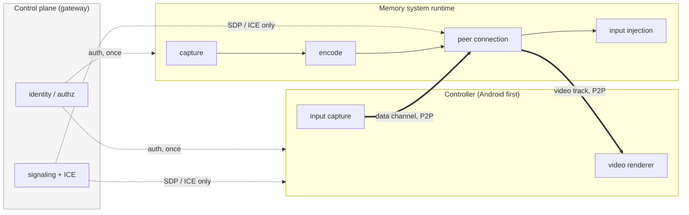

# Visual streaming — architecture

Decisions in [decisions.md](decisions.md). Failure analysis in
[fmea.md](fmea.md). Sequencing in [project-plan.md](project-plan.md).

## What already exists

Worth stating precisely, because the value of this design is how little of it
is new.

A controller and a memory system already establish an authenticated
peer-to-peer session: the controller posts an offer to the broker, the memory
system accepts, SDP and ICE relay through the gateway, a data channel opens,
and both ends exchange a signed hello bound to the SDP hashes before any
application frame is accepted. Frames on that channel are versioned, and the
feed already carries a durable cursor with replay rejection.

None of that changes. Visual streaming adds a track to that connection and new
message types to that channel.



Media never traverses the gateway. The gateway keeps doing identity,
authorization, discovery, signaling and relay-of-last-resort, and nothing else.

## The prerequisite the brief omits

The brief treats "add a video track to the existing connection" as a small
change. It is the right choice, but it is gated on something that does not
exist yet.

Adding a track after a session is live requires renegotiation: a second
offer/answer exchange on an already-connected peer. The broker permits this
(see decisions D-02). Neither client can receive it, because both stop reading
signals once the initial answer arrives, and Android additionally destroys
signals it is not waiting for.

So Milestone 1 begins with a **persistent signal reader** on the client:

- read signals for the life of the session, not until the first answer
- buffer kinds you are not currently waiting for instead of dropping them
- apply a received offer, produce an answer, post it back

This is small, but it is load-bearing and it is first. It also fixes
`t_76c5c374` as a side effect, which is currently breaking ordinary connects on
Android.

An alternative — negotiate the video track up front on every control session,
avoiding renegotiation entirely — was considered and rejected: it would pay
codec and transceiver setup on every session, including the overwhelming
majority that never stream, and it makes the capability implicit where D-08
wants it explicit and per-machine.

## Session shape

One peer connection carries everything.

```text
RTCPeerConnection
├── data: control (exists today — feed, commands, hello)
├── data: input     (new — pointer, key, wheel, clipboard, viewport)
├── video: surface  (new — browser or desktop)
└── audio           (deferred)
```

Input is a **separate data channel** from the existing control feed. The
existing channel carries ordered, durable, cursor-tracked application frames;
input is high-rate, lossy-tolerant and worthless once stale. Putting a pointer
move behind a durable cursor would be wrong in both directions — it would slow
input down and pollute the event log with data nobody will replay.

## Capability negotiation

Capabilities are requested on the existing control channel, which already has a
versioned frame envelope.

```text
controller                         memory system
    │
    ├── visual_capabilities_request ──►
    │                                   enumerate what this host can do
    ◄── visual_capabilities ────────────┤   {browser: true, desktop: false, …}
    │
    ├── visual_session_start ─────────►
    │      {kind, width, height, fps}   authorize
    │                                   create capture source
    │                                   add track → renegotiation
    ◄── sdp_offer (renegotiation) ──────┤
    ├── sdp_answer ───────────────────►
    │
    ◄══ video ══════════════════════════┤
    ├── input events ─────────────────►
```

The capability exchange is what lets D-08 work: the Machines row can show or
hide the streaming control based on what that specific machine reported, rather
than offering it everywhere and failing on the machines that cannot.

## Platform capture

Behind one trait, because the pipeline should not know which one it has.

```rust
/// A source of frames for one visual session.
///
/// Deliberately returns encoded samples rather than raw frames: the encoder is
/// platform-specific too (VideoToolbox on macOS, VAAPI/x264 on Linux), and a
/// trait that returned raw frames would force a copy through a common pixel
/// format that neither platform natively wants.
pub trait VisualCapture: Send {
    fn start(&mut self, options: &VisualSessionOptions) -> Result<(), CaptureError>;
    /// Next encoded sample, or `None` when the source has ended.
    async fn next_sample(&mut self) -> Option<EncodedSample>;
    fn set_viewport(&mut self, width: u32, height: u32, scale: f32) -> Result<(), CaptureError>;
    fn stop(&mut self);
}
```

| Implementation | Path |
|---|---|
| `LinuxX11Capture` | Xvfb display, X11 shared-memory capture, software H.264 |
| `LinuxWaylandCapture` | headless compositor, PipeWire, DMA-BUF (later) |
| `MacOSScreenCaptureKit` | ScreenCaptureKit → CVPixelBuffer → VideoToolbox |

`webrtc-rs` accepts externally encoded samples through
`TrackLocalStaticSample`, so the encoder stays outside the WebRTC stack on every
platform. That is what makes the same runtime code work against three very
different capture paths.

## Frame production

Do not encode 30 identical frames a second.

```text
input event arrives        → capture immediately (input responsiveness is the
                             whole product)
surface changing           → 30 fps, 60 optional
surface unchanged          → decay toward 1–5 fps
session idle               → suspend production
```

The scheduler is driven by two signals: a dirty-region or frame-difference hint
from the capture source, and the arrival of input. Input-driven capture matters
more than the dirty hint — a keystroke should produce a frame before the capture
source has noticed anything changed, because the round trip is what the user
feels.

## Input protocol

Versioned, on the input channel. Coordinates normalized `0.0–1.0` against the
displayed surface so client viewport scaling never has to be communicated.

```json
{ "v": 1, "type": "pointer_move", "x": 0.426, "y": 0.337 }
```

```json
{ "v": 1, "type": "key_down", "code": "KeyK", "key": "k", "modifiers": ["meta"] }
```

Keyboard carries both physical `code` and logical `key`. Transmitting generated
text alone would lose arrows, function keys, Escape, Tab and the modifier
combinations that make a remote IDE or browser usable — which is the difference
between a demo and a workstation.

## Control ownership

`AGENT` · `HUMAN` · `SHARED` · `PAUSED`, exchanged as a control frame and
reported to the agent on change.

Given D-06 — automation is implied by runtime access, not gated — ownership is
**a coordination mechanism, not a security control**. It stops a human and an
agent fighting over a pointer. It does not stop an agent from acting, and
nothing in this design should be described as if it does.

## Trust boundary

Remote GUI access is equivalent to remote shell: a viewer can reach logged-in
sessions, stored credentials, source, and cloud consoles.

Controls that hold:

- peer authentication and the signed hello complete **before** a track is added
- `browser.view` and `browser.control` are separate grants; viewing does not
  imply driving
- media is DTLS-SRTP by construction
- clipboard is separately gated
- session start, ownership change and clipboard access emit audit events
- a live session can be revoked, and idle sessions disconnect

Controls that do **not** hold, stated plainly so nobody relies on them:

- nothing prevents a process with a runtime in the container from driving the
  browser through CDP (D-06). The boundary is the runtime grant itself.
- ownership state is coordination, not enforcement.

## Reconnect

Browser lifetime and stream lifetime are independent. A dropped peer connection
keeps the capture source and the browser alive for a grace period so a
reconnect reattaches rather than restarting the work. Encoder failure restarts
the encoder, not the browser. Browser crash restarts the browser and reports
lost volatile state rather than pretending the session survived.
