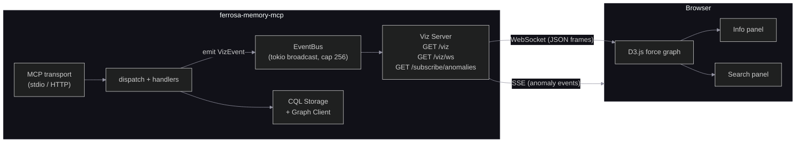
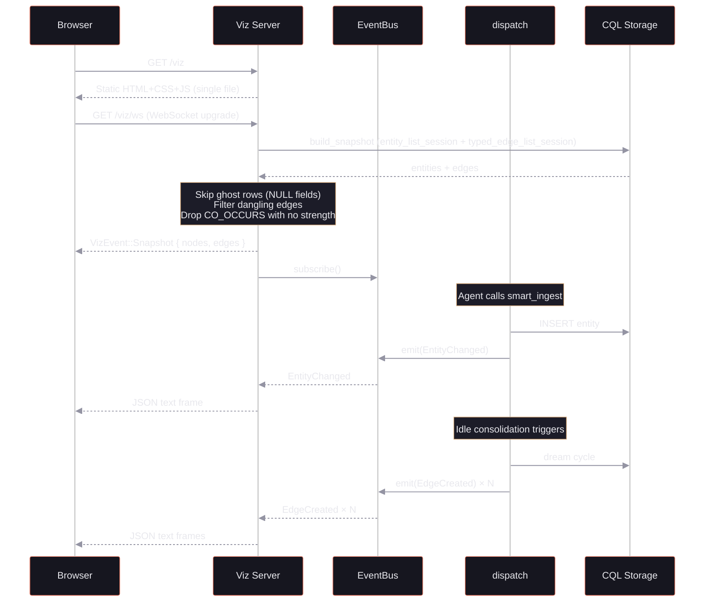
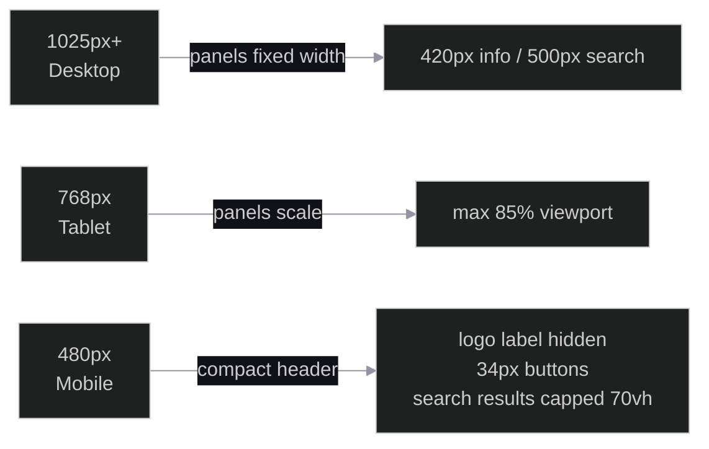

# Memory Graph Visualizer

> Last updated: 2026-04-01
> Status: Implemented. Multiselect filter dropdowns (node type + edge type), extended color mapping (document, section, crate, module, bug), CO_OCCURS noise filtering, mobile-responsive panels, anomaly SSE.

Real-time force-directed graph visualization of the memory knowledge graph, embedded in the MCP server binary. Point a browser at a local port, see entities, folds, and edges as an interactive D3.js graph. Live updates stream via WebSocket as the memory system processes new content.

## Architecture



The viz server runs on a **separate port** (default 8766, or `http_port + 1`) from the MCP transport. It serves the dashboard HTML as a static string compiled into the binary via `include_str!` — no build tools, no node_modules.

## Data Flow



**Key design decisions:**
- Snapshot is built **per connection** before subscribing to the event bus — no race condition between initial state and live deltas
- Dangling edges (where source or target node doesn't exist) are **filtered out** of snapshots
- CO_OCCURS edges with no `strength` value are dropped (noise from bulk ingestion)
- Ghost rows (NULL required fields from bulk CQL inserts) are silently skipped
- If the browser falls behind, lagged events are dropped with a warning (broadcast channel capacity: 256)
- Auto-reconnect after 3 seconds on disconnect

## Event Protocol

Seven event types, all serialized as JSON with a `type` discriminator tag:

| Event | Trigger | Payload |
|-------|---------|---------|
| `Snapshot` | WebSocket connect | All nodes + edges for session/tenant |
| `EntityChanged` | `upsert_entity`, `smart_ingest` | Full `VizNode` + action ("created" / "updated") |
| `EdgeCreated` | `run_consolidation` | `VizEdge` (source, target, edge_type) |
| `StateChanged` | `promote_memory`, `demote_memory` | entity_id + new state |
| `FactUpdated` | `write_temporal_fact` | entity_id + fact_text + superseded ID |
| `FoldCompleted` | `complete_fold` | fold_id + summary + entity count |
| `AnomalyDetected` | Retrieval frequency >3σ | entity_id, name, count, mean, stddev, threshold |

### VizNode Structure

```
{
  id: string,           // entity_id or fold_id
  label: string,        // entity_name or fold summary prefix
  node_type: string,    // "entity" or "fold"
  entity_type: string,  // "concept", "person", "decision", etc.
  state: string,        // "active", "dormant", "silent"
  confidence: f64,
  created_at: string,   // RFC 3339
  context: string       // context_snippet for detail panel
}
```

### VizEdge Structure

```
{
  source: string,       // source node id
  target: string,       // target node id
  edge_type: string,    // "CO_OCCURS", "MENTIONED_IN", "FOLDED_INTO", "SUPERSEDES", "depends_on", "contains", "calls", "references"
  strength: f32 | null  // similarity strength for CO_OCCURS; weight for typed edges
}
```

## Frontend

### Technology

- **D3.js v7** force simulation (loaded from CDN)
- **Single HTML file** with inline CSS and JS — compiled into the Rust binary
- **Inter font** from Google Fonts (Ferrosa brand)

### Layout

Full-viewport dark background (`#0a0a0f` Void). Three regions:

1. **Header bar** — Fe logo, "memory" label, live stats (node count, edge count, LIVE/OFFLINE indicator with pulsing green dot)
2. **SVG canvas** — Force-directed graph filling the viewport
3. **Sliding panels** — Info panel (right) and search panel (left), mutually exclusive

### Force Simulation Parameters

| Parameter | Value | Effect |
|-----------|-------|--------|
| Link distance | `200 * (1 - strength)` (30–200px) | Higher strength = closer nodes |
| Charge strength | -1500, max 800px | Strong repulsion between all nodes |
| Center X/Y strength | 0.005 | Gentle pull toward canvas center |
| Collision radius | 20px | Prevents node overlap |
| Alpha decay | 0.0076 | Slow cooling for smooth convergence |

Link distance is driven by edge `strength`: `depends_on` (1.0) → 30px, `contains` (0.9) → 50px, `calls` (0.7) → 90px. Edges without strength default to 0.1 → 180px.

### Color Mapping (Ferrosa Brand)

**Entity types → node fill:**

| Type | Color | Hex |
|------|-------|-----|
| concept | Steel Blue | `#7c9cf5` |
| person | Amethyst | `#c882f0` |
| decision | Terracotta | `#e2725b` |
| pattern | Amber | `#f4a261` |
| org | Copper | `#d4a574` |
| event | Verdigris | `#6bc9a0` |
| place | Steel Blue (light) | `#9cb8f7` |
| preference | Amber (light) | `#f7be7e` |
| document | Teal | `#4ecdc4` |
| section | Teal (dark) | `#45b7aa` |
| crate | Coral Red | `#ff6b6b` |
| module | Orange | `#ffa94d` |
| bug | Rust Red | `#e25b5b` |
| app | Amethyst | `#c882f0` |
| fold | Slate with border | `#16161f` stroke `#1e1e2a` |

**Edge types → line color:**

| Type | Color | Hex |
|------|-------|-----|
| CO_OCCURS | Copper | `#d4a574` |
| MENTIONED_IN | Steel Blue | `#7c9cf5` |
| FOLDED_INTO | Amethyst | `#c882f0` |
| SUPERSEDES | Rust Red | `#e25b5b` |
| depends_on | Pink | `#ff7eb3` |
| contains | Green | `#7effa0` |
| calls | Yellow | `#ffe07e` |
| references | Sky Blue | `#87ceeb` |

Node radius scales with confidence (7–11px for entities, 5px for folds).

### Filter UI

Two multiselect dropdown menus in the header bar allow filtering by node type and edge type:

1. **Nodes dropdown** — lists all entity types present in the graph with color swatches. Toggling types filters which nodes are visible; edges with hidden endpoints are also hidden.
1. **Edges dropdown** — lists all edge types present in the graph with color swatches. Toggling types filters which edges are drawn.

Each dropdown has **All** and **None** quick-select buttons. When no types are explicitly selected, all types are shown (empty set = show all).

Node type filtering also filters edges: only edges between two visible nodes are shown. This means selecting only "crate" nodes will show only `depends_on` edges between crates.

On mobile (<600px), the filter dropdowns wrap below the logo in the header. Dropdown menus are touch-friendly with adequate tap targets.

### Animations

| Event | Animation | Duration |
|-------|-----------|----------|
| New node | Fade in from `r:0`, opacity 0 → 1 | 500ms |
| New edge | Stroke-opacity 0 → 0.35 (draw-in) | 500ms |
| Remove edge | Fade to opacity 0 | 300ms |
| State/fact change | Terracotta glow ring pulse | 200ms flash + 800ms fade |
| Connection status | Breathing green dot pulse | 2s infinite loop |

### Interaction

- **Click node** — highlight node + connected edges, open info panel with metadata
- **Drag node** — pin/unpin from simulation
- **Zoom/pan** — D3 zoom behavior on SVG
- **Hover** — tooltip with entity name + type
- **Search** — text filter highlights matching nodes, dims everything else (matched: full opacity, unmatched: 0.05–0.1)

## Sliding Panels

Both panels use `position: fixed` with CSS transitions (0.25s ease) on `max-width` and `opacity`.

### Info Panel (Right)

Opens on node click. Displays:
- Entity name, type, memory state, confidence score
- Creation timestamp
- Context snippet
- List of connected edges (clickable targets)
- Entity type breakdown across the full graph
- Memory state distribution (active/dormant/silent counts)

### Search Panel (Left)

Opens via header button. Provides text search over entity names with clickable results that focus the graph on the matched node.

### Mutual Exclusion

Opening one panel automatically closes the other — prevents overlap on narrow viewports.

## Mobile Responsive



Panel width is computed dynamically:
```
targetWidth = min(viewport_width × 0.6, max_panel_width)
```

On mobile (<480px), the header collapses to icon-only buttons and the logo label is hidden to save space.

## SSE Anomaly Stream

`GET /subscribe/anomalies` provides a Server-Sent Events stream that filters the event bus for `AnomalyDetected` events only. Intended for external monitoring tools or alerting integrations.

```
event: anomaly
data: {"type":"AnomalyDetected","entity_id":"...","entity_name":"SuspiciousEntity","retrieval_count":25,"session_mean":5.0,"session_stddev":2.0,"sigma_threshold":3.0}
```

## Configuration

```toml
[viz]
enabled = true        # default: true when HTTP transport active
port = 8766           # default: http_port + 1
```

In stdio mode (Claude Code), the viz server starts on a separate port. In HTTP mode, viz routes are added to the same HTTP server.

## File Manifest

| File | Responsibility |
|------|---------------|
| `crates/ferrosa-memory-core/src/viz.rs` | VizEvent, VizNode, VizEdge types, EventBus |
| `crates/ferrosa-memory-core/src/http.rs` | `/viz`, `/viz/ws`, `/subscribe/anomalies` routes |
| `crates/ferrosa-memory-core/assets/viz.html` | Single-file HTML+CSS+JS dashboard |
| `crates/ferrosa-memory-core/src/dispatch.rs` | Emits VizEvents from tool handlers |
